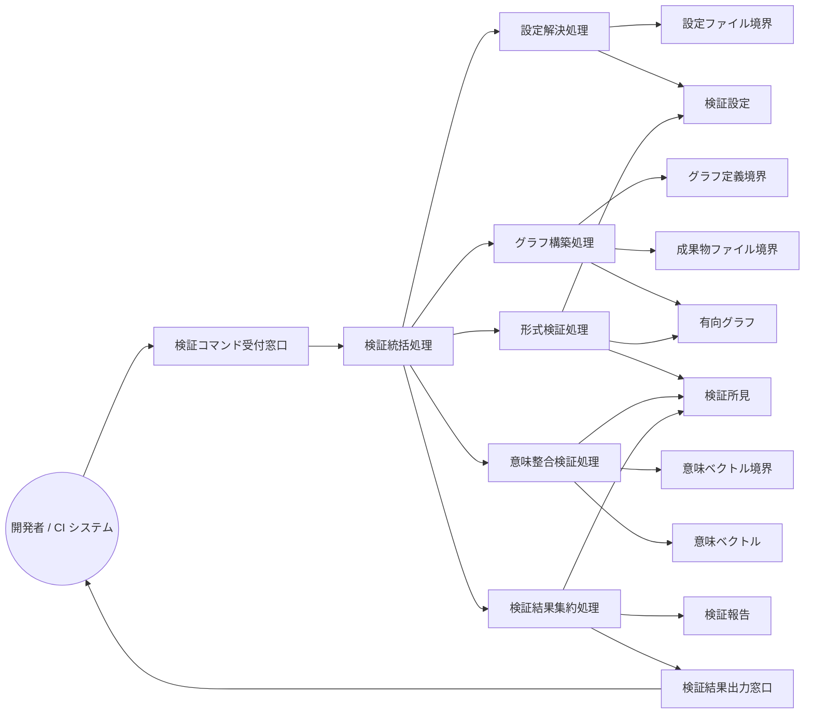

Document ID: RBA-LGX-001

# RBA-LGX-001: グラフ読み込みと検証 のドメイン構造

**親 UC**: UC-LGX-001
**レイヤ**: 抽象側（ドメインレベル、言語非依存）

> **記述規律**: ドメイン語彙のみ。クラス境界・属性・操作・カーディナリティ・言語要素は書かない。Boundary/Control/Entity の役割識別と通信制約遵守のみ（`04-iconix-layer.md` §3）。本 RBA は UC-LGX-001 の動作検証装置である。

---

## 1. ドメイン主語

UC-LGX-001 から抽出した主語（概念名のまま、クラス名にしない）。

### Boundary 役割（名詞・外部との境界）

- **検証コマンド受付窓口**: アクター（開発者 / CI システム）からの検証要求（`check --formal` / `check`）を受け取る境界
- **設定ファイル境界**: `.legixy.toml`（検証設定の供給元）
- **グラフ定義境界**: `graph.toml`（有向グラフ定義の供給元）
- **成果物ファイル境界**: 各成果物ファイル本文（ファイル存在・Document ID 行・引用の照合対象）
- **意味ベクトル境界**: 保存済み意味ベクトルの供給元（意味整合検証の参照元。不在・空も許容される供給状態）
- **検証結果出力窓口**: 検証報告（人間可読 / 構造化）とログを区別してアクターへ返す境界

### Control 役割（動詞・制御）

- **検証統括処理**: 検証要求を受け、設定解決・グラフ構築・形式検証・意味整合検証・結果集約を協調させる。部分的な読込失敗があっても他の検証を継続する責務を持つ
- **設定解決処理**: 設定ファイル境界から検証設定を解決する
- **グラフ構築処理**: グラフ定義境界と成果物ファイル境界から有向グラフを構築する（未解決エッジは除外し記録、CTX-INV-5）
- **形式検証処理**: 有向グラフと検証設定から形式的整合性（ID 形式・ファイル存在・Document ID 一致・チェーン整合・孤立・DAG）を検査し検証所見を生成する
- **意味整合検証処理**: 意味ベクトルを参照し、宣言済み再定義の引用・定義値との不整合・サブノード意味乖離（いずれもオプトイン）を検査し検証所見を生成する
- **検証結果集約処理**: 検証所見を severity 別に集約して検証報告を作り、結果の成否（致命所見の有無）を確定する

### Entity 役割（名詞・データ）

- **検証設定**: 検証の閾値・オプトイン有効化・設定ソースなどの解決済み設定値
- **有向グラフ**: 構築されたノード・エッジの集合（未解決エッジの記録を含む）
- **検証所見**: 個々の検査結果（区分・severity・対象 ID・位置・メッセージ）
- **検証報告**: 検証所見を集約した結果（区分別件数・全体の成否）
- **意味ベクトル**: 意味整合検証が参照する保存済みベクトル（不在は致命としない供給状態）

## 2. 主語間の関係（概念レベル）

カーディナリティ・composition/aggregation の意味付けは具体側（RBD）で行う。

- 検証コマンド受付窓口 は 検証統括処理 に検証要求を渡す
- 検証統括処理 は 設定解決処理・グラフ構築処理・形式検証処理・意味整合検証処理・検証結果集約処理 を協調させる
- 設定解決処理 は 設定ファイル境界 を読み 検証設定 を確定する
- グラフ構築処理 は グラフ定義境界 と 成果物ファイル境界 を読み 有向グラフ を構築する
- 形式検証処理 は 有向グラフ と 検証設定 を読み 検証所見 を生成する
- 意味整合検証処理 は 意味ベクトル境界 から 意味ベクトル を参照し 検証所見 を生成する（オプトイン無効時・ベクトル不在時は所見を増やさない）
- 検証結果集約処理 は 検証所見 を集約し 検証報告 を作り 検証結果出力窓口 に渡す
- 検証結果出力窓口 は アクター に検証報告とログを区別して返す

## 3. 通信フロー（ドメインレベル）

主語名はドメイン語彙。クラス名命名規則（PascalCase 等）・関数名・型は使わない。

## 4. 通信制約遵守チェック（Noun-Verb ルール、§3.4）

- [x] Boundary 同士の直接通信なし（受付窓口・各供給境界・出力窓口は Control 経由でのみ連携）
- [x] Entity 同士の直接通信なし（検証設定・有向グラフ・検証所見・検証報告・意味ベクトルは Control 経由でのみ読み書き）
- [x] Boundary → Entity 直結なし（供給境界から Entity への流れは必ず Control〔設定解決/グラフ構築/意味整合検証〕を介する）
- [x] Actor → Control / Entity 直結なし（アクターは検証コマンド受付窓口 Boundary のみと通信）

違反なし。全通信が Actor⇄Boundary / Boundary⇄Control / Control⇄Control / Control⇄Entity に収まる。

## 5. 1:1 Correspondence 検証（UC ⇄ RBA、§3.3）

| UC-LGX-001 ステップ | RBA フロー上の対応 | 整合 |
|---|---|---|
| 基本 1（`check --formal` 実行） | Actor → 検証コマンド受付窓口 → 検証統括処理 | ✓ |
| 基本 2（`.legixy.toml` 解析） | 検証統括処理 → 設定解決処理 → 設定ファイル境界 → 検証設定 | ✓ |
| 基本 3（`graph.toml` 構築） | 検証統括処理 → グラフ構築処理 → グラフ定義境界 / 成果物ファイル境界 → 有向グラフ | ✓ |
| 基本 4a〜f（形式検証: ID/ファイル/Document ID/チェーン/孤立/DAG） | 形式検証処理 → 有向グラフ / 検証設定 → 検証所見 | ✓ |
| 基本 4g〜i（IdRedefined/Mismatch/Drift、オプトイン） | 意味整合検証処理 → 意味ベクトル境界 / 意味ベクトル → 検証所見 | ✓ |
| 基本 5（結果出力 ERROR/WARNING/INFO/OK） | 検証結果集約処理 → 検証報告 → 検証結果出力窓口 | ✓ |
| 基本 6（ERROR 0 件で成功） | 検証結果集約処理 が検証報告の成否を確定 | ✓ |
| 代替 2a/3a（設定/グラフ不在で終了） | 設定解決処理 / グラフ構築処理 が供給境界の不在を検証所見（致命）として集約処理へ | ✓ |
| 代替 4a（`--formal` 無で意味検証追加） | 検証統括処理 が意味整合検証処理を追加起動（UC-LGX-007 へ委譲） | ✓ |
| 代替 4g-A/B・4h-A・4i-A（オプトイン分岐） | 意味整合検証処理 の起動条件（検証設定のオプトイン）で分岐 | ✓ |

逆方向（RBA フロー → UC ステップ）も全フローが UC ステップに対応。余剰フローなし。

## 6. Object Discovery（§3.5）

UC に明示されていなかったが RBA 構築過程で構造化された主語・責務:

- **検証統括処理（Control）の「部分失敗継続」責務**: UC-001 の挙動は SPEC-LGX-004.REQ.05（一部読込失敗でも他検査継続）に委譲されており（UC ループ GAP-LGX-190 で委譲容認 close 済）、RBA では検証統括処理の明示責務として構造化した。新規ドメイン主語の追加ではなく、既存 UC/SPEC 範囲内の責務の可視化。
- **「意味ベクトル境界」と「意味ベクトル」の Boundary/Entity 分離**: UC では engine.db への言及が薄いが、意味整合検証（4g-i）の供給元（境界）と参照データ（Entity）を分離した。不在・空が致命でない供給状態であることは UC 4i-A.6 / SPEC-LGX-004.REQ.02 に錨着。

新ドメイン主語・新責務の SPEC/UC への遡及反映は不要（いずれも既存 UC-001 / SPEC-LGX-004 の範囲内の構造化）。**概念領域の汚染なし**: 各 Entity（検証設定/有向グラフ/検証所見/検証報告/意味ベクトル）に概念領域外の操作混入なし。各 Control の責務名と担う処理が一致（設定解決処理が結果集約しない、等）。

## 7. ICONIX 流三者整合性（UC ⇄ RBA ⇄ SPEC、§11.2）

| 検査 | 確認内容 | 結果 |
|---|---|---|
| UC ⇄ RBA | UC-001 各ステップが RBA フローに 1:1 対応（§5） | ✓ |
| RBA ⇄ SPEC | RBA 主語が SPEC-LGX-004（検証）/ SPEC-LGX-002（グラフ基盤）の用語・概念と一致。形式検証処理=REQ.01 検証カテゴリ、意味整合検証処理=REQ.11/12/13、検証結果集約処理=REQ.03/04（severity・exit）、有向グラフ=SPEC-002、CTX-INV-5（未解決エッジ）=LEGIXY-SPEC-001 §10.1 | ✓ |
| UC ⇄ SPEC | UC-001 が SPEC-004 の責任分担（判定専用・read-only）・不変条件（CTX-INV-2/4）・終了コード契約（LGX-COMPAT-001 §3）と整合 | ✓ |

概念領域の汚染なし、用語不一致なし。

## 8. Jacobson 流三者整合性（UC ⇄ RBA ⇄ SEQA、§11.1）

**保留**: SEQA-LGX-001 生成時に確定する。本 RBA のドメイン主語（B/C/E）が SEQA のレーンと一致し、Noun-Verb ルールが SEQA でも守られ、UC text 並列配置で各ステップが SEQA メッセージと対応することを SEQA 段階で検証する。RBA 単独では UC⇄RBA（§5）+ UC⇄SPEC（§7）まで。

## 9. 抽象層 GREEN 確定状況（§11.4）

| 条件 | 状況 |
|---|---|
| 1. Jacobson 三者整合性（UC⇄RBA⇄SEQA） | 保留（SEQA 生成後） |
| 2. ICONIX 三者整合性（UC⇄RBA⇄SPEC） | ✓（§7） |
| 3. Noun-Verb ルール違反なし | ✓（§4） |
| 4. Object Discovery を SPEC/UC に反映 | ✓ 反映不要を確認（§6） |
| 5. UC Disambiguation の GAP[UC] closed | ✓ UC-001 の GAP（189/190）は close 済 |
| 6. 概念領域の汚染検査 | ✓（§6） |
| 7. Behavior Allocation 指針（SEQA で） | 保留（SEQA/SEQD） |
| 8. `check --formal` pass | 登録後に確認 |
| 9. レイヤ汚染なし | ✓（言語要素・操作・属性なし） |

3〜7 は機械検証不能（Adversary + 人間判断）。SEQA-LGX-001 と対で抽象層 GREEN を確定する。

## 10. 履歴

| 日付 | 変更内容 |
|---|---|
| 2026-06-13 | 初版。UC-LGX-001 のドメイン構造（Boundary 6 / Control 6 / Entity 5）。UC⇄RBA 1:1 対応・Noun-Verb・Object Discovery・ICONIX 三者整合性を確認。Jacobson 三者整合性は SEQA-LGX-001 で確定 |
