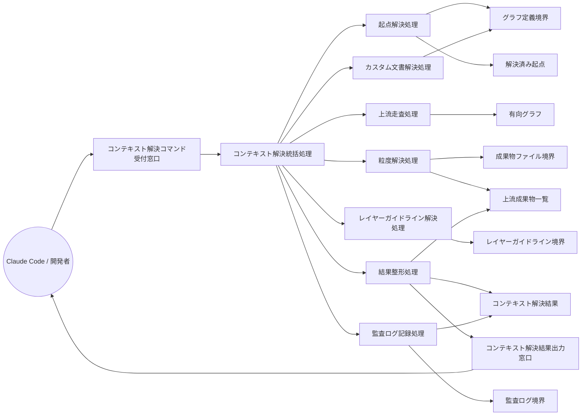

Document ID: RBA-LGX-002

# RBA-LGX-002: コンテキスト解決 のドメイン構造

**親 UC**: UC-LGX-002
**レイヤ**: 抽象側（ドメインレベル、言語非依存）

> **記述規律**: ドメイン語彙のみ。クラス境界・属性・操作・カーディナリティ・言語要素は書かない。Boundary/Control/Entity の役割識別と通信制約遵守のみ（`04-iconix-layer.md` §3）。本 RBA は UC-LGX-002 の動作検証装置である。

---

## 1. ドメイン主語

UC-LGX-002 から抽出した主語（概念名のまま、クラス名にしない）。

### Boundary 役割（名詞・外部との境界）

- **コンテキスト解決コマンド受付窓口**: アクター（Claude Code / 開発者）からの `context <files>` 要求（オプション含む）を受け取る境界
- **設定ファイル境界**: `.legixy.toml`（設定の供給元）
- **グラフ定義境界**: `graph.toml`（有向グラフ定義の供給元。ノード・エッジ情報の照合源）
- **成果物ファイル境界**: 上流成果物の本文ファイル（本文・サブノード本文の供給元。不在・欠損も許容）
- **レイヤーガイドライン境界**: レイヤーに対応するガイドライン文書の供給元
- **監査ログ境界**: context_log への記録先（engine.db 上の書込先。不在・書込失敗もベストエフォート）
- **コンテキスト解決結果出力窓口**: 解決済みコンテキスト結果（6 セクション）をアクターへ返す境界

### Control 役割（動詞・制御）

- **コンテキスト解決統括処理**: コンテキスト解決要求を受け、起点解決・上流走査・ガイドライン解決・カスタム文書解決・結果整形・監査ログ記録を協調させる。起点ノード不在・上流部分欠損でも部分成功を継続する責務を持つ
- **起点解決処理**: 指定ファイルパスを graph.toml のノードに逆引きし、解決済み起点と未解決起点を分別する
- **上流走査処理**: 解決済み起点から有向グラフを逆方向（chain エッジ・ParentChild エッジ）に走査し、上流成果物を収集する。depth_limit が指定された場合は走査階層を制限する
- **粒度解決処理**: 走査結果の各上流成果物に対して granularity（文書全文 / サブノード本文）を適用し、返却本文を確定する。sections フィルタおよび outline 変換も本処理内で適用する
- **レイヤーガイドライン解決処理**: 起点のレイヤーに対応するガイドライン文書をレイヤーガイドライン境界から取得し、辞書順で整列する
- **カスタム文書解決処理**: カスタムエッジに基づく追加文書をグラフ定義境界から取得し、辞書順で整列する
- **結果整形処理**: 6 セクション（レイヤーガイドライン・追加ガイドライン・キャッシュブレーク点マーカ・上流成果物・対象ノードメタデータ・カスタム文書）を決定論的順序で組み立て、コンテキスト解決結果を生成する。返却本文の文字数が上限を超える場合はエラーを生成する
- **監査ログ記録処理**: コンテキスト解決結果の確定後、呼出情報を監査ログ境界へ書き込む。書込失敗は警告として記録しつつ本処理の成功を維持する

### Entity 役割（名詞・データ）

- **解決済み起点**: ファイルパスから特定された対象ノード情報（対応する成果物 ID および未解決起点の記録を含む）
- **有向グラフ**: 設定・グラフ定義境界から構築されたノード・エッジの集合（上流走査の基盤）
- **上流成果物一覧**: 走査・フィルタ・粒度解決を経た上流成果物の集合（chain_distance 順・決定論的整列済み）
- **コンテキスト解決結果**: 6 セクション構成の最終返却データ（targets / upstream / layer_documents / additional_documents / custom_documents・キャッシュブレーク点マーカを含む）

## 2. 主語間の関係（概念レベル）

カーディナリティ・composition/aggregation の意味付けは具体側（RBD）で行う。

- コンテキスト解決コマンド受付窓口 は コンテキスト解決統括処理 に要求を渡す
- コンテキスト解決統括処理 は 起点解決処理・上流走査処理・粒度解決処理・レイヤーガイドライン解決処理・カスタム文書解決処理・結果整形処理・監査ログ記録処理 を協調させる
- 起点解決処理 は グラフ定義境界 を参照し 解決済み起点 を確定する
- 上流走査処理 は 有向グラフ を走査し 上流成果物一覧 の候補を収集する
- 粒度解決処理 は 成果物ファイル境界 から本文を取得し 上流成果物一覧 を確定する
- レイヤーガイドライン解決処理 は レイヤーガイドライン境界 を参照し コンテキスト解決結果 のガイドライン部分を供給する
- カスタム文書解決処理 は グラフ定義境界 からカスタムエッジ情報を取得し コンテキスト解決結果 のカスタム文書部分を供給する
- 結果整形処理 は 上流成果物一覧 と各ガイドライン部分を合成し コンテキスト解決結果 を生成する
- 監査ログ記録処理 は コンテキスト解決結果 の確定後に 監査ログ境界 へ書き込む
- コンテキスト解決結果出力窓口 は アクターに コンテキスト解決結果 を返す

## 3. 通信フロー（ドメインレベル）

主語名はドメイン語彙。クラス名命名規則（PascalCase 等）・関数名・型は使わない。

## 4. 通信制約遵守チェック（Noun-Verb ルール、§3.4）

- [x] Boundary 同士の直接通信なし（受付窓口・各供給境界・出力窓口はすべて Control 経由でのみ連携）
- [x] Entity 同士の直接通信なし（解決済み起点・有向グラフ・上流成果物一覧・コンテキスト解決結果はすべて Control 経由でのみ読み書き）
- [x] Boundary → Entity 直結なし（グラフ定義境界・成果物ファイル境界・レイヤーガイドライン境界から Entity への流れは必ず Control を介する）
- [x] Actor → Control / Entity 直結なし（アクターはコンテキスト解決コマンド受付窓口 Boundary のみと通信）

違反なし。全通信が Actor⇄Boundary / Boundary⇄Control / Control⇄Control / Control⇄Entity に収まる。

## 5. 1:1 Correspondence 検証（UC ⇄ RBA、§3.3）

| UC-LGX-002 ステップ | RBA フロー上の対応 | 整合 |
|---|---|---|
| 基本 1（`context <files>` 実行） | アクター → コンテキスト解決コマンド受付窓口 → コンテキスト解決統括処理 | ✓ |
| 基本 2（ファイルパスから成果物 ID を逆引き） | コンテキスト解決統括処理 → 起点解決処理 → グラフ定義境界 → 解決済み起点 | ✓ |
| 基本 3（有向グラフを逆方向走査して上流成果物を収集） | コンテキスト解決統括処理 → 上流走査処理 → 有向グラフ | ✓ |
| 基本 4（レイヤールールに基づくガイドライン文書を解決） | コンテキスト解決統括処理 → レイヤーガイドライン解決処理 → レイヤーガイドライン境界 | ✓ |
| 基本 5（カスタムエッジに基づく追加文書を解決） | コンテキスト解決統括処理 → カスタム文書解決処理 → グラフ定義境界 | ✓ |
| 基本 6（ContextResult として返却） | 結果整形処理 → コンテキスト解決結果 → コンテキスト解決結果出力窓口 → アクター | ✓ |
| 基本 7（context_log に監査ログを記録） | 監査ログ記録処理 → 監査ログ境界 | ✓ |
| 代替 2a（ファイルがどのノードにも対応しない） | 起点解決処理 が未解決起点を解決済み起点の記録として保持し、targets の artifact_id を null として結果整形処理へ渡す | ✓ |
| 代替 3a（上流成果物が存在しない） | 上流走査処理 が空の上流成果物一覧を返し、粒度解決処理・結果整形処理が空 upstream で組み立て | ✓ |
| 代替 4-A（`--outline-only` 指定時の見出し変換） | 粒度解決処理 が各上流成果物の本文を見出し階層リストに置換（sections フィルタ後） | ✓ |
| 代替 4-B（`--sections <ids>` 指定時のサブノード絞り込み） | 粒度解決処理 が sections フィルタを適用し、指定 ID と一致するサブノードのみを上流成果物一覧に含める | ✓ |
| 代替 4-C（`--depth N` 指定時の走査階層制限） | 上流走査処理 が depth_limit に従い走査を N 階層に制限する | ✓ |

逆方向（RBA フロー → UC ステップ）も全フローが UC ステップに対応。余剰フローなし。

## 6. Object Discovery（§3.5）

UC に明示されていなかったが RBA 構築過程で構造化された主語・責務:

- **有向グラフ（Entity）の構築タイミング**: UC-LGX-002 では `graph.toml` を直接参照する形で記述されているが、RBA では「グラフ定義境界（Boundary）→ 有向グラフ（Entity）」の分離を構造化した。これは UC-LGX-001 の有向グラフ構築と同一ドメイン概念を共有することを明示するものであり、新規主語の追加ではなく既存 SPEC-LGX-003.REQ.04（決定論保証）/ SPEC-LGX-002（グラフ基盤）の範囲内の可視化。
- **粒度解決処理（Control）の sections フィルタ・outline 変換責務**: UC では代替 4-A/4-B として独立した分岐として記述されているが、RBA では粒度解決処理の内部適用順（sections フィルタ → outline 変換）として構造化した。SPEC-LGX-003.REQ.18（フラグ組合せ優先順位）に錨着。新規ドメイン主語は不要。
- **監査ログ記録処理のベストエフォート責務**: UC の事後条件「context_log に記録が追加される」の背後に、SPEC-LGX-003.REQ.19（書込失敗時は警告のみで本処理成功を維持）が存在する。RBA ではこれを監査ログ記録処理の明示責務として構造化した。SPEC/UC 範囲内の責務の可視化であり遡及不要。
- **大規模返却時エラー**: UC では触れられていないが、SPEC-LGX-003.REQ.13（500,000 文字超過でエラー返却）が結果整形処理の責務として存在する。UC には代替フローとして記載されていないが、SPEC に明示されている。**GAP[UC] 候補**（後述 NOTES 参照）。

**概念汚染なし**: 各 Entity（解決済み起点・有向グラフ・上流成果物一覧・コンテキスト解決結果）に概念領域外の操作混入なし。各 Control の責務名と担う処理が一致。

## 7. ICONIX 流三者整合性（UC ⇄ RBA ⇄ SPEC、§11.2）

| 検査 | 確認内容 | 結果 |
|---|---|---|
| UC ⇄ RBA | UC-LGX-002 各ステップが RBA フローに 1:1 対応（§5） | ✓ |
| RBA ⇄ SPEC | RBA 主語が SPEC-LGX-003 の用語・概念と一致。起点解決処理=REQ.20（起点ノード不在時の扱い）、上流走査処理=REQ.02（上流成果物の返却）・REQ.17（depth_limit）、粒度解決処理=REQ.03（granularity）・REQ.15（outline_only）・REQ.16（sections）・REQ.18（フラグ組合せ）、レイヤーガイドライン解決処理=REQ.02（Layer Guidelines）、カスタム文書解決処理=REQ.02（Additional Guidelines・Custom Documents）、結果整形処理=REQ.10（6 セクション）・REQ.11（決定論的整列）・REQ.12（キャッシュブレーク点マーカ）・REQ.13（大規模返却エラー）・REQ.14（バイト単位決定論）、監査ログ記録処理=REQ.07（監査ログ）・REQ.19（書込失敗ベストエフォート） | ✓ |
| UC ⇄ SPEC | UC-LGX-002 が SPEC-LGX-003 の不変条件（CTX-INV-1/2/3/MCP-INV-4）・事後条件と整合。REQ.04（決定論）・REQ.06（MCP-INV-1、新ツール追加禁止）・REQ.09（並行安全性）との整合を確認 | ✓ |

概念領域の汚染なし、用語不一致なし。

## 8. Jacobson 流三者整合性（UC ⇄ RBA ⇄ SEQA、§11.1）

**保留**: SEQA-LGX-002 生成時に確定する。本 RBA のドメイン主語（B/C/E）が SEQA のレーンと一致し、Noun-Verb ルールが SEQA でも守られ、UC text 並列配置で各ステップが SEQA メッセージと対応することを SEQA 段階で検証する。RBA 単独では UC⇄RBA（§5）+ UC⇄SPEC（§7）まで。

## 9. 抽象層 GREEN 確定状況（§11.4）

| 条件 | 状況 |
|---|---|
| 1. Jacobson 三者整合性（UC⇄RBA⇄SEQA） | 保留（SEQA 生成後） |
| 2. ICONIX 三者整合性（UC⇄RBA⇄SPEC） | ✓（§7） |
| 3. Noun-Verb ルール違反なし | ✓（§4） |
| 4. Object Discovery を SPEC/UC に反映 | ✓ 反映不要を確認（§6）。大規模返却エラーの UC 代替フロー欠落は GAP[UC] 候補として NOTES に記載 |
| 5. UC Disambiguation の GAP[UC] closed | 確認要（大規模返却エラー GAP[UC] 候補の裁定待ち） |
| 6. 概念領域の汚染検査 | ✓（§6） |
| 7. Behavior Allocation 指針（SEQA で） | 保留（SEQA/SEQD） |
| 8. `check --formal` pass | 登録後に確認 |
| 9. レイヤ汚染なし | ✓（言語要素・操作・属性なし） |

3〜7 は機械検証不能（Adversary + 人間判断）。SEQA-LGX-002 と対で抽象層 GREEN を確定する。

## 10. 履歴

| 日付 | 変更内容 |
|---|---|
| 2026-06-13 | 初版。UC-LGX-002 のドメイン構造（Boundary 7 / Control 7 / Entity 4）。UC⇄RBA 1:1 対応・Noun-Verb・Object Discovery・ICONIX 三者整合性を確認。大規模返却エラー（REQ.13）が UC 代替フローに未記載である点を GAP[UC] 候補として記録。Jacobson 三者整合性は SEQA-LGX-002 で確定 |
