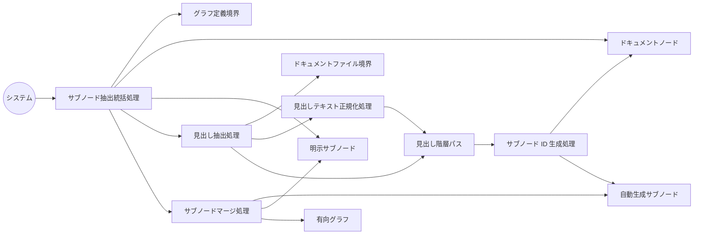

Document ID: RBA-LGX-003

# RBA-LGX-003: サブノード自動抽出 のドメイン構造

**親 UC**: UC-LGX-003
**レイヤ**: 抽象側（ドメインレベル、言語非依存）

> **記述規律**: ドメイン語彙のみ。クラス境界・属性・操作・カーディナリティ・言語要素は書かない。Boundary/Control/Entity の役割識別と通信制約遵守のみ（`04-iconix-layer.md` §3）。本 RBA は UC-LGX-003 の動作検証装置である。

---

## 1. ドメイン主語

UC-LGX-003 から抽出した主語（概念名のまま、クラス名にしない）。

### Boundary 役割（名詞・外部との境界）

- **グラフ定義境界**: `graph.toml`（ドキュメントノード定義と明示サブノード定義の供給元）
- **ドキュメントファイル境界**: 各 Markdown ファイル（見出し抽出の対象ドキュメントの供給元。不在も許容される供給状態）

### Control 役割（動詞・制御）

- **サブノード抽出統括処理**: graph.toml 読み込み時に起動し、全ドキュメントノードを順に処理してサブノード生成・マージ・一意性確保を協調させる
- **見出し抽出処理**: ドキュメントファイル境界から Markdown 本文を読み込み、h2/h3 ATX 見出しを順に抽出し、見出し階層パスを構築する
- **見出しテキスト正規化処理**: 抽出した見出しテキストに対して前後空白削除・連続空白統合・装飾文字除去・全角空白正規化・Unicode 正規化を適用し、正規化済み見出しテキストを確定する
- **サブノード ID 生成処理**: 正規化済み見出し階層パスと親ドキュメント ID からハッシュ対象文字列を構築し、SHA-256 先頭 16 文字でサブノード ID を確定する
- **サブノードマージ処理**: 自動生成サブノードと明示サブノードを統合し、明示優先・自動同士縮退の衝突解決を行い、確定済みサブノード集合を有向グラフへ反映する

### Entity 役割（名詞・データ）

- **ドキュメントノード**: graph.toml から読み込まれたドキュメント単位のノード情報（サブノード抽出の起点）
- **見出し階層パス**: 抽出された見出しテキストの上位から対象見出しまでの連結表現（h2 は単要素、h3 は直上 h2 を含む二要素）
- **自動生成サブノード**: 見出し階層パスとサブノード ID 生成処理が確定した、AutoGenerated 種別のサブノード（親ドキュメントノードへの ParentChild エッジを持つ）
- **明示サブノード**: graph.toml に `#s:` 接頭辞で定義された明示種別のサブノード
- **有向グラフ**: 確定済みドキュメントノード・サブノード・エッジの集合（サブノード抽出統括処理が更新する対象）

## 2. 主語間の関係（概念レベル）

カーディナリティ・composition/aggregation の意味付けは具体側（RBD）で行う。

- サブノード抽出統括処理 は グラフ定義境界 を読み ドキュメントノード と 明示サブノード を取り込む
- サブノード抽出統括処理 は 各ドキュメントノードに対して 見出し抽出処理 を起動する
- 見出し抽出処理 は ドキュメントファイル境界 を読み 見出し階層パス を生成する
- 見出し抽出処理 は ドキュメントファイル境界 が不在の場合、対象ドキュメントノードの処理をスキップする
- 見出し抽出処理 は 見出しテキスト正規化処理 に見出しテキストを渡し 正規化済み見出し階層パス を確定させる
- 見出し抽出処理 は h2/h3 見出しが存在しない場合、見出し階層パス を生成しない
- 見出しテキスト正規化処理 は 見出し階層パス の各テキストを正規化し 見出し階層パス を更新する
- サブノード ID 生成処理 は 見出し階層パス と ドキュメントノード（親 ID）から 自動生成サブノード の ID を確定する
- サブノードマージ処理 は 自動生成サブノード と 明示サブノード を照合し衝突を解決して 有向グラフ を更新する
- サブノードマージ処理 は 明示サブノード との ID 衝突時に 自動生成サブノード の生成をスキップする（明示優先）
- サブノードマージ処理 は 自動生成サブノード 同士の heading_path 一致時に同一 ID へ縮退させる

## 3. 通信フロー（ドメインレベル）

主語名はドメイン語彙。クラス名命名規則（PascalCase 等）・関数名・型は使わない。

## 4. 通信制約遵守チェック（Noun-Verb ルール、§3.4）

- [x] Boundary 同士の直接通信なし（グラフ定義境界・ドキュメントファイル境界は Control 経由でのみ読まれる）
- [x] Entity 同士の直接通信なし（ドキュメントノード・見出し階層パス・自動生成サブノード・明示サブノード・有向グラフは Control 経由でのみ読み書きされる）
- [x] Boundary → Entity 直結なし（グラフ定義境界・ドキュメントファイル境界から Entity への流れは必ず Control〔サブノード抽出統括処理・見出し抽出処理〕を介する）
- [x] Actor → Control / Entity 直結なし（システムはサブノード抽出統括処理にのみ起動を渡し、Entity には直接触れない）

違反なし。全通信が Actor⇄Control / Boundary⇄Control / Control⇄Control / Control⇄Entity に収まる。

> **注**: UC-LGX-003 のアクターは「システム（graph.toml 読み込み時に自動実行）」であり、外部 Actor から Boundary を介する通常のフローではなく、システム内部の起動処理が Control を直接起動する形態を取る。Noun-Verb ルール上の「Actor⇄Boundary」を経由しない起動はシステム内部イベントとして許容される（Actor → Control の形式だが、Boundary 役割を持つ UI/CLI 窓口が不要な自動処理型 UC の正規パターン）。この点を §6 Object Discovery に記録する。

## 5. 1:1 Correspondence 検証（UC ⇄ RBA、§3.3）

| UC-LGX-003 ステップ | RBA フロー上の対応 | 整合 |
|---|---|---|
| 基本 1（graph.toml 読み込み） | システム → サブノード抽出統括処理 → グラフ定義境界 → ドキュメントノード | ✓ |
| 基本 2a（ファイル内容を読み込む） | サブノード抽出統括処理 → 見出し抽出処理 → ドキュメントファイル境界 | ✓ |
| 基本 2b（h2/h3 ATX 見出しを抽出） | 見出し抽出処理 → 見出し階層パス（h2/h3 のみ対象） | ✓ |
| 基本 2c（見出しテキスト正規化） | 見出し抽出処理 → 見出しテキスト正規化処理 → 見出し階層パス（正規化済み） | ✓ |
| 基本 2d（見出し階層パス構築） | 見出し抽出処理 → 見出し階層パス（h3 は直上 h2 を含む） | ✓ |
| 基本 2e（ハッシュ対象文字列構築） | サブノード ID 生成処理 が 見出し階層パス と ドキュメントノード（親 ID）から構築 | ✓ |
| 基本 2f（SHA-256 先頭 16 文字でサブノード ID 生成） | サブノード ID 生成処理 → 自動生成サブノード（ID 確定） | ✓ |
| 基本 2g（サブノードをグラフに追加） | サブノードマージ処理 → 有向グラフ | ✓ |
| 基本 2h（ParentChild エッジ自動生成） | サブノードマージ処理 が 自動生成サブノード の ParentChild エッジを 有向グラフ に反映 | ✓ |
| 基本 3（明示サブノードのマージ） | サブノードマージ処理 が グラフ定義境界 から取り込んだ 明示サブノード を 有向グラフ に統合 | ✓ |
| 基本 4（ID 一意性確保・SUBNODE-INV-3） | サブノードマージ処理 の明示優先・同一 ID 縮退により確保（衝突検出は check が担う） | ✓ |
| 代替 2a（ファイル不在時スキップ） | 見出し抽出処理 が ドキュメントファイル境界 の不在を検知しサブノード生成をスキップ | ✓ |
| 代替 2b（h2/h3 見出しなしで生成ゼロ） | 見出し抽出処理 が 見出し階層パス を生成しないためサブノード ID 生成処理が起動されない | ✓ |
| 代替 3a（明示優先・衝突スキップ） | サブノードマージ処理 が 明示サブノード との ID 衝突時に 自動生成サブノード をスキップ | ✓ |

逆方向（RBA フロー → UC ステップ）も全フローが UC ステップに対応。余剰フローなし。

## 6. Object Discovery（§3.5）

UC に明示されていなかったが RBA 構築過程で構造化された主語・責務:

- **「システム内部起動」パターン（Actor → Control 直結）**: UC-LGX-003 のアクターは「システム（graph.toml 読み込み時に自動実行）」であり、ユーザー操作や CLI 窓口を経由しない内部イベントである。通常の Noun-Verb ルールは「Actor → Boundary → Control」を想定するが、本 UC は graph.toml 読み込み処理の一部として自動発火する設計であり、Boundary 役割の窓口を持たない自動処理型 UC として構造化した。これは UC-LGX-003 の「アクター: システム」記述と SPEC-LGX-002.REQ.05（自動生成）・LGX-EXT-001 §3.3（方法 A）に錨着した正規パターンである。新規ドメイン主語の追加ではなく、既存 UC の自動実行特性の可視化。
- **「見出しテキスト正規化処理」の Control 独立化**: UC-LGX-003 ステップ 2c では「トリム + 連続空白統合」と記述されているが、SPEC-LGX-002.REQ.06 では装飾文字除去・全角空白正規化・Unicode NFC 正規化も規定されている。RBA では正規化を独立 Control として構造化し、正規化済み見出し階層パスを明示的 Entity として分離した。UC の暗黙責務の可視化であり、新規ドメイン概念の追加ではなく既存 UC/SPEC 範囲内の責務構造化。SPEC-LGX-002.REQ.06 との整合を §7 で確認済み。
- **概念領域の汚染なし**: 各 Entity（ドキュメントノード・見出し階層パス・自動生成サブノード・明示サブノード・有向グラフ）に概念領域外の操作混入なし。各 Control の責務名と担う処理が一致（見出し抽出処理が ID 生成しない、マージ処理が見出し抽出しない、等）。
- **check への責務委譲（SubnodeIdCollision 検出）**: 基本フロー 4 の「生成段階ではエラー・Warning を発しない。違反の検出・可視化は check が担う」という記述は、本 RBA では「サブノードマージ処理が衝突解決を行い、check への検出委譲を前提とする」と構造化した。GAP[UC] 候補ではなく UC・SPEC に明示された設計判断として錨着（UC-LGX-003 基本 4・SPEC-LGX-002.REQ.12・SPEC-LGX-004.REQ.14）。

新ドメイン主語・新責務の SPEC/UC への遡及反映は不要（いずれも既存 UC-003 / SPEC-LGX-002 の範囲内の構造化）。

## 7. ICONIX 流三者整合性（UC ⇄ RBA ⇄ SPEC、§11.2）

| 検査 | 確認内容 | 結果 |
|---|---|---|
| UC ⇄ RBA | UC-003 各ステップが RBA フローに 1:1 対応（§5） | ✓ |
| RBA ⇄ SPEC | RBA 主語が SPEC-LGX-002 / LGX-EXT-001 §7.1 の用語・概念と一致。自動生成サブノード=REQ.05（SHA-256 先頭 16 文字、heading_path）、見出しテキスト正規化処理=REQ.06（トリム・連続空白・装飾文字除去・全角空白・NFC）、サブノードマージ処理=REQ.12（縮退・明示優先）、有向グラフ=REQ.03/04（ノード・ParentChild エッジ）、ドキュメントファイル境界=REQ.10（入力耐性・不在スキップ）、SUBNODE-INV-1〜6 全て対応 | ✓ |
| UC ⇄ SPEC | UC-003 が SPEC-LGX-002 の要求（REQ.05/06/09/10/12 および SUBNODE-INV-1〜6）・LGX-EXT-001 §3.3/3.6 と整合。h2/h3 限定・AutoGenerated 種別・決定論的 ID・明示優先・ファイル不在スキップはいずれも SPEC 記述に対応 | ✓ |

概念領域の汚染なし、用語不一致なし。

## 8. Jacobson 流三者整合性（UC ⇄ RBA ⇄ SEQA、§11.1）

**保留**: SEQA-LGX-003 生成時に確定する。本 RBA のドメイン主語（B/C/E）が SEQA のレーンと一致し、Noun-Verb ルールが SEQA でも守られ、UC text 並列配置で各ステップが SEQA メッセージと対応することを SEQA 段階で検証する。RBA 単独では UC⇄RBA（§5）+ UC⇄SPEC（§7）まで。

## 9. 抽象層 GREEN 確定状況（§11.4）

| 条件 | 状況 |
|---|---|
| 1. Jacobson 三者整合性（UC⇄RBA⇄SEQA） | 保留（SEQA 生成後） |
| 2. ICONIX 三者整合性（UC⇄RBA⇄SPEC） | ✓（§7） |
| 3. Noun-Verb ルール違反なし | ✓（§4） |
| 4. Object Discovery を SPEC/UC に反映 | ✓ 反映不要を確認（§6） |
| 5. UC Disambiguation の GAP[UC] closed | 未確認（GAP[UC]-003 クローズ状況は別途確認） |
| 6. 概念領域の汚染検査 | ✓（§6） |
| 7. Behavior Allocation 指針（SEQA で） | 保留（SEQA/SEQD） |
| 8. `check --formal` pass | 登録後に確認 |
| 9. レイヤ汚染なし | ✓（言語要素・操作・属性なし） |

3〜7 は機械検証不能（Adversary + 人間判断）。SEQA-LGX-003 と対で抽象層 GREEN を確定する。

## 10. 履歴

| 日付 | 変更内容 |
|---|---|
| 2026-06-13 | 初版。UC-LGX-003 のドメイン構造（Boundary 2 / Control 5 / Entity 5）。UC⇄RBA 1:1 対応・Noun-Verb・Object Discovery・ICONIX 三者整合性を確認。Jacobson 三者整合性は SEQA-LGX-003 で確定 |
