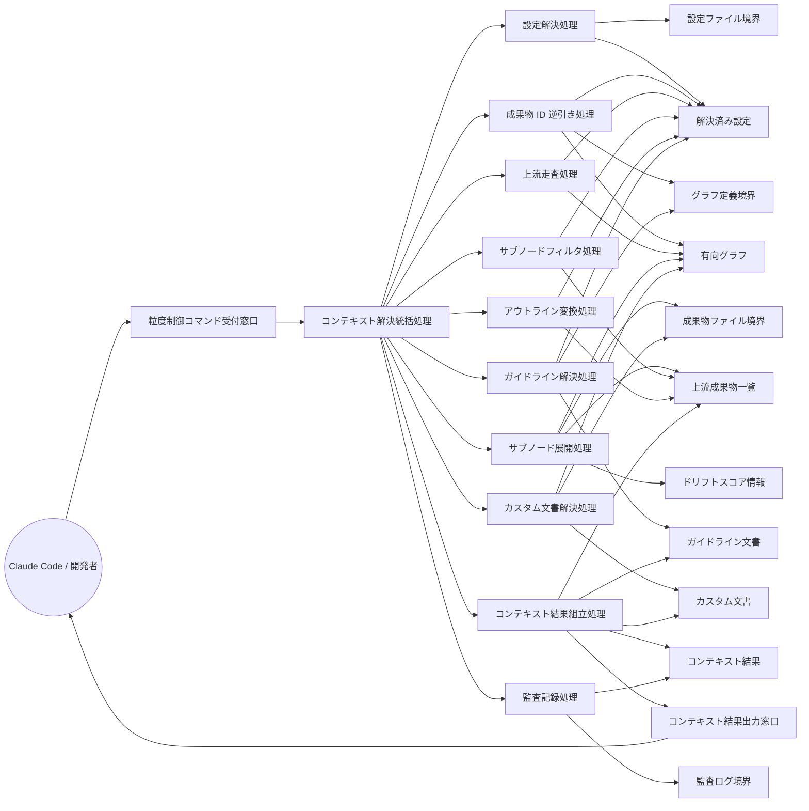

Document ID: RBA-LGX-004

# RBA-LGX-004: 粒度制御付きコンテキスト解決 のドメイン構造

**親 UC**: UC-LGX-004
**レイヤ**: 抽象側（ドメインレベル、言語非依存）

> **記述規律**: ドメイン語彙のみ。クラス境界・属性・操作・カーディナリティ・言語要素は書かない。Boundary/Control/Entity の役割識別と通信制約遵守のみ（`04-iconix-layer.md` §3）。本 RBA は UC-LGX-004 の動作検証装置である。

---

## 1. ドメイン主語

UC-LGX-004 から抽出した主語（概念名のまま、クラス名にしない）。

### Boundary 役割（名詞・外部との境界）

- **粒度制御コマンド受付窓口**: アクター（Claude Code / 開発者）から `--granularity subnode` を含むコンテキスト解決要求を受け取る境界
- **設定ファイル境界**: `.legixy.toml`（設定の供給元）
- **グラフ定義境界**: `graph.toml`（有向グラフ定義・サブノードエッジの供給元）
- **成果物ファイル境界**: 各成果物ファイル本文（上流成果物の内容を供給する境界。サブノードセクション抽出の対象）
- **コンテキスト結果出力窓口**: コンテキスト解決結果（上流成果物一覧・ガイドライン・カスタム文書）をアクターへ返す境界
- **監査ログ境界**: 呼出し記録（context_log）の書き込み先境界

### Control 役割（動詞・制御）

- **コンテキスト解決統括処理**: 粒度制御付きコンテキスト解決要求を受け、設定解決・成果物 ID 逆引き・上流走査・ガイドライン解決・カスタム文書解決・結果組立・監査記録を協調させる
- **設定解決処理**: 設定ファイル境界から設定を解決する
- **成果物 ID 逆引き処理**: 対象ファイルパスから対応する成果物 ID をグラフ定義境界を参照して逆引きする
- **上流走査処理**: 成果物 ID を起点にグラフ定義境界の有向グラフを逆方向に辿り、上流成果物を収集する。粒度が `subnode` の場合はサブノードエッジも走査対象とする。`--depth N` が指定された場合は N 階層に走査を制限する
- **サブノード展開処理**: 上流走査で収集した上流成果物の各ドキュメントについて、サブノードエッジを辿って関連サブノードを特定し、成果物ファイル境界から各サブノードセクションの本文を抽出する。サブノードが存在しない場合はドキュメント全体（fallback）とする
- **サブノードフィルタ処理**: `--sections <ids>` が指定された場合、展開済みサブノードのうち指定 ID と一致するもののみに絞り込む
- **アウトライン変換処理**: `--outline-only` が指定された場合、各上流成果物の本文を見出し一覧に置換する。`--granularity subnode` との組合せ時は sections フィルタ適用後のサブノードの本文をアンカー文字列のみとする
- **ガイドライン解決処理**: 設定とグラフ定義境界からレイヤーガイドライン・追加ガイドラインを解決する
- **カスタム文書解決処理**: グラフ定義境界のカスタムエッジから追加文書を解決する
- **コンテキスト結果組立処理**: 解決済みの上流成果物一覧・ガイドライン・カスタム文書・キャッシュブレーク点マーカを規定のセクション順序（Layer Guidelines → Additional Guidelines → キャッシュブレーク点 → Upstream Artifacts → Target Node Metadata → Custom Documents）に従って決定論的に組み立て、コンテキスト結果を確定する
- **監査記録処理**: コンテキスト解決の呼出しを監査ログ境界に記録する。記録に失敗した場合も本処理の結果返却は維持する（本処理優先）

### Entity 役割（名詞・データ）

- **解決済み設定**: 設定ファイルから解決された設定値（粒度・depth・フラグ類を含む）
- **有向グラフ**: グラフ定義境界からロードされたノード・エッジの集合（サブノードエッジ・カスタムエッジ・チェーンエッジを含む）
- **上流成果物一覧**: 上流走査で収集し、粒度制御に従って整形された上流成果物（ドキュメント全文またはサブノードセクション）の集合。セクション内部は決定論的順序に従う
- **ドリフトスコア情報**: 各サブノードエッジに付与された意味的ズレ度合い（上流成果物一覧の各要素に付属する）
- **ガイドライン文書**: レイヤーガイドライン・追加ガイドラインの解決済み内容
- **カスタム文書**: カスタムエッジ由来の追加文書の解決済み内容
- **コンテキスト結果**: 組み立て完成後の返却内容（上流成果物一覧・ガイドライン・カスタム文書・Target Node Metadata・キャッシュブレーク点マーカを含む最終形）

## 2. 主語間の関係（概念レベル）

カーディナリティ・composition/aggregation の意味付けは具体側（RBD）で行う。

- 粒度制御コマンド受付窓口 は コンテキスト解決統括処理 に要求（粒度・フラグ含む）を渡す
- コンテキスト解決統括処理 は 設定解決処理・成果物 ID 逆引き処理・上流走査処理・サブノード展開処理・サブノードフィルタ処理・アウトライン変換処理・ガイドライン解決処理・カスタム文書解決処理・コンテキスト結果組立処理・監査記録処理 を協調させる
- 設定解決処理 は 設定ファイル境界 を読み 解決済み設定 を確定する
- 成果物 ID 逆引き処理 は グラフ定義境界 と 解決済み設定 を参照して ファイルパスと成果物 ID の対応 を有向グラフ から解決する
- 上流走査処理 は 有向グラフ と 解決済み設定（depth 含む）を参照して 上流成果物の候補集合 を収集する
- サブノード展開処理 は 有向グラフ のサブノードエッジを辿り 成果物ファイル境界 からセクション本文を取り出して 上流成果物一覧 を構築する（サブノード不在時は fallback として当該ドキュメント全体）
- サブノードフィルタ処理 は 解決済み設定（sections 指定）を参照して 上流成果物一覧 を絞り込む
- アウトライン変換処理 は 解決済み設定（outline-only 指定）を参照して 上流成果物一覧 の各本文を見出し一覧またはアンカー文字列のみに変換する
- ガイドライン解決処理 は グラフ定義境界 と 解決済み設定 を参照して ガイドライン文書 を確定する
- カスタム文書解決処理 は 有向グラフ のカスタムエッジを辿り 成果物ファイル境界 から カスタム文書 を確定する
- コンテキスト結果組立処理 は 上流成果物一覧・ガイドライン文書・カスタム文書 を読み コンテキスト結果 を確定して コンテキスト結果出力窓口 に渡す
- 監査記録処理 は コンテキスト結果 の呼出し情報を 監査ログ境界 に書き込む
- コンテキスト結果出力窓口 は アクター にコンテキスト結果を返す
- ドリフトスコア情報 は サブノード展開処理 が有向グラフのエッジから取り出し、上流成果物一覧 の各サブノード要素に付属させる

## 3. 通信フロー（ドメインレベル）

主語名はドメイン語彙。クラス名命名規則（PascalCase 等）・関数名・型は使わない。

## 4. 通信制約遵守チェック（Noun-Verb ルール、§3.4）

- [x] Boundary 同士の直接通信なし（粒度制御コマンド受付窓口・設定ファイル境界・グラフ定義境界・成果物ファイル境界・コンテキスト結果出力窓口・監査ログ境界は Control 経由でのみ連携）
- [x] Entity 同士の直接通信なし（解決済み設定・有向グラフ・上流成果物一覧・ドリフトスコア情報・ガイドライン文書・カスタム文書・コンテキスト結果は Control 経由でのみ読み書き）
- [x] Boundary → Entity 直結なし（供給境界から Entity への流れは必ず Control〔設定解決処理・成果物 ID 逆引き処理・サブノード展開処理・ガイドライン解決処理・カスタム文書解決処理〕を介する）
- [x] Actor → Control / Entity 直結なし（アクターは粒度制御コマンド受付窓口 Boundary のみと通信）

違反なし。全通信が Actor⇄Boundary / Boundary⇄Control / Control⇄Control / Control⇄Entity に収まる。

## 5. 1:1 Correspondence 検証（UC ⇄ RBA、§3.3）

| UC-LGX-004 ステップ | RBA フロー上の対応 | 整合 |
|---|---|---|
| 基本 1（`legixy context <files> --granularity subnode` 実行） | Actor → 粒度制御コマンド受付窓口 → コンテキスト解決統括処理 | ✓ |
| 基本 2（UC-LGX-002 基本フロー 2〜5 と同様に上流成果物を解決） | 設定解決処理・成果物 ID 逆引き処理・上流走査処理・ガイドライン解決処理・カスタム文書解決処理 | ✓ |
| 基本 3a（サブノードエッジを辿り関連サブノードを特定） | サブノード展開処理 → 有向グラフのサブノードエッジ走査 | ✓ |
| 基本 3b（各サブノードの本文〔該当セクションのみ〕を抽出） | サブノード展開処理 → 成果物ファイル境界 → 上流成果物一覧 | ✓ |
| 基本 3c（ドリフトスコアをエッジごとに付与） | サブノード展開処理 → ドリフトスコア情報 → 上流成果物一覧 | ✓ |
| 基本 4（UpstreamArtifact に subnode_id, anchor, content, drift_score を含めて返却） | コンテキスト結果組立処理 → コンテキスト結果 → コンテキスト結果出力窓口 | ✓ |
| 代替 1a（`--granularity document` のとき UC-LGX-002 と同一動作） | コンテキスト解決統括処理がサブノード展開処理・フィルタ処理を起動せず、ドキュメント全文で上流成果物一覧を構築（UC-LGX-002 相当） | ✓ |
| 代替 3a（サブノードが存在しない上流成果物はドキュメント全体として返却） | サブノード展開処理 → サブノードエッジ不在時は成果物ファイル境界からドキュメント全文を fallback として 上流成果物一覧 に組み込む | ✓ |
| 代替 4-A（`--outline-only` 指定時、各サブノード artifact の body はアンカー文字列のみ） | アウトライン変換処理 → 上流成果物一覧（本文をアンカー文字列のみに置換） | ✓ |
| 代替 4-B（`--sections <ids>` 指定時、一致するサブノードのみ） | サブノードフィルタ処理 → 上流成果物一覧（sections フィルタ後） | ✓ |
| 代替 4-C（`--depth N` 指定時、上流走査を N 階層に制限） | 上流走査処理 → 解決済み設定（depth 制限）に従って走査を制限 | ✓ |
| 代替 4-D（`--granularity subnode` 時、子サブノードを個別 UpstreamArtifact として展開） | サブノード展開処理 → 有向グラフの h2/h3 自動抽出エッジを辿り各サブノードを 上流成果物一覧 の個別要素として展開 | ✓ |
| 事後条件（監査ログ記録） | 監査記録処理 → 監査ログ境界 | ✓ |

逆方向（RBA フロー → UC ステップ）も全フローが UC ステップに対応。余剰フローなし。

## 6. Object Discovery（§3.5）

UC に明示されていなかったが RBA 構築過程で構造化された主語・責務:

- **「サブノード展開処理」と「上流走査処理」の Control 分離**: UC-004 基本フロー 2 は「UC-LGX-002 の基本フロー 2〜5 と同様」として上流成果物収集を委譲し、基本フロー 3 でサブノード特定・本文抽出・ドリフトスコア付与を記述している。RBA では上流走査（グラフ逆引き）とサブノード展開（エッジ走査・セクション抽出・スコア付与）を別 Control として構造化した。両者は同一 UC ステップ群に対応する責務の可視化であり、新概念の追加ではない。
- **「サブノードフィルタ処理」と「アウトライン変換処理」の独立 Control 化**: UC-004 代替 4-B（sections フィルタ）と代替 4-A（outline-only）は独立した分岐として記述されている。SPEC-LGX-003.REQ.18 のフラグ組合せマトリクス（sections フィルタが先、outline 化が後）に対応して、RBA でも別 Control として明示した。実行順序の構造化であり、新ドメイン主語の追加ではない。
- **「ドリフトスコア情報」の Entity 化**: UC-004 基本フロー 3c「ドリフトスコア（エッジごと）を付与する」は、サブノード展開処理が有向グラフのエッジから取り出して上流成果物一覧の各要素に付属させるデータである。RBA では Entity として明示した。SPEC-LGX-003.REQ.03/08 および LGX-EXT-001 §5.1 の範囲内の構造化。
- **「監査ログ境界」と「監査記録処理」**: UC-004 の事後条件（「UC-LGX-002 の事後条件と同じ（監査ログ）」）に対応。SPEC-LGX-003.REQ.07/19 に錨着。本処理優先（記録失敗でも結果返却維持）の責務は監査記録処理の明示責務として構造化した。

新ドメイン主語・新責務の SPEC/UC への遡及反映は不要（いずれも UC-LGX-004 / UC-LGX-002 / SPEC-LGX-003 の範囲内の構造化）。**概念領域の汚染なし**: 各 Entity が単一概念を保持し、Control が当該 UC ステップに対応する責務のみを担う。

## 7. ICONIX 流三者整合性（UC ⇄ RBA ⇄ SPEC、§11.2）

| 検査 | 確認内容 | 結果 |
|---|---|---|
| UC ⇄ RBA | UC-004 各ステップが RBA フローに 1:1 対応（§5） | ✓ |
| RBA ⇄ SPEC | RBA 主語が SPEC-LGX-003 の用語・概念と一致。粒度制御コマンド受付窓口=REQ.01（granularity 入力）、上流走査処理=REQ.02（上流成果物返却）・REQ.08（サブノード親への解決）・REQ.17（depth_limit）、サブノード展開処理=REQ.03（subnode 粒度）・REQ.04（決定論・REQ.11 アンカー出現順）・代替 4-D（子サブノード個別展開）、サブノードフィルタ処理=REQ.16（sections フィルタ）、アウトライン変換処理=REQ.15（outline_only）・REQ.18（フラグ組合せマトリクス）、コンテキスト結果組立処理=REQ.10（6 セクション配置順序）・REQ.11（決定論的整列）・REQ.12（キャッシュブレーク点）・REQ.13（大規模返却エラー）・REQ.14（バイト単位決定論）、監査記録処理=REQ.07（context_log）・REQ.19（本処理優先・別 Tx） | ✓ |
| UC ⇄ SPEC | UC-004 関連要求（SPEC-LGX-003.REQ.03/08/15/16/17）と不変条件（CTX-INV-1、MCP-INV-1/2）が RBA 主語の責務に反映済み | ✓ |

概念領域の汚染なし、用語不一致なし。

## 8. Jacobson 流三者整合性（UC ⇄ RBA ⇄ SEQA、§11.1）

**保留**: SEQA-LGX-004 生成時に確定する。本 RBA のドメイン主語（B/C/E）が SEQA のレーンと一致し、Noun-Verb ルールが SEQA でも守られ、UC text 並列配置で各ステップが SEQA メッセージと対応することを SEQA 段階で検証する。RBA 単独では UC⇄RBA（§5）+ UC⇄SPEC（§7）まで。

## 9. 抽象層 GREEN 確定状況（§11.4）

| 条件 | 状況 |
|---|---|
| 1. Jacobson 三者整合性（UC⇄RBA⇄SEQA） | 保留（SEQA 生成後） |
| 2. ICONIX 三者整合性（UC⇄RBA⇄SPEC） | ✓（§7） |
| 3. Noun-Verb ルール違反なし | ✓（§4） |
| 4. Object Discovery を SPEC/UC に反映 | ✓ 反映不要を確認（§6） |
| 5. UC Disambiguation の GAP[UC] closed | UC-004 の GAP 状況は親が確認 |
| 6. 概念領域の汚染検査 | ✓（§6） |
| 7. Behavior Allocation 指針（SEQA で） | 保留（SEQA/SEQD） |
| 8. `check --formal` pass | 登録後に確認 |
| 9. レイヤ汚染なし | ✓（言語要素・操作・属性なし） |

3〜7 は機械検証不能（Adversary + 人間判断）。SEQA-LGX-004 と対で抽象層 GREEN を確定する。

## 10. 履歴

| 日付 | 変更内容 |
|---|---|
| 2026-06-13 | 初版。UC-LGX-004 のドメイン構造（Boundary 6 / Control 10 / Entity 7）。UC⇄RBA 1:1 対応・Noun-Verb・Object Discovery・ICONIX 三者整合性を確認。Jacobson 三者整合性は SEQA-LGX-004 で確定 |
