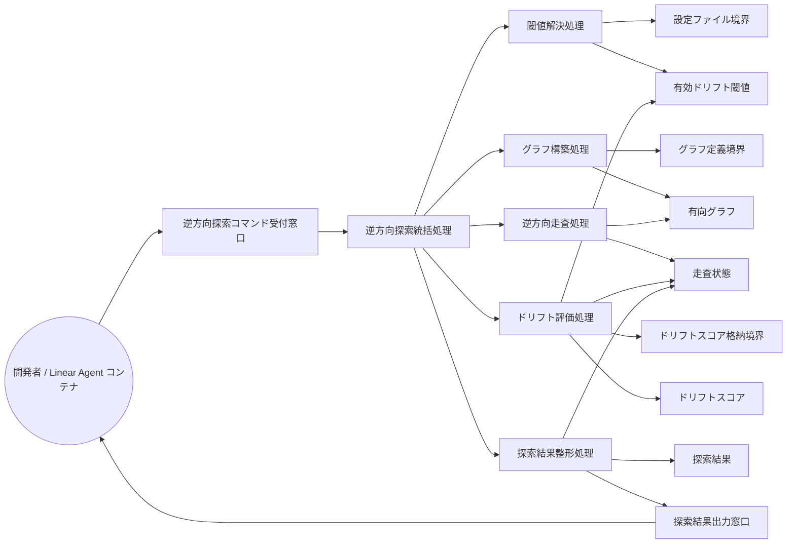

Document ID: RBA-LGX-005

# RBA-LGX-005: 逆方向探索 のドメイン構造

**親 UC**: UC-LGX-005
**レイヤ**: 抽象側（ドメインレベル、言語非依存）

> **記述規律**: ドメイン語彙のみ。クラス境界・属性・操作・カーディナリティ・言語要素は書かない。Boundary/Control/Entity の役割識別と通信制約遵守のみ（`04-iconix-layer.md` §3）。本 RBA は UC-LGX-005 の動作検証装置である。

---

## 1. ドメイン主語

UC-LGX-005 から抽出した主語（概念名のまま、クラス名にしない）。

### Boundary 役割（名詞・外部との境界）

- **逆方向探索コマンド受付窓口**: アクター（開発者 / Linear Agent コンテナ）から逆方向探索要求（`investigate <node-id> [--drift-threshold <val>]`）を受け取る境界
- **設定ファイル境界**: ドリフト閾値のデフォルト値を供給する設定ファイルの境界（`--drift-threshold` 未指定時に参照）
- **グラフ定義境界**: `graph.toml`（有向グラフ定義の供給元）
- **ドリフトスコア格納境界**: `engine.db`（各エッジのドリフトスコアを保持。不在・未生成時は代替フロー 3a により参照されない）
- **探索結果出力窓口**: 走査結果（訪問ノード・疑わしいノード・深さマップ）をアクターへ返す境界

### Control 役割（動詞・制御）

- **逆方向探索統括処理**: 探索要求を受け、閾値解決・グラフ構築・逆方向走査・ドリフト評価・結果整形を協調させる。DB 不在時はドリフトスコアなしで走査結果のみ返す責務を持つ（FB-INV-4）
- **閾値解決処理**: `--drift-threshold` 引数の有無を判断し、指定があれば要求値を、未指定であれば設定ファイル境界から取得したデフォルト値を有効ドリフト閾値として確定する
- **グラフ構築処理**: グラフ定義境界から有向グラフを構築する
- **逆方向走査処理**: 起点ノードから有向グラフを逆方向（上流方向）に幅優先で走査し、訪問ノードと各ノードの深さを記録する
- **ドリフト評価処理**: ドリフトスコア格納境界から各エッジのドリフトスコアを参照し、有効ドリフト閾値以上のエッジを「疑わしい」としてマークして疑わしいノードを抽出する。DB 不在時はこの処理を省略する
- **探索結果整形処理**: 訪問ノード（走査順）・疑わしいノード（スコア降順）・深さマップを探索結果としてまとめ、探索結果出力窓口に渡す

### Entity 役割（名詞・データ）

- **有効ドリフト閾値**: 閾値解決処理が確定した、今回の探索に適用するドリフト閾値の値
- **有向グラフ**: 構築されたノード・エッジの集合（逆方向走査の走査対象）
- **走査状態**: 逆方向走査中の訪問済みノードと各ノードの深さの記録
- **ドリフトスコア**: ドリフト評価処理が参照する各エッジの意味的類似度スコア（DB 不在時は参照されない）
- **探索結果**: 走査結果をまとめた出力データ（訪問ノード・疑わしいノード・深さマップの三者）

## 2. 主語間の関係（概念レベル）

カーディナリティ・composition/aggregation の意味付けは具体側（RBD）で行う。

- 逆方向探索コマンド受付窓口 は 逆方向探索統括処理 に探索要求を渡す
- 逆方向探索統括処理 は 閾値解決処理・グラフ構築処理・逆方向走査処理・ドリフト評価処理・探索結果整形処理 を協調させる
- 閾値解決処理 は 設定ファイル境界 を参照し（`--drift-threshold` 未指定時のみ） 有効ドリフト閾値 を確定する
- グラフ構築処理 は グラフ定義境界 を読み 有向グラフ を構築する
- 逆方向走査処理 は 有向グラフ を上流方向に辿り 走査状態 を更新する
- ドリフト評価処理 は ドリフトスコア格納境界 から ドリフトスコア を参照し 有効ドリフト閾値 と照合して 走査状態 の疑わしいノードを確定する（DB 不在時は省略）
- 探索結果整形処理 は 走査状態 を読み 探索結果 を作り 探索結果出力窓口 に渡す
- 探索結果出力窓口 は アクター に探索結果を返す

## 3. 通信フロー（ドメインレベル）

主語名はドメイン語彙。クラス名命名規則（PascalCase 等）・関数名・型は使わない。

## 4. 通信制約遵守チェック（Noun-Verb ルール、§3.4）

- [x] Boundary 同士の直接通信なし（受付窓口・設定ファイル境界・グラフ定義境界・DB 境界・出力窓口は Control 経由でのみ連携）
- [x] Entity 同士の直接通信なし（有効ドリフト閾値・有向グラフ・走査状態・ドリフトスコア・探索結果は Control 経由でのみ読み書き）
- [x] Boundary → Entity 直結なし（供給境界から Entity への流れは必ず Control〔閾値解決処理 / グラフ構築処理 / ドリフト評価処理〕を介する）
- [x] Actor → Control / Entity 直結なし（アクターは逆方向探索コマンド受付窓口 Boundary のみと通信）

違反なし。全通信が Actor⇄Boundary / Boundary⇄Control / Control⇄Control / Control⇄Entity に収まる。

## 5. 1:1 Correspondence 検証（UC ⇄ RBA、§3.3）

| UC-LGX-005 ステップ | RBA フロー上の対応 | 整合 |
|---|---|---|
| 基本 1（`investigate <node-id> [--drift-threshold <val>]` 実行） | Actor → 逆方向探索コマンド受付窓口 → 逆方向探索統括処理 | ✓ |
| 基本 2（起点ノードから逆方向 BFS 走査） | 逆方向探索統括処理 → 逆方向走査処理 → 有向グラフ → 走査状態 | ✓ |
| 基本 3（各エッジのドリフトスコアを参照） | ドリフト評価処理 → ドリフトスコア格納境界 → ドリフトスコア | ✓ |
| 基本 4（ドリフト閾値以上のエッジを「疑わしい」としてマーク） | ドリフト評価処理 → 有効ドリフト閾値 / ドリフトスコア → 走査状態（疑わしいノード確定） | ✓ |
| 基本 5（結果を visited / suspicious_nodes / depth_map 形式で返却） | 探索結果整形処理 → 走査状態 → 探索結果 → 探索結果出力窓口 | ✓ |
| 代替 3a（embedding 未生成の場合、ドリフトスコアなしで走査結果のみ返す） | 逆方向探索統括処理 が DB 不在を検知し ドリフト評価処理 を省略、探索結果整形処理 が走査状態のみから探索結果を組む（FB-INV-4） | ✓ |
| 代替 1a（`--drift-threshold` 未指定の場合、設定ファイルの値を使用） | 閾値解決処理 → 設定ファイル境界 → 有効ドリフト閾値 | ✓ |

逆方向（RBA フロー → UC ステップ）も全フローが UC ステップに対応。余剰フローなし。

## 6. Object Discovery（§3.5）

UC に明示されていなかったが RBA 構築過程で構造化された主語・責務:

- **「閾値解決処理」の明示**: UC 代替 1a（`--drift-threshold` 未指定時に設定ファイル参照）は、閾値の確定責務を独立した Control として可視化する必要があった。UC では「使用する」とのみ記述されているが、引数優先 / 設定ファイル参照という分岐ロジックが責務として存在する。既存 UC-005 の範囲内の構造化であり、新規概念の追加ではない。
- **「走査状態」Entity の明示**: UC 基本 2〜4 の走査・マーク処理は、訪問済みノード・深さ・疑わしいノードを蓄積する中間データを前提とする。UC では結果の形式（visited / suspicious_nodes / depth_map）として出力側から記述されているが、RBA では走査中に蓄積される Entity として「走査状態」を明示した。LEGIXY-SPEC-001 §5 / §6 に錨着。
- **「DB 不在時安全性」の責務明示**: FB-INV-4（DB 不在時でもグラフ上流は正常に返される）は UC 事前条件に明示されているが、RBA では逆方向探索統括処理の責務として構造化した。ドリフト評価処理の省略分岐であり、新ドメイン主語の追加ではない。

新ドメイン主語・新責務の SPEC/UC への遡及反映は不要（いずれも既存 UC-005 / LEGIXY-SPEC-001 §4〜6 の範囲内の構造化）。**概念領域の汚染なし**: 各 Entity（有効ドリフト閾値/有向グラフ/走査状態/ドリフトスコア/探索結果）に概念領域外の操作混入なし。各 Control の責務名と担う処理が一致（逆方向走査処理がドリフト評価しない、ドリフト評価処理が結果整形しない、等）。

## 7. ICONIX 流三者整合性（UC ⇄ RBA ⇄ SPEC、§11.2）

| 検査 | 確認内容 | 結果 |
|---|---|---|
| UC ⇄ RBA | UC-005 各ステップが RBA フローに 1:1 対応（§5） | ✓ |
| RBA ⇄ SPEC | RBA 主語が LEGIXY-SPEC-001 §4（investigate 機能）/ §5（双方向探索）/ §6（ドリフトスコア）/ §7（データ構造）の用語・概念と一致。有向グラフ=§5、ドリフトスコア=§6、ドリフトスコア格納境界=§7（engine.db）、逆方向走査=§5 逆方向、FB-INV-4=§10.2 | ✓ |
| UC ⇄ SPEC | UC-005 が LEGIXY-SPEC-001 §4（investigate エンジン機能）/ §5（逆方向探索の目的: 不具合の原因探索）/ §10.2 FB-INV-4（DB 不在時安全性）と整合。事後条件の読み取り専用操作は設計原則 P-02 と整合 | ✓ |

概念領域の汚染なし、用語不一致なし。

## 8. Jacobson 流三者整合性（UC ⇄ RBA ⇄ SEQA、§11.1）

**保留**: SEQA-LGX-005 生成時に確定する。本 RBA のドメイン主語（B/C/E）が SEQA のレーンと一致し、Noun-Verb ルールが SEQA でも守られ、UC text 並列配置で各ステップが SEQA メッセージと対応することを SEQA 段階で検証する。RBA 単独では UC⇄RBA（§5）+ UC⇄SPEC（§7）まで。

## 9. 抽象層 GREEN 確定状況（§11.4）

| 条件 | 状況 |
|---|---|
| 1. Jacobson 三者整合性（UC⇄RBA⇄SEQA） | 保留（SEQA 生成後） |
| 2. ICONIX 三者整合性（UC⇄RBA⇄SPEC） | ✓（§7） |
| 3. Noun-Verb ルール違反なし | ✓（§4） |
| 4. Object Discovery を SPEC/UC に反映 | ✓ 反映不要を確認（§6） |
| 5. UC Disambiguation の GAP[UC] closed | UC-005 に起票待ち GAP なし（構造化は既存 UC/SPEC 範囲内） |
| 6. 概念領域の汚染検査 | ✓（§6） |
| 7. Behavior Allocation 指針（SEQA で） | 保留（SEQA/SEQD） |
| 8. `check --formal` pass | 登録後に確認 |
| 9. レイヤ汚染なし | ✓（言語要素・操作・属性なし） |

3〜7 は機械検証不能（Adversary + 人間判断）。SEQA-LGX-005 と対で抽象層 GREEN を確定する。

## 10. 履歴

| 日付 | 変更内容 |
|---|---|
| 2026-06-13 | 初版。UC-LGX-005 のドメイン構造（Boundary 5 / Control 6 / Entity 5）。UC⇄RBA 1:1 対応・Noun-Verb・Object Discovery・ICONIX 三者整合性を確認。Jacobson 三者整合性は SEQA-LGX-005 で確定 |
