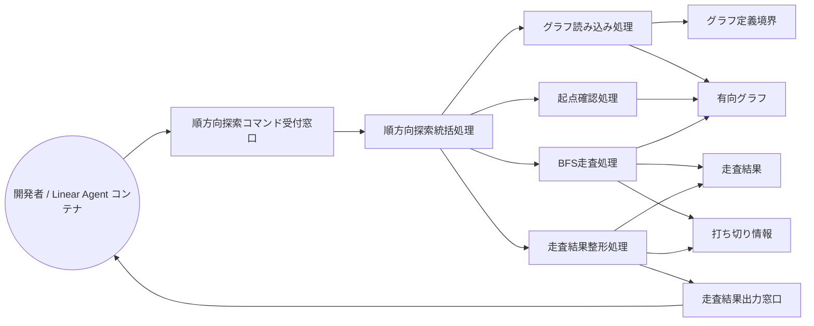

Document ID: RBA-LGX-006

# RBA-LGX-006: 順方向探索 のドメイン構造

**親 UC**: UC-LGX-006
**レイヤ**: 抽象側（ドメインレベル、言語非依存）

> **記述規律**: ドメイン語彙のみ。クラス境界・属性・操作・カーディナリティ・言語要素は書かない。Boundary/Control/Entity の役割識別と通信制約遵守のみ（`04-iconix-layer.md` §3）。本 RBA は UC-LGX-006 の動作検証装置である。

---

## 1. ドメイン主語

UC-LGX-006 から抽出した主語（概念名のまま、クラス名にしない）。

### Boundary 役割（名詞・外部との境界）

- **順方向探索コマンド受付窓口**: アクター（開発者 / Linear Agent コンテナ）からの順方向探索要求（`impact <node-id> [--max-depth <n>]`）を受け取る境界
- **グラフ定義境界**: `graph.toml`（有向グラフ定義の供給元）
- **走査結果出力窓口**: 走査結果（到達ノード一覧・深度情報）を標準出力としてアクターへ返す境界

### Control 役割（動詞・制御）

- **順方向探索統括処理**: 探索要求を受け、グラフ読み込み・起点確認・BFS 走査・結果整形を協調させる
- **グラフ読み込み処理**: グラフ定義境界から有向グラフを読み込む
- **起点確認処理**: 指定された成果物 ID が有向グラフに存在するかを確認する
- **BFS 走査処理**: 有向グラフを順方向（`from`→`to`）に幅優先探索し、到達ノードと各ノードの深度を確定する。最大深度指定がある場合は深度上限で走査を打ち切り、打ち切り発生時は打ち切り情報を生成する
- **走査結果整形処理**: 到達ノード一覧・深度情報を走査結果としてまとめ、走査結果出力窓口へ渡す

### Entity 役割（名詞・データ）

- **有向グラフ**: 読み込まれたノード・エッジの集合（順方向走査の対象データ）
- **走査結果**: 到達した全ノード（走査順）と各ノードの起点からの深度の集合
- **打ち切り情報**: 最大深度指定時に深度超過で除外されたノードが存在する場合に生成される情報（除外発生の事実と除外ノード件数）

## 2. 主語間の関係（概念レベル）

カーディナリティ・composition/aggregation の意味付けは具体側（RBD）で行う。

- 順方向探索コマンド受付窓口 は 順方向探索統括処理 に探索要求（成果物 ID・最大深度指定）を渡す
- 順方向探索統括処理 は グラフ読み込み処理・起点確認処理・BFS 走査処理・走査結果整形処理 を協調させる
- グラフ読み込み処理 は グラフ定義境界 を読み 有向グラフ を構築する
- 起点確認処理 は 有向グラフ を参照して起点ノードの存在を確認する
- BFS 走査処理 は 有向グラフ を順方向に辿り 走査結果 と（打ち切り発生時は）打ち切り情報 を生成する
- 走査結果整形処理 は 走査結果 を整形し 走査結果出力窓口 に渡す
- 走査結果整形処理 は 打ち切り情報 が存在する場合、打ち切り情報 も 走査結果出力窓口 に渡す
- 走査結果出力窓口 は アクター に走査結果（および打ち切り情報）を返す

## 3. 通信フロー（ドメインレベル）

主語名はドメイン語彙。クラス名命名規則（PascalCase 等）・関数名・型は使わない。

## 4. 通信制約遵守チェック（Noun-Verb ルール、§3.4）

- [x] Boundary 同士の直接通信なし（受付窓口・グラフ定義境界・出力窓口は Control 経由でのみ連携）
- [x] Entity 同士の直接通信なし（有向グラフ・走査結果・打ち切り情報は Control 経由でのみ読み書き）
- [x] Boundary → Entity 直結なし（グラフ定義境界から Entity への流れは必ず グラフ読み込み処理 を介する）
- [x] Actor → Control / Entity 直結なし（アクターは 順方向探索コマンド受付窓口 Boundary のみと通信）

違反なし。全通信が Actor⇄Boundary / Boundary⇄Control / Control⇄Control / Control⇄Entity に収まる。

## 5. 1:1 Correspondence 検証（UC ⇄ RBA、§3.3）

| UC-LGX-006 ステップ | RBA フロー上の対応 | 整合 |
|---|---|---|
| 基本 1（`impact <node-id> [--max-depth <n>]` 実行） | Actor → 順方向探索コマンド受付窓口 → 順方向探索統括処理 | ✓ |
| 基本 2（起点ノードから有向グラフを順方向に BFS 走査） | 順方向探索統括処理 → グラフ読み込み処理 → グラフ定義境界 → 有向グラフ、その後 BFS 走査処理 → 有向グラフ → 走査結果 | ✓ |
| 基本 3（`--max-depth` 指定時に深度で走査打ち切り） | BFS 走査処理 が最大深度指定を参照し深度上限で打ち切り、打ち切り情報 を生成 | ✓ |
| 基本 4（結果返却: visited 全ノード + depth_map） | 走査結果整形処理 → 走査結果 → 走査結果出力窓口 | ✓ |
| 代替 1a（`--max-depth` 未指定: 全深度走査） | BFS 走査処理 が深度上限なしで有向グラフ 全体を走査（打ち切り情報 は生成されない） | ✓ |
| 代替 2a（起点ノードが graph.toml に不在: 空結果で exit 0） | 起点確認処理 が有向グラフ に起点を見つけられない場合、BFS 走査処理 は空の 走査結果 を生成し 走査結果出力窓口 経由で返却 | ✓ |

逆方向（RBA フロー → UC ステップ）も全フローが UC ステップに対応。余剰フローなし。

## 6. Object Discovery（§3.5）

UC に明示されていなかったが RBA 構築過程で構造化された主語・責務:

- **起点確認処理（Control）の分離**: UC の代替 2a（「起点が graph.toml に存在しない場合、空結果を返す」）は BFS 走査処理 の前段で起点の存在確認が必要であることを示す。UC では暗黙の責務だったが、RBA では 起点確認処理 として分離して可視化した。SPEC-LGX-005.REQ.05（存在しない起点はエラーではない）に錨着。新ドメイン主語の追加ではなく、既存 UC/SPEC 範囲内の責務の可視化。
- **「打ち切り情報」Entity の導出**: SPEC-LGX-005.REQ.04（深度超過で除外されたノードが 1 件以上存在する場合は stderr に Info 1 件を出力）を構造化すると、BFS 走査処理 が生成し 走査結果整形処理 が 走査結果出力窓口 へ渡す独立データとして現れる。UC では「--max-depth が指定されている場合、その深度で走査を打ち切る」のみ記載だが SPEC の観測可能性要求（REQ.04）から導出した。UC へ遡及反映するか否かは人間裁定に委ねる（GAP[UC] 候補）。
- **グラフ読み込み処理 と BFS 走査処理 の責務分離**: UC のステップ 2 は「有向グラフを順方向に BFS 走査する」と一括記述するが、グラフ定義境界（graph.toml）の読み込みと走査の実行は責務が異なる。RBA-LGX-001（グラフ読み込みと検証）の構造と整合させるため、グラフ読み込み処理 を独立 Control として分離した。

**概念領域の汚染なし**: 有向グラフ は走査対象データのみを保持（検証所見など他 Entity の概念領域が混入していない）。BFS 走査処理 は走査のみを実行し結果集約に踏み込まない。打ち切り情報 はグラフ状態変更を含まず読み取り専用操作の不変条件（UC 事後条件）に違反しない。

## 7. ICONIX 流三者整合性（UC ⇄ RBA ⇄ SPEC、§11.2）

| 検査 | 確認内容 | 結果 |
|---|---|---|
| UC ⇄ RBA | UC-006 各ステップが RBA フローに 1:1 対応（§5） | ✓ |
| RBA ⇄ SPEC | RBA 主語が SPEC-LGX-005 の用語・概念と一致。BFS 走査処理=REQ.01（順方向 from→to）+ REQ.03（BFS・決定論性）+ REQ.04（最大深度制御・打ち切り Info）、起点確認処理=REQ.05（存在しない起点はエラーではない）、有向グラフ=SPEC-LGX-002、打ち切り情報=REQ.04 の打ち切り発生時 Info に対応 | ✓ |
| UC ⇄ SPEC | UC-006 が SPEC-LGX-005.REQ.10（Admin Surface 限定）・REQ.01（順方向 from→to 統一）・REQ.06（循環 safety）・CTX-INV-1（決定論保証）と整合。グラフ状態変更なし（読み取り専用）は SPEC-LGX-002 の読み取り系操作定義と整合 | ✓ |

概念領域の汚染なし、用語不一致なし。

## 8. Jacobson 流三者整合性（UC ⇄ RBA ⇄ SEQA、§11.1）

**保留**: SEQA-LGX-006 生成時に確定する。本 RBA のドメイン主語（B/C/E）が SEQA のレーンと一致し、Noun-Verb ルールが SEQA でも守られ、UC text 並列配置で各ステップが SEQA メッセージと対応することを SEQA 段階で検証する。RBA 単独では UC⇄RBA（§5）+ UC⇄SPEC（§7）まで。

## 9. 抽象層 GREEN 確定状況（§11.4）

| 条件 | 状況 |
|---|---|
| 1. Jacobson 三者整合性（UC⇄RBA⇄SEQA） | 保留（SEQA 生成後） |
| 2. ICONIX 三者整合性（UC⇄RBA⇄SPEC） | ✓（§7） |
| 3. Noun-Verb ルール違反なし | ✓（§4） |
| 4. Object Discovery を SPEC/UC に反映 | 一部保留（打ち切り情報 Entity の UC 反映要否は人間裁定。他は反映不要を確認（§6）） |
| 5. UC Disambiguation の GAP[UC] closed | 確認中（打ち切り情報 Entity 導出が GAP[UC] 候補、§6） |
| 6. 概念領域の汚染検査 | ✓（§6） |
| 7. Behavior Allocation 指針（SEQA で） | 保留（SEQA/SEQD） |
| 8. `check --formal` pass | 登録後に確認 |
| 9. レイヤ汚染なし | ✓（言語要素・操作・属性なし） |

3〜7 は機械検証不能（Adversary + 人間判断）。SEQA-LGX-006 と対で抽象層 GREEN を確定する。

## 10. 履歴

| 日付 | 変更内容 |
|---|---|
| 2026-06-13 | 初版。UC-LGX-006 のドメイン構造（Boundary 3 / Control 5 / Entity 3）。UC⇄RBA 1:1 対応・Noun-Verb・Object Discovery・ICONIX 三者整合性を確認。打ち切り情報 Entity の UC 反映要否を GAP[UC] 候補として記録。Jacobson 三者整合性は SEQA-LGX-006 で確定 |
