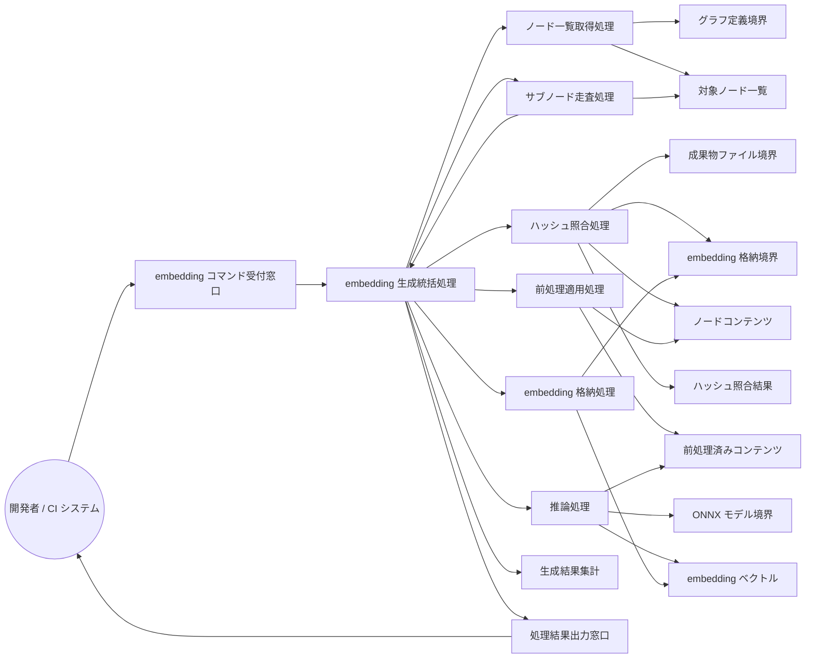

Document ID: RBA-LGX-007

# RBA-LGX-007: embedding 生成とドリフト検出 のドメイン構造

**親 UC**: UC-LGX-007
**レイヤ**: 抽象側（ドメインレベル、言語非依存）

> **記述規律**: ドメイン語彙のみ。クラス境界・属性・操作・カーディナリティ・言語要素は書かない。Boundary/Control/Entity の役割識別と通信制約遵守のみ（`04-iconix-layer.md` §3）。本 RBA は UC-LGX-007 の動作検証装置である。

---

## 1. ドメイン主語

UC-LGX-007 から抽出した主語（概念名のまま、クラス名にしない）。

### Boundary 役割（名詞・外部との境界）

- **embedding コマンド受付窓口**: アクター（開発者 / CI システム）からの embedding 生成要求（`embed [--all] [--subnodes]`）を受け取る境界
- **グラフ定義境界**: `graph.toml`（対象ノード一覧の供給元）
- **成果物ファイル境界**: 各成果物ファイル本文（ハッシュ計算・前処理の入力供給元）
- **ONNX モデル境界**: モデルファイル（`model.onnx` + `tokenizer.json`）の供給元。不在時は起動不能の供給状態
- **embedding 格納境界**: `engine.db`（既存ハッシュの参照元であり生成済み embedding の格納先）
- **処理結果出力窓口**: 生成件数・スキップ件数・失敗件数・エラー詳細をアクターへ返す境界

### Control 役割（動詞・制御）

- **embedding 生成統括処理**: 生成要求を受け、ノード走査・ハッシュ照合・前処理・推論・格納を協調させる。部分失敗があっても後続ノードを継続する責務を持つ
- **ノード一覧取得処理**: グラフ定義境界から対象ノード一覧を確定する
- **ハッシュ照合処理**: 成果物ファイル境界からコンテンツハッシュを計算し、embedding 格納境界の既存ハッシュと比較してスキップ・再生成・強制再生成を判定する
- **前処理適用処理**: スキップ対象外のノードコンテンツに対し、所定の正規化（空テキスト判定・トークン上限超過切り捨てを含む）を適用する
- **推論処理**: ONNX モデル境界を通じて取得したモデルでトークン化・推論・平均プーリング・L2 正規化を実行し embedding ベクトルを得る
- **embedding 格納処理**: 生成済み embedding ベクトルとモデル版情報・コンテンツハッシュを embedding 格納境界に書き込む（ノード単位トランザクション）
- **サブノード走査処理**: `--subnodes` 指定時に、ノードのコンテンツ範囲を切り出してサブノード単位で embedding 生成統括処理へ委譲する

### Entity 役割（名詞・データ）

- **対象ノード一覧**: グラフ定義境界から確定した処理対象ノードの集合
- **ノードコンテンツ**: 成果物ファイルから供給された本文テキスト（正規化前の入力）
- **ハッシュ照合結果**: コンテンツハッシュと既存ハッシュの比較結果（スキップ・再生成・未生成の 3 状態）
- **前処理済みコンテンツ**: 正規化・切り捨て処理を経た embedding 入力テキスト
- **embedding ベクトル**: 推論処理が生成した意味表現ベクトル（モデル版情報・コンテンツハッシュを伴う）
- **生成結果集計**: 処理全体の件数（生成・スキップ・失敗・エラー詳細）

## 2. 主語間の関係（概念レベル）

カーディナリティ・composition/aggregation の意味付けは具体側（RBD）で行う。

- embedding コマンド受付窓口 は embedding 生成統括処理 に生成要求を渡す
- embedding 生成統括処理 は ノード一覧取得処理・ハッシュ照合処理・前処理適用処理・推論処理・embedding 格納処理 を協調させる
- ノード一覧取得処理 は グラフ定義境界 を読み 対象ノード一覧 を確定する
- ハッシュ照合処理 は 成果物ファイル境界 を読み ノードコンテンツ を受け取り embedding 格納境界 の既存ハッシュと比較して ハッシュ照合結果 を確定する
- 前処理適用処理 は ノードコンテンツ を受け取り 前処理済みコンテンツ を生成する
- 推論処理 は ONNX モデル境界 を参照し 前処理済みコンテンツ から embedding ベクトル を生成する
- embedding 格納処理 は embedding ベクトル を embedding 格納境界 に書き込む
- embedding 生成統括処理 は 生成結果集計 を更新し 処理結果出力窓口 に渡す
- 処理結果出力窓口 は アクター に生成結果集計（件数・エラー詳細）を返す
- サブノード走査処理 は `--subnodes` 指定時に 対象ノード一覧 からコンテンツ範囲を切り出し embedding 生成統括処理 に委譲する

## 3. 通信フロー（ドメインレベル）

主語名はドメイン語彙。クラス名命名規則（PascalCase 等）・関数名・型は使わない。

## 4. 通信制約遵守チェック（Noun-Verb ルール、§3.4）

- [x] Boundary 同士の直接通信なし（受付窓口・グラフ定義境界・成果物ファイル境界・ONNX モデル境界・embedding 格納境界・出力窓口は Control 経由でのみ連携）
- [x] Entity 同士の直接通信なし（対象ノード一覧・ノードコンテンツ・ハッシュ照合結果・前処理済みコンテンツ・embedding ベクトル・生成結果集計は Control 経由でのみ読み書き）
- [x] Boundary → Entity 直結なし（各供給境界から Entity への流れは必ず Control〔ハッシュ照合処理・前処理適用処理・推論処理〕を介する）
- [x] Actor → Control / Entity 直結なし（アクターは embedding コマンド受付窓口 Boundary のみと通信）

違反なし。全通信が Actor⇄Boundary / Boundary⇄Control / Control⇄Control / Control⇄Entity に収まる。

## 5. 1:1 Correspondence 検証（UC ⇄ RBA、§3.3）

| UC-LGX-007 ステップ | RBA フロー上の対応 | 整合 |
|---|---|---|
| 基本 1（`legixy embed [--all] [--subnodes]` 実行） | Actor → embedding コマンド受付窓口 → embedding 生成統括処理 | ✓ |
| 基本 2（graph.toml から全ノードを取得） | embedding 生成統括処理 → ノード一覧取得処理 → グラフ定義境界 → 対象ノード一覧 | ✓ |
| 基本 3a（ファイル内容の SHA-256 計算） | ハッシュ照合処理 → 成果物ファイル境界 → ノードコンテンツ | ✓ |
| 基本 3b（既存ハッシュと比較・スキップ判定、SCORE-INV-1） | ハッシュ照合処理 → embedding 格納境界 → ハッシュ照合結果 | ✓ |
| 基本 3c（前処理の適用） | 前処理適用処理 → ノードコンテンツ → 前処理済みコンテンツ | ✓ |
| 基本 3d（ONNX モデルで embedding 生成） | 推論処理 → ONNX モデル境界 / 前処理済みコンテンツ → embedding ベクトル | ✓ |
| 基本 3e（embeddings テーブルに格納） | embedding 格納処理 → embedding ベクトル → embedding 格納境界 | ✓ |
| 基本 4（`--subnodes` 指定時のサブノード処理） | サブノード走査処理 → 対象ノード一覧 → embedding 生成統括処理（委譲） | ✓ |
| 代替 2a（ONNX モデル不在で ERROR） | 推論処理 が ONNX モデル境界 の不在を検出し 生成結果集計（失敗）→ 処理結果出力窓口 | ✓ |
| 代替 3b（`--all` でハッシュ比較スキップ・全再生成） | ハッシュ照合処理 が `--all` フラグによりスキップ判定を省略し全ノードを処理対象とする（ハッシュ照合結果へ） | ✓ |
| 事後条件（embeddings テーブル更新・モデルバージョン記録、SCORE-INV-2） | embedding 格納処理 が embedding ベクトルと共にモデル版情報を embedding 格納境界 に書き込む | ✓ |

逆方向（RBA フロー → UC ステップ）も全フローが UC ステップに対応。余剰フローなし。

## 6. Object Discovery（§3.5）

UC に明示されていなかったが RBA 構築過程で構造化された主語・責務:

- **「サブノード走査処理（Control）」の明示化**: UC 基本 4 は「`--subnodes` が指定された場合、サブノードの embedding も生成する」と記すが、サブノードの content_range 切り出しとドキュメントノードと共通の embedding 生成フローへの委譲という責務は明示されていなかった。SPEC-LGX-006.REQ.09 に錨着（コンテンツ範囲ベースの切り出し）。新規ドメイン主語の追加ではなく既存 UC/SPEC 範囲内の責務の可視化。
- **「ハッシュ照合結果（Entity）」の 3 状態**: UC 基本 3b はスキップ判定のみ言及するが、SPEC-LGX-006.REQ.05 に定義される fresh/stale/未生成の 3 状態が照合処理の出力として構造化された。既存 SPEC 範囲内の構造化。
- **「生成結果集計（Entity）」の明示化**: UC の事後条件には件数集計の言及がないが、SPEC-LGX-006.REQ.02 の `--json` 出力スキーマ（generated/skipped/failed/errors）と整合するドメイン概念として抽出した。既存 SPEC 範囲内。
- **「前処理適用処理（Control）」の分離**: UC 基本 3c は前処理適用を一行で記すが、SPEC-LGX-006.REQ.01（トークン上限超過切り捨て）・REQ.02（空テキスト skip）・REQ.09（content_range 防御的検証）の複合責務を担う制御として独立させた。推論処理との責務境界が明確になった。

新ドメイン主語・新責務の SPEC/UC への遡及反映は不要（いずれも既存 UC-LGX-007 / SPEC-LGX-006 の範囲内の構造化）。**概念領域の汚染なし**: 各 Entity（対象ノード一覧・ノードコンテンツ・ハッシュ照合結果・前処理済みコンテンツ・embedding ベクトル・生成結果集計）に概念領域外の操作混入なし。各 Control の責務名と担う処理が一致（前処理適用処理が推論しない、推論処理が格納しない、等）。

UC-LGX-007 の概要には「ドリフト検出」という語が残っているが、UC 本文の「ドリフト検出」節は UC-LGX-013 への委譲を明示している。本 RBA は `embed` コマンド（embedding 生成）に専念しており、ドリフト検出の Boundary/Control/Entity は含めない。これは UC 本文の意図に整合する（NOTES 参照）。

## 7. ICONIX 流三者整合性（UC ⇄ RBA ⇄ SPEC、§11.2）

| 検査 | 確認内容 | 結果 |
|---|---|---|
| UC ⇄ RBA | UC-LGX-007 各ステップが RBA フローに 1:1 対応（§5） | ✓ |
| RBA ⇄ SPEC | RBA 主語が SPEC-LGX-006 の用語・概念と一致。embedding 生成統括処理=REQ.02（embed コマンド）、ハッシュ照合処理=REQ.02（content_hash 一致 skip + --all 強制）+ REQ.03（content_hash 正規化）、前処理適用処理=REQ.01（トークン上限超過切り捨て）+ REQ.02（空テキスト skip）+ REQ.09（content_range 検証）、推論処理=REQ.01（ONNX・トークン化・mean pooling・L2 正規化）、embedding 格納処理=REQ.03/08（格納情報・トランザクション粒度）、ハッシュ照合結果の 3 状態=REQ.05（fresh/stale/未生成）、生成結果集計=REQ.02（--json スキーマ）、ONNX モデル境界=REQ.01（モデルパス・shape 検証）、embedding 格納境界=REQ.02/REQ.10（model_version 管理）、サブノード走査処理=REQ.09/12 | ✓ |
| UC ⇄ SPEC | UC-LGX-007 が SPEC-LGX-006 の不変条件（SCORE-INV-1: ハッシュ一致保証、SCORE-INV-2: モデルバージョン一致）・終了コード契約（LGX-COMPAT-001 §3）と整合 | ✓ |

概念領域の汚染なし、用語不一致なし。

## 8. Jacobson 流三者整合性（UC ⇄ RBA ⇄ SEQA、§11.1）

**保留**: SEQA-LGX-007 生成時に確定する。本 RBA のドメイン主語（B/C/E）が SEQA のレーンと一致し、Noun-Verb ルールが SEQA でも守られ、UC text 並列配置で各ステップが SEQA メッセージと対応することを SEQA 段階で検証する。RBA 単独では UC⇄RBA（§5）+ UC⇄SPEC（§7）まで。

## 9. 抽象層 GREEN 確定状況（§11.4）

| 条件 | 状況 |
|---|---|
| 1. Jacobson 三者整合性（UC⇄RBA⇄SEQA） | 保留（SEQA 生成後） |
| 2. ICONIX 三者整合性（UC⇄RBA⇄SPEC） | ✓（§7） |
| 3. Noun-Verb ルール違反なし | ✓（§4） |
| 4. Object Discovery を SPEC/UC に反映 | ✓ 反映不要を確認（§6） |
| 5. UC Disambiguation の GAP[UC] closed | UC-LGX-007 の GAP[UC] の状態は SEQA 着手前に確認する |
| 6. 概念領域の汚染検査 | ✓（§6） |
| 7. Behavior Allocation 指針（SEQA で） | 保留（SEQA/SEQD） |
| 8. `check --formal` pass | 登録後に確認 |
| 9. レイヤ汚染なし | ✓（言語要素・操作・属性なし） |

3〜7 は機械検証不能（Adversary + 人間判断）。SEQA-LGX-007 と対で抽象層 GREEN を確定する。

## 10. 履歴

| 日付 | 変更内容 |
|---|---|
| 2026-06-13 | 初版。UC-LGX-007 のドメイン構造（Boundary 6 / Control 7 / Entity 6）。UC⇄RBA 1:1 対応・Noun-Verb・Object Discovery・ICONIX 三者整合性を確認。drift 専念分離（UC-013 委譲）を §6 で明示。Jacobson 三者整合性は SEQA-LGX-007 で確定 |
