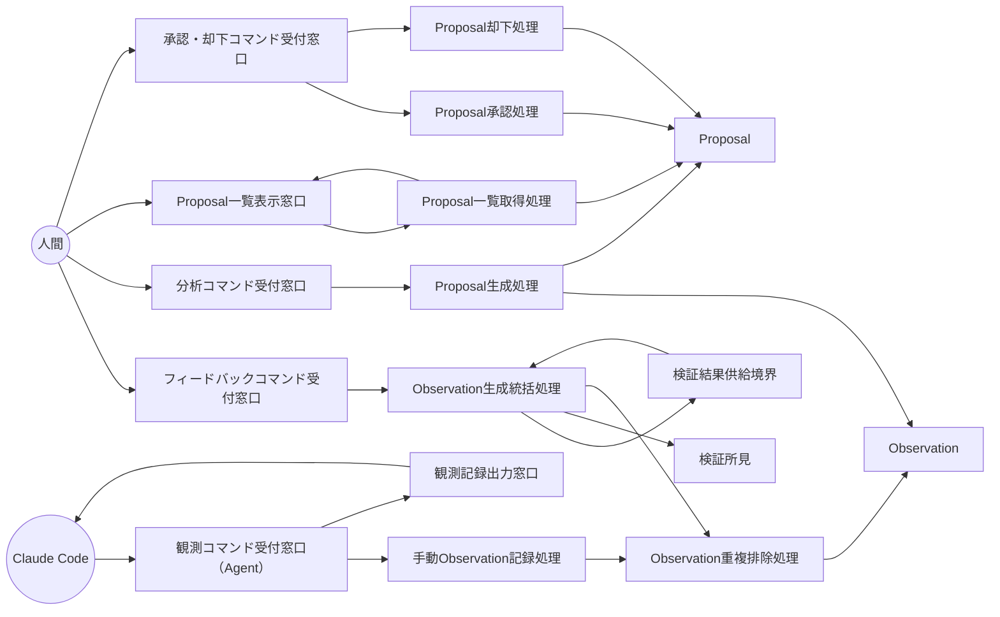

Document ID: RBA-LGX-008

# RBA-LGX-008: フィードバックループ のドメイン構造

**親 UC**: UC-LGX-008
**レイヤ**: 抽象側（ドメインレベル、言語非依存）

> **記述規律**: ドメイン語彙のみ。クラス境界・属性・操作・カーディナリティ・言語要素は書かない。Boundary/Control/Entity の役割識別と通信制約遵守のみ（`04-iconix-layer.md` §3）。本 RBA は UC-LGX-008 の動作検証装置である。

---

## 1. ドメイン主語

UC-LGX-008 から抽出した主語（概念名のまま、クラス名にしない）。

### Boundary 役割（名詞・外部との境界）

- **観測コマンド受付窓口（Agent）**: Claude Code からの気づき記録要求（`observe` MCP 経由）を受け取る境界
- **フィードバックコマンド受付窓口**: 人間からの自動 Observation 生成要求（`feedback` コマンド）を受け取る境界
- **分析コマンド受付窓口**: 人間からの Proposal 生成要求（`analyze` コマンド）を受け取る境界
- **Proposal 一覧表示窓口**: 人間からの未承認 Proposal 一覧表示要求（`proposals` コマンド）を受け取り、一覧をアクターへ返す境界
- **承認・却下コマンド受付窓口**: 人間からの承認・却下操作（`approve` / `reject` コマンド）を受け取る境界
- **検証結果供給境界**: check 実行結果（ChainIntegrity / LinkCandidate / Drift / OrphanFile 等のカテゴリ所見）を供給する境界
- **観測記録出力窓口**: 観測記録の完了通知をアクターへ返す境界

### Control 役割（動詞・制御）

- **Observation 生成統括処理**: フィードバックコマンドを受け取り、検証結果から各カテゴリの Observation を生成し重複を排除して永続化する責務を持つ
- **手動 Observation 記録処理**: Agent からの観測記録要求を受け取り、message・category・関連ノード ID を検証し Observation として永続化する
- **Observation 重複排除処理**: (category, 正準化 related_ids) の複合キーで pending / analyzing 状態の Observation 重複を検査する
- **Proposal 生成処理**: pending の Observation を取り込み（Pessimistic Claim: analyzing へ遷移）、カテゴリ別の変換規則に従って Proposal を生成し、semantic_key による重複排除を行う。変換規則に対応しないカテゴリは Observation を skipped 終端へ遷移させる。失敗時は Observation を pending に差し戻す
- **Proposal 一覧取得処理**: 指定ステータスの Proposal を一覧として取得する
- **Proposal 承認処理**: pending 状態の Proposal を CAS で原子的に approved へ遷移させる
- **Proposal 却下処理**: pending 状態の Proposal を CAS で原子的に rejected へ遷移させる（理由必須）

### Entity 役割（名詞・データ）

- **Observation**: 気づき・自動検知の記録（category・message・関連ノード ID・status）。pending / analyzing / resolved / skipped の状態を持つ
- **Proposal**: 承認待ちの改善提案（kind・対象ノード・semantic_key・status）。pending / approved / rejected の状態を持つ
- **検証所見**: 検証結果供給境界から供給される check 結果の個別所見（カテゴリと対象情報を含む）

## 2. 主語間の関係（概念レベル）

カーディナリティ・composition/aggregation の意味付けは具体側（RBD）で行う。

- フィードバックコマンド受付窓口 は Observation 生成統括処理 に生成要求を渡す
- Observation 生成統括処理 は 検証結果供給境界 から 検証所見 を参照する
- Observation 生成統括処理 は Observation 重複排除処理 を経て Observation を永続化する
- 観測コマンド受付窓口（Agent） は 手動 Observation 記録処理 に記録要求を渡す
- 手動 Observation 記録処理 は Observation 重複排除処理 を経て Observation を永続化する
- 分析コマンド受付窓口 は Proposal 生成処理 に生成要求を渡す
- Proposal 生成処理 は pending の Observation を参照し、Observation の状態を遷移させながら Proposal を生成する
- Proposal 生成処理 は 生成した Proposal を永続化する（semantic_key で重複排除）
- Proposal 一覧表示窓口 は Proposal 一覧取得処理 を経て Proposal 一覧を人間に返す
- 承認・却下コマンド受付窓口 は Proposal 承認処理 または Proposal 却下処理 に操作を渡す
- Proposal 承認処理 / Proposal 却下処理 は Proposal の状態を原子的に遷移させる

## 3. 通信フロー（ドメインレベル）

主語名はドメイン語彙。クラス名命名規則（PascalCase 等）・関数名・型は使わない。

## 4. 通信制約遵守チェック（Noun-Verb ルール、§3.4）

- [x] Boundary 同士の直接通信なし（各受付窓口・供給境界・出力窓口は Control 経由でのみ連携）
- [x] Entity 同士の直接通信なし（Observation・Proposal・検証所見は Control 経由でのみ読み書き）
- [x] Boundary → Entity 直結なし（検証結果供給境界から 検証所見 への流れは Observation 生成統括処理を介する）
- [x] Actor → Control / Entity 直結なし（人間は各受付窓口 Boundary のみと通信。Claude Code は観測コマンド受付窓口 Boundary のみと通信）

違反なし。全通信が Actor⇄Boundary / Boundary⇄Control / Control⇄Control / Control⇄Entity に収まる。

## 5. 1:1 Correspondence 検証（UC ⇄ RBA、§3.3）

| UC-LGX-008 ステップ | RBA フロー上の対応 | 整合 |
|---|---|---|
| Observation 生成 1（`feedback` コマンド: check 結果から自動生成） | 人間 → フィードバックコマンド受付窓口 → Observation 生成統括処理 → 検証結果供給境界 / 検証所見 → Observation 重複排除処理 → Observation | ✓ |
| Observation 生成 2（`observe` コマンド: 手動記録 MCP 経由） | Claude Code → 観測コマンド受付窓口（Agent）→ 手動 Observation 記録処理 → Observation 重複排除処理 → Observation | ✓ |
| Observation 生成 3（重複チェック: FB-INV-1） | Observation 重複排除処理 が (category, 正準化 related_ids) で pending/analyzing の Observation を検査 | ✓ |
| Proposal 生成 1（`analyze` コマンド: pending から Proposal 生成） | 人間 → 分析コマンド受付窓口 → Proposal 生成処理 → Observation（pending → analyzing）→ Proposal | ✓ |
| Proposal 生成 2（Pessimistic Claim: pending → analyzing → proposed/skipped） | Proposal 生成処理 が Observation の状態を遷移させながら Proposal を生成。変換不能カテゴリは skipped 終端 | ✓ |
| Proposal 生成 3（カテゴリ別変換） | Proposal 生成処理 がカテゴリ別変換規則に従って Proposal の種別を決定 | ✓ |
| Proposal 生成 4（semantic_key 重複排除: FB-INV-5） | Proposal 生成処理 が semantic_key で pending Proposal の重複を排除 | ✓ |
| 承認・却下 1（`proposals` コマンド: 一覧表示） | 人間 → Proposal 一覧表示窓口 → Proposal 一覧取得処理 → Proposal → Proposal 一覧表示窓口 → 人間 | ✓ |
| 承認・却下 2（`approve <id>`: 原子的承認 FB-INV-2） | 人間 → 承認・却下コマンド受付窓口 → Proposal 承認処理 → Proposal（CAS で pending → approved） | ✓ |
| 承認・却下 3（`reject <id> --reason <reason>`: 理由必須却下） | 人間 → 承認・却下コマンド受付窓口 → Proposal 却下処理 → Proposal（CAS で pending → rejected） | ✓ |
| 代替 1a（check 結果に該当カテゴリなし → Observation 生成なし） | Observation 生成統括処理 が検証所見の該当カテゴリ不在を検知し Observation 生成をスキップ | ✓ |
| 代替 2a（analyze 処理中失敗 → Observation を pending に差し戻し） | Proposal 生成処理 が失敗時に Observation を pending へ差し戻す（claim release） | ✓ |

逆方向（RBA フロー → UC ステップ）も全フローが UC ステップに対応。余剰フローなし。

## 6. Object Discovery（§3.5）

UC に明示されていなかったが RBA 構築過程で構造化した主語・責務:

- **「観測記録出力窓口」の明示**: UC では `observe` コマンドの応答出力が暗示的だが、RBA で Boundary として明示化した。Claude Code への完了通知の経路として必要。既存 UC/SPEC 範囲内の構造化であり、新規ドメイン主語の追加ではない。
- **「Observation 重複排除処理（Control）」の独立化**: UC では重複チェックが単一ステップとして記述されているが、`feedback` と `observe` の両経路で共有される責務として独立 Control を設けた。FB-INV-1 の実装機構（SPEC-LGX-007.REQ.11）への錨着。
- **「検証所見（Entity）」の明示**: 検証結果供給境界から Observation 生成統括処理への流れで中間データを Entity として構造化した。SPEC-LGX-007.REQ.02 / SPEC-LGX-004 の所見概念に錨着。

新ドメイン主語・新責務の SPEC/UC への遡及反映は不要（いずれも既存 UC-LGX-008 / SPEC-LGX-007 の範囲内の構造化）。

**概念領域の汚染なし**: 各 Entity（Observation・Proposal・検証所見）に概念領域外の操作混入なし。各 Control の責務名と担う処理が一致（Observation 重複排除処理が Proposal を操作しない、Proposal 承認処理が Observation を操作しない、等）。

**Admin / Agent Surface 分離の構造的反映**: `feedback` / `analyze` / `proposals` / `approve` / `reject` は人間アクターのみの Boundary に接続。`observe` と `get_compile_audit` は Claude Code アクターの Boundary に接続。SPEC-LGX-007 §5 Surface 分離マトリクスをドメイン構造に正しく反映している。

## 7. ICONIX 流三者整合性（UC ⇄ RBA ⇄ SPEC、§11.2）

| 検査 | 確認内容 | 結果 |
|---|---|---|
| UC ⇄ RBA | UC-LGX-008 各ステップが RBA フローに 1:1 対応（§5） | ✓ |
| RBA ⇄ SPEC | RBA 主語が SPEC-LGX-007 の用語・概念と一致。Observation=REQ.01/REQ.08、Proposal=REQ.09、Observation 生成統括処理=REQ.02、手動 Observation 記録処理=REQ.01、Proposal 生成処理=REQ.03（skipped 終端含む REQ.08 状態モデル）、Proposal 一覧取得処理=REQ.04、Proposal 承認処理=REQ.05（CAS=FB-INV-2）、Proposal 却下処理=REQ.05（reason 必須）、Observation 重複排除処理=REQ.11（FB-INV-1）、Admin/Agent Surface 分離=§5 Surface 分離マトリクス | ✓ |
| UC ⇄ SPEC | UC-LGX-008 が SPEC-LGX-007 の不変条件（FB-INV-1〜5）・Surface 分離（§5）・状態モデル（REQ.08/REQ.09）と整合 | ✓ |

概念領域の汚染なし、用語不一致なし。

## 8. Jacobson 流三者整合性（UC ⇄ RBA ⇄ SEQA、§11.1）

**保留**: SEQA-LGX-008 生成時に確定する。本 RBA のドメイン主語（B/C/E）が SEQA のレーンと一致し、Noun-Verb ルールが SEQA でも守られ、UC text 並列配置で各ステップが SEQA メッセージと対応することを SEQA 段階で検証する。RBA 単独では UC⇄RBA（§5）+ UC⇄SPEC（§7）まで。

## 9. 抽象層 GREEN 確定状況（§11.4）

| 条件 | 状況 |
|---|---|
| 1. Jacobson 三者整合性（UC⇄RBA⇄SEQA） | 保留（SEQA 生成後） |
| 2. ICONIX 三者整合性（UC⇄RBA⇄SPEC） | ✓（§7） |
| 3. Noun-Verb ルール違反なし | ✓（§4） |
| 4. Object Discovery を SPEC/UC に反映 | ✓ 反映不要を確認（§6） |
| 5. UC Disambiguation の GAP[UC] closed | 確認待ち（UC-LGX-008 に open GAP があれば確認が必要） |
| 6. 概念領域の汚染検査 | ✓（§6） |
| 7. Behavior Allocation 指針（SEQA で） | 保留（SEQA/SEQD） |
| 8. `check --formal` pass | 登録後に確認 |
| 9. レイヤ汚染なし | ✓（言語要素・操作・属性なし） |

3〜7 は機械検証不能（Adversary + 人間判断）。SEQA-LGX-008 と対で抽象層 GREEN を確定する。

## 10. 履歴

| 日付 | 変更内容 |
|---|---|
| 2026-06-13 | 初版。UC-LGX-008 のドメイン構造（Boundary 7 / Control 7 / Entity 3）。UC⇄RBA 1:1 対応・Noun-Verb・Object Discovery・ICONIX 三者整合性を確認。Jacobson 三者整合性は SEQA-LGX-008 で確定 |
