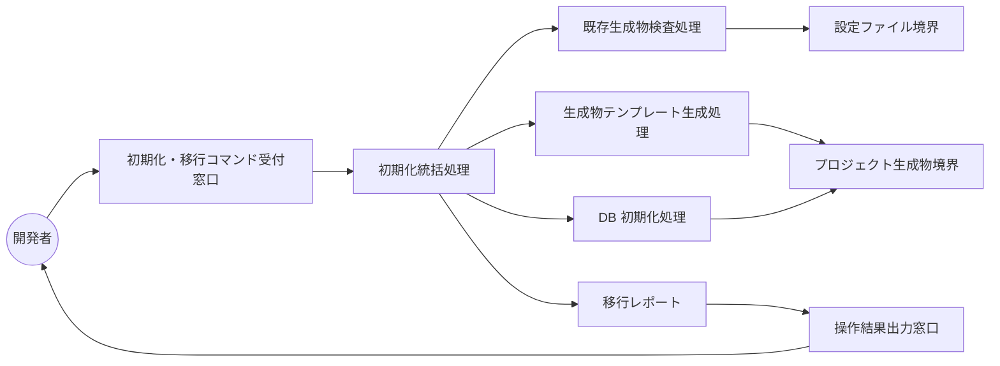
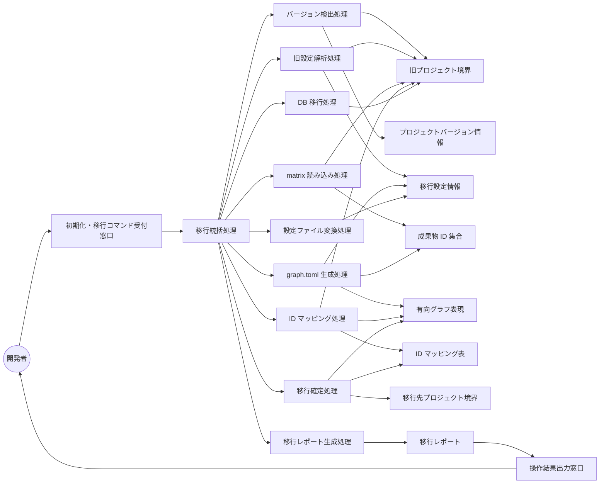

Document ID: RBA-LGX-009

# RBA-LGX-009: プロジェクト初期化とマイグレーション のドメイン構造

**親 UC**: UC-LGX-009
**レイヤ**: 抽象側（ドメインレベル、言語非依存）

> **記述規律**: ドメイン語彙のみ。クラス境界・属性・操作・カーディナリティ・言語要素は書かない。Boundary/Control/Entity の役割識別と通信制約遵守のみ（`04-iconix-layer.md` §3）。本 RBA は UC-LGX-009 の動作検証装置である。

---

## 1. ドメイン主語

UC-LGX-009 から抽出した主語（概念名のまま、クラス名にしない）。本 UC は **init 系統**と **migrate 系統**の 2 フローを包含する。

### Boundary 役割（名詞・外部との境界）

**【init / migrate 共通】**

- **初期化・移行コマンド受付窓口**: アクター（開発者）から `legixy init` または `legixy migrate` 要求を受け取る境界
- **設定ファイル境界**: `.legixy.toml` および旧名 `.trace-engine.toml` の探索・供給元（旧名フォールバック含む）
- **操作結果出力窓口**: 成否・変更サマリ・エラーメッセージ・リカバリ手順をアクターへ返す境界

**【init 系統】**

- **プロジェクト生成物境界**: init が新規生成する `.legixy.toml` テンプレート・`docs/traceability/graph.toml`・ディレクトリ構造・`.legixy/` の供給先境界

**【migrate 系統】**

- **旧プロジェクト境界**: 移行元 v0.1.0 プロジェクトのルート（`.legixy.toml` / `.trace-engine.toml`・matrix.md / matrix.json・engine.db・vectors.bin を含む）の供給元境界
- **移行先プロジェクト境界**: 生成した `graph.toml`・移行後 `.legixy.toml`・`migration-id-map.toml`・移行後 `engine.db` の確定先境界（atomic 書込）

### Control 役割（動詞・制御）

**【init 系統】**

- **初期化統括処理**: init 要求を受け、既存生成物検査・退避・テンプレート生成・DB 初期化・ディレクトリ作成を協調させる
- **既存生成物検査処理**: `.legixy.toml` / `docs/traceability/graph.toml` / `.legixy/engine.db` の存在を確認し、`--force` 指定の有無に応じて続行か中断かを決定する
- **生成物テンプレート生成処理**: ICONIX 標準 8 typecode を含む `.legixy.toml` テンプレート・空の `graph.toml`・`.legixy/` 構造を生成する
- **DB 初期化処理**: 初期スキーマで engine.db を新規作成する

**【migrate 系統】**

- **移行統括処理**: migrate 要求を受け、バージョン検出・旧プロジェクト読み込み・変換・確定・レポート出力を協調させる（途中失敗時は元データを保全して中断）
- **バージョン検出処理**: 旧プロジェクト境界から engine.db の `user_version`・設定ファイルの `[graph]` セクション有無を参照し、プロジェクトバージョンを確定する。矛盾特徴を検出した場合は移行統括処理に中断を要求する
- **旧設定解析処理**: 旧プロジェクト境界から `.legixy.toml` / `.trace-engine.toml` を読み込み、`[id.chain]` order・`[matrix]`・`[id]` 設定を解釈して移行設定情報を確定する。破損（TOML パース失敗・`[id.chain]` 欠落）を検出した場合は中断を要求する
- **matrix 読み込み処理**: 旧プロジェクト境界から matrix.md / matrix.json をパースし、成果物 ID 集合を抽出する。抽出 0 件は空入力として正常扱い、構造崩れによる 0 件も同様に扱う
- **graph.toml 生成処理**: 抽出した成果物 ID 集合と移行設定情報から `[[nodes]]` と `[[edges]]` を生成する。生成物の妥当性（パース可能性・ID 一意性）を確定前に検証し、壊れた出力を確定先境界へ送らない
- **ID マッピング処理**: 旧 ID と新 ID の対応表（全単射保証。曖昧性・多対一・全体一意性違反を検出した場合は中断）を確定し、既存 graph.toml 内のエッジ・parent フィールドを書き換える
- **設定ファイル変換処理**: 旧 `.legixy.toml` に `[graph]` セクションを追加して legixy 形式に変換する。既存 `[matrix]` セクションは保持する
- **DB 移行処理**: 旧 engine.db を新スキーマへ変換する（追加カラム付与、既存データ保持）。vectors.bin があれば embeddings テーブルへインポートする。SQLite トランザクションで非破壊性を保証する
- **移行確定処理**: DB コミットを先行させ、その後 graph.toml / migration-id-map.toml を atomic（一時ファイル → fsync → rename）で確定する。確定前に退避ファイルを命名規約（`.bak.{epoch}`）で生成する
- **移行レポート生成処理**: 成功時は変更サマリ（生成・更新ファイル一覧・ID 書き換え件数・バックアップ場所）を確定する。失敗時は失敗段階・バックアップ場所・リカバリ手順を確定する

### Entity 役割（名詞・データ）

- **プロジェクトバージョン情報**: 検出されたバージョン（v0.1.0 / legixy）と判定根拠
- **移行設定情報**: 旧設定から解釈された `[id.chain]` order・matrix 設定・ID パターン
- **成果物 ID 集合**: matrix から抽出されたドキュメント ID の集合（空集合も含む）
- **有向グラフ表現**: 生成された `[[nodes]]` と `[[edges]]` の集合（ドキュメントノードのみ）
- **ID マッピング表**: 旧 ID → 新 ID の全単射対応表
- **移行レポート**: 変更サマリまたは失敗情報（段階・バックアップ場所・リカバリ手順）

---

## 2. 主語間の関係（概念レベル）

カーディナリティ・composition/aggregation の意味付けは具体側（RBD）で行う。

**【共通】**

- 初期化・移行コマンド受付窓口 は init 要求を 初期化統括処理 へ、migrate 要求を 移行統括処理 へ渡す
- 操作結果出力窓口 は アクター に成否・サマリ・エラーを返す

**【init 系統】**

- 初期化統括処理 は 既存生成物検査処理・生成物テンプレート生成処理・DB 初期化処理 を協調させる
- 既存生成物検査処理 は 設定ファイル境界 を参照して生成物の存在を確認し、中断・退避・続行を判断する
- 生成物テンプレート生成処理 は ICONIX 標準構成の生成物を プロジェクト生成物境界 へ書き出す
- DB 初期化処理 は 初期スキーマの engine.db を プロジェクト生成物境界 へ書き出す
- 初期化統括処理 は 移行レポート（init 成功/失敗）を確定し 操作結果出力窓口 へ渡す

**【migrate 系統】**

- 移行統括処理 は バージョン検出処理・旧設定解析処理・matrix 読み込み処理・graph.toml 生成処理・ID マッピング処理・設定ファイル変換処理・DB 移行処理・移行確定処理・移行レポート生成処理 を協調させる
- バージョン検出処理 は 旧プロジェクト境界 を参照して プロジェクトバージョン情報 を確定する
- 旧設定解析処理 は 旧プロジェクト境界 から設定を読み 移行設定情報 を確定する
- matrix 読み込み処理 は 旧プロジェクト境界 から matrix をパースし 成果物 ID 集合 を確定する
- graph.toml 生成処理 は 成果物 ID 集合 と 移行設定情報 から 有向グラフ表現 を生成する
- ID マッピング処理 は 有向グラフ表現 と 旧プロジェクト境界 の既存参照から ID マッピング表 を生成する
- 設定ファイル変換処理 は 移行設定情報 から legixy 形式の設定内容を生成する
- DB 移行処理 は 旧プロジェクト境界 の engine.db / vectors.bin を新スキーマへ変換する
- 移行確定処理 は 有向グラフ表現・ID マッピング表・変換後設定・変換後 DB を 移行先プロジェクト境界 へ atomic に確定する
- 移行レポート生成処理 は 移行レポート を確定し 操作結果出力窓口 へ渡す

---

## 3. 通信フロー（ドメインレベル）

### 3-A. init 系統

### 3-B. migrate 系統

主語名はドメイン語彙。クラス名命名規則（PascalCase 等）・関数名・型は使わない。

---

## 4. 通信制約遵守チェック（Noun-Verb ルール、§3.4）

- [x] Boundary 同士の直接通信なし（受付窓口・各供給境界・出力窓口は Control 経由でのみ連携。`B_src → B_dst` のような直接通信なし）
- [x] Entity 同士の直接通信なし（プロジェクトバージョン情報・移行設定情報・成果物 ID 集合・有向グラフ表現・ID マッピング表・移行レポートはすべて Control 経由でのみ読み書き）
- [x] Boundary → Entity 直結なし（旧プロジェクト境界・設定ファイル境界の読み込みは必ず バージョン検出処理 / 旧設定解析処理 / matrix 読み込み処理 / DB 移行処理 / 既存生成物検査処理 を介する）
- [x] Actor → Control / Entity 直結なし（アクターは 初期化・移行コマンド受付窓口 Boundary のみと通信）

違反なし。全通信が Actor⇄Boundary / Boundary⇄Control / Control⇄Control / Control⇄Entity に収まる。

---

## 5. 1:1 Correspondence 検証（UC ⇄ RBA、§3.3）

| UC-LGX-009 ステップ | RBA フロー上の対応 | 整合 |
|---|---|---|
| **init 基本 1**（`legixy init` 実行） | Actor → 初期化・移行コマンド受付窓口 → 初期化統括処理 | ✓ |
| **init 基本 2a**（`.legixy.toml` 生成） | 初期化統括処理 → 生成物テンプレート生成処理 → プロジェクト生成物境界 | ✓ |
| **init 基本 2b**（`docs/traceability/graph.toml` 生成） | 生成物テンプレート生成処理 → プロジェクト生成物境界（空の graph.toml） | ✓ |
| **init 基本 2c**（各成果物タイプのディレクトリ生成） | 生成物テンプレート生成処理 → プロジェクト生成物境界（ICONIX 8 ディレクトリ） | ✓ |
| **init 基本 2d**（`.legixy/` ディレクトリ生成） | DB 初期化処理 → プロジェクト生成物境界（engine.db + .gitignore） | ✓ |
| **init 代替 2a**（`.legixy.toml` 既存 → ERROR） | 既存生成物検査処理 が生成物の存在を確認 → 初期化統括処理が中断 → 移行レポート → 操作結果出力窓口 | ✓ |
| **migrate 基本 1**（`legixy migrate --from <path>` 実行） | Actor → 初期化・移行コマンド受付窓口 → 移行統括処理 | ✓ |
| **migrate 基本 2a**（`.legixy.toml` 解析） | 移行統括処理 → 旧設定解析処理 → 旧プロジェクト境界 → 移行設定情報 | ✓ |
| **migrate 基本 2b**（matrix.md / matrix.json パース） | 移行統括処理 → matrix 読み込み処理 → 旧プロジェクト境界 → 成果物 ID 集合 | ✓ |
| **migrate 基本 3**（`[[nodes]]` と `[[edges]]` 生成） | graph.toml 生成処理 → 成果物 ID 集合 / 移行設定情報 → 有向グラフ表現 | ✓ |
| **migrate 基本 4**（`.legixy.toml` を legixy 形式に変換） | 設定ファイル変換処理 → 移行設定情報 → 移行確定処理 → 移行先プロジェクト境界 | ✓ |
| **migrate 基本 5**（feedback.db → engine.db 移行） | DB 移行処理 → 旧プロジェクト境界（engine.db）→ 移行確定処理 → 移行先プロジェクト境界 | ✓ |
| **migrate 基本 6**（vectors.bin → embeddings テーブル） | DB 移行処理 → 旧プロジェクト境界（vectors.bin）→ 移行先プロジェクト境界 | ✓ |
| **migrate 基本 7**（移行レポート出力） | 移行レポート生成処理 → 移行レポート → 操作結果出力窓口 → Actor | ✓ |
| **migrate 代替 2b**（旧プロジェクト不在 → ERROR） | バージョン検出処理 / 旧設定解析処理 が旧プロジェクト境界の不在を検知 → 移行統括処理が中断 | ✓ |

逆方向（RBA フロー → UC ステップ）も全フローが UC ステップに対応。余剰フローなし。

---

## 6. Object Discovery（§3.5）

UC に明示されていなかったが RBA 構築過程で構造化された主語・責務:

- **バージョン検出処理（Control）**: UC-009 の migrate 基本フローは「v0.1.0 プロジェクトを読み込む」から始まるが、どのバージョンかの自動判定責務は UC に明示されていない。SPEC-LGX-008.REQ.09 が `user_version` / `[graph]` セクション / マーカ欠落の 3 段階検出と矛盾時 Error を規定しており、RBA ではこれを独立した制御主語として構造化した。新ドメイン概念ではなく、SPEC-008 の既存要求の可視化。

- **移行確定処理（Control）の「DB コミット先行 + atomic rename」責務**: UC では「移行レポートを出力する」で終わっているが、SPEC-LGX-008.REQ.02 が定める DB コミット先行・一時ファイル→fsync→rename の確定順序は、init/migrate 両系統で原本を保全するための不可欠な制御ステップである。RBA では移行確定処理として独立 Control に昇格した。

- **既存生成物検査処理（Control）の「legixy 生成物のみを判定対象とする」責務**: UC の代替フロー 2a は「`.legixy.toml` が既に存在する場合」と簡潔に記述しているが、SPEC-LGX-008.REQ.07（GAP-LGX-143 対応）は判定対象を `.legixy.toml` / `docs/traceability/graph.toml` / `.legixy/engine.db` に限定し、ICONIX 8 ディレクトリやユーザドキュメントは対象外と明記する。RBA では既存生成物検査処理の責務として構造化した。

- **graph.toml 生成処理（Control）の「出力妥当性検証」責務**: SPEC-LGX-008.REQ.03a が「確定前にパース可能性と ID 一意性を検証し壊れた出力を生成しない」を規定する。UC には明示なし。RBA では graph.toml 生成処理が移行確定処理へ渡す前に妥当性を検証する責務として構造化した。

新ドメイン主語・新責務の SPEC/UC への遡及反映は不要（いずれも UC-009 / SPEC-008 の既存範囲内の構造化）。**概念領域の汚染なし**: 各 Entity（プロジェクトバージョン情報・移行設定情報・成果物 ID 集合・有向グラフ表現・ID マッピング表・移行レポート）に概念領域外の操作混入なし。各 Control の責務名と担う処理が一致（旧設定解析処理が graph 生成しない、graph.toml 生成処理が DB を変換しない、等）。

---

## 7. ICONIX 流三者整合性（UC ⇄ RBA ⇄ SPEC、§11.2）

| 検査 | 確認内容 | 結果 |
|---|---|---|
| UC ⇄ RBA | UC-009 各ステップが RBA フローに 1:1 対応（§5） | ✓ |
| RBA ⇄ SPEC | RBA 主語が SPEC-LGX-008 の用語・概念と一致。バージョン検出処理=REQ.09、旧設定解析処理=REQ.03・REQ.03a、matrix 読み込み処理=REQ.03、graph.toml 生成処理=REQ.03・REQ.03a・REQ.05、ID マッピング処理=REQ.11、設定ファイル変換処理=REQ.04・REQ.13、DB 移行処理=REQ.01・REQ.05・REQ.06、移行確定処理=REQ.02・REQ.02a、移行レポート生成処理=REQ.08。init 系統は REQ.07（既存生成物検査=GAP-LGX-143、テンプレート=ICONIX 8 typecode、DB 初期化=REQ.07、退避=REQ.02a） | ✓ |
| UC ⇄ SPEC | UC-009 が SPEC-008 の非破壊性（REQ.02）・退避命名規約（REQ.02a）・空入力正常終了（REQ.03）・破損 Error（REQ.03a）・移行確定順序（REQ.02）・init の legixy 生成物のみ判定（REQ.07=GAP-LGX-143）・移行レポート成功時サマリ（REQ.08）と整合 | ✓ |

概念領域の汚染なし、用語不一致なし。

---

## 8. Jacobson 流三者整合性（UC ⇄ RBA ⇄ SEQA、§11.1）

**保留**: SEQA-LGX-009 生成時に確定する。本 RBA のドメイン主語（B/C/E）が SEQA のレーンと一致し、Noun-Verb ルールが SEQA でも守られ、UC text 並列配置で各ステップが SEQA メッセージと対応することを SEQA 段階で検証する。RBA 単独では UC⇄RBA（§5）+ UC⇄SPEC（§7）まで。

---

## 9. 抽象層 GREEN 確定状況（§11.4）

| 条件 | 状況 |
|---|---|
| 1. Jacobson 三者整合性（UC⇄RBA⇄SEQA） | 保留（SEQA 生成後） |
| 2. ICONIX 三者整合性（UC⇄RBA⇄SPEC） | ✓（§7） |
| 3. Noun-Verb ルール違反なし | ✓（§4） |
| 4. Object Discovery を SPEC/UC に反映 | ✓ 反映不要を確認（§6） |
| 5. UC Disambiguation の GAP[UC] closed | UC-009 の GAP 確認要（親が中央管理） |
| 6. 概念領域の汚染検査 | ✓（§6） |
| 7. Behavior Allocation 指針（SEQA で） | 保留（SEQA/SEQD） |
| 8. `check --formal` pass | 登録後に確認 |
| 9. レイヤ汚染なし | ✓（言語要素・操作・属性なし） |

3〜7 は機械検証不能（Adversary + 人間判断）。SEQA-LGX-009 と対で抽象層 GREEN を確定する。

---

## 10. 履歴

| 日付 | 変更内容 |
|---|---|
| 2026-06-13 | 初版。UC-LGX-009 のドメイン構造（Boundary 5 / Control 11 / Entity 6）。init 系統と migrate 系統の 2 フロー構造化。UC⇄RBA 1:1 対応・Noun-Verb・Object Discovery・ICONIX 三者整合性を確認。Jacobson 三者整合性は SEQA-LGX-009 で確定 |
