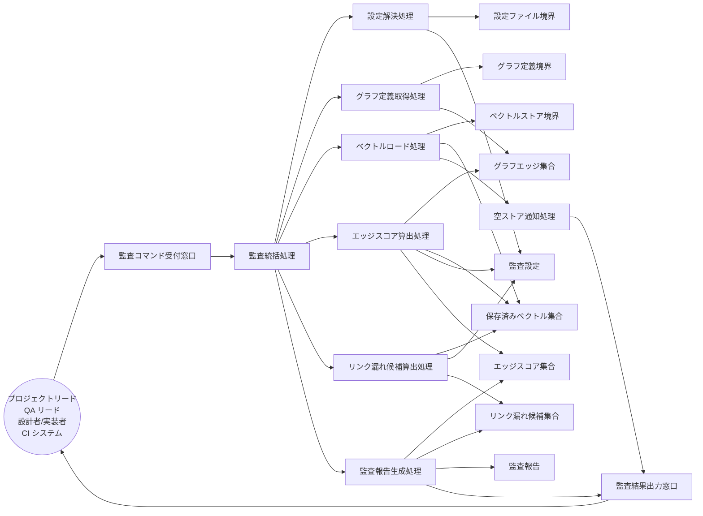

Document ID: RBA-LGX-010

# RBA-LGX-010: トレーサビリティ健全性監査 のドメイン構造

**親 UC**: UC-LGX-010
**レイヤ**: 抽象側（ドメインレベル、言語非依存）

> **記述規律**: ドメイン語彙のみ。クラス境界・属性・操作・カーディナリティ・言語要素は書かない。Boundary/Control/Entity の役割識別と通信制約遵守のみ（`04-iconix-layer.md` §3）。本 RBA は UC-LGX-010 の動作検証装置である。

---

## 1. ドメイン主語

UC-LGX-010 から抽出した主語（概念名のまま、クラス名にしない）。

### Boundary 役割（名詞・外部との境界）

- **監査コマンド受付窓口**: アクター（プロジェクトリード / QA リード / 設計者 / 実装者 / CI システム）からの監査要求（`report [--json]`）を受け取る境界
- **グラフ定義境界**: `graph.toml`（全エッジ定義の供給元。Chain / Custom / ParentChild の各エッジを供給）
- **ベクトルストア境界**: `engine.db` の embeddings テーブル（保存済み全件ベクトルの供給元。空状態も許容される供給状態）
- **設定ファイル境界**: `.legixy.toml`（`link_candidate_threshold` を含む設定の供給元）
- **監査結果出力窓口**: 監査報告（text モード / JSON モード）を標準出力へ、診断情報を標準エラーへ区別して返す境界

### Control 役割（動詞・制御）

- **監査統括処理**: 監査要求を受け、設定解決・グラフ定義取得・ベクトルロード・スコア算出・報告生成を協調させる
- **設定解決処理**: 設定ファイル境界から `link_candidate_threshold` を解決する
- **グラフ定義取得処理**: グラフ定義境界から全エッジ（Chain / Custom / ParentChild）を取得する
- **ベクトルロード処理**: ベクトルストア境界から全件ベクトルを取得する。空状態を検知し代替フローへ分岐する
- **エッジスコア算出処理**: 既定義エッジのうち両端点のベクトルが存在し次元が一致するものの cosine 類似度を算出する。次元不一致・ベクトル不在・非有限スコアのエッジはスキップし集約警告を生成する（SPEC-LGX-006.REQ.04 / SPEC-LGX-010.REQ.09 に従う bulk 類似度算出の消費者として動作）
- **リンク漏れ候補算出処理**: 非エッジのペアから類似度が閾値以上のリンク漏れ候補を算出する（同様に bulk API の消費者として動作）
- **監査報告生成処理**: エッジスコア集合・リンク漏れ候補集合・統計サマリを集約し、出力形式（text / JSON）に応じて監査報告を生成する
- **空ストア通知処理**: ベクトルストアが空の場合に案内情報を生成し監査結果出力窓口へ渡す

### Entity 役割（名詞・データ）

- **監査設定**: 解決済みの `link_candidate_threshold` およびその他の監査設定値
- **グラフエッジ集合**: 取得済みの全エッジ定義（種別・両端点）の集合
- **保存済みベクトル集合**: ロード済みの全件ベクトルとその付帯情報（次元・ノード識別）の集合
- **エッジスコア集合**: 算出済みのエッジ類似度スコア（算出対象エッジ・スキップエッジ・集約警告を含む）
- **リンク漏れ候補集合**: 算出済みの候補ペアとスコアの集合
- **監査報告**: エッジスコア集合・リンク漏れ候補集合・統計サマリを集約した出力単位（text モードまたは JSON モード）

## 2. 主語間の関係（概念レベル）

カーディナリティ・composition/aggregation の意味付けは具体側（RBD）で行う。

- 監査コマンド受付窓口 は 監査統括処理 に監査要求を渡す
- 監査統括処理 は 設定解決処理・グラフ定義取得処理・ベクトルロード処理・エッジスコア算出処理・リンク漏れ候補算出処理・監査報告生成処理 を協調させる
- 設定解決処理 は 設定ファイル境界 を読み 監査設定 を確定する
- グラフ定義取得処理 は グラフ定義境界 を読み グラフエッジ集合 を確定する
- ベクトルロード処理 は ベクトルストア境界 を読み 保存済みベクトル集合 を確定する。空状態の場合は 空ストア通知処理 を起動する
- エッジスコア算出処理 は グラフエッジ集合 と 保存済みベクトル集合 と 監査設定 を読み エッジスコア集合 を生成する
- リンク漏れ候補算出処理 は 保存済みベクトル集合 と 監査設定 を読み リンク漏れ候補集合 を生成する
- 監査報告生成処理 は エッジスコア集合 と リンク漏れ候補集合 を読み 監査報告 を生成して 監査結果出力窓口 に渡す
- 空ストア通知処理 は 監査結果出力窓口 に案内情報を渡す
- 監査結果出力窓口 は アクター に監査報告（stdout）と診断情報（stderr）を区別して返す

## 3. 通信フロー（ドメインレベル）

主語名はドメイン語彙。クラス名命名規則（PascalCase 等）・関数名・型は使わない。

## 4. 通信制約遵守チェック（Noun-Verb ルール、§3.4）

- [x] Boundary 同士の直接通信なし（受付窓口・各供給境界・出力窓口は Control 経由でのみ連携）
- [x] Entity 同士の直接通信なし（グラフエッジ集合・保存済みベクトル集合・エッジスコア集合・リンク漏れ候補集合・監査報告・監査設定は Control 経由でのみ読み書き）
- [x] Boundary → Entity 直結なし（供給境界からの情報は必ず Control〔設定解決/グラフ定義取得/ベクトルロード〕を介して Entity へ）
- [x] Actor → Control / Entity 直結なし（アクターは監査コマンド受付窓口 Boundary のみと通信）

違反なし。全通信が Actor⇄Boundary / Boundary⇄Control / Control⇄Control / Control⇄Entity に収まる。

## 5. 1:1 Correspondence 検証（UC ⇄ RBA、§3.3）

| UC-LGX-010 ステップ | RBA フロー上の対応 | 整合 |
|---|---|---|
| 基本 1（`legixy report [--json]` 実行） | Actor → 監査コマンド受付窓口 → 監査統括処理 | ✓ |
| 基本 2（graph.toml をパース、embeddings 全件ロード） | 監査統括処理 → グラフ定義取得処理 → グラフ定義境界 → グラフエッジ集合 / 監査統括処理 → ベクトルロード処理 → ベクトルストア境界 → 保存済みベクトル集合 | ✓ |
| 基本 2（`.legixy.toml` の `link_candidate_threshold` 解決） | 監査統括処理 → 設定解決処理 → 設定ファイル境界 → 監査設定 | ✓ |
| 基本 3a（全エッジの cosine 類似度算出） | エッジスコア算出処理 → グラフエッジ集合 / 保存済みベクトル集合 / 監査設定 → エッジスコア集合 | ✓ |
| 基本 3b（非エッジペアで閾値以上のリンク漏れ候補算出） | リンク漏れ候補算出処理 → 保存済みベクトル集合 / 監査設定 → リンク漏れ候補集合 | ✓ |
| 基本 4（text モード: 人間可読階層表示） | 監査報告生成処理 → エッジスコア集合 / リンク漏れ候補集合 → 監査報告 → 監査結果出力窓口 | ✓ |
| 基本 5（`--json` モード: 構造化 JSON） | 監査報告生成処理 → 監査報告（JSON 形式）→ 監査結果出力窓口 | ✓ |
| 基本 6（exit 0 で終了） | 監査統括処理 が正常完了を確定 | ✓ |
| 代替 2a（embeddings テーブルが空: INFO 出力 + exit 0） | ベクトルロード処理 が空状態を検知 → 空ストア通知処理 → 監査結果出力窓口 | ✓ |
| 代替 3a（算出失敗: exit 1） | エッジスコア算出処理 / リンク漏れ候補算出処理 が失敗を監査統括処理 へ伝達 | ✓ |
| 事後条件（UC-LGX-008 連携の選択肢あり） | 監査結果出力窓口 がアクターへ報告を返す（後続 UC-008 は本 RBA の範囲外） | ✓ |

逆方向（RBA フロー → UC ステップ）も全フローが UC ステップに対応。余剰フローなし。

## 6. Object Discovery（§3.5）

UC に明示されていなかったが RBA 構築過程で構造化された主語・責務:

- **設定解決処理（Control）の明示化**: UC-010 では「`link_candidate_threshold` が設定されている」を事前条件として記述するのみで、設定解決の処理主体が明示されていなかった。SPEC-LGX-010.REQ.04 の「閾値 ≥ `link_candidate_threshold`」および REQ.01 のグローバルオプション受理（`--json` 等）を受け、設定解決処理を独立 Control として構造化した。新規ドメイン概念の追加ではなく、既存 UC/SPEC の責務の可視化。

- **エッジスコア算出処理のスキップ・集約警告責務**: UC-010 はスキップ処理を記述していないが、SPEC-LGX-010.REQ.04 の「端点 embedding 不在・次元不一致のエッジは算出対象外 + 集約 Warning」および SPEC-LGX-006.REQ.04 の「次元不一致ペアを skip + 集約 Warning」に基づき、エッジスコア算出処理の責務に明示的に含めた。UCレベルへの遡及は不要（SPECに錨着）。ただし UC のスコープ記述に集約 Warning の記載がないため、GAP[UC] 候補として記す（後述 NOTES 参照）。

- **「グラフ定義境界」と「グラフエッジ集合」の Boundary/Entity 分離**: UC では「graph.toml をパース」と一文で記述されているが、外部ファイル（境界）とロード後のドメインデータ（Entity）を分離した。SPEC-LGX-010.REQ.07 の「graph.toml に書き込まない」に錨着。

- **「ベクトルストア境界」と「保存済みベクトル集合」の Boundary/Entity 分離**: UC では「embeddings テーブルから全件をロードする」と記述されているが、供給元 DB（境界）とメモリ上のデータ（Entity）を分離した。UC 事後条件「engine.db / graph.toml は不変」および STATE-INV-1 に錨着。

**概念領域の汚染なし**: エッジスコア集合にリンク漏れ候補が混入していない（別 Entity）。リンク漏れ候補集合に閾値判定（severity 概念）が含まれていない（SPEC-LGX-010.REQ.04 の「報告は計測であり判定しない」に錨着）。監査報告に書き込み操作が含まれていない（STATE-INV-1）。

## 7. ICONIX 流三者整合性（UC ⇄ RBA ⇄ SPEC、§11.2）

| 検査 | 確認内容 | 結果 |
|---|---|---|
| UC ⇄ RBA | UC-010 各ステップが RBA フローに 1:1 対応（§5） | ✓ |
| RBA ⇄ SPEC | RBA 主語が SPEC-LGX-010.REQ.04（report 計測レポート）/ SPEC-LGX-006.REQ.11（bulk 類似度 API = 算出基盤）の用語・概念と一致。エッジスコア算出処理 = REQ.04 「全エッジ cosine 類似度 links」、リンク漏れ候補算出処理 = REQ.04 「candidates (≥ threshold)」、統計サマリ = REQ.04 「summary {total_links, min/max/mean_link_score}」、スキップ + 集約警告 = SPEC-LGX-006.REQ.04 / SPEC-LGX-010.REQ.09 | ✓ |
| UC ⇄ SPEC | UC-010 が SPEC-LGX-010.REQ.04 の読取専用・exit 0 正常終了・空ストア時 INFO・判定なし（severity 概念なし）と整合。関連不変条件 SCORE-INV-1（決定性保証）= SPEC-LGX-006.REQ.11 / STATE-INV-1（engine.db 不変）= SPEC-LGX-010.REQ.07 / NFR-LGX-001.OBS.02（stdout/stderr 分離）= SPEC-LGX-010.REQ.01 との整合 | ✓ |

概念領域の汚染なし、用語不一致なし。

## 8. Jacobson 流三者整合性（UC ⇄ RBA ⇄ SEQA、§11.1）

**保留**: SEQA-LGX-010 生成時に確定する。本 RBA のドメイン主語（B/C/E）が SEQA のレーンと一致し、Noun-Verb ルールが SEQA でも守られ、UC text 並列配置で各ステップが SEQA メッセージと対応することを SEQA 段階で検証する。RBA 単独では UC⇄RBA（§5）+ UC⇄SPEC（§7）まで。

## 9. 抽象層 GREEN 確定状況（§11.4）

| 条件 | 状況 |
|---|---|
| 1. Jacobson 三者整合性（UC⇄RBA⇄SEQA） | 保留（SEQA 生成後） |
| 2. ICONIX 三者整合性（UC⇄RBA⇄SPEC） | ✓（§7） |
| 3. Noun-Verb ルール違反なし | ✓（§4） |
| 4. Object Discovery を SPEC/UC に反映 | ✓ 反映不要を確認（§6）/ GAP[UC] 候補 1 件あり（スキップ・集約 Warning の UC 記載欠落）|
| 5. UC Disambiguation の GAP[UC] closed | 未確認（GAP[UC] 候補 1 件 — 本 RBA 起票分。クローズ後に確定） |
| 6. 概念領域の汚染検査 | ✓（§6） |
| 7. Behavior Allocation 指針（SEQA で） | 保留（SEQA/SEQD） |
| 8. `check --formal` pass | 登録後に確認 |
| 9. レイヤ汚染なし | ✓（言語要素・操作・属性なし） |

3〜7 は機械検証不能（Adversary + 人間判断）。SEQA-LGX-010 と対で抽象層 GREEN を確定する。

## 10. 履歴

| 日付 | 変更内容 |
|---|---|
| 2026-06-13 | 初版。UC-LGX-010 のドメイン構造（Boundary 5 / Control 8 / Entity 6）。UC⇄RBA 1:1 対応・Noun-Verb・Object Discovery・ICONIX 三者整合性を確認。GAP[UC] 候補 1 件（スキップ・集約 Warning の UC 記載欠落）を NOTES に記す。Jacobson 三者整合性は SEQA-LGX-010 で確定 |
