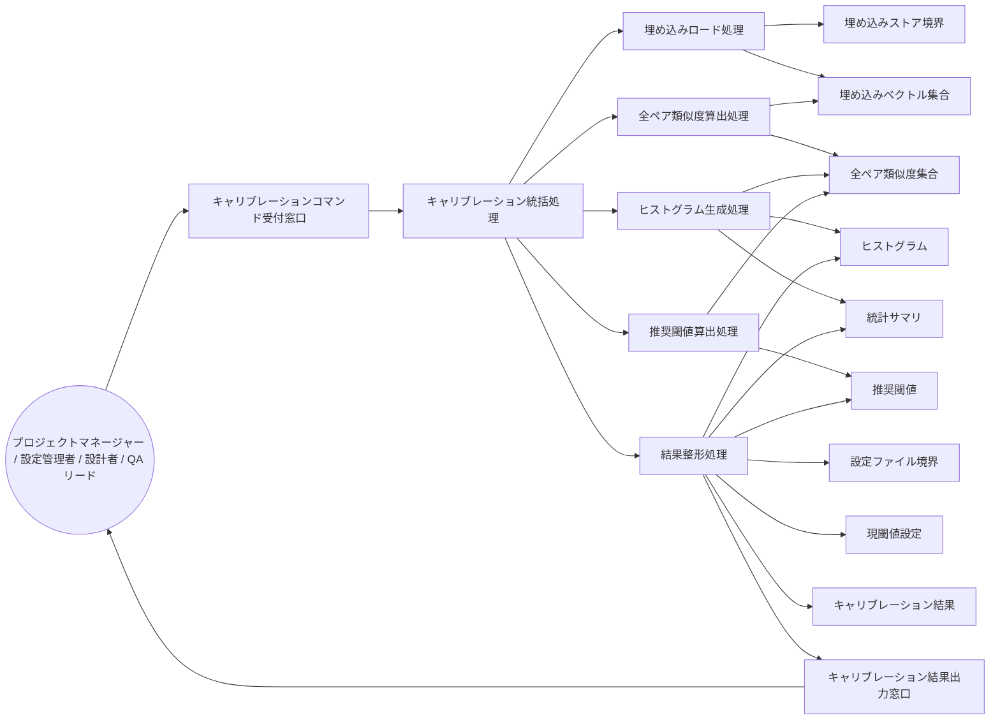

Document ID: RBA-LGX-011

# RBA-LGX-011: 閾値キャリブレーション のドメイン構造

**親 UC**: UC-LGX-011
**レイヤ**: 抽象側（ドメインレベル、言語非依存）

> **記述規律**: ドメイン語彙のみ。クラス境界・属性・操作・カーディナリティ・言語要素は書かない。Boundary/Control/Entity の役割識別と通信制約遵守のみ（`04-iconix-layer.md` §3）。本 RBA は UC-LGX-011 の動作検証装置である。

---

## 1. ドメイン主語

UC-LGX-011 から抽出した主語（概念名のまま、クラス名にしない）。

### Boundary 役割（名詞・外部との境界）

- **キャリブレーションコマンド受付窓口**: アクター（プロジェクトマネージャー / 設定管理者 / 設計者 / QA リード）から `calibrate` 実行要求とオプション（`--buckets` / `--recommend` / `--json`）を受け取る境界
- **設定ファイル境界**: `.legixy.toml`（現在の 3 閾値 `similarity_threshold` / `drift_threshold` / `link_candidate_threshold` の供給元）
- **埋め込みストア境界**: `engine.db` の embeddings テーブル（全ノード埋め込みベクトルの供給元。読取専用）
- **キャリブレーション結果出力窓口**: ヒストグラム・統計サマリ・閾値一覧・推奨閾値をアクターへ返す境界（text モードは stdout / ログは stderr）

### Control 役割（動詞・制御）

- **キャリブレーション統括処理**: 実行要求を受け、埋め込みロード・全ペア類似度算出・ヒストグラム生成・推奨閾値算出（オプション）・結果整形・出力を協調させる
- **埋め込みロード処理**: 埋め込みストア境界から全ノードの埋め込みベクトルをロードし、空ストアの場合は早期終了を統括処理へ通知する
- **全ペア類似度算出処理**: ロード済み埋め込みベクトルから全ペアのコサイン類似度を算出する（O(N²)。非有限スコアのペアは算入しない）
- **ヒストグラム生成処理**: 全ペア類似度集合と指定バケット数から度数分布（ヒストグラム）と統計値（最小・最大・平均）を生成する
- **推奨閾値算出処理**: 全ペア類似度集合のパーセンタイル方式（p25 / 1.0−p90 / p75）に基づき 3 閾値の推奨値を算出する（`--recommend` 指定時のみ起動。ペア数 0 の場合は算出を行わず通知を生成する）
- **結果整形処理**: ヒストグラム・統計値・現閾値設定・推奨閾値（指定時）を指定フォーマット（text / JSON）に整形し、キャリブレーション結果出力窓口へ渡す

### Entity 役割（名詞・データ）

- **埋め込みベクトル集合**: ロード済みの全ノード埋め込みベクトル（全ペア類似度算出の入力。空も許容される状態）
- **全ペア類似度集合**: 全ノードペアのコサイン類似度値の集まり（ヒストグラム生成と推奨閾値算出の共通入力）
- **ヒストグラム**: バケット別の度数分布（バケット数は実行オプションで指定）
- **統計サマリ**: 全ペア類似度の最小・最大・平均値
- **現閾値設定**: `.legixy.toml` から供給された 3 閾値の現在値
- **推奨閾値**: パーセンタイル方式で算出した 3 閾値の推奨値（`--recommend` 指定時のみ存在）
- **キャリブレーション結果**: ヒストグラム・統計サマリ・現閾値設定・推奨閾値（指定時）を束ねた出力全体

## 2. 主語間の関係（概念レベル）

カーディナリティ・composition/aggregation の意味付けは具体側（RBD）で行う。

- キャリブレーションコマンド受付窓口 は キャリブレーション統括処理 に実行要求とオプションを渡す
- キャリブレーション統括処理 は 埋め込みロード処理・全ペア類似度算出処理・ヒストグラム生成処理・推奨閾値算出処理・結果整形処理 を協調させる
- 埋め込みロード処理 は 埋め込みストア境界 を読み 埋め込みベクトル集合 を確定する（空ストア時は統括処理へ早期終了を通知）
- 全ペア類似度算出処理 は 埋め込みベクトル集合 を読み 全ペア類似度集合 を生成する
- ヒストグラム生成処理 は 全ペア類似度集合 を読み ヒストグラム と 統計サマリ を生成する
- 推奨閾値算出処理 は 全ペア類似度集合 を読み 推奨閾値 を算出する（`--recommend` 指定時のみ）
- 結果整形処理 は 設定ファイル境界 を読み 現閾値設定 を取得する
- 結果整形処理 は ヒストグラム・統計サマリ・現閾値設定・推奨閾値 を束ねて キャリブレーション結果 を生成し キャリブレーション結果出力窓口 に渡す
- キャリブレーション結果出力窓口 は アクター に結果を返す

## 3. 通信フロー（ドメインレベル）

主語名はドメイン語彙。クラス名命名規則（PascalCase 等）・関数名・型は使わない。

## 4. 通信制約遵守チェック（Noun-Verb ルール、§3.4）

- [x] Boundary 同士の直接通信なし（受付窓口・埋め込みストア境界・設定ファイル境界・出力窓口は Control 経由でのみ連携）
- [x] Entity 同士の直接通信なし（埋め込みベクトル集合・全ペア類似度集合・ヒストグラム・統計サマリ・現閾値設定・推奨閾値・キャリブレーション結果は Control 経由でのみ読み書き）
- [x] Boundary → Entity 直結なし（供給境界から Entity への流れは必ず Control〔埋め込みロード処理 / 結果整形処理〕を介する）
- [x] Actor → Control / Entity 直結なし（アクターはキャリブレーションコマンド受付窓口 Boundary のみと通信）

違反なし。全通信が Actor⇄Boundary / Boundary⇄Control / Control⇄Control / Control⇄Entity に収まる。

## 5. 1:1 Correspondence 検証（UC ⇄ RBA、§3.3）

| UC-LGX-011 ステップ | RBA フロー上の対応 | 整合 |
|---|---|---|
| 基本 1（`legixy calibrate [--buckets N] [--recommend] [--json]` 実行） | Actor → キャリブレーションコマンド受付窓口 → キャリブレーション統括処理 | ✓ |
| 基本 2（embeddings テーブルから全件ロード） | キャリブレーション統括処理 → 埋め込みロード処理 → 埋め込みストア境界 → 埋め込みベクトル集合 | ✓ |
| 基本 3（全ペア類似度算出、O(N²)） | キャリブレーション統括処理 → 全ペア類似度算出処理 → 埋め込みベクトル集合 → 全ペア類似度集合 | ✓ |
| 基本 4（指定バケット数のヒストグラム生成） | キャリブレーション統括処理 → ヒストグラム生成処理 → 全ペア類似度集合 → ヒストグラム / 統計サマリ | ✓ |
| 基本 5（text モード: ASCII ヒストグラム + 統計 + 閾値一覧） | 結果整形処理 → 設定ファイル境界 → 現閾値設定 / ヒストグラム / 統計サマリ → キャリブレーション結果 → キャリブレーション結果出力窓口 | ✓ |
| 基本 6（`--json` モード出力） | 結果整形処理 がフォーマット指定に従い JSON 形式で キャリブレーション結果 を生成 | ✓ |
| 基本 7（exit 0 で終了） | キャリブレーション統括処理 が正常終了を確定 | ✓ |
| 代替 2a（embeddings が空 → INFO 出力 + exit 0） | 埋め込みロード処理 が空ストアを検出し統括処理へ早期終了通知 → 結果出力窓口 が INFO を出力 | ✓ |
| 代替 1a（`--buckets 0` → エラー + exit 1） | キャリブレーションコマンド受付窓口 がオプション検証でエラーを検出し統括処理へ通知 | ✓ |
| 代替 3a（全ペア算出失敗 → exit 1） | 全ペア類似度算出処理 が失敗を統括処理へ通知 → 出力窓口 がエラー報告 | ✓ |
| 代替 1b（`--recommend` 指定 → 推奨閾値追加出力） | キャリブレーション統括処理 → 推奨閾値算出処理 → 全ペア類似度集合 → 推奨閾値 → 結果整形処理 → キャリブレーション結果 | ✓ |
| 代替 3b（`--recommend` かつペア数 0 → stderr INFO） | 推奨閾値算出処理 がペア数 0 を検出し「算出不能」通知を生成 → キャリブレーション結果出力窓口 が stderr に出力 | ✓ |

逆方向（RBA フロー → UC ステップ）も全フローが UC ステップに対応。余剰フローなし。

## 6. Object Discovery（§3.5）

UC に明示されていなかったが RBA 構築過程で構造化した主語・責務:

- **「埋め込みストア境界」と「埋め込みベクトル集合」の Boundary/Entity 分離**: UC ではエンジン DB への言及が「embeddings テーブルから全件をロード」に留まるが、永続ファイル供給元（境界）とロード後のメモリ上データ（Entity）を明示的に分離した。事後条件「engine.db は不変（読取のみ）」と SPEC-LGX-010 REQ.06（読取専用）に錨着。
- **「結果整形処理」の独立**: UC の基本 5/6 では text / JSON モードが列挙されているが、整形責務を独立した Control として抽出した。「推奨閾値の有無」と「フォーマット指定」の直交性を明示化するための構造化であり、新規ドメイン概念の追加ではなく既存 UC 範囲内の責務の可視化。
- **「キャリブレーション統括処理」の「早期終了通知」責務**: UC 代替 2a（空ストア時の早期終了）は統括処理が全ペア類似度算出・ヒストグラム生成をスキップして即座に INFO 出力へ遷移する流れを意味する。これは SPEC-LGX-010 REQ.05 の空ストア時の挙動に錨着。
- **`--buckets 0` の境界受付段での検証**: UC 代替 1a を境界受付窓口のオプション検証責務として構造化した。これは入力契約違反の早期検出パターンであり、統括処理に到達する前のゲートとして明示する（LGX-COMPAT-001 §4 #7 に錨着）。

新ドメイン主語・新責務の SPEC/UC への遡及反映は不要（いずれも既存 UC-LGX-011 / SPEC-LGX-010 / SPEC-LGX-006 の範囲内の構造化）。**概念領域の汚染なし**: 各 Entity（埋め込みベクトル集合・全ペア類似度集合・ヒストグラム・統計サマリ・現閾値設定・推奨閾値・キャリブレーション結果）に概念領域外の操作混入なし。各 Control の責務名と担う処理が一致（ヒストグラム生成処理が推奨閾値を算出しない、等）。

## 7. ICONIX 流三者整合性（UC ⇄ RBA ⇄ SPEC、§11.2）

| 検査 | 確認内容 | 結果 |
|---|---|---|
| UC ⇄ RBA | UC-LGX-011 各ステップが RBA フローに 1:1 対応（§5） | ✓ |
| RBA ⇄ SPEC | RBA 主語が SPEC-LGX-010（calibrate=REQ.05）/ SPEC-LGX-006（bulk similarity API=REQ.11）の用語・概念と一致。全ペア類似度算出処理 = REQ.11 の `compute_all_pair_scores`（ドメイン概念）、ヒストグラム生成処理 = REQ.11 の `histogram`（ドメイン概念）、推奨閾値算出処理 = REQ.05 のパーセンタイル方式（p25/1.0-p90/p75）、現閾値設定 = `.legixy.toml` の 3 閾値、非有限スコアの算入除外 = SPEC-LGX-010 REQ.09 | ✓ |
| UC ⇄ SPEC | UC-LGX-011 が SPEC-LGX-010 REQ.05（calibrate 要件）・REQ.06（読取専用）・REQ.09（非有限スコア skip）・NFR-LGX-001.OBS.02（出力先 stderr/stdout）・OBS.05（終了コード）・LGX-COMPAT-001 §4 #7（凍結済み引数契約）と整合 | ✓ |

概念領域の汚染なし、用語不一致なし。

## 8. Jacobson 流三者整合性（UC ⇄ RBA ⇄ SEQA、§11.1）

**保留**: SEQA-LGX-011 生成時に確定する。本 RBA のドメイン主語（B/C/E）が SEQA のレーンと一致し、Noun-Verb ルールが SEQA でも守られ、UC text 並列配置で各ステップが SEQA メッセージと対応することを SEQA 段階で検証する。RBA 単独では UC⇄RBA（§5）+ UC⇄SPEC（§7）まで。

## 9. 抽象層 GREEN 確定状況（§11.4）

| 条件 | 状況 |
|---|---|
| 1. Jacobson 三者整合性（UC⇄RBA⇄SEQA） | 保留（SEQA 生成後） |
| 2. ICONIX 三者整合性（UC⇄RBA⇄SPEC） | ✓（§7） |
| 3. Noun-Verb ルール違反なし | ✓（§4） |
| 4. Object Discovery を SPEC/UC に反映 | ✓ 反映不要を確認（§6） |
| 5. UC Disambiguation の GAP[UC] closed | UC-LGX-011 に未 close の GAP なし（確認済） |
| 6. 概念領域の汚染検査 | ✓（§6） |
| 7. Behavior Allocation 指針（SEQA で） | 保留（SEQA/SEQD） |
| 8. `check --formal` pass | 登録後に確認 |
| 9. レイヤ汚染なし | ✓（言語要素・操作・属性なし） |

3〜7 は機械検証不能（Adversary + 人間判断）。SEQA-LGX-011 と対で抽象層 GREEN を確定する。

## 10. 履歴

| 日付 | 変更内容 |
|---|---|
| 2026-06-13 | 初版。UC-LGX-011 のドメイン構造（Boundary 4 / Control 6 / Entity 7）。UC⇄RBA 1:1 対応・Noun-Verb・Object Discovery・ICONIX 三者整合性を確認。Jacobson 三者整合性は SEQA-LGX-011 で確定 |
