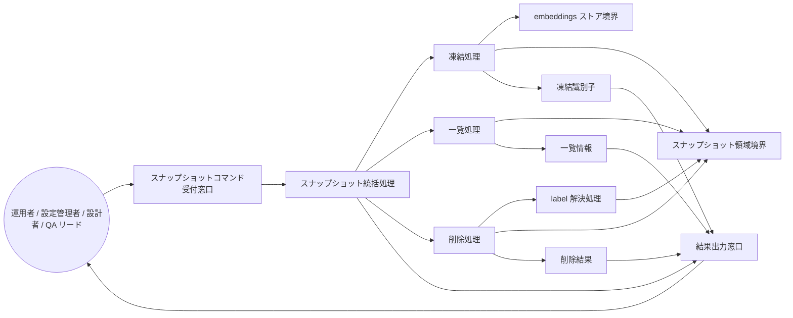

Document ID: RBA-LGX-012

# RBA-LGX-012: ベースライン凍結管理 のドメイン構造

**親 UC**: UC-LGX-012
**レイヤ**: 抽象側（ドメインレベル、言語非依存）

> **記述規律**: ドメイン語彙のみ。クラス境界・属性・操作・カーディナリティ・言語要素は書かない。Boundary/Control/Entity の役割識別と通信制約遵守のみ（`04-iconix-layer.md` §3）。本 RBA は UC-LGX-012 の動作検証装置である。

---

## 1. ドメイン主語

UC-LGX-012 から抽出した主語（概念名のまま、クラス名にしない）。

### Boundary 役割（名詞・外部との境界）

- **スナップショットコマンド受付窓口**: アクター（運用者 / 設定管理者 / 設計者 / QA リード）からのスナップショット操作要求（`snapshot create` / `snapshot list` / `snapshot delete`）を受け取る境界。サブコマンド省略（`legixy snapshot` のみ）は使用法誤りとして exit 2 を返す
- **embeddings ストア境界**: 凍結対象となる現行 embedding 全行の供給元。engine.db 不在時は空ストア相当として扱う（REQ.07）
- **スナップショット領域境界**: 凍結済みスナップショット行の永続供給元・書込先（engine.db 内の分離領域）
- **結果出力窓口**: 操作結果（snapshot_id / 一覧 / 削除確認）を stdout に、診断メッセージ（INFO / WARNING / ERROR）を stderr に区別してアクターへ返す境界

### Control 役割（動詞・制御）

- **スナップショット統括処理**: スナップショット操作要求を受け、サブコマンド種別を判定し、凍結処理 / 一覧処理 / 削除処理のいずれかへ振り分ける
- **凍結処理**: embeddings ストア境界から現行全行を単一トランザクションでスナップショット領域境界へ複製し、一意な凍結識別子を発行する。空ストア時（複製行 0 件）はスナップショットを永続化せず WARNING を通知して終了する
- **一覧処理**: スナップショット領域境界から全スナップショット行を読み取り、taken_at 降順で整列して一覧情報を組み立てる。0 件時は案内メッセージ相当を組み立てる
- **削除処理**: 削除対象（凍結識別子または label 参照）を受け取り、label 参照の場合は label 解決処理に委譲し、対象行をスナップショット領域境界から除去する
- **label 解決処理**: `label:<L>` 形式の参照を受け取り、スナップショット領域境界に問い合わせて taken_at 最新の 1 件へ決定論的に解決する。対象 label が存在しない場合は ERROR を通知して exit 1 で終了する

### Entity 役割（名詞・データ）

- **凍結識別子**: `snap-` プレフィクスを持つ一意な識別子（内部形式は不透明トークン。生成後は consumer から不透明として扱われる）
- **スナップショット行集合**: 凍結時点の embedding 全行の複製（snapshot_id / label / node_count / taken_at / content_hash / model_version を含む）
- **一覧情報**: snapshot_id / label / node_count / taken_at を持つスナップショット行集合の taken_at 降順整列済み表現
- **削除結果**: 削除操作の結果（対象識別子 / 削除行数）

## 2. 主語間の関係（概念レベル）

カーディナリティ・composition/aggregation の意味付けは具体側（RBD）で行う。

- スナップショットコマンド受付窓口 は スナップショット統括処理 に操作要求を渡す
- スナップショット統括処理 は サブコマンド種別に応じて 凍結処理 / 一覧処理 / 削除処理 のいずれかを起動する
- 凍結処理 は embeddings ストア境界 から現行全行を読み取り スナップショット領域境界 へ複製し 凍結識別子 を発行する
- 一覧処理 は スナップショット領域境界 から スナップショット行集合 を読み取り 一覧情報 を組み立てる
- 削除処理 は label 参照時に label 解決処理 を呼び出し、解決済み識別子でスナップショット領域境界 の対象行を除去し 削除結果 を生成する
- label 解決処理 は スナップショット領域境界 に問い合わせて対象 label を taken_at 最新の 1 件へ解決する
- スナップショット統括処理 は 結果出力窓口 に最終結果（凍結識別子 / 一覧情報 / 削除結果）と診断メッセージを渡す
- 結果出力窓口 は アクター に操作結果（stdout）と診断メッセージ（stderr）を区別して返す

## 3. 通信フロー（ドメインレベル）

主語名はドメイン語彙。クラス名命名規則（PascalCase 等）・関数名・型は使わない。

## 4. 通信制約遵守チェック（Noun-Verb ルール、§3.4）

- [x] Boundary 同士の直接通信なし（スナップショットコマンド受付窓口・embeddings ストア境界・スナップショット領域境界・結果出力窓口は Control 経由でのみ連携）
- [x] Entity 同士の直接通信なし（凍結識別子・スナップショット行集合・一覧情報・削除結果は Control 経由でのみ読み書き）
- [x] Boundary → Entity 直結なし（供給境界から Entity への流れは必ず Control〔凍結処理 / 一覧処理 / 削除処理〕を介する）
- [x] Actor → Control / Entity 直結なし（アクターはスナップショットコマンド受付窓口 Boundary のみと通信）

違反なし。全通信が Actor⇄Boundary / Boundary⇄Control / Control⇄Control / Control⇄Entity に収まる。

## 5. 1:1 Correspondence 検証（UC ⇄ RBA、§3.3）

| UC-LGX-012 ステップ | RBA フロー上の対応 | 整合 |
|---|---|---|
| 基本 1（`legixy snapshot create --label <L>` 実行） | Actor → スナップショットコマンド受付窓口 → スナップショット統括処理 → 凍結処理 | ✓ |
| 基本 2（embeddings ストア現行全行を単一トランザクションで複製） | 凍結処理 → embeddings ストア境界 → スナップショット領域境界 → スナップショット行集合 | ✓ |
| 基本 3（snapshot_id 発行・text/--json で返却） | 凍結処理 → 凍結識別子 → 結果出力窓口 → Actor | ✓ |
| 基本 4（`legixy snapshot list` で一覧確認） | スナップショット統括処理 → 一覧処理 → スナップショット領域境界 → 一覧情報 → 結果出力窓口 → Actor | ✓ |
| 基本 5（UC-LGX-013 の `--against snapshot:<L>` 参照は後続利用） | スナップショット領域境界 が参照元となる（本 UC 範囲外、後続利用の注記のみ） | ✓ |
| 基本 6（`legixy snapshot delete <snapshot_id \| label:<L>>` 削除） | スナップショット統括処理 → 削除処理 → （label 参照時）label 解決処理 → スナップショット領域境界 → 削除結果 → 結果出力窓口 | ✓ |
| 基本 7（exit 0 で終了） | 結果出力窓口 → Actor（正常終了） | ✓ |
| 代替 1a（サブコマンド省略 → exit 2） | スナップショットコマンド受付窓口 が使用法誤りとして exit 2 を返す | ✓ |
| 代替 2a（空ストア create → WARNING + exit 0、非永続） | 凍結処理 が複製行 0 件を検出し永続化せず → 結果出力窓口 が WARNING を stderr に通知 | ✓ |
| 代替 4a（list 0 件 → 案内メッセージ / 空配列 + exit 0） | 一覧処理 が 0 件を検出し案内メッセージを組み立てる → 結果出力窓口 | ✓ |
| 代替 6a（delete label:<L> 複数存在 → taken_at 最新の 1 件へ解決） | label 解決処理 が スナップショット領域境界 に問い合わせ taken_at 最新を決定論的に解決 | ✓ |
| 代替 6b（delete snapshot_id 不在 → WARNING + exit 0 / --json は警告なし） | 削除処理 が 0 行削除を検出し 削除結果（deleted_rows: 0）を生成 → 結果出力窓口 が text/json で分岐出力 | ✓ |
| 代替 6c（delete label:<L> 存在しない → ERROR + exit 1） | label 解決処理 が解決失敗を検出 → 結果出力窓口 が ERROR を stderr に通知して exit 1 | ✓ |

逆方向（RBA フロー → UC ステップ）も全フローが UC ステップに対応。余剰フローなし。

## 6. Object Discovery（§3.5）

UC に明示されていなかったが RBA 構築過程で構造化された主語・責務:

- **label 解決処理（Control）の独立化**: UC-LGX-012 の代替 6a と代替 6c はいずれも label 参照の解決に関するフローだが、UC ではこれが暗黙的に削除処理の一部として混在していた。RBA では `delete label:<L>` と `delete <snapshot_id>` の経路分岐を明確にするために label 解決処理を独立した Control として分離した。これにより 6a（複数存在時の最新優先解決）と 6c（label 不在の ERROR + exit 1）の非対称性が構造上可視化される。新規ドメイン主語の追加ではなく、UC/SPEC 既存責務の可視化（SPEC-LGX-010.REQ.02 の「label 解決の規則」節に対応）。
- **「スナップショット行集合」Entity の明示**: UC-LGX-012 では「embeddings ストアの現行全行を複製する」と記述されているが、複製後の状態（スナップショット領域内のデータ）と複製元（現行 embeddings ストア）の区別が曖昧。RBA では両者を別 Boundary/Entity として分離した。スナップショット行集合が content_hash / model_version を含むことは SCORE-INV-1（関連不変条件）および SPEC-LGX-010.REQ.02 に錨着。
- **代替 2a（空ストア非永続）の凍結処理内完結**: UC では空ストア時に「スナップショットは永続化されず」と記述されているが、RBA 上では凍結処理が複製行 0 件を検出しスナップショット領域境界への書込みをスキップするフローとして具体化した。UC/SPEC の範囲内の構造化であり新規ドメイン主語の追加なし。

概念領域の汚染なし: 各 Entity（凍結識別子 / スナップショット行集合 / 一覧情報 / 削除結果）に概念領域外の操作混入なし。各 Control の責務名と担う処理が一致（一覧処理が削除しない、削除処理が embedding を生成しない、等）。

## 7. ICONIX 流三者整合性（UC ⇄ RBA ⇄ SPEC、§11.2）

| 検査 | 確認内容 | 結果 |
|---|---|---|
| UC ⇄ RBA | UC-LGX-012 の全ステップが RBA フローに 1:1 対応（§5） | ✓ |
| RBA ⇄ SPEC | RBA 主語が SPEC-LGX-010.REQ.02 の用語・概念と一致。凍結処理=REQ.02「単一トランザクション複製・snapshot_id 発行」、一覧処理=REQ.02「taken_at 降順一覧」、削除処理=REQ.02「delete 挙動」、label 解決処理=REQ.02「label 解決の規則（決定論的最新優先）」、空ストア非永続=REQ.02「複製行 0 件のため非永続」、スナップショット行集合の内容=SCORE-INV-1、engine.db 不在=REQ.07 | ✓ |
| UC ⇄ SPEC | UC-LGX-012 が SPEC-LGX-010.REQ.01（終了コード分類・stderr 統一）/ REQ.02（snapshot ライフサイクル）/ REQ.06（list 安定出力）/ REQ.07（ストレージ境界・DB 不在非作成）/ LGX-COMPAT-001 §4 #8（凍結済引数契約）と整合 | ✓ |

概念領域の汚染なし、用語不一致なし。

## 8. Jacobson 流三者整合性（UC ⇄ RBA ⇄ SEQA、§11.1）

**保留**: SEQA-LGX-012 生成時に確定する。本 RBA のドメイン主語（B/C/E）が SEQA のレーンと一致し、Noun-Verb ルールが SEQA でも守られ、UC text 並列配置で各ステップが SEQA メッセージと対応することを SEQA 段階で検証する。RBA 単独では UC⇄RBA（§5）+ UC⇄SPEC（§7）まで。

## 9. 抽象層 GREEN 確定状況（§11.4）

| 条件 | 状況 |
|---|---|
| 1. Jacobson 三者整合性（UC⇄RBA⇄SEQA） | 保留（SEQA 生成後） |
| 2. ICONIX 三者整合性（UC⇄RBA⇄SPEC） | ✓（§7） |
| 3. Noun-Verb ルール違反なし | ✓（§4） |
| 4. Object Discovery を SPEC/UC に反映 | ✓ 反映不要を確認（§6：既存 UC/SPEC 範囲内の構造化） |
| 5. UC Disambiguation の GAP[UC] closed | UC-012 の UC ループ確定済（delete label 不在=exit 1 代替 6c 追加・OBS 訂正）。残存 GAP がある場合は SEQA 前に確認要 |
| 6. 概念領域の汚染検査 | ✓（§6） |
| 7. Behavior Allocation 指針（SEQA で） | 保留（SEQA/SEQD） |
| 8. `check --formal` pass | 登録後に確認 |
| 9. レイヤ汚染なし | ✓（言語要素・操作・属性なし） |

3〜7 は機械検証不能（Adversary + 人間判断）。SEQA-LGX-012 と対で抽象層 GREEN を確定する。

## 10. 履歴

| 日付 | 変更内容 |
|------|---------|
| 2026-06-13 | 初版。UC-LGX-012 のドメイン構造（Boundary 4 / Control 5 / Entity 4）。UC⇄RBA 1:1 対応・Noun-Verb・Object Discovery・ICONIX 三者整合性を確認。Jacobson 三者整合性は SEQA-LGX-012 で確定 |
