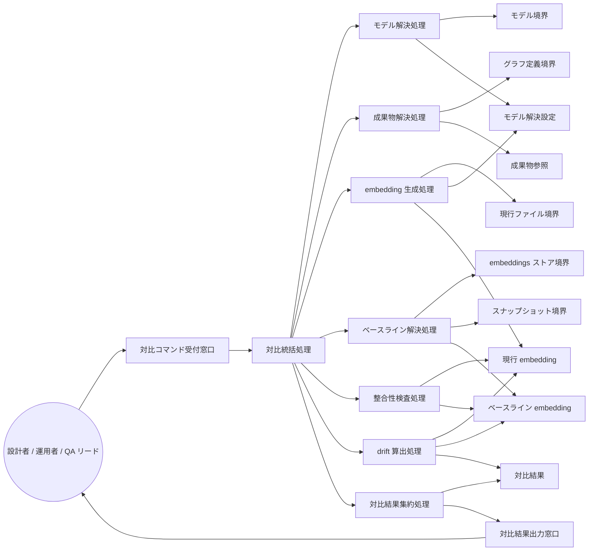

Document ID: RBA-LGX-013

# RBA-LGX-013: standalone ドリフト対比 のドメイン構造

**親 UC**: UC-LGX-013
**レイヤ**: 抽象側（ドメインレベル、言語非依存）

> **記述規律**: ドメイン語彙のみ。クラス境界・属性・操作・カーディナリティ・言語要素は書かない。Boundary/Control/Entity の役割識別と通信制約遵守のみ（`04-iconix-layer.md` §3）。本 RBA は UC-LGX-013 の動作検証装置である。

---

## 1. ドメイン主語

UC-LGX-013 から抽出した主語（概念名のまま、クラス名にしない）。

### Boundary 役割（名詞・外部との境界）

- **対比コマンド受付窓口**: アクター（設計者 / 運用者 / QA リード）からの `drift` 実行要求（`<artifact_id>` + `[--against snapshot:<token>]` + `[--json]`）を受け取る境界
- **グラフ定義境界**: `graph.toml`（対象成果物の登録確認と現行ファイルパス解決の供給元）
- **現行ファイル境界**: 対象成果物の現行ファイル内容（embedding 生成のための読取対象）
- **モデル境界**: ONNX モデルの供給元（`--models-dir` フラグ ＞ `LGX_MODELS_DIR` ＞ `TE_MODELS_DIR` ＞ 設定ファイル の順。drift のみが実行時に依存する境界）
- **embeddings ストア境界**: 保存済み embedding 行（現行保存行 = デフォルトベースライン）の供給元
- **スナップショット境界**: 凍結済みスナップショット（`--against snapshot:<token>` 指定時のベースライン供給元）
- **対比結果出力窓口**: drift 値（text / `--json`）を stdout に、ログ・診断を stderr に区別してアクターへ返す境界

### Control 役割（動詞・制御）

- **対比統括処理**: 対比要求を受け、モデル解決・成果物解決・embedding 生成・ベースライン解決・整合性検査・drift 算出・結果出力を協調させる
- **モデル解決処理**: モデル境界を解決順序（フラグ ＞ 環境変数 `LGX_MODELS_DIR` ＞ 旧名 `TE_MODELS_DIR` ＞ 設定ファイル）に従って解決する。旧名解決時は stderr へ新名案内を通知し続行する。全解決失敗・読込失敗は exit 1 とする
- **成果物解決処理**: グラフ定義境界から対象成果物の登録を確認し、現行ファイル境界のパスを解決する。未登録は exit 1、現行ファイル欠落は exit 1
- **embedding 生成処理**: 現行ファイル境界の内容を読み込み、解決済みモデルで embedding を生成する
- **ベースライン解決処理**: `--against` 指定の有無・形式（省略 / `snapshot:<token>` 曖昧形式 / `snapshot:label:<LABEL>` 明示形式）に応じてベースラインを解決する。プレフィクス欠如は exit 1。label 解決で複数一致時は taken_at 最新の 1 件へ決定論的に解決する。明示 label 形式で解決失敗時は exit 1。不在（未 embed / スナップショットに当該行なし）は exit 0（INFO を stderr）
- **整合性検査処理**: ベースライン embedding と現行 embedding の次元数一致・model_version 完全一致（SPEC-LGX-006.REQ.10 の判定）を検査する。次元不一致は exit 1、model_version 不一致（次元一致）は exit 1（SCORE-INV-2 違反）
- **drift 算出処理**: `drift = 1.0 − cosine 類似度` を算出する。非有限スコア（NaN/±Inf）が生じた場合は exit 1
- **対比結果集約処理**: drift 値とベースライン情報（`baseline_available`・`baseline_source`）を集約し、対比結果出力窓口へ渡す

### Entity 役割（名詞・データ）

- **モデル解決設定**: 解決順序・環境変数・フラグの解決済み値（どの経路で解決されたかを含む）
- **成果物参照**: 登録確認済みの対象成果物情報（graph.toml 上の存在とファイルパス）
- **現行 embedding**: 現行ファイル内容から生成した embedding 値（次元数・model_version を含む）
- **ベースライン embedding**: embeddings ストアまたはスナップショットから取得したベースライン値（次元数・model_version・供給元情報を含む）
- **対比結果**: drift 値・`baseline_available` フラグ・`baseline_source` を含む集約された対比情報

## 2. 主語間の関係（概念レベル）

カーディナリティ・composition/aggregation の意味付けは具体側（RBD）で行う。

- 対比コマンド受付窓口 は 対比統括処理 に対比要求を渡す
- 対比統括処理 は モデル解決処理・成果物解決処理・embedding 生成処理・ベースライン解決処理・整合性検査処理・drift 算出処理・対比結果集約処理 を協調させる
- モデル解決処理 は モデル境界 を解決順序に従って読み モデル解決設定 を確定する
- 成果物解決処理 は グラフ定義境界 を読み 成果物参照 を確定する
- embedding 生成処理 は 現行ファイル境界 と モデル解決設定 を読み 現行 embedding を生成する
- ベースライン解決処理 は embeddings ストア境界 または スナップショット境界 を読み ベースライン embedding を解決する（不在・形式不正の場合は解決失敗として扱う）
- 整合性検査処理 は 現行 embedding と ベースライン embedding の次元数・model_version を照合する
- drift 算出処理 は 現行 embedding と ベースライン embedding から 対比結果 を生成する
- 対比結果集約処理 は 対比結果 を集約し 対比結果出力窓口 に渡す
- 対比結果出力窓口 は アクター に drift 値（stdout）とログ（stderr）を区別して返す

## 3. 通信フロー（ドメインレベル）

主語名はドメイン語彙。クラス名命名規則（PascalCase 等）・関数名・型は使わない。

## 4. 通信制約遵守チェック（Noun-Verb ルール、§3.4）

- [x] Boundary 同士の直接通信なし（対比コマンド受付窓口・各供給境界・出力窓口は Control 経由でのみ連携）
- [x] Entity 同士の直接通信なし（モデル解決設定・成果物参照・現行 embedding・ベースライン embedding・対比結果は Control 経由でのみ読み書き）
- [x] Boundary → Entity 直結なし（供給境界から Entity への流れは必ず Control〔モデル解決処理 / 成果物解決処理 / embedding 生成処理 / ベースライン解決処理〕を介する）
- [x] Actor → Control / Entity 直結なし（アクターは対比コマンド受付窓口 Boundary のみと通信）

違反なし。全通信が Actor⇄Boundary / Boundary⇄Control / Control⇄Control / Control⇄Entity に収まる。

## 5. 1:1 Correspondence 検証（UC ⇄ RBA、§3.3）

| UC-LGX-013 ステップ | RBA フロー上の対応 | 整合 |
|---|---|---|
| 基本 1（`legixy drift <artifact_id> [--against snapshot:<token>] [--json]` 実行） | Actor → 対比コマンド受付窓口 → 対比統括処理 | ✓ |
| 基本 2（ONNX モデルを解決順序に従って解決） | 対比統括処理 → モデル解決処理 → モデル境界 → モデル解決設定 | ✓ |
| 基本 3（対象成果物の現行ファイル内容を読み込み embedding 生成） | 対比統括処理 → 成果物解決処理 → グラフ定義境界 → 成果物参照 → embedding 生成処理 → 現行ファイル境界 → 現行 embedding | ✓ |
| 基本 4（ベースライン選択: `--against` 省略 / `snapshot:<token>` / `snapshot:label:<LABEL>`） | ベースライン解決処理 → embeddings ストア境界 / スナップショット境界 → ベースライン embedding | ✓ |
| 基本 5（次元数一致・model_version 完全一致の検査） | 整合性検査処理 → 現行 embedding / ベースライン embedding | ✓ |
| 基本 6（drift = 1.0 − cosine 類似度 算出） | drift 算出処理 → 現行 embedding / ベースライン embedding → 対比結果 | ✓ |
| 基本 7（text または --json で出力し exit 0） | 対比結果集約処理 → 対比結果 → 対比結果出力窓口 → Actor | ✓ |
| 代替 1a（`snapshot:` プレフィクス欠如 → exit 1） | ベースライン解決処理 が形式不正を判定し exit 1 として対比統括処理に通知 | ✓ |
| 代替 2a（モデル解決失敗・読込失敗 → exit 1） | モデル解決処理 が解決失敗を exit 1 として対比統括処理に通知 | ✓ |
| 代替 2b（旧名 `TE_MODELS_DIR` 解決 → stderr 案内し続行） | モデル解決処理 が旧名経路でモデル解決設定 を確定しつつ診断を stderr 経由で通知 | ✓ |
| 代替 3a（`<artifact_id>` が graph.toml に未登録 → exit 1） | 成果物解決処理 が未登録を exit 1 として対比統括処理に通知 | ✓ |
| 代替 3b（graph.toml 登録済・現行ファイル欠落 → exit 1） | 成果物解決処理 が現行ファイル境界の不在を exit 1 として対比統括処理に通知 | ✓ |
| 代替 4a（ベースライン不在 → exit 0 + INFO + `baseline_available: false`） | ベースライン解決処理 が不在を正常なライフサイクル状態として対比結果集約処理に通知 → 対比結果出力窓口 | ✓ |
| 代替 4b（同一 label 複数 → taken_at 最新 1 件へ決定論的解決） | ベースライン解決処理 が決定論的選択でベースライン embedding を確定 | ✓ |
| 代替 5a（次元数不一致 → exit 1） | 整合性検査処理 が次元不一致を exit 1 として対比統括処理に通知 | ✓ |
| 代替 5b（model_version 不一致・次元一致 → exit 1） | 整合性検査処理 が model_version 不一致（SCORE-INV-2 違反）を exit 1 として対比統括処理に通知 | ✓ |
| 代替 6a（非有限スコア NaN/±Inf → exit 1） | drift 算出処理 が非有限スコアを exit 1 として対比統括処理に通知 | ✓ |

逆方向（RBA フロー → UC ステップ）も全フローが UC ステップに対応。余剰フローなし。

## 6. Object Discovery（§3.5）

UC に明示されていなかったが RBA 構築過程で構造化された主語・責務:

- **整合性検査処理（Control）の二段構成**: UC では「次元数一致・model_version 完全一致」が基本 5 に記されているが、RBA では整合性検査処理として独立した Control に構造化した。UC-013 代替 5a（次元不一致）と代替 5b（model_version 不一致・次元一致）の非対称性——同じ「整合検査」の 2 経路が異なる根拠（前者は計算不能、後者は SCORE-INV-2 違反）を持つ——が明示的に見える化できた。新規ドメイン概念の追加ではなく、UC の記述を構造化したもの。SPEC-LGX-006.REQ.10 に錨着。

- **「ベースライン解決処理」の多形式対応**: UC の基本 4 では `--against` の省略・曖昧形式・明示形式の 3 形式と label 複数一致の解決規則が同一ステップ内に記されている。RBA では単一の「ベースライン解決処理」がこれらすべてを担う責務として構造化した。明示 label 形式（`snapshot:label:<L>`）の解決失敗が exit 1（曖昧形式は exit 0 の可能性あり）という非対称性が SPEC-LGX-010 REQ.03 の 2026-06-13 版 spec-change（ADR-LGX-019）に基づくことを確認。

- **「embeddings ストア境界」と「スナップショット境界」の分離**: `--against` 省略時（embeddings ストア）と `snapshot:<token>` 指定時（スナップショット）は別の供給境界から取得する。UC の事前条件「`embed --all` 実行済、または UC-LGX-012 で凍結済のスナップショット」と整合。

新ドメイン主語・新責務の SPEC/UC への遡及反映は不要（いずれも既存 UC-013 / SPEC-LGX-010.REQ.03 / SPEC-LGX-006.REQ.10 の範囲内の構造化）。**概念領域の汚染なし**: 各 Entity（モデル解決設定 / 成果物参照 / 現行 embedding / ベースライン embedding / 対比結果）に概念領域外の操作混入なし。各 Control の責務名と担う処理が一致（ベースライン解決処理が drift 算出しない、等）。

## 7. ICONIX 流三者整合性（UC ⇄ RBA ⇄ SPEC、§11.2）

| 検査 | 確認内容 | 結果 |
|---|---|---|
| UC ⇄ RBA | UC-013 各ステップが RBA フローに 1:1 対応（§5） | ✓ |
| RBA ⇄ SPEC | RBA 主語が SPEC-LGX-010.REQ.03（drift standalone 対比）/ SPEC-LGX-006.REQ.10（model_version 完全一致判定）の用語・概念と一致。モデル解決処理=REQ.03 のモデル解決順序・旧名フォールバック、ベースライン解決処理=REQ.03 の `--against` 3 形式・label 解決規則・明示形式失敗 exit 1（ADR-LGX-019）、整合性検査処理=REQ.03 の次元不一致 exit 1・model_version 不一致 exit 1（SCORE-INV-2 / SPEC-LGX-006.REQ.10）、drift 算出処理=REQ.03 の drift 定義・REQ.09 の非有限スコア exit 1、対比結果出力窓口=NFR-LGX-001.OBS.02・OBS.05 | ✓ |
| UC ⇄ SPEC | UC-013 が SPEC-LGX-010.REQ.03（読取専用・決定性・DB 不在時非作成）/ SPEC-LGX-010.REQ.07（ストレージ境界と非破壊性）/ LGX-COMPAT-001 §4 #5（drift 凍結済み引数契約）と整合 | ✓ |

概念領域の汚染なし、用語不一致なし。

## 8. Jacobson 流三者整合性（UC ⇄ RBA ⇄ SEQA、§11.1）

**保留**: SEQA-LGX-013 生成時に確定する。本 RBA のドメイン主語（B/C/E）が SEQA のレーンと一致し、Noun-Verb ルールが SEQA でも守られ、UC text 並列配置で各ステップが SEQA メッセージと対応することを SEQA 段階で検証する。RBA 単独では UC⇄RBA（§5）+ UC⇄SPEC（§7）まで。

## 9. 抽象層 GREEN 確定状況（§11.4）

| 条件 | 状況 |
|---|---|
| 1. Jacobson 三者整合性（UC⇄RBA⇄SEQA） | 保留（SEQA 生成後） |
| 2. ICONIX 三者整合性（UC⇄RBA⇄SPEC） | ✓（§7） |
| 3. Noun-Verb ルール違反なし | ✓（§4） |
| 4. Object Discovery を SPEC/UC に反映 | ✓ 反映不要を確認（§6） |
| 5. UC Disambiguation の GAP[UC] closed | 確認中（UC-013 は新規 UC。GAP[UC] 未発行 = 問題なし） |
| 6. 概念領域の汚染検査 | ✓（§6） |
| 7. Behavior Allocation 指針（SEQA で） | 保留（SEQA/SEQD） |
| 8. `check --formal` pass | 登録後に確認 |
| 9. レイヤ汚染なし | ✓（言語要素・操作・属性なし） |

3〜7 は機械検証不能（Adversary + 人間判断）。SEQA-LGX-013 と対で抽象層 GREEN を確定する。

## 10. 履歴

| 日付 | 変更内容 |
|---|---|
| 2026-06-13 | 初版。UC-LGX-013 のドメイン構造（Boundary 7 / Control 8 / Entity 5）。UC⇄RBA 1:1 対応（17 ステップ）・Noun-Verb・Object Discovery・ICONIX 三者整合性を確認。Jacobson 三者整合性は SEQA-LGX-013 で確定 |
