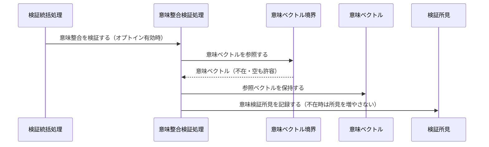
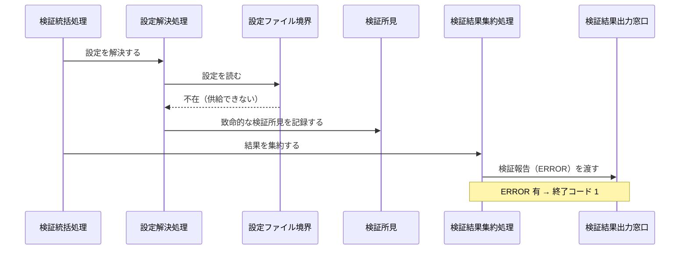
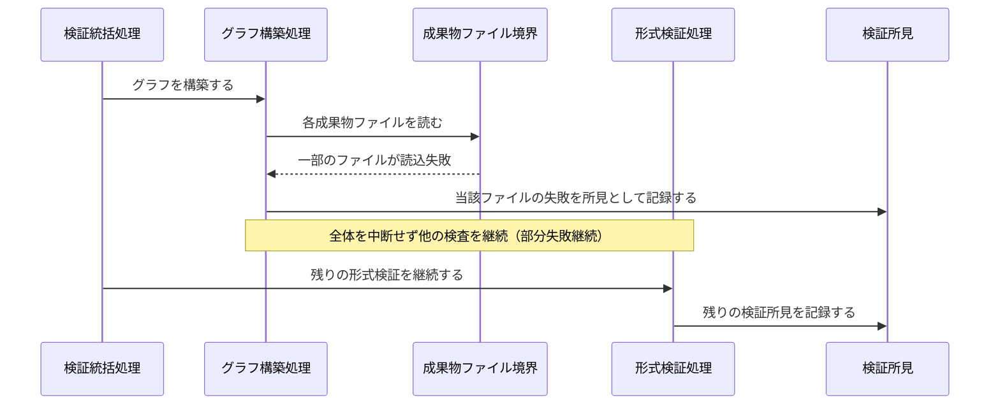

Document ID: SEQA-LGX-001

# SEQA-LGX-001: グラフ読み込みと検証 のドメイン相互作用

**親 RBA**: RBA-LGX-001
**親 UC**: UC-LGX-001
**レイヤ**: 抽象側（ドメインレベル、言語非依存）

> **記述規律**: RBA-LGX-001 で識別したドメイン主語をレーンとして、UC-LGX-001 のフロー（基本/代替/例外）を時系列で展開する。メッセージは自然言語（ドメイン語彙）。関数名・API 名・引数型・言語固有同期機構は書かない（`04-iconix-layer.md` §4）。本 SEQA は UC ⇄ RBA ⇄ SEQA の Jacobson 流三者整合性を確定する。

---

## 1. UC text（並列配置）

UC-LGX-001 基本フロー（SEQA メッセージと 1:1 対応）:

```
1. アクターが `legixy check --formal` を実行する
2. システムが `.legixy.toml` を読み込み、設定を解析する
3. システムが `graph.toml` を読み込み、有向グラフをメモリ上に構築する
4. システムが形式検証を実行する（a:ID形式 / b:ファイル存在 / c:Document ID / d:チェーン整合 / e:孤立ファイル / f:DAG / g-i:オプトイン意味検証）
5. システムが検証結果を出力する（ERROR / WARNING / INFO / OK）
6. ERROR が 0 件の場合、終了コード 0 を返す
（代替 2a/3a: 設定/グラフ不在 → ERROR 報告して終了。代替 4a: --formal 無で意味検証追加）
```

## 2. 基本フロー（`check --formal`）

```mermaid
sequenceDiagram
    actor Actor as 開発者 / CI システム
    participant B1 as 検証コマンド受付窓口
    participant C0 as 検証統括処理
    participant C1 as 設定解決処理
    participant Bcfg as 設定ファイル境界
    participant Ecfg as 検証設定
    participant C2 as グラフ構築処理
    participant Bgraph as グラフ定義境界
    participant Egraph as 有向グラフ
    participant C3 as 形式検証処理
    participant Efind as 検証所見
    participant C5 as 検証結果集約処理
    participant Ereport as 検証報告
    participant B2 as 検証結果出力窓口

    Actor->>B1: 検証を要求する（--formal）
    B1->>C0: 検証を統括する
    C0->>C1: 設定を解決する
    C1->>Bcfg: 設定を読む
    Bcfg-->>C1: 設定内容
    C1->>Ecfg: 検証設定を確定する
    C0->>C2: グラフを構築する
    C2->>Bgraph: グラフ定義と成果物ファイルを読む
    Bgraph-->>C2: 定義内容
    C2->>Egraph: 有向グラフを構築する（未解決エッジは記録）
    C0->>C3: 形式検証する
    C3->>Egraph: グラフと検証設定を照合する
    C3->>Efind: 検証所見を記録する
    C0->>C5: 結果を集約する
    C5->>Efind: 検証所見を集約する
    C5->>Ereport: 検証報告を作る（区分別件数・成否）
    C5->>B2: 検証報告を渡す
    B2-->>Actor: 検証報告（ERROR/WARNING/INFO/OK）+ 終了コード
```

## 3. 代替フロー

### 代替 4a: 無印 `check`（意味整合検証を追加）



### 代替 2a / 3a: 設定 / グラフ不在



## 4. 例外フロー

### 例外: 一部成果物ファイルの読込失敗（部分失敗継続）



## 5. 並行性（概念レベル）

`check` は読み取り専用の判定であり、ドメインレベルで並行に発生する事象はない（各検証処理は検証統括処理の協調下で逐次進む）。並行アクセス時の整合性は検証対象外（NFR-LGX-001.REL.07/08 の射程）。

## 6. 整合性確認

- [x] 各メッセージがドメイン語彙で書かれている（関数名・API 名・型なし）
- [x] レーンが RBA-LGX-001 の主語と一致する（クラス名混入なし）
- [x] UC-LGX-001 の基本（Step1-6）/ 代替（2a/3a/4a）/ 例外（部分失敗継続）フローを網羅
- [x] Noun-Verb ルール遵守（Actor⇄Boundary / Boundary⇄Control / Control⇄Control / Control⇄Entity のみ。Boundary 同士・Entity 同士・Boundary→Entity・Actor→内部 の直接通信なし）

## 7. コントローラ責務と実行操作の整合（§4.4）

| Control レーン | 概念名が示す責務 | 実行する操作 | 整合 |
|---|---|---|---|
| 検証統括処理 | 検証フロー全体の協調・部分失敗継続 | 各処理を順に依頼、結果集約を依頼 | ✓ |
| 設定解決処理 | 設定の解決 | 設定ファイル境界を読み検証設定を確定 | ✓（結果集約等の越権なし） |
| グラフ構築処理 | グラフ構築 | グラフ定義/成果物を読み有向グラフを構築 | ✓ |
| 形式検証処理 | 形式整合性の検査 | グラフ/設定を照合し検証所見を記録 | ✓ |
| 意味整合検証処理 | 意味整合性の検査 | 意味ベクトルを参照し検証所見を記録 | ✓ |
| 検証結果集約処理 | 所見集約・成否確定 | 検証所見を集約し検証報告を作り出力へ渡す | ✓ |

余剰操作なし（各操作が UC ステップに対応）。Control 間メッセージ（統括 → 各処理）が UC の振る舞いを実現。

## 8. Jacobson 流三者整合性（UC ⇄ RBA ⇄ SEQA、§11.1）— 確定

| 検査 | 確認内容 | 結果 |
|---|---|---|
| UC ⇄ RBA | UC-001 各ステップが RBA-001 フローに 1:1 対応（RBA-001 §5） | ✓ |
| RBA ⇄ SEQA | RBA-001 の主語（B/C/E）が本 SEQA のレーンと一致、Noun-Verb ルールが SEQA でも保持（§6） | ✓ |
| UC ⇄ SEQA | UC text 並列配置（§1）、各 UC ステップが SEQA メッセージと対応（基本/代替/例外を §2-4 で網羅） | ✓ |

3 者が同じ振る舞いを動的に表現していることを確認。**これにより RBA-LGX-001 §8 の Jacobson 三者整合性「保留」が解消される。**

## 9. 履歴

| 日付 | 変更内容 |
|---|---|
| 2026-06-13 | 初版。UC-LGX-001 / RBA-LGX-001 の時系列展開。基本（check --formal）/ 代替（無印 check・設定/グラフ不在）/ 例外（部分失敗継続）を網羅。Jacobson 流三者整合性を確定（RBA-001 §8 保留解消）。Control 責務⇄操作の整合（§4.4）確認 |
