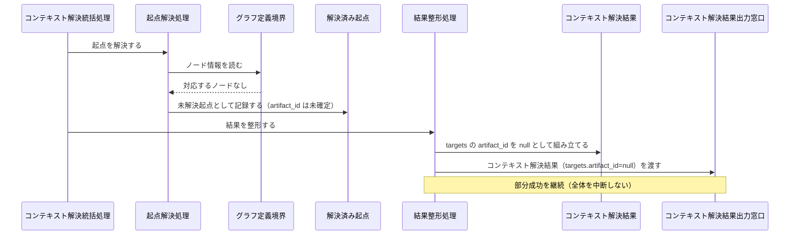
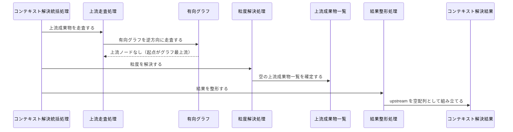
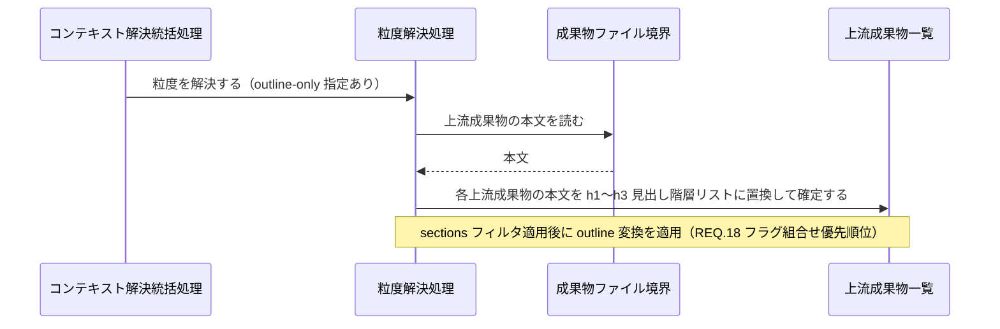
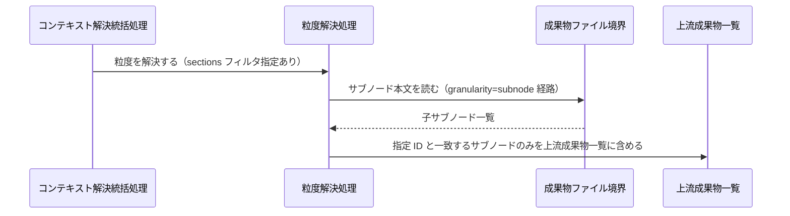
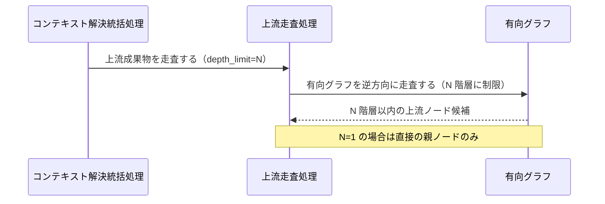
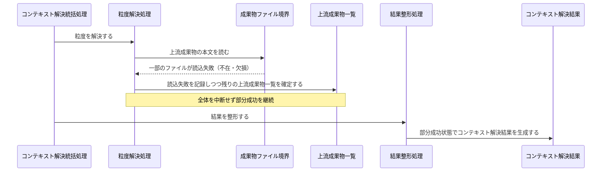
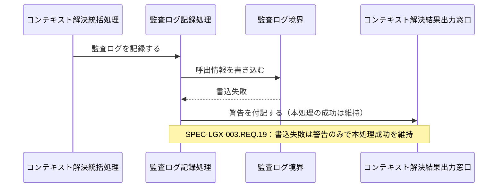
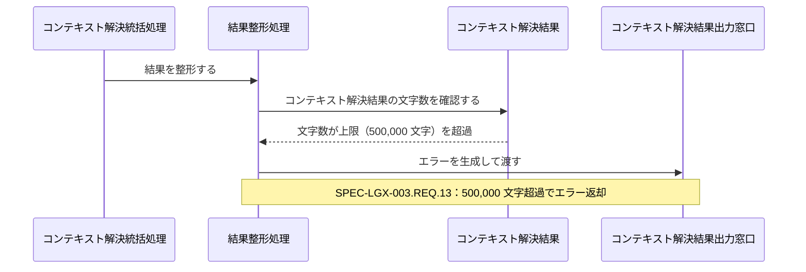

Document ID: SEQA-LGX-002

# SEQA-LGX-002: コンテキスト解決 のドメイン相互作用

**親 RBA**: RBA-LGX-002
**親 UC**: UC-LGX-002
**レイヤ**: 抽象側（ドメインレベル、言語非依存）

> **記述規律**: RBA-LGX-002 で識別したドメイン主語をレーンとして、UC-LGX-002 のフロー（基本/代替/例外）を時系列で展開する。メッセージは自然言語（ドメイン語彙）。関数名・API 名・引数型・言語固有同期機構は書かない（`04-iconix-layer.md` §4）。本 SEQA は UC ⇄ RBA ⇄ SEQA の Jacobson 流三者整合性を確定する。

---

## 1. UC text（並列配置）

UC-LGX-002 基本フロー（SEQA メッセージと 1:1 対応）:

```
1. アクターが `legixy context <files> [--command <intent>]` を実行する
2. システムがファイルパスから対応する成果物 ID を逆引きする（resolver）
3. システムが成果物 ID から有向グラフを逆方向に走査し、上流成果物を収集する
4. システムがレイヤールールに基づくガイドライン文書を解決する
5. システムがカスタムエッジに基づく追加文書を解決する
6. システムが結果を ContextResult として返却する（targets / upstream / layer_documents / custom_documents）
7. システムが context_log に監査ログを記録する
（代替 2a: ファイルがどのノードにも対応しない → targets の artifact_id を null として返す）
（代替 3a: 上流成果物が存在しない → upstream を空配列として返す）
（代替 4-A: --outline-only 指定 → upstream の各本文を見出し階層リストに置換）
（代替 4-B: --sections <ids> 指定 → 指定 ID と一致するサブノードのみを upstream に含める）
（代替 4-C: --depth N 指定 → 上流走査を N 階層に制限）
```

## 2. 基本フロー（`context <files>`）

```mermaid
sequenceDiagram
    actor Actor as Claude Code / 開発者
    participant B受付 as コンテキスト解決コマンド受付窓口
    participant C統括 as コンテキスト解決統括処理
    participant C起点 as 起点解決処理
    participant Bグラフ定義 as グラフ定義境界
    participant E起点 as 解決済み起点
    participant Eグラフ as 有向グラフ
    participant C走査 as 上流走査処理
    participant C粒度 as 粒度解決処理
    participant B成果物 as 成果物ファイル境界
    participant E上流 as 上流成果物一覧
    participant Cガイド as レイヤーガイドライン解決処理
    participant Bガイド as レイヤーガイドライン境界
    participant Cカスタム as カスタム文書解決処理
    participant C整形 as 結果整形処理
    participant E結果 as コンテキスト解決結果
    participant C監査 as 監査ログ記録処理
    participant B監査 as 監査ログ境界
    participant B出力 as コンテキスト解決結果出力窓口

    Actor->>B受付: コンテキスト解決を要求する（files・オプション）
    B受付->>C統括: コンテキスト解決を統括する
    C統括->>C起点: 起点を解決する
    C起点->>Bグラフ定義: ノード情報を読む
    Bグラフ定義-->>C起点: ノード・エッジ情報
    C起点->>E起点: 解決済み起点を確定する（未解決起点も記録）
    C統括->>C走査: 上流成果物を走査する
    C走査->>Eグラフ: 有向グラフを逆方向に走査する
    Eグラフ-->>C走査: 上流ノード候補
    C統括->>C粒度: 粒度を解決する
    C粒度->>B成果物: 上流成果物の本文を読む
    B成果物-->>C粒度: 本文（不在・欠損も許容）
    C粒度->>E上流: 上流成果物一覧を確定する（chain_distance 順・決定論的整列）
    C統括->>Cガイド: レイヤーガイドラインを解決する
    Cガイド->>Bガイド: レイヤーに対応するガイドライン文書を取得する
    Bガイド-->>Cガイド: ガイドライン文書（辞書順）
    C統括->>Cカスタム: カスタム文書を解決する
    Cカスタム->>Bグラフ定義: カスタムエッジ情報を取得する
    Bグラフ定義-->>Cカスタム: カスタムエッジ文書（辞書順）
    C統括->>C整形: 結果を整形する
    C整形->>E上流: 上流成果物一覧を参照する
    C整形->>E結果: コンテキスト解決結果を生成する（6 セクション・決定論的順序）
    C整形->>B出力: コンテキスト解決結果を渡す
    C統括->>C監査: 監査ログを記録する
    C監査->>E結果: 確定済みコンテキスト解決結果を参照する
    C監査->>B監査: 呼出情報を書き込む（ベストエフォート）
    B出力-->>Actor: コンテキスト解決結果（6 セクション）
```

## 3. 代替フロー

### 代替 2a: ファイルがどのノードにも対応しない



### 代替 3a: 上流成果物が存在しない



### 代替 4-A: `--outline-only` 指定（見出し変換）



### 代替 4-B: `--sections <ids>` 指定（サブノード絞り込み）



### 代替 4-C: `--depth N` 指定（走査階層制限）



## 4. 例外フロー

### 例外: 成果物ファイル読込失敗（部分成功継続）



### 例外: 監査ログ書込失敗（ベストエフォート）



### 例外: 返却本文が上限を超過（大規模返却エラー）



## 5. 並行性（概念レベル）

`context` はファイルパスから上流を解決する読み取り中心の処理である。ドメインレベルで並行に発生する事象はない（各処理はコンテキスト解決統括処理の協調下で逐次進む）。なお SPEC-LGX-003.REQ.09 が並行実行時の安全性を別途規定しているが、これは NFR 射程であり本 SEQA の範囲外。

## 6. 整合性確認

- [x] 各メッセージがドメイン語彙で書かれている（関数名・API 名・型なし）
- [x] レーンが RBA-LGX-002 の主語と一致する（クラス名混入なし）
- [x] UC-LGX-002 の基本（Step1-7）/ 代替（2a/3a/4-A/4-B/4-C）/ 例外（部分成功継続・監査ログ書込失敗・大規模返却エラー）フローを網羅
- [x] Noun-Verb ルール遵守（Actor⇄Boundary / Boundary⇄Control / Control⇄Control / Control⇄Entity のみ。Boundary 同士・Entity 同士・Boundary→Entity・Actor→内部 の直接通信なし）

## 7. コントローラ責務と実行操作の整合（§4.4）

| Control レーン | 概念名が示す責務 | 実行する操作 | 整合 |
|---|---|---|---|
| コンテキスト解決統括処理 | コンテキスト解決全体の協調・部分成功継続 | 起点解決・上流走査・粒度解決・ガイドライン解決・カスタム文書解決・結果整形・監査ログ記録を順に依頼 | ✓ |
| 起点解決処理 | ファイルパスからノードへの逆引き | グラフ定義境界を参照し解決済み起点を確定（未解決起点も記録） | ✓（結果整形等の越権なし） |
| 上流走査処理 | 有向グラフの逆方向走査 | 有向グラフを逆方向に走査し上流ノード候補を収集（depth_limit 適用） | ✓ |
| 粒度解決処理 | 上流成果物の本文確定・フィルタ・変換 | 成果物ファイル境界から本文を取得し sections フィルタ・outline 変換を適用して上流成果物一覧を確定 | ✓ |
| レイヤーガイドライン解決処理 | レイヤー対応ガイドライン取得 | レイヤーガイドライン境界を参照し辞書順で整列 | ✓ |
| カスタム文書解決処理 | カスタムエッジ文書取得 | グラフ定義境界からカスタムエッジ情報を取得し辞書順で整列 | ✓ |
| 結果整形処理 | 6 セクション組み立て・上限検査 | 上流成果物一覧と各ガイドライン部分を合成しコンテキスト解決結果を生成。文字数上限超過時はエラーを生成 | ✓ |
| 監査ログ記録処理 | 呼出情報の書込（ベストエフォート） | コンテキスト解決結果確定後に監査ログ境界へ書き込む。書込失敗は警告として記録し本処理の成功を維持 | ✓ |

余剰操作なし（各操作が UC ステップに対応）。Control 間メッセージ（統括 → 各処理）が UC の振る舞いを実現。

## 8. Jacobson 流三者整合性（UC ⇄ RBA ⇄ SEQA、§11.1）— 確定

| 検査 | 確認内容 | 結果 |
|---|---|---|
| UC ⇄ RBA | UC-002 各ステップが RBA-002 フローに 1:1 対応（RBA-002 §5） | ✓ |
| RBA ⇄ SEQA | RBA-002 の主語（B 7 / C 7 / E 4）が本 SEQA のレーンと一致、Noun-Verb ルールが SEQA でも保持（§6） | ✓ |
| UC ⇄ SEQA | UC text 並列配置（§1）、各 UC ステップが SEQA メッセージと対応（基本/代替/例外を §2-4 で網羅） | ✓ |

3 者が同じ振る舞いを動的に表現していることを確認。**これにより RBA-LGX-002 §8 の Jacobson 三者整合性「保留」が解消される。**

## 9. 履歴

| 日付 | 変更内容 |
|---|---|
| 2026-06-13 | 初版。UC-LGX-002 / RBA-LGX-002 の時系列展開。基本（context <files>）/ 代替（2a・3a・4-A・4-B・4-C）/ 例外（部分成功継続・監査ログ書込失敗・大規模返却エラー）を網羅。Jacobson 流三者整合性を確定（RBA-002 §8 保留解消）。Control 責務⇄操作の整合（§4.4）確認 |
