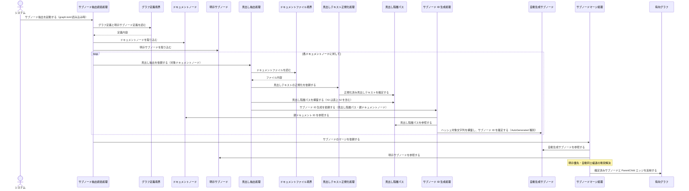
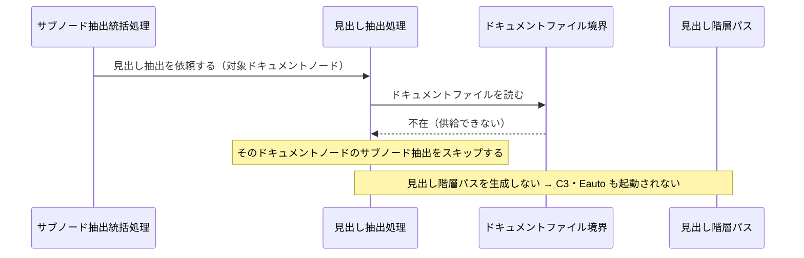
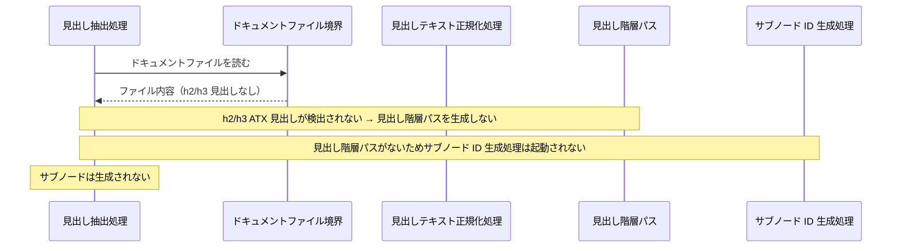
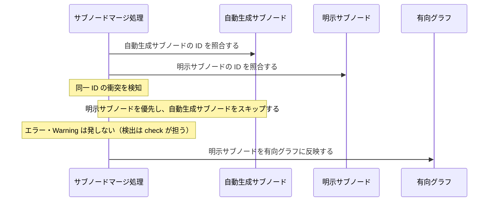
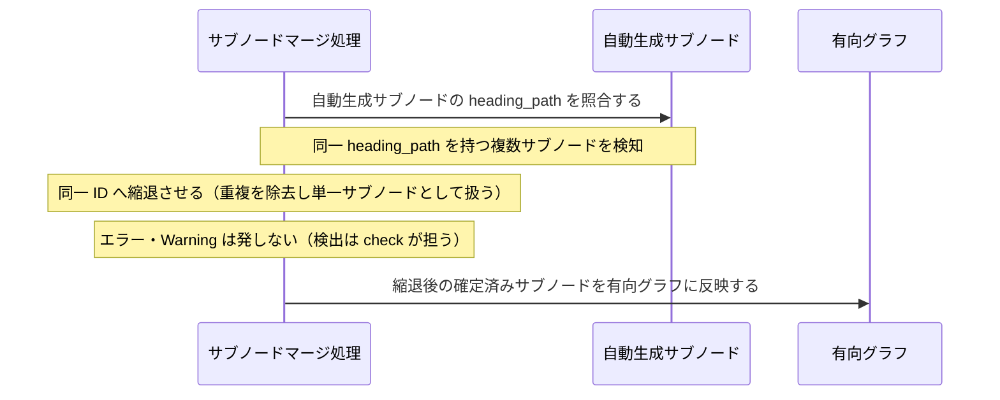

Document ID: SEQA-LGX-003

# SEQA-LGX-003: サブノード自動抽出 のドメイン相互作用

**親 RBA**: RBA-LGX-003
**親 UC**: UC-LGX-003
**レイヤ**: 抽象側（ドメインレベル、言語非依存）

> **記述規律**: RBA-LGX-003 で識別したドメイン主語をレーンとして、UC-LGX-003 のフロー（基本/代替/例外）を時系列で展開する。メッセージは自然言語（ドメイン語彙）。関数名・API 名・引数型・言語固有同期機構は書かない（`04-iconix-layer.md` §4）。本 SEQA は UC ⇄ RBA ⇄ SEQA の Jacobson 流三者整合性を確定する。UC-LGX-003 はアクター=システム（graph.toml 読み込み時に自動実行）の自動処理型 UC であり、CLI 窓口を持たない内部起動パターンを取る（RBA-LGX-003 §4・§6 参照）。

---

## 1. UC text（並列配置）

UC-LGX-003 基本フロー（SEQA メッセージと 1:1 対応）:

```
1. システムが graph.toml を読み込む
2. 各ドキュメントノード（.md ファイル）に対して:
   a. ファイル内容を読み込む
   b. ##（h2）および ###（h3）の ATX 見出しを抽出する
   c. 各見出しテキストを正規化する（トリム + 連続空白統合）
   d. 見出し階層パスを構築する（h3 は直上の h2 を含む）
   e. ハッシュ対象文字列「親ID|見出し1|見出し2」を構築する
   f. SHA-256 の先頭 16 文字（hex）でサブノード ID を生成する
   g. サブノードをグラフに追加する（AutoGenerated 種別）
   h. 親 → サブノードの ParentChild エッジを自動生成する
3. graph.toml で明示定義されたサブノード（#s: 接頭辞）もマージする
4. 全サブノードの ID 一意性を担保する（SUBNODE-INV-3）:
   明示サブノードとの衝突は生成スキップ（明示優先）、
   自動生成同士の同一 heading_path は同一 ID へ縮退する。
   生成段階ではエラー・Warning を発しない。
（代替 2a: ファイル不在 → そのノードのサブノード抽出をスキップ）
（代替 2b: h2/h3 見出しなし → サブノードは生成されない）
（代替 3a: 明示サブノードと自動生成サブノードの ID 衝突 → 明示側を優先）
```

## 2. 基本フロー（graph.toml 読み込み時の自動サブノード抽出）



## 3. 代替フロー

### 代替 2a: ドキュメントファイルが存在しない場合



### 代替 2b: h2/h3 見出しが存在しない場合



### 代替 3a: 明示サブノードと自動生成サブノードの ID 衝突



## 4. 例外フロー

### 例外: 自動生成サブノード同士の heading_path 一致（同一 ID 縮退）



## 5. 並行性（概念レベル）

自動処理型 UC であり、graph.toml 読み込み処理の内部イベントとして逐次実行される。各ドキュメントノードに対する見出し抽出処理はドメインレベルで順次実行（サブノード抽出統括処理の協調下）。マージ段階では全ドキュメントノードの処理完了後に一括適用される。並行アクセス時の整合性は本 UC の射程外（NFR 層の責務）。

## 6. 整合性確認

- [x] 各メッセージがドメイン語彙で書かれている（関数名・API 名・型なし）
- [x] レーンが RBA-LGX-003 の主語と一致する（Boundary 2: グラフ定義境界・ドキュメントファイル境界 / Control 5: サブノード抽出統括処理・見出し抽出処理・見出しテキスト正規化処理・サブノード ID 生成処理・サブノードマージ処理 / Entity 5: ドキュメントノード・見出し階層パス・自動生成サブノード・明示サブノード・有向グラフ）
- [x] UC-LGX-003 の基本（Step1-4）/ 代替（2a/2b/3a）/ 例外（自動同士縮退）フローを網羅
- [x] Noun-Verb ルール遵守（Actor⇄Control / Boundary⇄Control / Control⇄Control / Control⇄Entity のみ。Boundary 同士・Entity 同士・Boundary→Entity・Actor→Entity の直接通信なし）

## 7. コントローラ責務と実行操作の整合（§4.4）

| Control レーン | 概念名が示す責務 | 実行する操作 | 整合 |
|---|---|---|---|
| サブノード抽出統括処理 | 全ドキュメントノードの処理協調・マージ依頼 | グラフ定義境界を読みドキュメントノード・明示サブノードを取り込む、各ノードに見出し抽出処理を起動、マージを依頼 | ✓ |
| 見出し抽出処理 | ドキュメントから h2/h3 見出しの抽出・階層パス構築 | ドキュメントファイル境界を読み、正規化処理に依頼し、見出し階層パスを構築し、ID 生成処理に依頼 | ✓（ID 生成・マージは行わない） |
| 見出しテキスト正規化処理 | 見出しテキストの正規化確定 | 見出し階層パスの各テキストを正規化し確定する | ✓（抽出・生成越権なし） |
| サブノード ID 生成処理 | 見出し階層パスと親 ID からサブノード ID を確定 | 親ドキュメント ID と見出し階層パスを参照し、ハッシュ対象文字列を構築し、自動生成サブノードの ID を確定する | ✓（マージ・グラフ更新は行わない） |
| サブノードマージ処理 | 自動生成と明示サブノードの統合・衝突解決・グラフ反映 | 自動生成サブノードと明示サブノードを照合し、明示優先・縮退解決後に有向グラフへ反映する | ✓（見出し抽出・ID 生成越権なし） |

余剰操作なし（各操作が UC ステップに対応）。Control 間メッセージがUC の振る舞いを実現。

## 8. Jacobson 流三者整合性（UC ⇄ RBA ⇄ SEQA、§11.1）— 確定

| 検査 | 確認内容 | 結果 |
|---|---|---|
| UC ⇄ RBA | UC-003 各ステップが RBA-003 フローに 1:1 対応（RBA-003 §5） | ✓ |
| RBA ⇄ SEQA | RBA-003 の主語（B/C/E 計 12 主語）が本 SEQA のレーンと一致、Noun-Verb ルールが SEQA でも保持（§6） | ✓ |
| UC ⇄ SEQA | UC text 並列配置（§1）、各 UC ステップが SEQA メッセージと対応（基本/代替/例外を §2-4 で網羅） | ✓ |

3 者が同じ振る舞いを動的に表現していることを確認。**これにより RBA-LGX-003 §8 の Jacobson 三者整合性「保留」が解消される。**

自動処理型パターン（Actor → Control 直結、Boundary 窓口なし）について: RBA-LGX-003 §4・§6 で記録済みの正規パターンであり、SEQA でも同様に Actor → サブノード抽出統括処理 への直接起動として表現した。Noun-Verb 遵守上の違反でなく自動処理型 UC の正規展開形式。

## 9. 履歴

| 日付 | 変更内容 |
|---|---|
| 2026-06-13 | 初版。UC-LGX-003 / RBA-LGX-003 の時系列展開。基本（graph.toml 読み込み時自動抽出）/ 代替（ファイル不在・見出しなし・明示優先）/ 例外（自動同士縮退）を網羅。Jacobson 流三者整合性を確定（RBA-003 §8 保留解消）。Control 責務⇄操作の整合（§4.4）確認 |
