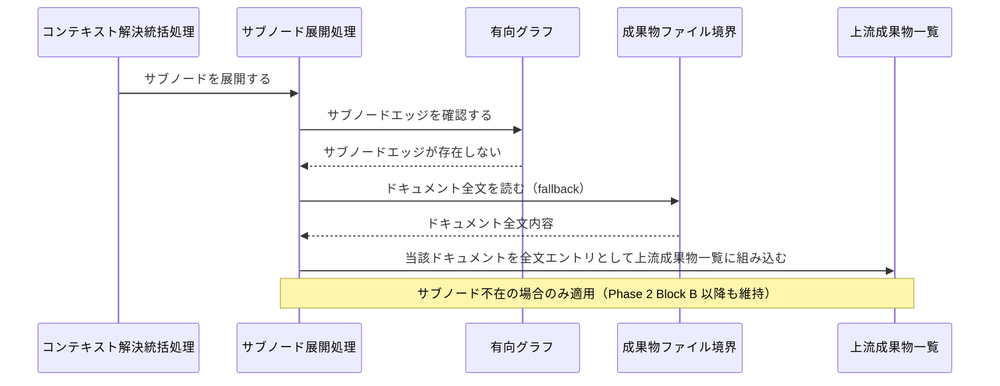
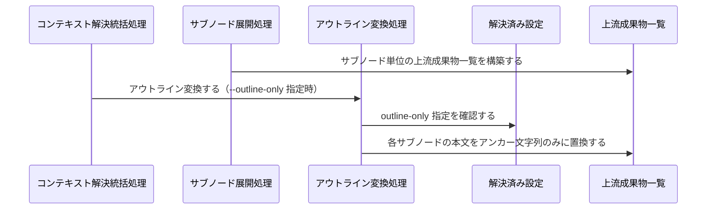
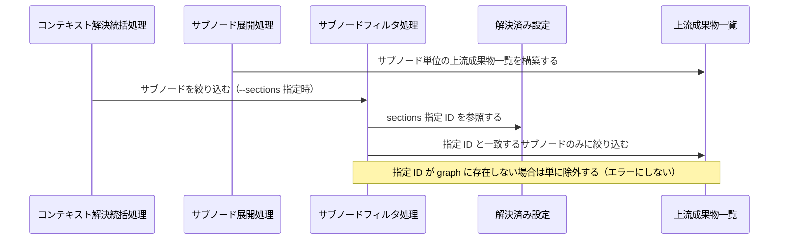
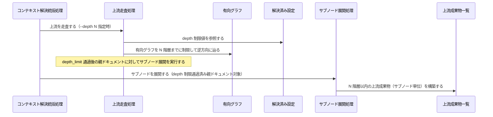
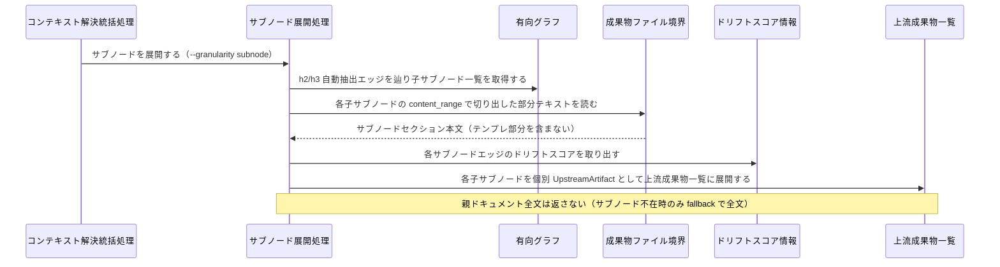
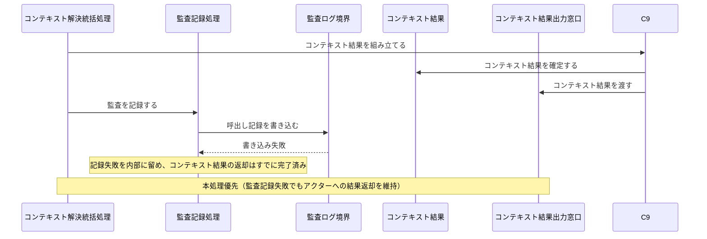

Document ID: SEQA-LGX-004

# SEQA-LGX-004: 粒度制御付きコンテキスト解決 のドメイン相互作用

**親 RBA**: RBA-LGX-004
**親 UC**: UC-LGX-004
**レイヤ**: 抽象側（ドメインレベル、言語非依存）

> **記述規律**: RBA-LGX-004 で識別したドメイン主語をレーンとして、UC-LGX-004 のフロー（基本/代替/例外）を時系列で展開する。メッセージは自然言語（ドメイン語彙）。関数名・API 名・引数型・言語固有同期機構は書かない（`04-iconix-layer.md` §4）。本 SEQA は UC ⇄ RBA ⇄ SEQA の Jacobson 流三者整合性を確定する。

---

## 1. UC text（並列配置）

UC-LGX-004 基本フロー（SEQA メッセージと 1:1 対応）:

```
1. アクターが `legixy context <files> --granularity subnode` を実行する
2. UC-LGX-002 の基本フロー 2〜5 と同様に上流成果物を解決する
   （設定解決 → 成果物 ID 逆引き → 上流走査 → ガイドライン解決 → カスタム文書解決）
3. 上流成果物がサブノードを持つ場合:
   a. 対象ファイルからサブノードへのエッジを辿り、関連サブノードを特定する
   b. 各サブノードの本文（該当セクションのみ）を抽出する
   c. ドリフトスコア（エッジごと）を付与する
4. 結果の UpstreamArtifact に subnode_id, anchor, content, drift_score を含めて返却する
（代替 1a: --granularity document 時は UC-LGX-002 と同一動作。
  代替 3a: サブノード不在の上流成果物はドキュメント全体として返却（fallback）。
  代替 4-A: --outline-only 指定時は各サブノード artifact の body はアンカー文字列のみ。
  代替 4-B: --sections <ids> 指定時は一致するサブノードのみ。
  代替 4-C: --depth N 指定時は上流走査を N 階層に制限。
  代替 4-D: --granularity subnode 時は子サブノードを個別 UpstreamArtifact として展開）
（事後条件: 監査ログ記録。記録失敗でも結果返却を維持）
```

## 2. 基本フロー（`context <files> --granularity subnode`）

```mermaid
sequenceDiagram
    actor Actor as Claude Code / 開発者
    participant B1 as 粒度制御コマンド受付窓口
    participant C0 as コンテキスト解決統括処理
    participant C1 as 設定解決処理
    participant Bcfg as 設定ファイル境界
    participant Ecfg as 解決済み設定
    participant C2 as 成果物 ID 逆引き処理
    participant Bgraph as グラフ定義境界
    participant Egraph as 有向グラフ
    participant C3 as 上流走査処理
    participant C4 as サブノード展開処理
    participant Bfile as 成果物ファイル境界
    participant Eupstream as 上流成果物一覧
    participant Edrift as ドリフトスコア情報
    participant C7 as ガイドライン解決処理
    participant Eguide as ガイドライン文書
    participant C8 as カスタム文書解決処理
    participant Ecustom as カスタム文書
    participant C9 as コンテキスト結果組立処理
    participant Eresult as コンテキスト結果
    participant C10 as 監査記録処理
    participant Blog as 監査ログ境界
    participant B2 as コンテキスト結果出力窓口

    Actor->>B1: コンテキスト解決を要求する（--granularity subnode）
    B1->>C0: 粒度制御付きコンテキスト解決を統括する
    C0->>C1: 設定を解決する
    C1->>Bcfg: 設定を読む
    Bcfg-->>C1: 設定内容（粒度・フラグ類を含む）
    C1->>Ecfg: 解決済み設定を確定する
    C0->>C2: 成果物 ID を逆引きする
    C2->>Bgraph: グラフ定義を読む
    Bgraph-->>C2: グラフ定義内容
    C2->>Egraph: 有向グラフを構築する
    C2->>Ecfg: 解決済み設定を参照する
    C0->>C3: 上流を走査する
    C3->>Egraph: 有向グラフを逆方向に辿る
    C3->>Ecfg: depth 制限を参照する
    C0->>C4: サブノードを展開する
    C4->>Egraph: サブノードエッジを辿り関連サブノードを特定する
    C4->>Bfile: 各サブノードセクションの本文を読む
    Bfile-->>C4: セクション本文
    C4->>Edrift: ドリフトスコアをエッジから取り出す
    C4->>Eupstream: サブノード単位の上流成果物一覧を構築する（ドリフトスコア付属）
    C0->>C7: ガイドラインを解決する
    C7->>Bgraph: グラフ定義を参照する
    C7->>Ecfg: 解決済み設定を参照する
    C7->>Eguide: ガイドライン文書を確定する
    C0->>C8: カスタム文書を解決する
    C8->>Egraph: カスタムエッジを辿る
    C8->>Bfile: カスタム文書ファイルを読む
    Bfile-->>C8: カスタム文書内容
    C8->>Ecustom: カスタム文書を確定する
    C0->>C9: コンテキスト結果を組み立てる
    C9->>Eupstream: 上流成果物一覧を読む
    C9->>Eguide: ガイドライン文書を読む
    C9->>Ecustom: カスタム文書を読む
    C9->>Eresult: コンテキスト結果を確定する（決定論的順序）
    C9->>B2: コンテキスト結果を渡す
    C0->>C10: 監査を記録する
    C10->>Eresult: 呼出し情報を取り出す
    C10->>Blog: 呼出し記録を書き込む
    B2-->>Actor: コンテキスト結果（subnode_id・anchor・content・drift_score 付き）
```

## 3. 代替フロー

### 代替 1a: `--granularity document`（デフォルト、UC-LGX-002 相当動作）

```mermaid
sequenceDiagram
    actor Actor as Claude Code / 開発者
    participant B1 as 粒度制御コマンド受付窓口
    participant C0 as コンテキスト解決統括処理
    participant Ecfg as 解決済み設定
    participant C3 as 上流走査処理
    participant Egraph as 有向グラフ
    participant Eupstream as 上流成果物一覧
    participant C9 as コンテキスト結果組立処理
    participant Eresult as コンテキスト結果
    participant B2 as コンテキスト結果出力窓口

    Actor->>B1: コンテキスト解決を要求する（--granularity document）
    B1->>C0: ドキュメント粒度でコンテキスト解決を統括する
    C0->>Ecfg: 解決済み設定（粒度=document）を参照する
    Note over C0: サブノード展開処理・サブノードフィルタ処理・アウトライン変換処理は起動しない
    C0->>C3: 上流を走査する（UC-LGX-002 基本フロー相当）
    C3->>Egraph: 有向グラフを逆方向に辿る
    C3->>Eupstream: ドキュメント全文単位の上流成果物一覧を構築する
    C0->>C9: コンテキスト結果を組み立てる
    C9->>Eupstream: 上流成果物一覧を読む
    C9->>Eresult: コンテキスト結果を確定する
    C9->>B2: コンテキスト結果を渡す
    B2-->>Actor: コンテキスト結果（ドキュメント全文）
```

### 代替 3a: サブノード不在時の fallback（ドキュメント全体を返却）



### 代替 4-A: `--outline-only`（アンカー文字列のみ返却）



### 代替 4-B: `--sections <ids>`（指定サブノードのみ絞り込み）



### 代替 4-C: `--depth N`（上流走査を N 階層に制限）



### 代替 4-D: `--granularity subnode` 時の子サブノード個別展開



## 4. 例外フロー

### 例外: 監査記録失敗（本処理結果の返却を優先）



### 例外: 設定ファイル不在

```mermaid
sequenceDiagram
    participant C0 as コンテキスト解決統括処理
    participant C1 as 設定解決処理
    participant Bcfg as 設定ファイル境界
    participant B2 as コンテキスト結果出力窓口
    actor Actor as Claude Code / 開発者

    C0->>C1: 設定を解決する
    C1->>Bcfg: 設定を読む
    Bcfg-->>C1: 不在（供給できない）
    C1->>C0: 設定解決失敗を通知する
    C0->>B2: エラー報告を渡す
    B2-->>Actor: エラー報告（設定ファイル不在）
```

## 5. 並行性（概念レベル）

`context` はコンテキスト解決のワークフローであり、ドメインレベルで並行に発生する事象はない（設定解決 → ID 逆引き → 上流走査 → サブノード展開 → フィルタ/変換 → ガイドライン解決 → カスタム文書解決 → 結果組立 → 監査記録は、コンテキスト解決統括処理の協調下で逐次進む）。ファイル I/O の実装レベル並列化は DD 以降の関心事。

## 6. 整合性確認

- [x] 各メッセージがドメイン語彙で書かれている（関数名・API 名・型・`async`/`await`/`Result<T,E>` なし）
- [x] レーンが RBA-LGX-004 の主語と一致する（クラス名混入なし。RBA の Boundary 6・Control 10・Entity 7 を使用）
- [x] UC-LGX-004 の基本（Step1-4）/ 代替（1a/3a/4-A/4-B/4-C/4-D）/ 例外（監査記録失敗・設定ファイル不在）フローを網羅
- [x] Noun-Verb ルール遵守（Actor⇄Boundary / Boundary⇄Control / Control⇄Control / Control⇄Entity のみ。Boundary 同士・Entity 同士・Boundary→Entity・Actor→内部 の直接通信なし）

## 7. コントローラ責務と実行操作の整合（§4.4）

| Control レーン | 概念名が示す責務 | 実行する操作 | 整合 |
|---|---|---|---|
| コンテキスト解決統括処理 | 粒度制御付きコンテキスト解決フロー全体の協調 | 各処理を順に依頼し結果組立・監査記録を協調させる | ✓ |
| 設定解決処理 | 設定の解決 | 設定ファイル境界を読み解決済み設定を確定する | ✓（結果組立等の越権なし） |
| 成果物 ID 逆引き処理 | ファイルパスと成果物 ID の対応解決 | グラフ定義境界を読み有向グラフを構築し解決済み設定を参照する | ✓ |
| 上流走査処理 | 上流成果物候補集合の収集（depth 制限あり） | 有向グラフを逆方向に辿り depth 制限を適用する | ✓ |
| サブノード展開処理 | 上流成果物のサブノード単位への展開・ドリフトスコア付与 | サブノードエッジを辿り成果物ファイル境界からセクション本文を取り出しドリフトスコアを付属させて上流成果物一覧を構築する（サブノード不在時は fallback で全文） | ✓ |
| サブノードフィルタ処理 | sections 指定によるサブノード絞り込み | 解決済み設定の sections 指定を参照して上流成果物一覧を絞り込む | ✓ |
| アウトライン変換処理 | outline-only 指定による本文のアンカー文字列化 | 解決済み設定の outline-only 指定を参照して上流成果物一覧の各本文を置換する | ✓ |
| ガイドライン解決処理 | ガイドライン文書の確定 | グラフ定義境界と解決済み設定を参照してガイドライン文書を確定する | ✓ |
| カスタム文書解決処理 | カスタムエッジ由来の追加文書解決 | 有向グラフのカスタムエッジを辿り成果物ファイル境界からカスタム文書を確定する | ✓ |
| コンテキスト結果組立処理 | 決定論的なコンテキスト結果の確定 | 上流成果物一覧・ガイドライン文書・カスタム文書を規定のセクション順序に従って組み立てコンテキスト結果出力窓口に渡す | ✓ |
| 監査記録処理 | 呼出し記録の書き込み（本処理優先） | コンテキスト結果の呼出し情報を監査ログ境界に書き込む（失敗時も結果返却を維持） | ✓ |

余剰操作なし（各操作が UC ステップに対応）。Control 間メッセージ（統括 → 各処理）が UC の振る舞いを実現。

## 8. Jacobson 流三者整合性（UC ⇄ RBA ⇄ SEQA、§11.1）— 確定

| 検査 | 確認内容 | 結果 |
|---|---|---|
| UC ⇄ RBA | UC-LGX-004 各ステップが RBA-LGX-004 フローに 1:1 対応（RBA-LGX-004 §5） | ✓ |
| RBA ⇄ SEQA | RBA-LGX-004 の主語（Boundary 6・Control 10・Entity 7）が本 SEQA のレーンと一致、Noun-Verb ルールが SEQA でも保持（§6） | ✓ |
| UC ⇄ SEQA | UC text 並列配置（§1）、各 UC ステップが SEQA メッセージと対応（基本/代替/例外を §2-4 で網羅） | ✓ |

3 者が同じ振る舞いを動的に表現していることを確認。**これにより RBA-LGX-004 §8 の Jacobson 三者整合性「保留」が解消される。**

## 9. 履歴

| 日付 | 変更内容 |
|---|---|
| 2026-06-13 | 初版。UC-LGX-004 / RBA-LGX-004 の時系列展開。基本（context --granularity subnode）/ 代替（1a/3a/4-A/4-B/4-C/4-D）/ 例外（監査記録失敗・設定ファイル不在）を網羅。Jacobson 流三者整合性を確定（RBA-004 §8 保留解消）。Control 責務⇄操作の整合（§4.4）確認 |
