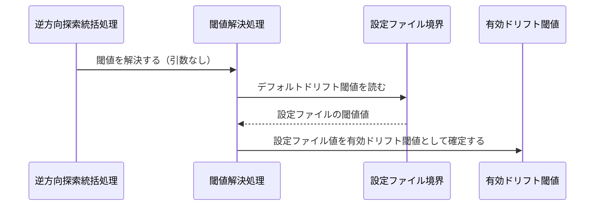
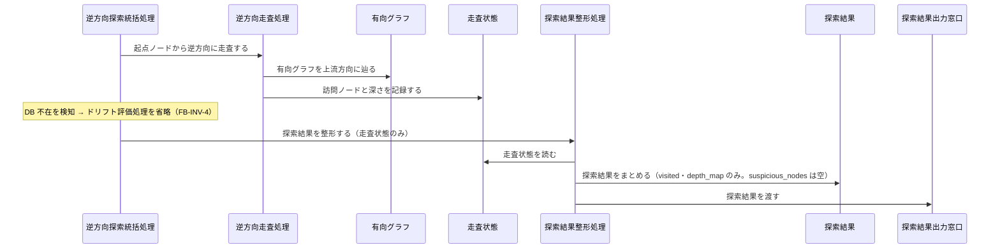
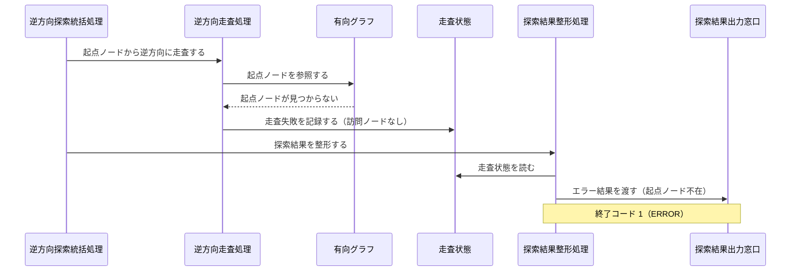

Document ID: SEQA-LGX-005

# SEQA-LGX-005: 逆方向探索 のドメイン相互作用

**親 RBA**: RBA-LGX-005
**親 UC**: UC-LGX-005
**レイヤ**: 抽象側（ドメインレベル、言語非依存）

> **記述規律**: RBA-LGX-005 で識別したドメイン主語をレーンとして、UC-LGX-005 のフロー（基本/代替/例外）を時系列で展開する。メッセージは自然言語（ドメイン語彙）。関数名・API 名・引数型・言語固有同期機構は書かない（`04-iconix-layer.md` §4）。本 SEQA は UC ⇄ RBA ⇄ SEQA の Jacobson 流三者整合性を確定する。

---

## 1. UC text（並列配置）

UC-LGX-005 基本フロー（SEQA メッセージと 1:1 対応）:

```
1. アクターが `legixy investigate <node-id> [--drift-threshold <val>]` を実行する
2. システムが起点ノードから有向グラフを逆方向（上流方向）に BFS 走査する
3. 各エッジのドリフトスコアを参照する
4. ドリフト閾値以上のエッジを「疑わしい」としてマークする
5. 結果を以下の形式で返却する:
   - visited: 走査された全ノード（走査順）
   - suspicious_nodes: ドリフト閾値以上のノード（スコア降順）
   - depth_map: 各ノードの起点からの距離
（代替 1a: --drift-threshold 未指定 → 設定ファイルのデフォルト値を使用）
（代替 3a: embedding 未生成 → ドリフトスコアなしで走査結果のみ返す）
```

## 2. 基本フロー（`investigate <node-id> --drift-threshold <val>`）

```mermaid
sequenceDiagram
    actor Actor as 開発者 / Linear Agent コンテナ
    participant B1 as 逆方向探索コマンド受付窓口
    participant C0 as 逆方向探索統括処理
    participant C1 as 閾値解決処理
    participant C2 as グラフ構築処理
    participant Bgraph as グラフ定義境界
    participant Egraph as 有向グラフ
    participant C3 as 逆方向走査処理
    participant Escan as 走査状態
    participant C4 as ドリフト評価処理
    participant Bdb as ドリフトスコア格納境界
    participant Edrift as ドリフトスコア
    participant Ethr as 有効ドリフト閾値
    participant C5 as 探索結果整形処理
    participant Eresult as 探索結果
    participant B2 as 探索結果出力窓口

    Actor->>B1: 逆方向探索を要求する（起点ノードID・閾値を指定）
    B1->>C0: 探索を統括する
    C0->>C1: 閾値を解決する
    C1->>Ethr: 要求値を有効ドリフト閾値として確定する
    C0->>C2: グラフを構築する
    C2->>Bgraph: グラフ定義を読む
    Bgraph-->>C2: 定義内容
    C2->>Egraph: 有向グラフを構築する
    C0->>C3: 起点ノードから逆方向に走査する
    C3->>Egraph: 有向グラフを上流方向に辿る
    C3->>Escan: 訪問ノードと深さを記録する
    C0->>C4: ドリフトを評価する
    C4->>Bdb: 各エッジのドリフトスコアを参照する
    Bdb-->>C4: ドリフトスコア
    C4->>Edrift: ドリフトスコアを保持する
    C4->>Ethr: 有効ドリフト閾値を参照する
    C4->>Escan: 閾値以上のノードを「疑わしい」としてマークする
    C0->>C5: 探索結果を整形する
    C5->>Escan: 走査状態を読む
    C5->>Eresult: 探索結果をまとめる（訪問ノード・疑わしいノード・深さマップ）
    C5->>B2: 探索結果を渡す
    B2-->>Actor: 探索結果（visited / suspicious_nodes / depth_map）
```

## 3. 代替フロー

### 代替 1a: `--drift-threshold` 未指定（設定ファイルのデフォルト値を使用）



### 代替 3a: embedding 未生成（ドリフトスコアなしで走査結果のみ返す）



## 4. 例外フロー

### 例外: 起点ノードがグラフ上に存在しない



## 5. 並行性（概念レベル）

`investigate` は読み取り専用の探索であり、ドメインレベルで並行に発生する事象はない（閾値解決・グラフ構築・逆方向走査・ドリフト評価・結果整形は逆方向探索統括処理の協調下で逐次進む）。グラフの状態変更は行わない（UC-005 事後条件: 読み取り専用操作）。並行アクセス時の整合性は本 UC の射程外。

## 6. 整合性確認

- [x] 各メッセージがドメイン語彙で書かれている（関数名・API 名・型なし）
- [x] レーンが RBA-LGX-005 の主語と一致する（クラス名混入なし）
- [x] UC-LGX-005 の基本（Step1-5）/ 代替（1a・3a）/ 例外（起点ノード不在）フローを網羅
- [x] Noun-Verb ルール遵守（Actor⇄Boundary / Boundary⇄Control / Control⇄Control / Control⇄Entity のみ。Boundary 同士・Entity 同士・Boundary→Entity・Actor→内部 の直接通信なし）

## 7. コントローラ責務と実行操作の整合（§4.4）

| Control レーン | 概念名が示す責務 | 実行する操作 | 整合 |
|---|---|---|---|
| 逆方向探索統括処理 | 探索フロー全体の協調・DB 不在時安全性確保（FB-INV-4） | 各処理を順に依頼、DB 不在検知時はドリフト評価処理を省略 | ✓ |
| 閾値解決処理 | 引数有無を判断し有効ドリフト閾値を確定 | 引数指定時は要求値、未指定時は設定ファイル境界を参照して閾値を確定 | ✓ |
| グラフ構築処理 | グラフ定義から有向グラフを構築 | グラフ定義境界を読み有向グラフを構築 | ✓ |
| 逆方向走査処理 | 起点ノードから上流方向 BFS 走査・深さ記録 | 有向グラフを上流方向に辿り走査状態を更新（ドリフト評価は行わない） | ✓ |
| ドリフト評価処理 | ドリフトスコア参照・疑わしいノード確定 | ドリフトスコア格納境界を参照し有効閾値と照合、走査状態に疑わしいノードをマーク（結果整形は行わない） | ✓ |
| 探索結果整形処理 | 走査状態から探索結果を組み出力窓口へ渡す | 走査状態を読み探索結果をまとめ探索結果出力窓口に渡す | ✓ |

余剰操作なし（各操作が UC ステップに対応）。Control 間メッセージ（統括 → 各処理）が UC の振る舞いを実現。

## 8. Jacobson 流三者整合性（UC ⇄ RBA ⇄ SEQA、§11.1）— 確定

| 検査 | 確認内容 | 結果 |
|---|---|---|
| UC ⇄ RBA | UC-005 各ステップが RBA-005 フローに 1:1 対応（RBA-005 §5） | ✓ |
| RBA ⇄ SEQA | RBA-005 の主語（B5/C6/E5）が本 SEQA のレーンと一致、Noun-Verb ルールが SEQA でも保持（§6） | ✓ |
| UC ⇄ SEQA | UC text 並列配置（§1）、各 UC ステップが SEQA メッセージと対応（基本/代替/例外を §2-4 で網羅） | ✓ |

3 者が同じ振る舞いを動的に表現していることを確認。**これにより RBA-LGX-005 §8 の Jacobson 三者整合性「保留」が解消される。**

## 9. 履歴

| 日付 | 変更内容 |
|---|---|
| 2026-06-13 | 初版。UC-LGX-005 / RBA-LGX-005 の時系列展開。基本（investigate --drift-threshold 指定）/ 代替（閾値未指定・embedding 未生成）/ 例外（起点ノード不在）を網羅。Jacobson 流三者整合性を確定（RBA-005 §8 保留解消）。Control 責務⇄操作の整合（§4.4）確認 |
