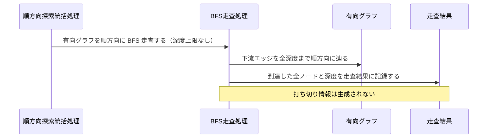

Document ID: SEQA-LGX-006

# SEQA-LGX-006: 順方向探索 のドメイン相互作用

**親 RBA**: RBA-LGX-006
**親 UC**: UC-LGX-006
**レイヤ**: 抽象側（ドメインレベル、言語非依存）

> **記述規律**: RBA-LGX-006 で識別したドメイン主語をレーンとして、UC-LGX-006 のフロー（基本/代替/例外）を時系列で展開する。メッセージは自然言語（ドメイン語彙）。関数名・API 名・引数型・言語固有同期機構は書かない（`04-iconix-layer.md` §4）。本 SEQA は UC ⇄ RBA ⇄ SEQA の Jacobson 流三者整合性を確定する。

---

## 1. UC text（並列配置）

UC-LGX-006 基本フロー（SEQA メッセージと 1:1 対応）:

```
1. アクターが `legixy impact <node-id> [--max-depth <n>]` を実行する
2. システムが起点ノードから有向グラフを順方向（下流方向）に BFS 走査する
3. `--max-depth` が指定されている場合、その深度で走査を打ち切る
4. 結果を以下の形式で返却する:
   - visited: 影響を受ける全ノード（走査順）
   - depth_map: 各ノードの起点からの距離
（代替 1a: --max-depth 未指定の場合、全深度を走査する）
（代替 2a: 起点ノードが graph.toml に存在しない場合、空の結果で exit 0）
```

## 2. 基本フロー（`impact` —max-depth 指定あり）

```mermaid
sequenceDiagram
    actor Actor as 開発者 / Linear Agent コンテナ
    participant B1 as 順方向探索コマンド受付窓口
    participant C0 as 順方向探索統括処理
    participant C1 as グラフ読み込み処理
    participant Bgraph as グラフ定義境界
    participant Egraph as 有向グラフ
    participant C2 as 起点確認処理
    participant C3 as BFS走査処理
    participant Eresult as 走査結果
    participant Etrunc as 打ち切り情報
    participant C4 as 走査結果整形処理
    participant B2 as 走査結果出力窓口

    Actor->>B1: 順方向探索を要求する（成果物 ID・最大深度指定）
    B1->>C0: 探索要求を統括する
    C0->>C1: グラフを読み込む
    C1->>Bgraph: グラフ定義を読む
    Bgraph-->>C1: グラフ定義内容
    C1->>Egraph: 有向グラフを構築する
    C0->>C2: 起点ノードの存在を確認する
    C2->>Egraph: 起点ノードを照合する
    Egraph-->>C2: 起点ノードあり（存在確認）
    C0->>C3: 有向グラフを順方向に BFS 走査する（最大深度指定あり）
    C3->>Egraph: 下流エッジを順方向に辿る
    C3->>Eresult: 到達ノードと深度を走査結果に記録する
    C3->>Etrunc: 深度超過ノードを打ち切り情報として記録する
    C0->>C4: 走査結果と打ち切り情報を整形する
    C4->>Eresult: 走査結果を読む
    C4->>Etrunc: 打ち切り情報を読む
    C4->>B2: 整形済み走査結果（visited・depth_map・打ち切り情報）を渡す
    B2-->>Actor: 走査結果 + 終了コード 0
```

## 3. 代替フロー

### 代替 1a: `--max-depth` 未指定（全深度走査）



### 代替 2a: 起点ノードが graph.toml に不在（空結果で exit 0）

```mermaid
sequenceDiagram
    participant C0 as 順方向探索統括処理
    participant C2 as 起点確認処理
    participant Egraph as 有向グラフ
    participant C3 as BFS走査処理
    participant Eresult as 走査結果
    participant C4 as 走査結果整形処理
    participant B2 as 走査結果出力窓口

    C0->>C2: 起点ノードの存在を確認する
    C2->>Egraph: 起点ノードを照合する
    Egraph-->>C2: 起点ノードなし（不在）
    C2->>C3: 起点不在を通知する
    C3->>Eresult: 空の走査結果を生成する（visited 空・depth_map 空）
    C0->>C4: 空の走査結果を整形する
    C4->>Eresult: 走査結果を読む（空）
    C4->>B2: 空の走査結果を渡す
    B2-->>Actor: 空の走査結果 + 終了コード 0
    Note over B2,Actor: 起点不在はエラーではない（SPEC-LGX-005.REQ.05）
```

## 4. 例外フロー

### 例外: グラフ定義の読込失敗

```mermaid
sequenceDiagram
    participant C0 as 順方向探索統括処理
    participant C1 as グラフ読み込み処理
    participant Bgraph as グラフ定義境界
    participant Eresult as 走査結果
    participant C4 as 走査結果整形処理
    participant B2 as 走査結果出力窓口

    C0->>C1: グラフを読み込む
    C1->>Bgraph: グラフ定義を読む
    Bgraph-->>C1: 読込失敗（graph.toml 不在または解析エラー）
    C1->>Eresult: 読込失敗を走査結果に記録する
    C0->>C4: 失敗内容を整形する
    C4->>Eresult: 走査結果を読む（失敗記録）
    C4->>B2: エラー内容を渡す
    B2-->>Actor: エラー報告 + 終了コード 1
    Note over C1,Bgraph: UC 事前条件（graph.toml 存在）が満たされない場合
```

## 5. 並行性（概念レベル）

`impact` は読み取り専用の走査であり、ドメインレベルで並行に発生する事象はない（グラフ読み込み→起点確認→BFS 走査→結果整形の各処理は順方向探索統括処理の協調下で逐次進む）。並行アクセス時の整合性は走査対象外（グラフ状態変更なし: UC-006 事後条件）。

## 6. 整合性確認

- [x] 各メッセージがドメイン語彙で書かれている（関数名・API 名・型なし）
- [x] レーンが RBA-LGX-006 の主語と一致する（クラス名混入なし）
- [x] UC-LGX-006 の基本（Step1-4）/ 代替 1a（全深度走査）/ 代替 2a（起点不在→空結果 exit 0）/ 例外（グラフ読込失敗）フローを網羅
- [x] Noun-Verb ルール遵守（Actor⇄Boundary / Boundary⇄Control / Control⇄Control / Control⇄Entity のみ。Boundary 同士・Entity 同士・Boundary→Entity・Actor→内部 の直接通信なし）

## 7. コントローラ責務と実行操作の整合（§4.4）

| Control レーン | 概念名が示す責務 | 実行する操作 | 整合 |
|---|---|---|---|
| 順方向探索統括処理 | 探索フロー全体の協調 | グラフ読み込み・起点確認・BFS 走査・結果整形を順に依頼 | ✓ |
| グラフ読み込み処理 | グラフ定義の読み込みと有向グラフ構築 | グラフ定義境界を読み有向グラフを構築 | ✓（走査・確認の越権なし） |
| 起点確認処理 | 起点ノードの存在確認 | 有向グラフに起点ノードを照合し存在有無を返す | ✓（BFS 走査の越権なし） |
| BFS 走査処理 | 有向グラフの順方向 BFS 走査・打ち切り制御 | 有向グラフを下流方向に辿り走査結果と打ち切り情報を記録 | ✓（整形・出力の越権なし） |
| 走査結果整形処理 | 走査結果の整形と出力窓口への受け渡し | 走査結果・打ち切り情報を読み走査結果出力窓口に渡す | ✓（走査の越権なし） |

余剰操作なし（各操作が UC ステップに対応）。Control 間メッセージ（統括 → 各処理）が UC の振る舞いを実現。

## 8. Jacobson 流三者整合性（UC ⇄ RBA ⇄ SEQA、§11.1）— 確定

| 検査 | 確認内容 | 結果 |
|---|---|---|
| UC ⇄ RBA | UC-006 各ステップが RBA-006 フローに 1:1 対応（RBA-006 §5） | ✓ |
| RBA ⇄ SEQA | RBA-006 の主語（B3/C5/E3）が本 SEQA のレーンと一致、Noun-Verb ルールが SEQA でも保持（§6） | ✓ |
| UC ⇄ SEQA | UC text 並列配置（§1）、各 UC ステップが SEQA メッセージと対応（基本/代替 1a・2a/例外を §2-4 で網羅） | ✓ |

3 者が同じ振る舞いを動的に表現していることを確認。**これにより RBA-LGX-006 §8 の Jacobson 三者整合性「保留」が解消される。**

## 9. 履歴

| 日付 | 変更内容 |
|---|---|
| 2026-06-13 | 初版。UC-LGX-006 / RBA-LGX-006 の時系列展開。基本（impact —max-depth 指定あり）/ 代替 1a（全深度走査）/ 代替 2a（起点ノード不在→空結果 exit 0）/ 例外（グラフ定義読込失敗）を網羅。Jacobson 流三者整合性を確定（RBA-006 §8 保留解消）。Control 責務⇄操作の整合（§4.4）確認 |
