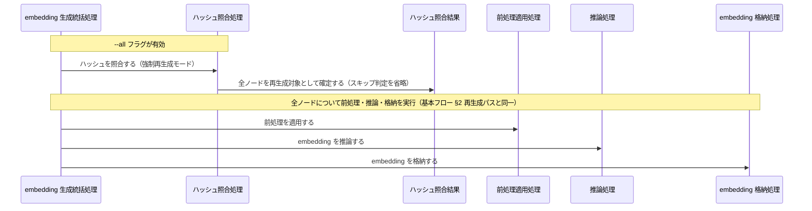
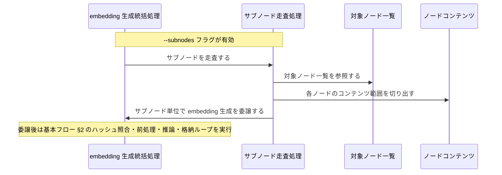
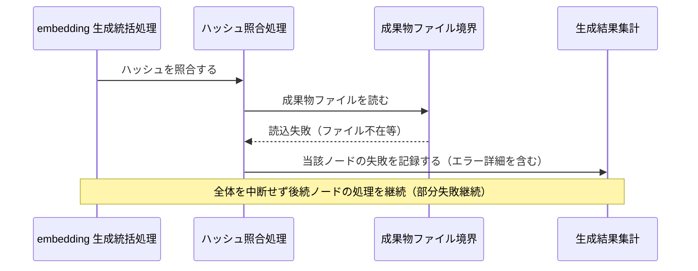

Document ID: SEQA-LGX-007

# SEQA-LGX-007: embedding 生成とドリフト検出 のドメイン相互作用

**親 RBA**: RBA-LGX-007
**親 UC**: UC-LGX-007
**レイヤ**: 抽象側（ドメインレベル、言語非依存）

> **記述規律**: RBA-LGX-007 で識別したドメイン主語をレーンとして、UC-LGX-007 のフロー（基本/代替/例外）を時系列で展開する。メッセージは自然言語（ドメイン語彙）。関数名・API 名・引数型・言語固有同期機構は書かない（`04-iconix-layer.md` §4）。本 SEQA は UC ⇄ RBA ⇄ SEQA の Jacobson 流三者整合性を確定する。drift 専念分離: ドリフト検出の主語（Boundary/Control/Entity）は含めない（UC-LGX-013 委譲に整合）。

---

## 1. UC text（並列配置）

UC-LGX-007 基本フロー（SEQA メッセージと 1:1 対応）:

```
1. アクターが `legixy embed [--all] [--subnodes]` を実行する
2. システムが graph.toml から全ノードを取得する
3. 各ノードについて:
   a. ファイル内容のハッシュ（SHA-256）を計算する
   b. engine.db の既存ハッシュと比較し、変更がなければスキップする（SCORE-INV-1）
   c. 変更がある場合、前処理（EmbeddingPreprocessor）を適用する
   d. ONNX モデルで embedding を生成する（トークン化 → 推論 → Mean Pooling → L2 正規化）
   e. engine.db の embeddings テーブルに格納する
4. `--subnodes` が指定された場合、サブノードの embedding も生成する
（代替 2a: ONNX モデル不在 → ERROR 報告。代替 3b: --all でハッシュ比較スキップ・全再生成）
```

## 2. 基本フロー（`embed`、ハッシュ照合あり）

```mermaid
sequenceDiagram
    actor Actor as 開発者 / CI システム
    participant B受付 as embedding コマンド受付窓口
    participant C統括 as embedding 生成統括処理
    participant C一覧 as ノード一覧取得処理
    participant Bgraph as グラフ定義境界
    participant Eノード一覧 as 対象ノード一覧
    participant Cハッシュ as ハッシュ照合処理
    participant Bファイル as 成果物ファイル境界
    participant B格納 as embedding 格納境界
    participant Eコンテンツ as ノードコンテンツ
    participant E照合結果 as ハッシュ照合結果
    participant C前処理 as 前処理適用処理
    participant E前処理済 as 前処理済みコンテンツ
    participant C推論 as 推論処理
    participant Bモデル as ONNX モデル境界
    participant Eベクトル as embedding ベクトル
    participant C格納 as embedding 格納処理
    participant E集計 as 生成結果集計
    participant B出力 as 処理結果出力窓口

    Actor->>B受付: embedding 生成を要求する（embed [--all] [--subnodes]）
    B受付->>C統括: embedding 生成を統括する
    C統括->>C一覧: 対象ノードを確定する
    C一覧->>Bgraph: グラフ定義を読む
    Bgraph-->>C一覧: グラフ定義内容
    C一覧->>Eノード一覧: 対象ノード一覧を確定する
    loop 各ノード
        C統括->>Cハッシュ: ハッシュを照合する
        Cハッシュ->>Bファイル: 成果物ファイルを読む
        Bファイル-->>Cハッシュ: ノードコンテンツ
        Cハッシュ->>Eコンテンツ: ノードコンテンツを保持する
        Cハッシュ->>B格納: 既存ハッシュを参照する
        B格納-->>Cハッシュ: 既存ハッシュ（不在も許容）
        Cハッシュ->>E照合結果: ハッシュ照合結果を確定する（スキップ・再生成・未生成）
        alt ハッシュ照合結果がスキップ（SCORE-INV-1）
            C統括->>E集計: スキップ件数を加算する
        else ハッシュ照合結果が再生成または未生成
            C統括->>C前処理: 前処理を適用する
            C前処理->>Eコンテンツ: ノードコンテンツを参照する
            C前処理->>E前処理済: 前処理済みコンテンツを確定する
            C統括->>C推論: embedding を推論する
            C推論->>Bモデル: モデルを参照する
            Bモデル-->>C推論: モデル内容（トークン化・推論・プーリング・正規化の基盤）
            C推論->>E前処理済: 前処理済みコンテンツを参照する
            C推論->>Eベクトル: embedding ベクトルを生成する
            C統括->>C格納: embedding を格納する
            C格納->>Eベクトル: embedding ベクトルを参照する
            C格納->>B格納: embedding ベクトルとモデル版情報とコンテンツハッシュを書き込む（SCORE-INV-2）
            C統括->>E集計: 生成件数を加算する
        end
    end
    C統括->>E集計: 処理結果集計を確定する
    C統括->>B出力: 処理結果集計を渡す
    B出力-->>Actor: 生成件数・スキップ件数・失敗件数・エラー詳細 + 終了コード
```

## 3. 代替フロー

### 代替 3b: `--all`（ハッシュ比較スキップ・全再生成）



### 代替 4（`--subnodes` 指定時のサブノード処理）



## 4. 例外フロー

### 例外 2a: ONNX モデル不在（ERROR 報告）

```mermaid
sequenceDiagram
    participant C統括 as embedding 生成統括処理
    participant C推論 as 推論処理
    participant Bモデル as ONNX モデル境界
    participant E集計 as 生成結果集計
    participant B出力 as 処理結果出力窓口
    actor Actor as 開発者 / CI システム

    C統括->>C推論: embedding を推論する
    C推論->>Bモデル: モデルを参照する
    Bモデル-->>C推論: 不在（供給できない）
    C推論->>E集計: 失敗を記録する（エラー詳細を含む）
    C統括->>B出力: 処理結果集計（失敗）を渡す
    B出力-->>Actor: ERROR 報告 + 終了コード 1
    Note over B出力,Actor: モデル不在は処理継続不能のため全体を即時終了
```

### 例外: 一部ノードのファイル読込失敗（部分失敗継続）



## 5. 並行性（概念レベル）

`embed` はノードを逐次走査する処理であり、ドメインレベルで並行に発生する事象はない（ハッシュ照合・前処理・推論・格納は embedding 生成統括処理の協調下で各ノードごとに逐次進む）。サブノード走査も統括処理への委譲として逐次モデル化される。並行アクセス時の整合性は NFR の射程（engine.db へのトランザクション粒度は embedding 格納処理のドメイン責務として §7 に記録）。

## 6. 整合性確認

- [x] 各メッセージがドメイン語彙で書かれている（関数名・API 名・型なし）
- [x] レーンが RBA-LGX-007 の主語と一致する（クラス名混入なし。RBA の B6/C7/E6 を全て参照）
- [x] UC-LGX-007 の基本（Step1-4、3a-3e）/ 代替（2a・3b・4）/ 例外（ファイル読込失敗部分失敗継続）フローを網羅
- [x] Noun-Verb ルール遵守（Actor⇄Boundary / Boundary⇄Control / Control⇄Control / Control⇄Entity のみ。Boundary 同士・Entity 同士・Boundary→Entity・Actor→内部 の直接通信なし）

## 7. コントローラ責務と実行操作の整合（§4.4）

| Control レーン | 概念名が示す責務 | 実行する操作 | 整合 |
|---|---|---|---|
| embedding 生成統括処理 | 生成フロー全体の協調・部分失敗継続 | ノード一覧取得・ハッシュ照合・前処理・推論・格納を順に依頼、結果集計を更新し出力へ渡す | ✓ |
| ノード一覧取得処理 | 対象ノードの確定 | グラフ定義境界を読み対象ノード一覧を確定する | ✓（集計・推論等の越権なし） |
| ハッシュ照合処理 | ハッシュ照合とスキップ判定 | 成果物ファイル境界を読みノードコンテンツを受け取り、格納境界の既存ハッシュと比較してハッシュ照合結果（3 状態）を確定する | ✓ |
| 前処理適用処理 | コンテンツの正規化 | ノードコンテンツを受け取り前処理済みコンテンツを生成する（空テキスト判定・トークン上限超過切り捨てを含む） | ✓（推論・格納の越権なし） |
| 推論処理 | embedding ベクトルの生成 | ONNX モデル境界を参照し前処理済みコンテンツからトークン化・推論・平均プーリング・L2 正規化を経て embedding ベクトルを生成する | ✓（格納・照合の越権なし） |
| embedding 格納処理 | embedding の永続化 | embedding ベクトルとモデル版情報とコンテンツハッシュを embedding 格納境界に書き込む（ノード単位） | ✓（推論・集計の越権なし） |
| サブノード走査処理 | サブノードの走査と委譲 | 対象ノード一覧からコンテンツ範囲を切り出し、サブノード単位で embedding 生成統括処理に委譲する | ✓ |

余剰操作なし。各 Control の操作が UC ステップと 1:1 対応。Control 間メッセージ（統括 → 各処理）が UC の振る舞いを実現。

## 8. Jacobson 流三者整合性（UC ⇄ RBA ⇄ SEQA、§11.1）— 確定

| 検査 | 確認内容 | 結果 |
|---|---|---|
| UC ⇄ RBA | UC-LGX-007 各ステップが RBA-LGX-007 フローに 1:1 対応（RBA-007 §5） | ✓ |
| RBA ⇄ SEQA | RBA-LGX-007 の主語（B6/C7/E6）が本 SEQA のレーンと一致（§6 参照）、Noun-Verb ルールが SEQA でも保持（§6） | ✓ |
| UC ⇄ SEQA | UC text 並列配置（§1）、各 UC ステップが SEQA メッセージと対応（基本/代替/例外を §2-4 で網羅） | ✓ |

3 者が同じ振る舞いを動的に表現していることを確認。**これにより RBA-LGX-007 §8 の Jacobson 三者整合性「保留」が解消される。**

### UC ⇄ SEQA 詳細対応表

| UC-LGX-007 ステップ | SEQA 対応箇所 | 整合 |
|---|---|---|
| 基本 1（`legixy embed [--all] [--subnodes]` 実行） | §2 Actor→B受付→C統括 | ✓ |
| 基本 2（graph.toml から全ノードを取得） | §2 C統括→C一覧→Bgraph→Eノード一覧 | ✓ |
| 基本 3a（ファイル内容の SHA-256 計算） | §2 C統括→Cハッシュ→Bファイル→Eコンテンツ | ✓ |
| 基本 3b（既存ハッシュと比較・スキップ判定、SCORE-INV-1） | §2 Cハッシュ→B格納→E照合結果（スキップ分岐） | ✓ |
| 基本 3c（前処理の適用） | §2 C統括→C前処理→Eコンテンツ→E前処理済 | ✓ |
| 基本 3d（ONNX モデルで embedding 生成） | §2 C統括→C推論→Bモデル/E前処理済→Eベクトル | ✓ |
| 基本 3e（embeddings テーブルに格納、SCORE-INV-2） | §2 C統括→C格納→Eベクトル→B格納 | ✓ |
| 基本 4（`--subnodes` 指定時のサブノード処理） | §3 代替 4: C統括→Cサブ→Eノード一覧→C統括（委譲） | ✓ |
| 代替 2a（ONNX モデル不在で ERROR） | §4 例外 2a: C推論→Bモデル（不在）→E集計→B出力 | ✓ |
| 代替 3b（`--all` でハッシュ比較スキップ・全再生成） | §3 代替 3b: Cハッシュ→E照合結果（全再生成確定） | ✓ |
| 事後条件（embeddings テーブル更新・モデルバージョン記録） | §2 C格納→B格納（モデル版情報・コンテンツハッシュ同時書込） | ✓ |

## 9. 履歴

| 日付 | 変更内容 |
|---|---|
| 2026-06-13 | 初版。UC-LGX-007 / RBA-LGX-007 の時系列展開。基本（embed、ハッシュ照合あり）/ 代替（--all 強制再生成・--subnodes サブノード走査）/ 例外（ONNX モデル不在・ファイル読込部分失敗継続）を網羅。Jacobson 流三者整合性を確定（RBA-007 §8 保留解消）。Control 責務⇄操作の整合（§4.4）確認。drift 専念分離（UC-013 委譲）に整合し drift 関連主語は含めない |
