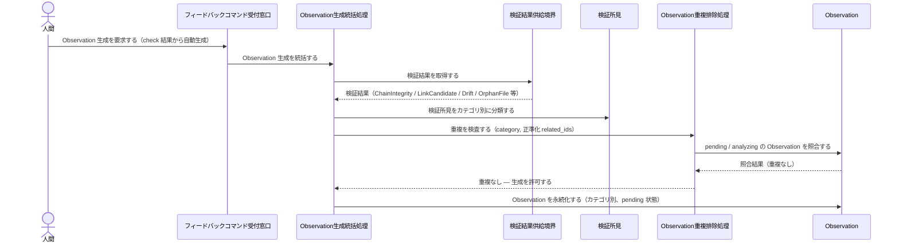
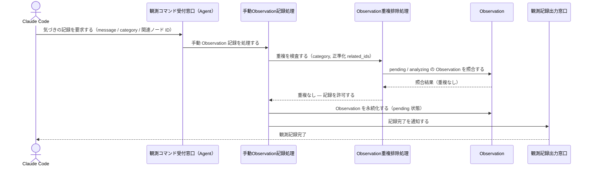
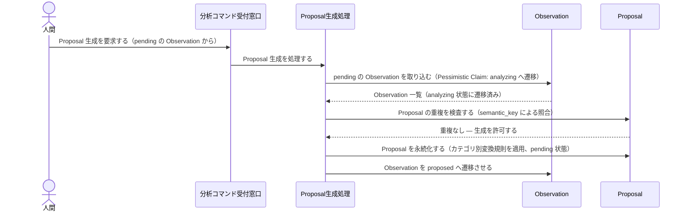
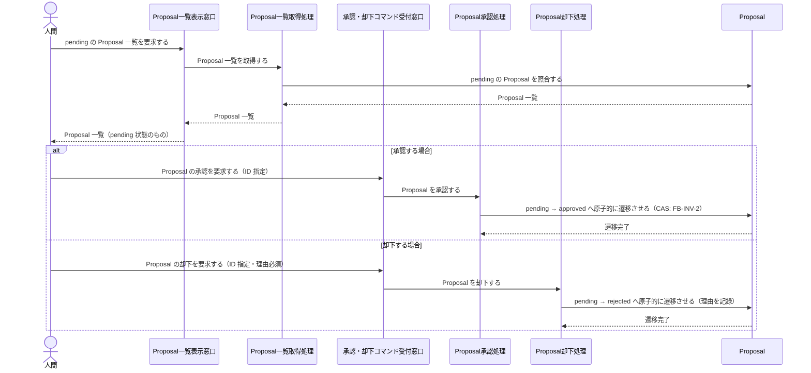
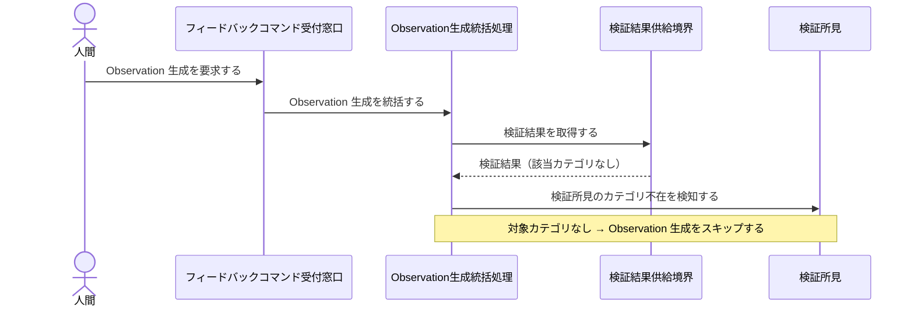
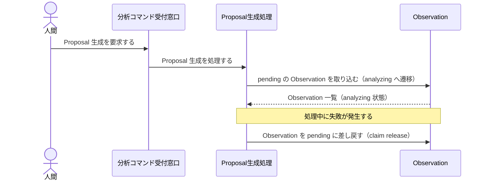
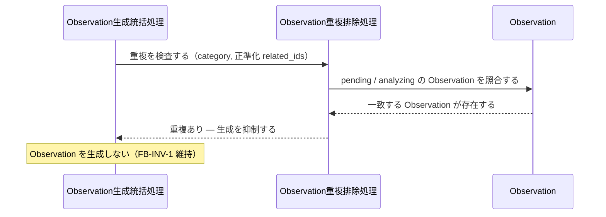
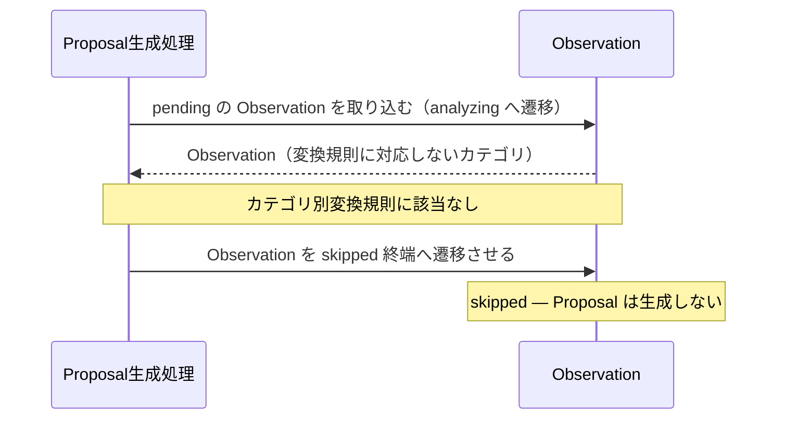
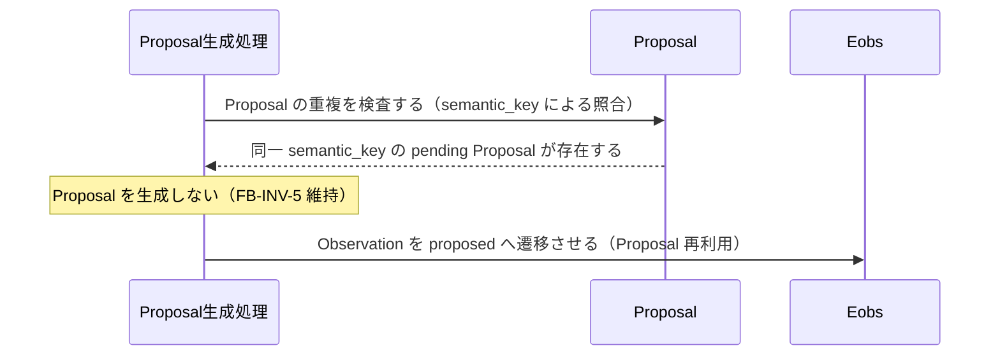

Document ID: SEQA-LGX-008

# SEQA-LGX-008: フィードバックループ のドメイン相互作用

**親 RBA**: RBA-LGX-008
**親 UC**: UC-LGX-008
**レイヤ**: 抽象側（ドメインレベル、言語非依存）

> **記述規律**: RBA-LGX-008 で識別したドメイン主語をレーンとして、UC-LGX-008 のフロー（基本/代替/例外）を時系列で展開する。メッセージは自然言語（ドメイン語彙）。関数名・API 名・引数型・言語固有同期機構は書かない（`04-iconix-layer.md` §4）。本 SEQA は UC ⇄ RBA ⇄ SEQA の Jacobson 流三者整合性を確定する。

---

## 1. UC text（並列配置）

UC-LGX-008 基本フロー（SEQA メッセージと 1:1 対応）:

```
### Observation 生成
1. feedback コマンド: check 結果から自動で Observation を生成する
   - ChainIntegrity → chain_integrity カテゴリ
   - LinkCandidate → link_candidate カテゴリ
   - Drift → drift カテゴリ
   - OrphanFile → orphan_file カテゴリ
2. observe コマンド: 手動で Observation を記録する（MCP 経由）
3. 重複チェック: (category, related_ids) が一致する pending の Observation は生成しない（FB-INV-1）

### Proposal 生成
1. analyze コマンド: pending の Observation から Proposal を生成する
2. Pessimistic Claim パターン: pending → analyzing → proposed/skipped
3. カテゴリ別の変換:
   - chain_integrity → add_chain_entry
   - link_candidate → add_link
   - drift → update_doc
4. semantic_key で Proposal の重複を排除する（FB-INV-5）

### 承認・却下（人間のみ）
1. proposals コマンド: pending の Proposal 一覧を表示する
2. approve <id>: Proposal を承認する（原子的トランザクション: FB-INV-2）
3. reject <id> --reason <reason>: Proposal を却下する（理由必須）

（代替 1a: check 結果に該当カテゴリがない場合 → Observation 生成なし）
（代替 2a: analyze 処理中失敗 → Observation を pending に戻す（claim release））
```

## 2. 基本フロー（Observation 生成 → Proposal 生成 → 承認・却下）

### 2a. Observation 生成（feedback コマンド: 自動生成）



### 2b. Observation 生成（observe コマンド: 手動記録、MCP 経由）



### 2c. Proposal 生成（analyze コマンド）



### 2d. Proposal 一覧表示・承認・却下



## 3. 代替フロー

### 代替 1a: check 結果に該当カテゴリがない場合（Observation 生成なし）



### 代替 2a: analyze 処理中失敗（Observation を pending に差し戻し）



## 4. 例外フロー

### 例外 A: Observation 生成中の重複検出（FB-INV-1 による抑制）



### 例外 B: Proposal 生成中の skipped 終端（変換不能カテゴリ）



### 例外 C: semantic_key による Proposal 重複排除（FB-INV-5）



## 5. 並行性（概念レベル）

UC-LGX-008 で定義されるフローは、観測フロー（`feedback` / `observe`）・Proposal 生成フロー（`analyze`）・承認却下フロー（`approve` / `reject`）の 3 系統が論理的に独立している。ただしドメインレベルでは、各コマンドはそれぞれ独立した起動として逐次処理される。`feedback` と `observe` は同じ Observation 重複排除処理・Observation Entity を共有しており、同時実行時の整合性は FB-INV-1 および CAS 相当の調整機構（Pessimistic Claim）によりドメイン不変条件として保証される。概念レベルでの並行イベントは重複排除処理が共有される点のみ。

## 6. 整合性確認

- [x] 各メッセージがドメイン語彙で書かれている（関数名・API 名・型なし）
- [x] レーンが RBA-LGX-008 の主語と一致する（クラス名混入なし）
- [x] UC-LGX-008 の基本フロー（Observation 生成 §2a/2b / Proposal 生成 §2c / 承認・却下 §2d）/ 代替（1a/2a）/ 例外（重複抑制/skipped終端/semantic_key重複排除）を網羅
- [x] Noun-Verb ルール遵守（Actor⇄Boundary / Boundary⇄Control / Control⇄Control / Control⇄Entity のみ。Boundary 同士・Entity 同士・Boundary→Entity・Actor→内部 の直接通信なし）

## 7. コントローラ責務と実行操作の整合（§4.4）

| Control レーン | 概念名が示す責務 | 実行する操作 | 整合 |
|---|---|---|---|
| Observation 生成統括処理 | check 結果から Observation を生成し重複排除して永続化 | 検証結果供給境界を参照し、検証所見をカテゴリ別に分類、重複排除処理を経て Observation を永続化 | ✓ |
| 手動 Observation 記録処理 | Agent からの観測記録要求を受けて Observation を永続化 | message/category/関連ノード ID を検証し、重複排除処理を経て Observation を永続化、完了通知を出力 | ✓ |
| Observation 重複排除処理 | (category, related_ids) 複合キーで pending/analyzing の重複を検査 | Observation Entity を照合し重複の有無を判定、結果を呼出元 Control に返す | ✓（Proposal を操作しない） |
| Proposal 生成処理 | pending の Observation から Proposal を生成（Pessimistic Claim + semantic_key 重複排除） | Observation を analyzing へ遷移、カテゴリ別変換規則を適用して Proposal を永続化、変換不能時は skipped へ遷移、失敗時は pending に差し戻し | ✓ |
| Proposal 一覧取得処理 | 指定ステータスの Proposal を一覧として取得 | Proposal Entity を照合し一覧を返す | ✓（承認・却下を操作しない） |
| Proposal 承認処理 | pending の Proposal を CAS で原子的に approved へ遷移 | Proposal Entity の状態を CAS で pending → approved へ遷移 | ✓ |
| Proposal 却下処理 | pending の Proposal を CAS で原子的に rejected へ遷移（理由必須） | Proposal Entity の状態を CAS で pending → rejected へ遷移（理由を記録） | ✓ |

余剰操作なし（各操作が UC ステップに対応）。Control 間メッセージが UC の振る舞いを実現。

## 8. Jacobson 流三者整合性（UC ⇄ RBA ⇄ SEQA、§11.1）— 確定

| 検査 | 確認内容 | 結果 |
|---|---|---|
| UC ⇄ RBA | UC-LGX-008 各ステップが RBA-LGX-008 フローに 1:1 対応（RBA §5） | ✓ |
| RBA ⇄ SEQA | RBA-LGX-008 の主語（Boundary 7 / Control 7 / Entity 3）が本 SEQA のレーンと一致、Noun-Verb ルールが SEQA でも保持（§6） | ✓ |
| UC ⇄ SEQA | UC text 並列配置（§1）、各 UC ステップが SEQA メッセージと対応（基本 §2a-2d / 代替 §3 / 例外 §4 を網羅） | ✓ |

3 者が同じ振る舞いを動的に表現していることを確認。**これにより RBA-LGX-008 §8 の Jacobson 三者整合性「保留」が解消される。**

## 9. 履歴

| 日付 | 変更内容 |
|---|---|
| 2026-06-13 | 初版。UC-LGX-008 / RBA-LGX-008 の時系列展開。基本（feedback §2a / observe §2b / analyze §2c / approve・reject §2d）/ 代替（1a: カテゴリ不在 / 2a: claim release）/ 例外（重複抑制 / skipped 終端 / semantic_key 重複排除）を網羅。Jacobson 流三者整合性を確定（RBA-008 §8 保留解消）。Control 責務⇄操作の整合（§4.4）確認 |
