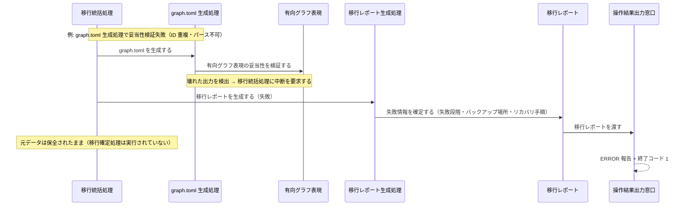
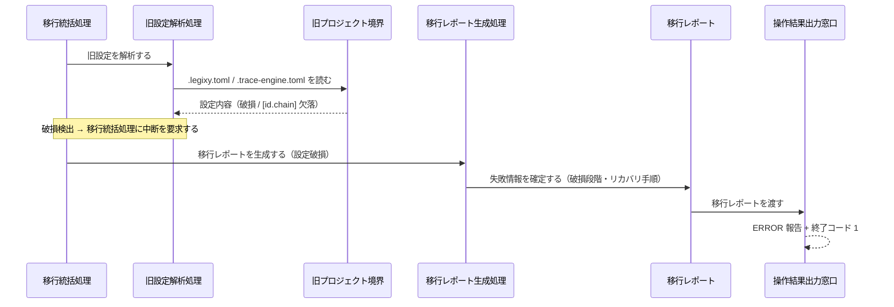

Document ID: SEQA-LGX-009

# SEQA-LGX-009: プロジェクト初期化とマイグレーション のドメイン相互作用

**親 RBA**: RBA-LGX-009
**親 UC**: UC-LGX-009
**レイヤ**: 抽象側（ドメインレベル、言語非依存）

> **記述規律**: RBA-LGX-009 で識別したドメイン主語をレーンとして、UC-LGX-009 のフロー（基本/代替/例外）を時系列で展開する。メッセージは自然言語（ドメイン語彙）。関数名・API 名・引数型・言語固有同期機構は書かない（`04-iconix-layer.md` §4）。本 SEQA は UC ⇄ RBA ⇄ SEQA の Jacobson 流三者整合性を確定する。

---

## 1. UC text（並列配置）

UC-LGX-009 基本フロー（SEQA メッセージと 1:1 対応）:

```
【init 系統】
1. アクターが `legixy init` を実行する
2. システムが以下を生成する:
   a. `.legixy.toml`（legixy テンプレート、`[graph]` セクション含む）
   b. `docs/traceability/graph.toml`（サンプルノード/エッジ付き）
   c. 各成果物タイプのディレクトリ
   d. `.legixy/` ディレクトリ（.gitignore 付き）
（代替 2a: `.legixy.toml` が既に存在する場合 → ERROR を報告して終了）

【migrate 系統】
1. アクターが `legixy migrate --from <v01_project_root>` を実行する
2. システムが v0.1.0 プロジェクトを読み込む:
   a. `.legixy.toml` を解析
   b. matrix.md（または matrix.json）をパース
3. マトリクスの各行から graph.toml のノードとエッジを生成する
4. v0.1.0 の `.legixy.toml` を legixy 形式に変換する
5. feedback.db を engine.db に移行する（テーブル構造をコピー）
6. vectors.bin があれば embeddings テーブルにインポートする
7. 移行レポートを出力する
（代替 2b: 旧プロジェクトが見つからない場合 → ERROR を報告して終了）
```

---

## 2. 基本フロー — init 系統（`legixy init`）

```mermaid
sequenceDiagram
    actor Actor as 開発者
    participant Bcmd as 初期化・移行コマンド受付窓口
    participant Cinit as 初期化統括処理
    participant Ccheck as 既存生成物検査処理
    participant Bcfg as 設定ファイル境界
    participant Ctmpl as 生成物テンプレート生成処理
    participant Bgen as プロジェクト生成物境界
    participant Cdbinit as DB 初期化処理
    participant Ereport as 移行レポート
    participant Bout as 操作結果出力窓口

    Actor->>Bcmd: init を要求する
    Bcmd->>Cinit: 初期化を統括する
    Cinit->>Ccheck: 既存生成物を検査する
    Ccheck->>Bcfg: legixy 生成物の存在を確認する
    Bcfg-->>Ccheck: 存在状況（不在）
    Note over Ccheck,Cinit: 生成物なし → 初期化続行
    Cinit->>Ctmpl: テンプレートを生成する
    Ctmpl->>Bgen: .legixy.toml テンプレートを書き出す
    Ctmpl->>Bgen: docs/traceability/graph.toml を書き出す
    Ctmpl->>Bgen: ICONIX 8 成果物タイプのディレクトリを作成する
    Cinit->>Cdbinit: DB を初期化する
    Cdbinit->>Bgen: .legixy/ に engine.db（初期スキーマ）と .gitignore を書き出す
    Cinit->>Ereport: init 成功の結果を確定する
    Ereport->>Bout: 移行レポートを渡す
    Bout-->>Actor: 成功サマリ（生成ファイル一覧）+ 終了コード 0
```

---

## 3. 基本フロー — migrate 系統（`legixy migrate --from <path>`）

```mermaid
sequenceDiagram
    actor Actor as 開発者
    participant Bcmd as 初期化・移行コマンド受付窓口
    participant Cmig as 移行統括処理
    participant Cver as バージョン検出処理
    participant Bsrc as 旧プロジェクト境界
    participant Ever as プロジェクトバージョン情報
    participant Ccfg as 旧設定解析処理
    participant Emigset as 移行設定情報
    participant Cmat as matrix 読み込み処理
    participant Eids as 成果物 ID 集合
    participant Cgraph as graph.toml 生成処理
    participant Egraph as 有向グラフ表現
    participant Cidmap as ID マッピング処理
    participant Eidmap as ID マッピング表
    participant Ccfgconv as 設定ファイル変換処理
    participant Cdb as DB 移行処理
    participant Ccommit as 移行確定処理
    participant Bdst as 移行先プロジェクト境界
    participant Crep as 移行レポート生成処理
    participant Ereport as 移行レポート
    participant Bout as 操作結果出力窓口

    Actor->>Bcmd: migrate を要求する（移行元パス指定）
    Bcmd->>Cmig: 移行を統括する
    Cmig->>Cver: バージョンを検出する
    Cver->>Bsrc: engine.db の user_version と設定ファイルを参照する
    Bsrc-->>Cver: バージョン識別情報
    Cver->>Ever: プロジェクトバージョン情報を確定する（v0.1.0）
    Cmig->>Ccfg: 旧設定を解析する
    Ccfg->>Bsrc: .legixy.toml / .trace-engine.toml を読む
    Bsrc-->>Ccfg: 設定内容
    Ccfg->>Emigset: 移行設定情報を確定する
    Cmig->>Cmat: matrix を読み込む
    Cmat->>Bsrc: matrix.md / matrix.json をパースする
    Bsrc-->>Cmat: 成果物リスト
    Cmat->>Eids: 成果物 ID 集合を確定する
    Cmig->>Cgraph: graph.toml を生成する
    Cgraph->>Eids: 成果物 ID 集合を照合する
    Cgraph->>Emigset: 移行設定情報を照合する
    Cgraph->>Egraph: 有向グラフ表現を確定する（ノード・エッジ・妥当性検証済）
    Cmig->>Cidmap: ID マッピングを生成する
    Cidmap->>Egraph: 有向グラフ表現を照合する
    Cidmap->>Bsrc: 既存参照を読む
    Cidmap->>Eidmap: ID マッピング表を確定する（全単射保証）
    Cmig->>Ccfgconv: 設定ファイルを変換する
    Ccfgconv->>Emigset: 移行設定情報を照合する
    Cmig->>Cdb: DB を移行する
    Cdb->>Bsrc: engine.db / vectors.bin を読む
    Bsrc-->>Cdb: 旧 DB データおよびベクタデータ
    Cmig->>Ccommit: 移行を確定する
    Ccommit->>Egraph: 有向グラフ表現を取得する
    Ccommit->>Eidmap: ID マッピング表を取得する
    Ccommit->>Bdst: DB コミットを先行させ graph.toml・migration-id-map.toml・.legixy.toml を atomic に書き出す
    Cmig->>Crep: 移行レポートを生成する
    Crep->>Ereport: 成功時サマリを確定する（生成・更新ファイル一覧・ID 書き換え件数・バックアップ場所）
    Ereport->>Bout: 移行レポートを渡す
    Bout-->>Actor: 成功サマリ + 終了コード 0
```

---

## 4. 代替フロー

### 代替 2a: init で `.legixy.toml` が既に存在する場合

```mermaid
sequenceDiagram
    actor Actor as 開発者
    participant Bcmd as 初期化・移行コマンド受付窓口
    participant Cinit as 初期化統括処理
    participant Ccheck as 既存生成物検査処理
    participant Bcfg as 設定ファイル境界
    participant Ereport as 移行レポート
    participant Bout as 操作結果出力窓口

    Actor->>Bcmd: init を要求する
    Bcmd->>Cinit: 初期化を統括する
    Cinit->>Ccheck: 既存生成物を検査する
    Ccheck->>Bcfg: legixy 生成物の存在を確認する
    Bcfg-->>Ccheck: 存在確認（.legixy.toml 検出）
    Note over Ccheck,Cinit: 生成物あり → 初期化を中断する
    Cinit->>Ereport: init 失敗の結果を確定する（既存 .legixy.toml 検出）
    Ereport->>Bout: 移行レポートを渡す
    Bout-->>Actor: ERROR 報告（既存プロジェクト検出）+ 終了コード 1
```

### 代替 2b: migrate で v0.1.0 プロジェクトが見つからない場合

```mermaid
sequenceDiagram
    actor Actor as 開発者
    participant Bcmd as 初期化・移行コマンド受付窓口
    participant Cmig as 移行統括処理
    participant Cver as バージョン検出処理
    participant Bsrc as 旧プロジェクト境界
    participant Crep as 移行レポート生成処理
    participant Ereport as 移行レポート
    participant Bout as 操作結果出力窓口

    Actor->>Bcmd: migrate を要求する（移行元パス指定）
    Bcmd->>Cmig: 移行を統括する
    Cmig->>Cver: バージョンを検出する
    Cver->>Bsrc: engine.db と設定ファイルを参照する
    Bsrc-->>Cver: 不在（供給できない）
    Note over Cver,Cmig: 旧プロジェクト不在 → 移行を中断する
    Cmig->>Crep: 移行レポートを生成する（旧プロジェクト不在）
    Crep->>Ereport: 失敗情報を確定する（不在段階・リカバリ手順）
    Ereport->>Bout: 移行レポートを渡す
    Bout-->>Actor: ERROR 報告（旧プロジェクト不在）+ 終了コード 1
```

---

## 5. 例外フロー

### 例外: migrate 途中での処理失敗（非破壊中断）



### 例外: migrate — 旧設定破損（TOML パース失敗・`[id.chain]` 欠落）



---

## 6. 並行性（概念レベル）

init 系統・migrate 系統ともに、ドメインレベルで並行に発生する事象はない。init は既存生成物検査 → テンプレート生成 → DB 初期化の逐次協調であり、migrate はバージョン検出 → 設定解析 → matrix 読み込み → graph 生成 → ID マッピング → 設定変換 → DB 移行 → 移行確定 → レポート生成の逐次協調である。各処理は移行統括処理または初期化統括処理の協調下で順序付けられ、概念レベルの並行実行は存在しない（非破壊性・atomic 確定は並行性ではなく確定順序の問題として扱う）。

---

## 7. 整合性確認

- [x] 各メッセージがドメイン語彙で書かれている（関数名・API 名・型なし）
- [x] レーンが RBA-LGX-009 の主語と一致する（クラス名・言語要素の混入なし）
- [x] UC-LGX-009 の基本フロー（init §2 / migrate §3）/ 代替フロー（2a / 2b: §4）/ 例外フロー（非破壊中断・設定破損: §5）を網羅
- [x] Noun-Verb ルール遵守（Actor⇄Boundary / Boundary⇄Control / Control⇄Control / Control⇄Entity のみ。Boundary 同士・Entity 同士・Boundary→Entity・Actor→内部 の直接通信なし）

---

## 8. コントローラ責務と実行操作の整合（§4.4）

### init 系統

| Control レーン | 概念名が示す責務 | 実行する操作 | 整合 |
|---|---|---|---|
| 初期化統括処理 | init フロー全体の協調・中断判断 | 既存検査・テンプレート生成・DB 初期化を順に依頼、レポートを確定 | ✓ |
| 既存生成物検査処理 | legixy 生成物の存在確認・中断/続行判断 | 設定ファイル境界を参照し存在を確認 | ✓（テンプレート生成等の越権なし） |
| 生成物テンプレート生成処理 | ICONIX 標準構成の生成物テンプレート生成 | .legixy.toml・graph.toml・ディレクトリをプロジェクト生成物境界へ書き出す | ✓ |
| DB 初期化処理 | 初期スキーマの engine.db 生成 | .legixy/engine.db と .gitignore をプロジェクト生成物境界へ書き出す | ✓ |

### migrate 系統

| Control レーン | 概念名が示す責務 | 実行する操作 | 整合 |
|---|---|---|---|
| 移行統括処理 | migrate フロー全体の協調・途中失敗時の非破壊中断 | バージョン検出から移行確定・レポートまでを順に依頼 | ✓ |
| バージョン検出処理 | プロジェクトバージョンの自動判定 | 旧プロジェクト境界を参照しプロジェクトバージョン情報を確定 | ✓ |
| 旧設定解析処理 | 旧設定の解釈・移行設定情報の確定 | 旧プロジェクト境界を読み移行設定情報を確定 | ✓（graph 生成等の越権なし） |
| matrix 読み込み処理 | matrix のパース・成果物 ID 集合の確定 | 旧プロジェクト境界をパースし成果物 ID 集合を確定（空集合も正常） | ✓ |
| graph.toml 生成処理 | ノード・エッジ生成と出力妥当性検証 | 成果物 ID 集合・移行設定情報から有向グラフ表現を生成（確定前に妥当性検証） | ✓（DB 変換等の越権なし） |
| ID マッピング処理 | 旧→新 ID 全単射対応表の確定 | 有向グラフ表現と旧参照から ID マッピング表を確定（全単射・一意性保証） | ✓ |
| 設定ファイル変換処理 | 旧設定を legixy 形式へ変換 | 移行設定情報から legixy 形式の設定内容を生成（[graph] セクション追加） | ✓ |
| DB 移行処理 | 旧 DB の新スキーマ変換・vectors.bin インポート | 旧プロジェクト境界の engine.db / vectors.bin を読み新スキーマへ変換 | ✓ |
| 移行確定処理 | DB コミット先行 + atomic rename による非破壊確定 | DB コミット先行後、graph.toml 等を移行先プロジェクト境界へ atomic に書き出す | ✓（バージョン検出等の越権なし） |
| 移行レポート生成処理 | 成否に応じた移行レポートの確定 | 移行レポートを確定し操作結果出力窓口へ渡す | ✓ |

余剰操作なし（各操作が UC ステップに対応）。Control 間メッセージ（統括 → 各処理）が UC の振る舞いを実現。

---

## 9. Jacobson 流三者整合性（UC ⇄ RBA ⇄ SEQA、§11.1）— 確定

| 検査 | 確認内容 | 結果 |
|---|---|---|
| UC ⇄ RBA | UC-009 各ステップが RBA-009 フローに 1:1 対応（RBA-009 §5） | ✓ |
| RBA ⇄ SEQA | RBA-009 の主語（B/C/E）が本 SEQA のレーンと一致。init 系統 4 Control / migrate 系統 10 Control / Boundary 6 / Entity 6。Noun-Verb ルールが SEQA 全フローで保持（§7） | ✓ |
| UC ⇄ SEQA | UC text 並列配置（§1）。init 基本フロー（§2）・migrate 基本フロー（§3）で各 UC ステップが SEQA メッセージと対応。代替（§4: 2a / 2b）・例外（§5: 非破壊中断・設定破損）を網羅 | ✓ |

3 者が同じ振る舞いを動的に表現していることを確認。**これにより RBA-LGX-009 §8 の Jacobson 三者整合性「保留」が解消される。**

---

## 10. 履歴

| 日付 | 変更内容 |
|---|---|
| 2026-06-13 | 初版。UC-LGX-009 / RBA-LGX-009 の時系列展開。init 系統（基本: §2・代替 2a: §4）と migrate 系統（基本: §3・代替 2b: §4・例外 2 件: §5）を網羅。Jacobson 流三者整合性を確定（RBA-009 §8 保留解消）。Control 責務⇄操作の整合（§8）確認 |
