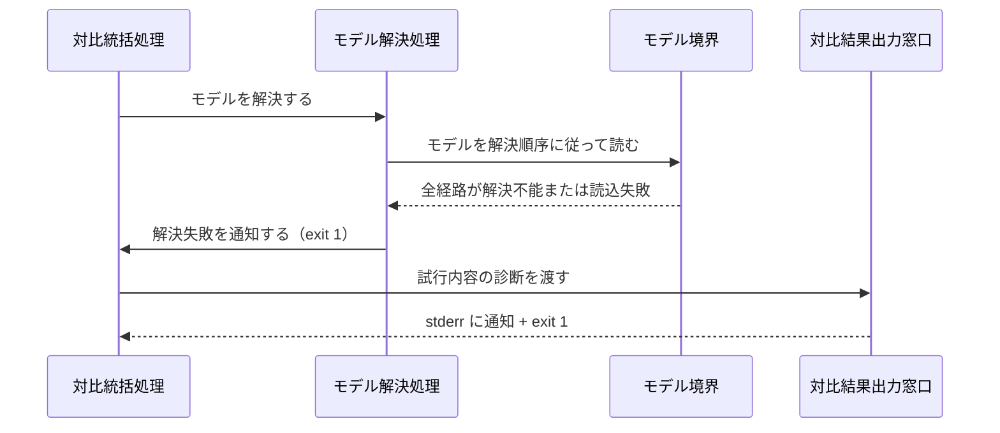
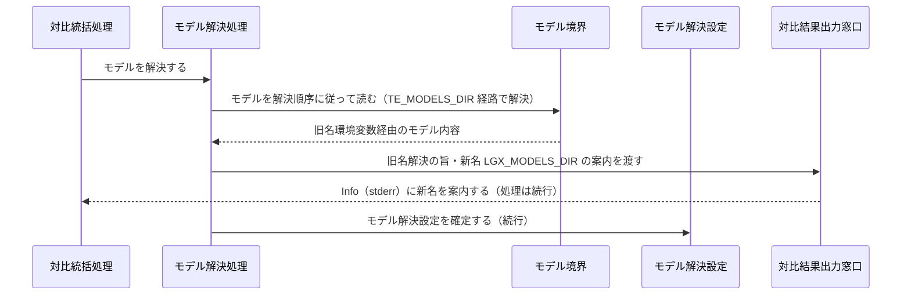
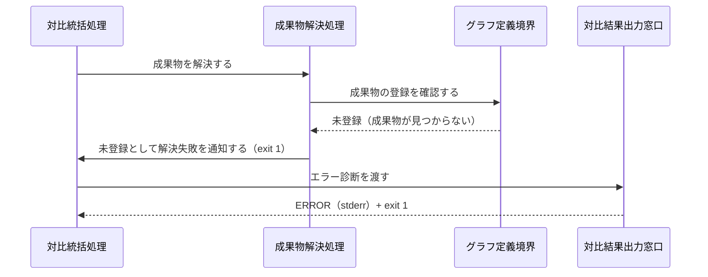
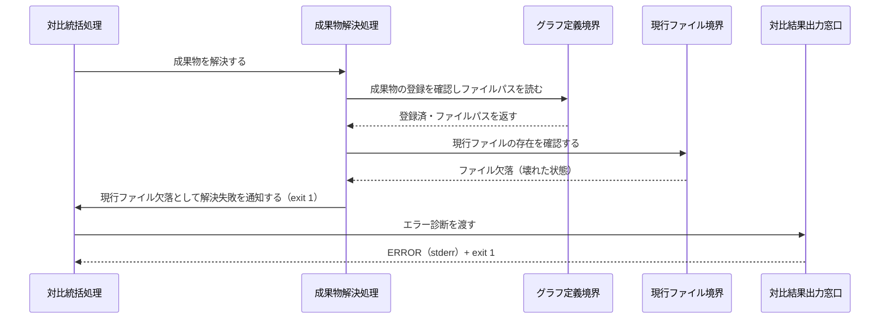
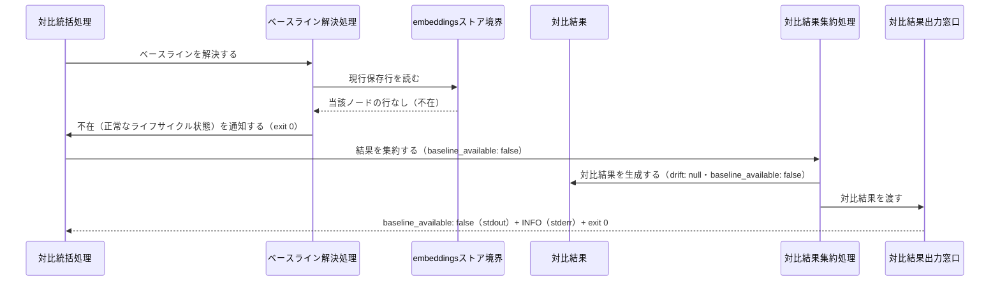
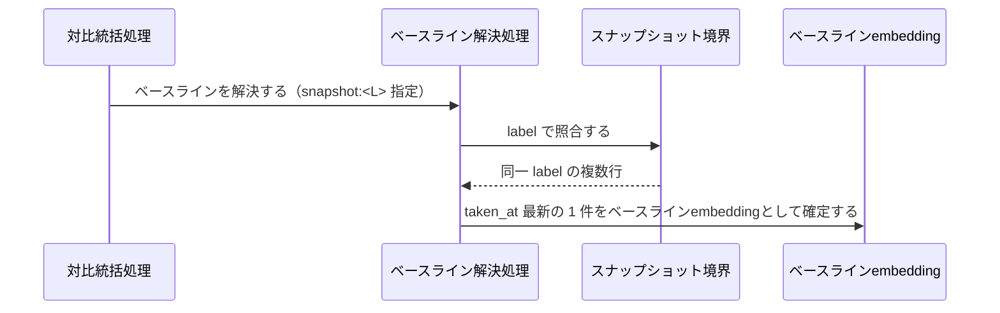
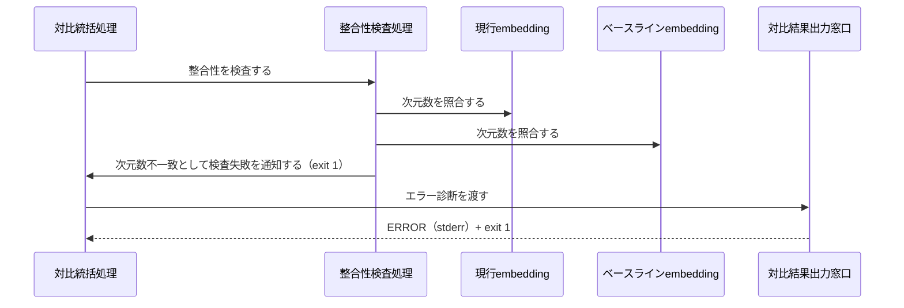
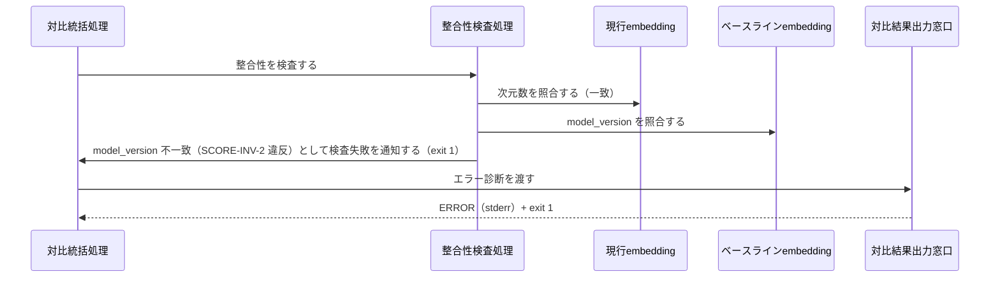
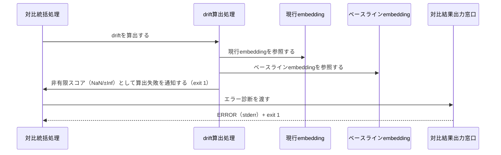
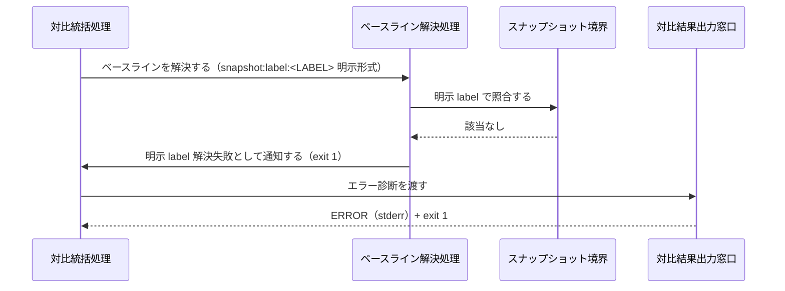

Document ID: SEQA-LGX-013

# SEQA-LGX-013: standalone ドリフト対比 のドメイン相互作用

**親 RBA**: RBA-LGX-013
**親 UC**: UC-LGX-013
**レイヤ**: 抽象側（ドメインレベル、言語非依存）

> **記述規律**: RBA-LGX-013 で識別したドメイン主語をレーンとして、UC-LGX-013 のフロー（基本/代替/例外）を時系列で展開する。メッセージは自然言語（ドメイン語彙）。関数名・API 名・引数型・言語固有同期機構は書かない（`04-iconix-layer.md` §4）。本 SEQA は UC ⇄ RBA ⇄ SEQA の Jacobson 流三者整合性を確定する。

---

## 1. UC text（並列配置）

UC-LGX-013 基本フロー（SEQA メッセージと 1:1 対応）:

```
1. アクターが `legixy drift <artifact_id> [--against snapshot:<token>] [--json]` を実行する
2. システムが ONNX モデルを解決順序に従って解決する
3. システムが対象成果物の現行ファイル内容を読み込み、embedding を生成する
4. システムがベースラインを選択する（--against 省略時 = embeddings ストアの現行保存行。
   snapshot:<token> 指定時 = label として解決し、解決できなければ snapshot_id とみなす。
   snapshot:label:<LABEL> の明示判別形式も label として解決）
5. システムがベースラインと現行 embedding の次元数一致・model_version 完全一致を検査する
6. システムが drift = 1.0 − cosine 類似度を算出する
7. text または --json で出力し exit 0 で終了する
（代替 1a: snapshot: プレフィクス欠如 → exit 1。代替 2a: モデル解決失敗 → exit 1。
  代替 2b: 旧名 TE_MODELS_DIR 解決 → stderr 案内し続行。代替 3a: artifact_id 未登録 → exit 1。
  代替 3b: 現行ファイル欠落 → exit 1。代替 4a: ベースライン不在 → exit 0 + INFO。
  代替 4b: label 複数一致 → taken_at 最新 1 件。代替 5a: 次元不一致 → exit 1。
  代替 5b: model_version 不一致 → exit 1。代替 6a: 非有限スコア → exit 1）
```

## 2. 基本フロー（`drift <artifact_id>`）

```mermaid
sequenceDiagram
    actor Actor as 設計者 / 運用者 / QA リード
    participant B1 as 対比コマンド受付窓口
    participant C0 as 対比統括処理
    participant C1 as モデル解決処理
    participant Bmodel as モデル境界
    participant Emsetting as モデル解決設定
    participant C2 as 成果物解決処理
    participant Bgraph as グラフ定義境界
    participant Eartifact as 成果物参照
    participant C3 as embedding生成処理
    participant Bfile as 現行ファイル境界
    participant Ecurrent as 現行embedding
    participant C4 as ベースライン解決処理
    participant Bembed as embeddingsストア境界
    participant Ebaseline as ベースラインembedding
    participant C5 as 整合性検査処理
    participant C6 as drift算出処理
    participant Eresult as 対比結果
    participant C7 as 対比結果集約処理
    participant B2 as 対比結果出力窓口

    Actor->>B1: 対比を要求する（artifact_id・オプション）
    B1->>C0: 対比を統括する
    C0->>C1: モデルを解決する
    C1->>Bmodel: モデルを解決順序に従って読む
    Bmodel-->>C1: モデル内容
    C1->>Emsetting: モデル解決設定を確定する
    C0->>C2: 成果物を解決する
    C2->>Bgraph: 成果物の登録を確認しファイルパスを読む
    Bgraph-->>C2: 登録内容とファイルパス
    C2->>Eartifact: 成果物参照を確定する
    C0->>C3: embeddingを生成する
    C3->>Bfile: 現行ファイル内容を読む
    Bfile-->>C3: ファイル内容
    C3->>Emsetting: 解決済みモデルを参照する
    C3->>Ecurrent: 現行embeddingを記録する
    C0->>C4: ベースラインを解決する
    C4->>Bembed: 現行保存行（デフォルトベースライン）を読む
    Bembed-->>C4: ベースライン内容
    C4->>Ebaseline: ベースラインembeddingを確定する
    C0->>C5: 整合性を検査する
    C5->>Ecurrent: 現行embeddingの次元数・model_versionを照合する
    C5->>Ebaseline: ベースラインembeddingの次元数・model_versionを照合する
    C0->>C6: driftを算出する
    C6->>Ecurrent: 現行embeddingを参照する
    C6->>Ebaseline: ベースラインembeddingを参照する
    C6->>Eresult: 対比結果を生成する
    C0->>C7: 結果を集約する
    C7->>Eresult: 対比結果を集約する
    C7->>B2: 対比結果を渡す
    B2-->>Actor: drift値（stdout）・ログ（stderr）+ exit 0
```

## 3. 代替フロー

### 代替 1a: `snapshot:` プレフィクスを欠く `--against` 値

```mermaid
sequenceDiagram
    actor Actor as 設計者 / 運用者 / QA リード
    participant B1 as 対比コマンド受付窓口
    participant C0 as 対比統括処理
    participant C4 as ベースライン解決処理
    participant B2 as 対比結果出力窓口

    Actor->>B1: 対比を要求する（--against 値にプレフィクスなし）
    B1->>C0: 対比を統括する
    C0->>C4: ベースラインを解決する
    C4->>C0: 形式不正として解決失敗を通知する（exit 1）
    C0->>B2: エラー診断を渡す
    B2-->>Actor: ERROR（stderr）+ exit 1
```

### 代替 2a: モデル解決失敗・読込失敗



### 代替 2b: 旧名 `TE_MODELS_DIR` による解決（新名案内し続行）



### 代替 3a: `<artifact_id>` が graph.toml に未登録



### 代替 3b: graph.toml 登録済・現行ファイル欠落



### 代替 4a: ベースライン不在（未 embed・スナップショットに当該行なし）



### 代替 4b: `snapshot:<L>` の label が同一複数 → taken_at 最新 1 件



### 代替 5a: 次元数不一致



### 代替 5b: model_version 不一致（次元は一致）



### 代替 6a: 非有限スコア（NaN/±Inf）発生



### 代替 --against snapshot:label:<LABEL> 明示形式での解決失敗



## 4. 例外フロー

### 例外: `--json` オプション指定時の出力形式切替

UC-LGX-013 の基本フロー 7 と代替 4a は `--json` 指定の有無で出力形式が異なる。ドメインレベルでは「対比結果出力窓口がアクターへ返す形式」の切替として表現する（形式切替は出力窓口の責務の範囲内であり、別の例外フローを要さない。フロー分岐なし）。

注: `--json` 指定時は `{"artifact_id", "drift", "baseline_available": true, "baseline_source": "embeddings" | "snapshot:<id>"}` を stdout に返す。baseline_available が false の場合は `{"artifact_id", "drift": null, "baseline_available": false}` を stdout に返し INFO を stderr に併出する。いずれも対比結果出力窓口の責務として集約。

## 5. 並行性（概念レベル）

なし。`drift` は読み取り専用の対比処理であり、モデル解決 → 成果物解決 → embedding 生成 → ベースライン解決 → 整合性検査 → drift 算出 → 結果集約 の各処理は対比統括処理の協調下で逐次進む。ドメインレベルで並行に発生する事象はない（UC-LGX-013 の事後条件「engine.db・graph.toml・成果物ファイルは不変」と整合）。

## 6. 整合性確認

- [x] 各メッセージがドメイン語彙で書かれている（関数名・API 名・型なし）
- [x] レーンが RBA-LGX-013 の主語と一致する（Boundary 7 / Control 8 / Entity 5。クラス名混入なし）
- [x] UC-LGX-013 の基本（Step 1-7）/ 代替（1a/2a/2b/3a/3b/4a/4b/5a/5b/6a・明示 label 失敗）/ 例外（--json 出力形式）フローを網羅
- [x] Noun-Verb ルール遵守（Actor⇄Boundary / Boundary⇄Control / Control⇄Control / Control⇄Entity のみ。Boundary 同士・Entity 同士・Boundary→Entity・Actor→内部 の直接通信なし）

## 7. コントローラ責務と実行操作の整合（§4.4）

| Control レーン | 概念名が示す責務 | 実行する操作 | 整合 |
|---|---|---|---|
| 対比統括処理 | 対比フロー全体の協調 | 各処理を順に依頼、結果集約を依頼 | ✓ |
| モデル解決処理 | ONNX モデルの解決 | モデル境界を解決順序に従って読み、モデル解決設定を確定する。旧名解決時は stderr 案内 | ✓（drift 算出等の越権なし） |
| 成果物解決処理 | 対象成果物の登録確認とファイルパス解決 | グラフ定義境界を読み成果物参照を確定する。未登録・欠落は exit 1 | ✓ |
| embedding 生成処理 | 現行ファイルからの embedding 生成 | 現行ファイル境界を読み、モデル解決設定を参照して現行 embedding を生成する | ✓ |
| ベースライン解決処理 | --against 3 形式のベースライン解決 | embeddings ストア境界またはスナップショット境界を読み、ベースライン embedding を確定する。形式不正・明示 label 失敗は exit 1、不在は exit 0 | ✓ |
| 整合性検査処理 | 次元数・model_version の整合性検査 | 現行 embedding とベースライン embedding の次元数・model_version を照合する。不一致は exit 1 | ✓（drift 算出を越権しない） |
| drift 算出処理 | drift 値の算出 | 現行 embedding とベースライン embedding から drift = 1.0 − cosine 類似度を算出し対比結果を生成する。非有限スコアは exit 1 | ✓ |
| 対比結果集約処理 | drift 値・ベースライン情報の集約 | 対比結果を集約し対比結果出力窓口に渡す | ✓（整合性検査等の越権なし） |

余剰操作なし（各操作が UC ステップに対応）。Control 間メッセージ（統括 → 各処理）が UC の振る舞いを実現。

## 8. Jacobson 流三者整合性（UC ⇄ RBA ⇄ SEQA、§11.1）— 確定

| 検査 | 確認内容 | 結果 |
|---|---|---|
| UC ⇄ RBA | UC-013 各ステップ（基本 7 + 代替 11 + 明示 label 失敗）が RBA-013 フローに 1:1 対応（RBA-013 §5） | ✓ |
| RBA ⇄ SEQA | RBA-013 の主語（Boundary 7 / Control 8 / Entity 5）が本 SEQA のレーンと一致、Noun-Verb ルールが SEQA でも保持（§6） | ✓ |
| UC ⇄ SEQA | UC text 並列配置（§1）、各 UC ステップが SEQA メッセージと対応（基本/代替/例外を §2-4 で網羅） | ✓ |

3 者が同じ振る舞いを動的に表現していることを確認。**これにより RBA-LGX-013 §8 の Jacobson 三者整合性「保留」が解消される。**

## 9. 履歴

| 日付 | 変更内容 |
|---|---|
| 2026-06-13 | 初版。UC-LGX-013 / RBA-LGX-013 の時系列展開。基本（drift 正常対比）/ 代替（1a/2a/2b/3a/3b/4a/4b/5a/5b/6a・明示 label 失敗）/ 例外（--json 出力形式切替）を網羅。Jacobson 流三者整合性を確定（RBA-013 §8 保留解消）。Control 責務⇄操作の整合（§4.4）確認 |
