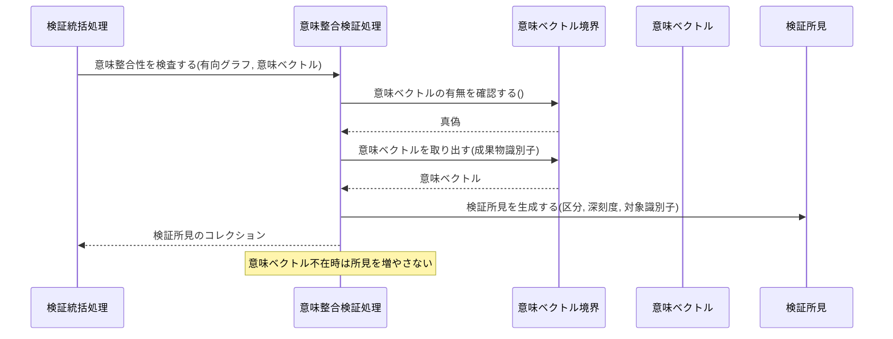
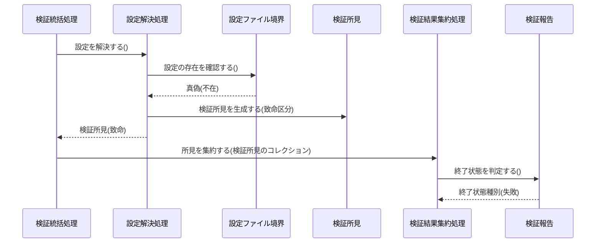
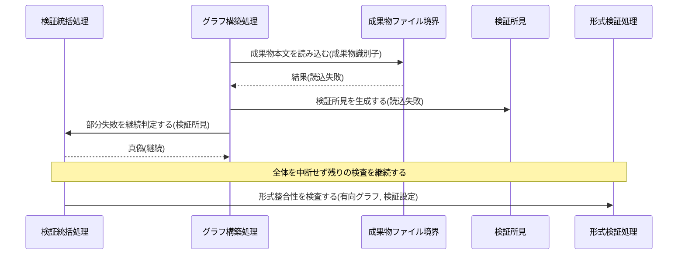

Document ID: SEQD-LGX-001

# SEQD-LGX-001: グラフ読み込みと検証 のクラス間メッセージング

**親 RBD**: RBD-LGX-001
**親 SEQA**: SEQA-LGX-001 / **親 UC**: UC-LGX-001
**レイヤ**: 具体側（クラス図レベル、言語非依存）

> **記述規律**: RBD-LGX-001 で識別したクラスをレーンとして、操作呼び出しの時系列を描く。**操作呼び出しは操作名（人間の言語）**。関数名・引数具体型・戻り型・言語固有同期機構は書かない（DD で確定）。本 SEQD は **Behavior Allocation**（どのクラスがどの操作を担うか）を確定する。
>
> **ハードルール 10**: 命名規則に従う関数呼び出し・言語固有のジェネリック型・並行修飾子・モジュール識別子が混入したら違反。`scripts/trace-check.sh` [5/5] が検出する。本ファイルは禁止トークンを literal で引用しない（記述的に書く）。

---

## 1. 基本フロー（`check --formal`）

```mermaid
sequenceDiagram
    actor Actor as 開発者 / CI システム
    participant B1 as 検証コマンド受付窓口
    participant C0 as 検証統括処理
    participant C1 as 設定解決処理
    participant Bcfg as 設定ファイル境界
    participant Ecfg as 検証設定
    participant C2 as グラフ構築処理
    participant Bgraph as グラフ定義境界
    participant Egraph as 有向グラフ
    participant C3 as 形式検証処理
    participant Efind as 検証所見
    participant C5 as 検証結果集約処理
    participant Ereport as 検証報告
    participant B2 as 検証結果出力窓口

    Actor->>B1: 検証を受け付ける(検証モード種別)
    B1->>C0: 検証を統括する(検証モード種別)
    C0->>C1: 設定を解決する()
    C1->>Bcfg: 設定を読み込む()
    Bcfg-->>C1: 設定内容
    C1->>Ecfg: 設定値を確定する(設定内容)
    C1-->>C0: 検証設定
    C0->>C2: 有向グラフを構築する()
    C2->>Bgraph: グラフ定義を読み込む()
    Bgraph-->>C2: 定義内容
    C2->>Egraph: ノードとエッジを構築する(定義内容)
    C2->>Egraph: 未解決エッジを記録する(エッジ)
    C2-->>C0: 有向グラフ
    C0->>C3: 形式整合性を検査する(有向グラフ, 検証設定)
    C3->>Egraph: ノードを取り出す(ノード識別子)
    Egraph-->>C3: ノード
    C3->>Egraph: 巡回を判定する()
    Egraph-->>C3: 真偽
    C3->>Efind: 検証所見を生成する(区分, 深刻度, 対象識別子)
    C3-->>C0: 検証所見のコレクション
    C0->>C5: 所見を集約する(検証所見のコレクション)
    C5->>Ereport: 検証報告を構成する(検証所見のコレクション)
    C5->>Ereport: 終了状態を判定する()
    Ereport-->>C5: 終了状態種別
    C5->>B2: 検証報告を出力する(検証報告)
    B2-->>Actor: 検証報告 + 終了状態
```

## 2. 代替フロー

### 代替 4a: 無印 `check`（意味整合検証を追加）



### 代替 2a / 3a: 設定 / グラフ不在



## 3. 例外フロー

### 例外: 一部成果物ファイルの読込失敗（部分失敗継続）



## 4. 並行性（概念レベル）

`check` は読み取り専用の逐次判定であり、ドメインレベルの並行性はない。並行アクセス時の整合性は検証対象外。具体的な並行機構は DD で扱う。

## 5. 失敗伝搬

- 各操作の戻り値は「結果」概念（成功 / 失敗 + 理由）で表現。具体的なエラー型は DD で確定。
- 致命的な検証所見（設定/グラフ不在・破損）は検証結果集約処理が終了状態種別（失敗）へ伝搬する。
- 部分的な読込失敗は検証所見として記録され、検証統括処理が継続を判定する（致命に昇格しない）。

## 6. Behavior Allocation（操作のクラス帰属、§6.3）

各操作は一つのクラスに帰属する（複数クラスへの分散なし）。Boundary=境界操作のみ / Control=複数 Entity の協調 / Entity=自身のデータ操作。

| 操作 | 帰属クラス | 役割 | 妥当性 |
|---|---|---|---|
| 検証を受け付ける | 検証コマンド受付窓口 | Boundary（アクター境界） | ✓ 境界操作のみ |
| 検証を統括する / 部分失敗を継続判定する | 検証統括処理 | Control（協調） | ✓ |
| 設定を解決する | 設定解決処理 | Control | ✓ |
| 設定を読み込む / 存在を確認する | 設定ファイル境界 | Boundary（外部ファイル境界） | ✓ |
| 有向グラフを構築する / 未解決エッジを記録する | グラフ構築処理 | Control | ✓ |
| ノードを取り出す / 隣接を辿る / 巡回を判定する | 有向グラフ | Entity（自身のデータ） | ✓ |
| 形式整合性を検査する | 形式検証処理 | Control | ✓ |
| 意味整合性を検査する | 意味整合検証処理 | Control | ✓ |
| 所見を集約する | 検証結果集約処理 | Control | ✓ |
| 検証報告を構成する / 終了状態を判定する | 検証報告 | Entity（自身のデータ） | ✓ |
| 検証報告を出力する / ログを出力する | 検証結果出力窓口 | Boundary | ✓ |

割り当てに迷う操作なし。各操作が UC ステップ / SEQA メッセージに対応（余剰操作なし）。

## 7. 整合性確認

- [x] レーンが RBD-LGX-001 のクラスと一致する
- [x] 操作呼び出しが RBD-LGX-001 で識別した操作と対応する
- [x] 命名規則に従う関数名が混入していない（操作名は日本語）
- [x] 言語固有の引数型・戻り型が混入していない（概念型のみ）
- [x] 言語固有同期機構の表記が混入していない

## 8. 履歴

| 日付 | 変更内容 |
|---|---|
| 2026-06-13 | 初版。RBD-LGX-001 のクラスをレーンに操作呼び出し時系列を展開。基本（check --formal）/ 代替（無印 check・設定/グラフ不在）/ 例外（部分失敗継続）。Behavior Allocation（操作のクラス帰属）を確定。失敗伝搬を概念表現。言語要素なし |
