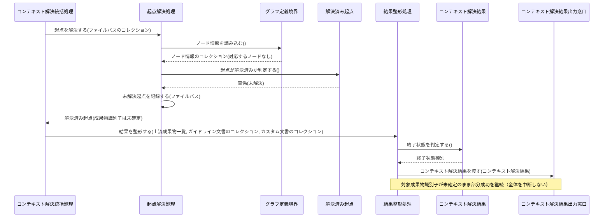
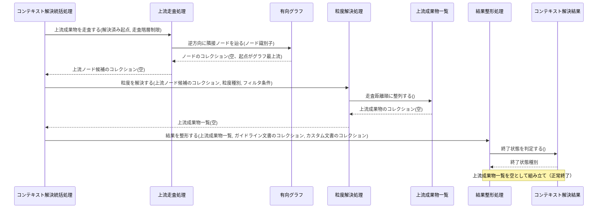
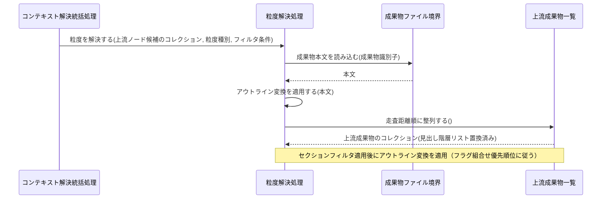
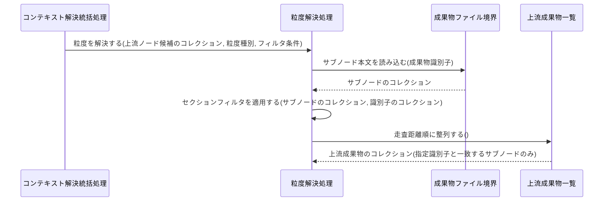
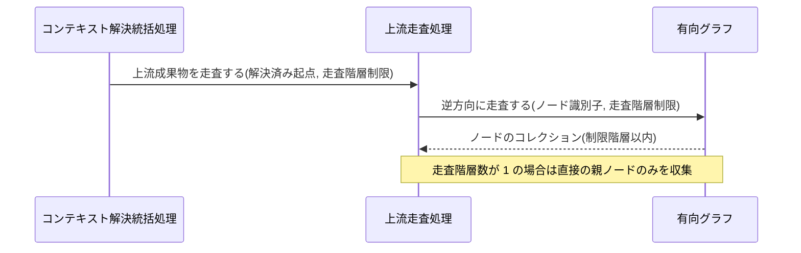
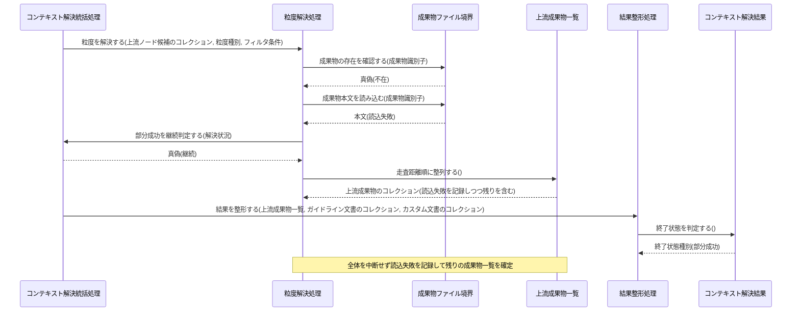
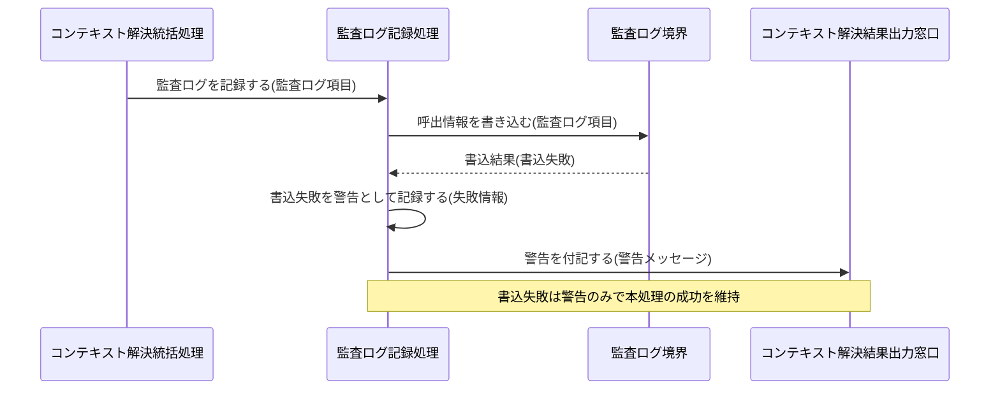
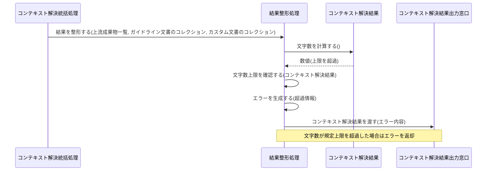

Document ID: SEQD-LGX-002

# SEQD-LGX-002: コンテキスト解決 のクラス間メッセージング

**親 RBD**: RBD-LGX-002
**親 SEQA**: SEQA-LGX-002 / **親 UC**: UC-LGX-002
**レイヤ**: 具体側（クラス図レベル、言語非依存）

> **記述規律**: RBD-LGX-002 で識別したクラスをレーンとして、操作呼び出しの時系列を描く。**操作呼び出しは操作名（人間の言語）**。関数名・引数具体型・戻り型・言語固有同期機構は書かない（DD で確定）。本 SEQD は **Behavior Allocation**（どのクラスがどの操作を担うか）を確定する。
>
> **ハードルール 10**: 命名規則に従う関数呼び出し・言語固有のジェネリック型・並行修飾子・モジュール識別子が混入したら違反。`scripts/trace-check.sh` [5/5] が検出する。本ファイルは禁止トークンを literal で引用しない（記述的に書く）。

---

## 1. 基本フロー（`context <files>`）

```mermaid
sequenceDiagram
    actor Actor as Claude Code / 開発者
    participant B受付 as コンテキスト解決コマンド受付窓口
    participant C統括 as コンテキスト解決統括処理
    participant C起点 as 起点解決処理
    participant Bグラフ定義 as グラフ定義境界
    participant E起点 as 解決済み起点
    participant Eグラフ as 有向グラフ
    participant C走査 as 上流走査処理
    participant C粒度 as 粒度解決処理
    participant B成果物 as 成果物ファイル境界
    participant E上流 as 上流成果物一覧
    participant Cガイド as レイヤーガイドライン解決処理
    participant Bガイド as レイヤーガイドライン境界
    participant Cカスタム as カスタム文書解決処理
    participant C整形 as 結果整形処理
    participant E結果 as コンテキスト解決結果
    participant C監査 as 監査ログ記録処理
    participant B監査 as 監査ログ境界
    participant B出力 as コンテキスト解決結果出力窓口

    Actor->>B受付: コンテキスト解決を受け付ける(ファイルパスのコレクション, オプション種別)
    B受付->>C統括: コンテキスト解決を統括する(ファイルパスのコレクション, オプション種別)
    C統括->>C起点: 起点を解決する(ファイルパスのコレクション)
    C起点->>Bグラフ定義: ノード情報を読み込む()
    Bグラフ定義-->>C起点: ノード情報のコレクション
    C起点->>Bグラフ定義: エッジ情報を読み込む()
    Bグラフ定義-->>C起点: エッジ情報のコレクション
    C起点->>E起点: 起点が解決済みか判定する()
    E起点-->>C起点: 真偽
    C起点-->>C統括: 解決済み起点
    C統括->>C走査: 上流成果物を走査する(解決済み起点, 走査階層制限)
    C走査->>Eグラフ: 逆方向に隣接ノードを辿る(ノード識別子)
    Eグラフ-->>C走査: ノードのコレクション
    C走査-->>C統括: 上流ノード候補のコレクション
    C統括->>C粒度: 粒度を解決する(上流ノード候補のコレクション, 粒度種別, フィルタ条件)
    C粒度->>B成果物: 成果物本文を読み込む(成果物識別子)
    B成果物-->>C粒度: 本文
    C粒度->>E上流: 走査距離順に整列する()
    E上流-->>C粒度: 上流成果物のコレクション
    C粒度-->>C統括: 上流成果物一覧
    C統括->>Cガイド: レイヤーガイドラインを解決する(レイヤー種別)
    Cガイド->>Bガイド: レイヤーに対応するガイドライン文書を取得する(レイヤー種別)
    Bガイド-->>Cガイド: ガイドライン文書のコレクション
    Cガイド-->>C統括: ガイドライン文書のコレクション
    C統括->>Cカスタム: カスタム文書を解決する()
    Cカスタム->>Bグラフ定義: カスタムエッジ情報を取得する()
    Bグラフ定義-->>Cカスタム: カスタムエッジ情報のコレクション
    Cカスタム-->>C統括: カスタム文書のコレクション
    C統括->>C整形: 結果を整形する(上流成果物一覧, ガイドライン文書のコレクション, カスタム文書のコレクション)
    C整形->>E結果: 文字数を計算する()
    E結果-->>C整形: 数値
    C整形->>E結果: 終了状態を判定する()
    E結果-->>C整形: 終了状態種別
    C整形->>B出力: コンテキスト解決結果を渡す(コンテキスト解決結果)
    C統括->>C監査: 監査ログを記録する(監査ログ項目)
    C監査->>E結果: 終了状態を判定する()
    E結果-->>C監査: 終了状態種別
    C監査->>B監査: 呼出情報を書き込む(監査ログ項目)
    B監査-->>C監査: 書込結果
    B出力-->>Actor: コンテキスト解決結果(6 セクション・決定論的順序)
```

## 2. 代替フロー

### 代替 2a: ファイルがどのノードにも対応しない



### 代替 3a: 上流成果物が存在しない



### 代替 4-A: アウトラインのみ指定（見出し変換）



### 代替 4-B: セクション識別子指定（サブノード絞り込み）



### 代替 4-C: 走査階層数指定（走査階層制限）



## 3. 例外フロー

### 例外: 成果物ファイル読込失敗（部分成功継続）



### 例外: 監査ログ書込失敗（ベストエフォート）



### 例外: 返却本文が上限を超過（大規模返却エラー）



## 4. 並行性（概念レベル）

`context` はファイルパスから上流を解決する読み取り中心の処理であり、ドメインレベルで並行に発生する事象はない。コンテキスト解決統括処理が各処理を順に協調し、逐次進行する。並行アクセス時の安全性（決定論保証）は非機能要件射程であり、具体的な並行機構は DD で扱う。

## 5. 失敗伝搬

- 各操作の戻り値は「結果」概念（成功 / 失敗 + 理由）で表現する。具体的なエラー型は DD で確定。
- 成果物ファイル読込失敗は部分成功として継続する（コンテキスト解決統括処理が継続を判定）。致命的な失敗には昇格しない。
- 監査ログ書込失敗はベストエフォートで警告に留め、本処理の成功を維持する。
- 返却本文の文字数が規定上限を超過した場合、結果整形処理がエラーを生成して返却する（終了状態種別=エラー）。

## 6. Behavior Allocation（操作のクラス帰属、§6.3）

各操作は一つのクラスに帰属する（複数クラスへの分散なし）。Boundary=境界操作のみ / Control=複数 Entity の協調 / Entity=自身のデータ操作。

| 操作 | 帰属クラス | 役割 | 妥当性 |
|---|---|---|---|
| コンテキスト解決を受け付ける | コンテキスト解決コマンド受付窓口 | Boundary（アクター境界） | ✓ 境界操作のみ |
| コンテキスト解決を統括する / 部分成功を継続判定する | コンテキスト解決統括処理 | Control（協調） | ✓ |
| 起点を解決する / 未解決起点を記録する | 起点解決処理 | Control | ✓ |
| ノード情報を読み込む / エッジ情報を読み込む / カスタムエッジ情報を取得する / グラフ定義の存在を確認する | グラフ定義境界 | Boundary（外部ファイル境界） | ✓ |
| 起点が解決済みか判定する | 解決済み起点 | Entity（自身のデータ） | ✓ |
| 上流成果物を走査する / 逆方向に走査する | 上流走査処理 | Control | ✓ |
| ノードを取り出す / 逆方向に隣接ノードを辿る / カスタムエッジを取り出す | 有向グラフ | Entity（自身のデータ） | ✓ |
| 粒度を解決する / セクションフィルタを適用する / アウトライン変換を適用する | 粒度解決処理 | Control | ✓ |
| 成果物本文を読み込む / サブノード本文を読み込む / 成果物の存在を確認する | 成果物ファイル境界 | Boundary（外部ファイル境界） | ✓ |
| 走査距離順に整列する | 上流成果物一覧 | Entity（自身のデータ） | ✓ |
| レイヤーガイドラインを解決する | レイヤーガイドライン解決処理 | Control | ✓ |
| レイヤーに対応するガイドライン文書を取得する | レイヤーガイドライン境界 | Boundary（外部ファイル境界） | ✓ |
| カスタム文書を解決する | カスタム文書解決処理 | Control | ✓ |
| 結果を整形する / 文字数上限を確認する / エラーを生成する | 結果整形処理 | Control | ✓ |
| 文字数を計算する / 終了状態を判定する | コンテキスト解決結果 | Entity（自身のデータ） | ✓ |
| 監査ログを記録する / 書込失敗を警告として記録する | 監査ログ記録処理 | Control | ✓ |
| 呼出情報を書き込む | 監査ログ境界 | Boundary（外部保存域境界） | ✓ |
| コンテキスト解決結果を渡す / 警告を付記する | コンテキスト解決結果出力窓口 | Boundary（アクター境界） | ✓ |

割り当てに迷う操作なし。各操作が UC ステップ / SEQA メッセージに対応（余剰操作なし）。

## 7. 整合性確認

- [x] レーンが RBD-LGX-002 のクラスと一致する（Boundary 7 / Control 8 / Entity 4）
- [x] 操作呼び出しが RBD-LGX-002 で識別した操作と対応する
- [x] 命名規則に従う関数名が混入していない（操作名は日本語）
- [x] 言語固有の引数型・戻り型が混入していない（概念型のみ）
- [x] 言語固有同期機構の表記が混入していない
- [x] 言語固有のジェネリック型の literal 引用なし
- [x] UC-LGX-002 の基本（Step1-7）/ 代替（2a・3a・4-A・4-B・4-C）/ 例外（部分成功継続・監査ログ書込失敗・大規模返却エラー）フローを網羅
- [x] Noun-Verb ルール遵守（Actor⇄Boundary / Boundary⇄Control / Control⇄Control / Control⇄Entity のみ）
- [x] Boundary 同士の直接通信なし / Entity 同士の直接通信なし

## 8. 履歴

| 日付 | 変更内容 |
|---|---|
| 2026-06-13 | 初版。RBD-LGX-002 のクラスをレーンに操作呼び出し時系列を展開。基本（context files）/ 代替（2a・3a・4-A・4-B・4-C）/ 例外（部分成功継続・監査ログ書込失敗・大規模返却エラー）。Behavior Allocation（操作のクラス帰属）を確定。失敗伝搬を概念表現。言語要素なし |
