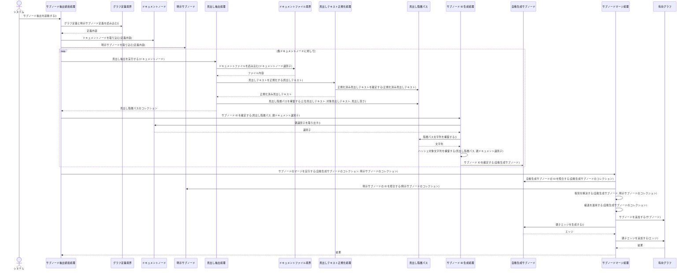
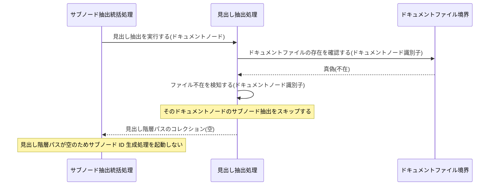
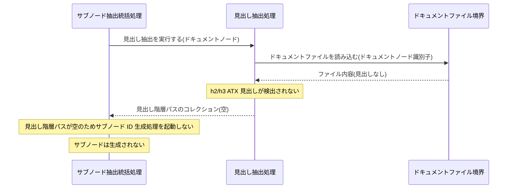
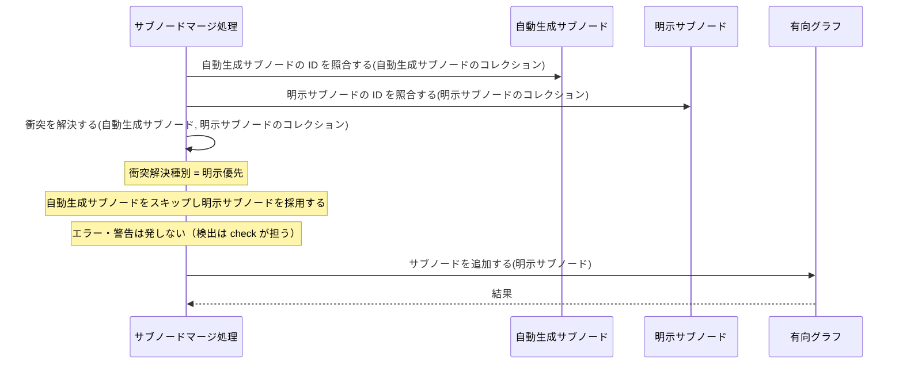
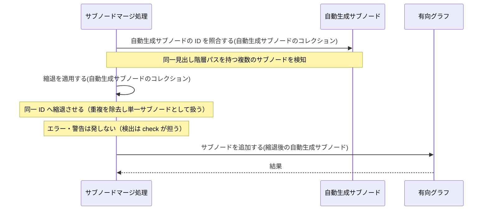

Document ID: SEQD-LGX-003

# SEQD-LGX-003: サブノード自動抽出 のクラス間メッセージング

**親 RBD**: RBD-LGX-003
**親 SEQA**: SEQA-LGX-003 / **親 UC**: UC-LGX-003
**レイヤ**: 具体側（クラス図レベル、言語非依存）

> **記述規律**: RBD-LGX-003 で識別したクラスをレーンとして、操作呼び出しの時系列を描く。**操作呼び出しは操作名（人間の言語）**。関数名・引数具体型・戻り型・言語固有同期機構は書かない（DD で確定）。本 SEQD は **Behavior Allocation**（どのクラスがどの操作を担うか）を確定する。
>
> **ハードルール 10**: 命名規則に従う関数呼び出し・言語固有のジェネリック型・並行修飾子・モジュール識別子が混入したら違反。`scripts/trace-check.sh` [5/5] が検出する。本ファイルは禁止トークンを literal で引用しない（記述的に書く）。

---

## 1. 基本フロー（graph.toml 読み込み時の自動サブノード抽出）

## 2. 代替フロー

### 代替 2a: ドキュメントファイルが存在しない場合

### 代替 2b: h2/h3 見出しが存在しない場合

### 代替 3a: 明示サブノードと自動生成サブノードの ID 衝突

## 3. 例外フロー

### 例外: 自動生成サブノード同士の見出し階層パス一致（同一 ID 縮退）

## 4. 並行性（概念レベル）

自動処理型 UC であり、graph.toml 読み込み処理の内部イベントとして逐次実行される。アクターが CLI 窓口を持たない自動処理型パターン（Actor→Control 直結）を取るため、並行起動は発生しない。各ドキュメントノードに対する見出し抽出処理は統括処理の協調下で順次実行され、マージ段階では全ドキュメントノードの処理完了後に一括適用される。並行アクセス時の整合性は本 UC の射程外（NFR 層の責務）。具体的な並行機構は DD で扱う。

## 5. 失敗伝搬

- 各操作の戻り値は「結果」概念（成功 / 失敗 + 理由）で表現。具体的なエラー型は DD で確定。
- ドキュメントファイル不在（代替 2a）は、当該ドキュメントノードのサブノード抽出をスキップするが、全体処理を中断しない。見出し抽出処理が統括処理に空の見出し階層パスのコレクションを返すことで上位へ伝達する。
- 明示サブノードとの ID 衝突（代替 3a）および自動生成同士の縮退（例外）は、サブノードマージ処理が静粛に衝突解決種別を返し、エラー・警告を発しない（違反の検出・可視化は check コマンドが担う）。

## 6. Behavior Allocation（操作のクラス帰属、§6.3）

各操作は一つのクラスに帰属する（複数クラスへの分散なし）。Boundary=境界操作のみ / Control=複数 Entity の協調 / Entity=自身のデータ操作。

| 操作 | 帰属クラス | 役割 | 妥当性 |
|---|---|---|---|
| サブノード抽出を起動する / ドキュメントノードを取り込む / 明示サブノードを取り込む | サブノード抽出統括処理 | Control（協調） | ✓ 全ドキュメントノードの処理協調とマージ依頼を担う |
| グラフ定義と明示サブノード定義を読み込む / グラフ定義の存在を確認する | グラフ定義境界 | Boundary（外部ファイル境界） | ✓ 境界操作のみ |
| ドキュメントファイルを読み込む / ドキュメントファイルの存在を確認する | ドキュメントファイル境界 | Boundary（外部ファイル境界） | ✓ 境界操作のみ |
| 見出し抽出を実行する / ファイル不在を検知する | 見出し抽出処理 | Control（協調） | ✓ ファイル読み込み・正規化依頼・見出し階層パス構築・ID 生成依頼を担う |
| 見出しテキストを正規化する | 見出しテキスト正規化処理 | Control（変換） | ✓ 正規化変換ロジックのみ、抽出・生成越権なし |
| 階層パス文字列を構築する | 見出し階層パス | Entity（自身のデータ） | ✓ 自身の文字列表現を組み立てる |
| サブノード ID を確定する / ハッシュ対象文字列を構築する | サブノード ID 生成処理 | Control（生成） | ✓ 階層パスと親 ID からサブノード ID を確定する、マージ・グラフ更新越権なし |
| 親識別子を取り出す | ドキュメントノード | Entity（自身のデータ） | ✓ 自身の属性を返す |
| 親子エッジを生成する | 自動生成サブノード | Entity（自身のデータ） | ✓ 自身から派生するエッジを生成する |
| サブノードのマージを実行する / 衝突を解決する / 縮退を適用する | サブノードマージ処理 | Control（統合） | ✓ 明示優先・縮退解決・グラフ反映を担う、見出し抽出・ID 生成越権なし |
| サブノードを追加する / 親子エッジを追加する / ノードを取り出す | 有向グラフ | Entity（自身のデータ） | ✓ 自身のコレクションに対する追加・参照操作 |

割り当てに迷う操作なし。各操作が UC ステップ / SEQA メッセージに対応（余剰操作なし）。

## 7. 整合性確認

- [x] レーンが RBD-LGX-003 のクラスと一致する（Boundary 2 / Control 5 / Entity 5）
- [x] 操作呼び出しが RBD-LGX-003 で識別した操作と対応する
- [x] 命名規則に従う関数名が混入していない（操作名は日本語）
- [x] 言語固有の引数型・戻り型が混入していない（概念型のみ）
- [x] 言語固有同期機構の表記が混入していない
- [x] Noun-Verb ルール遵守（Actor→Control / Boundary↔Control / Control↔Control / Control↔Entity のみ。Boundary 同士・Entity 同士・Boundary→Entity・Actor→Entity の直接通信なし）
- [x] UC-LGX-003 の基本フロー（Step 1-4）/ 代替（2a/2b/3a）/ 例外（自動同士縮退）を網羅

## 8. 履歴

| 日付 | 変更内容 |
|---|---|
| 2026-06-13 | 初版。RBD-LGX-003 のクラスをレーンに操作呼び出し時系列を展開。基本（graph.toml 読み込み時自動サブノード抽出）/ 代替（ファイル不在・見出しなし・明示優先）/ 例外（自動同士縮退）。Behavior Allocation（操作のクラス帰属）を確定。失敗伝搬を概念表現。言語要素なし |
