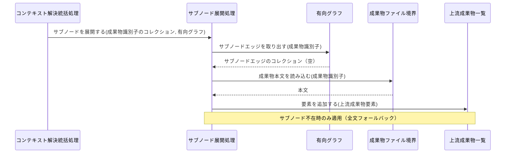
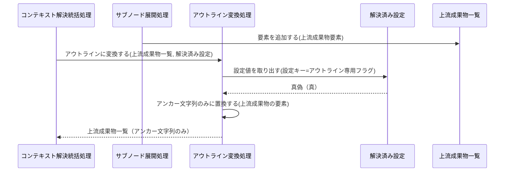
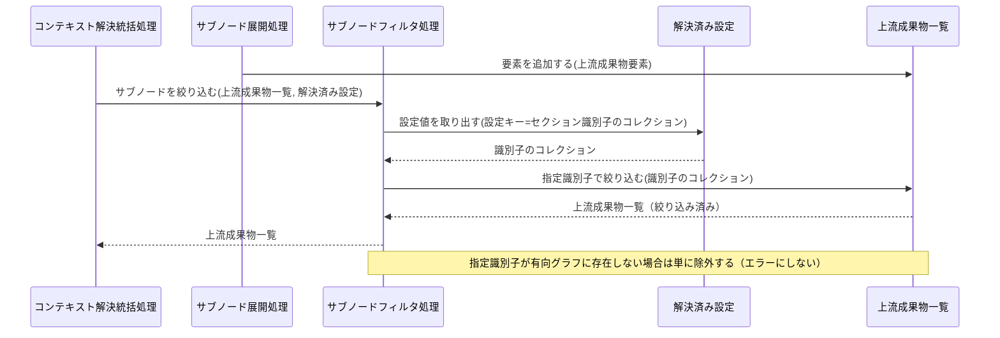
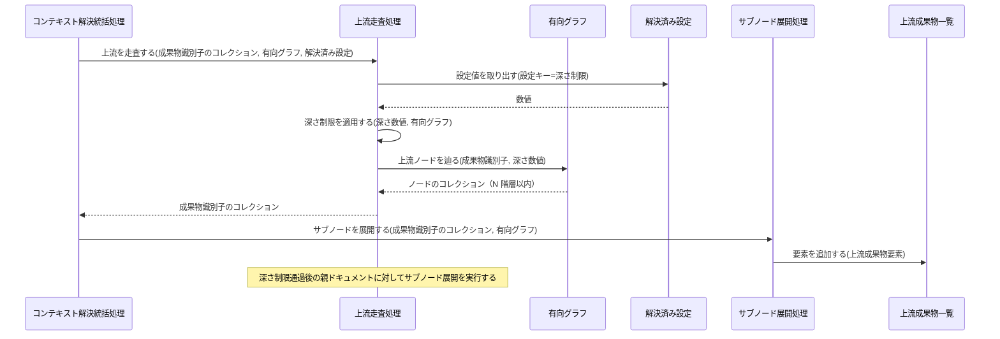
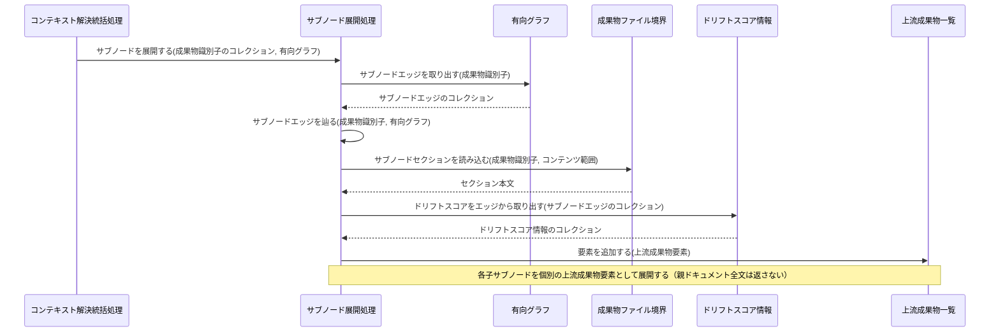
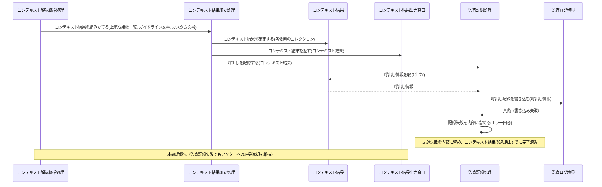

Document ID: SEQD-LGX-004

# SEQD-LGX-004: 粒度制御付きコンテキスト解決 のクラス間メッセージング

**親 RBD**: RBD-LGX-004
**親 SEQA**: SEQA-LGX-004 / **親 UC**: UC-LGX-004
**レイヤ**: 具体側（クラス図レベル、言語非依存）

> **記述規律**: RBD-LGX-004 で識別したクラスをレーンとして、操作呼び出しの時系列を描く。**操作呼び出しは操作名（人間の言語）**。関数名・引数具体型・戻り型・言語固有同期機構は書かない（DD で確定）。本 SEQD は **Behavior Allocation**（どのクラスがどの操作を担うか）を確定する。
>
> **ハードルール 10**: 命名規則に従う関数呼び出し・言語固有のジェネリック型・並行修飾子・モジュール識別子が混入したら違反。`scripts/trace-check.sh` [5/5] が検出する。本ファイルは禁止トークンを literal で引用しない（記述的に書く）。

---

## 1. 基本フロー（`context <files> --granularity subnode`）

```mermaid
sequenceDiagram
    actor Actor as Claude Code / 開発者
    participant B1 as 粒度制御コマンド受付窓口
    participant C0 as コンテキスト解決統括処理
    participant C1 as 設定解決処理
    participant Bcfg as 設定ファイル境界
    participant Ecfg as 解決済み設定
    participant C2 as 成果物 ID 逆引き処理
    participant Bgraph as グラフ定義境界
    participant Egraph as 有向グラフ
    participant C3 as 上流走査処理
    participant C4 as サブノード展開処理
    participant Bfile as 成果物ファイル境界
    participant Eupstream as 上流成果物一覧
    participant Edrift as ドリフトスコア情報
    participant C7 as ガイドライン解決処理
    participant Eguide as ガイドライン文書
    participant C8 as カスタム文書解決処理
    participant Ecustom as カスタム文書
    participant C9 as コンテキスト結果組立処理
    participant Eresult as コンテキスト結果
    participant C10 as 監査記録処理
    participant Blog as 監査ログ境界
    participant B2 as コンテキスト結果出力窓口

    Actor->>B1: コンテキスト解決を受け付ける(粒度種別, フラグ設定のコレクション)
    B1->>C0: 粒度制御付きコンテキスト解決を統括する(粒度種別, フラグ設定のコレクション)
    C0->>C1: 設定を解決する()
    C1->>Bcfg: 設定を読み込む()
    Bcfg-->>C1: 設定内容
    C1->>Ecfg: 設定値を確定する(設定内容)
    C1-->>C0: 解決済み設定
    C0->>C2: 成果物 ID を逆引きする(ファイルパスのコレクション, 有向グラフ)
    C2->>Bgraph: グラフ定義を読み込む()
    Bgraph-->>C2: グラフ定義内容
    C2->>Egraph: ノードとエッジを構築する(グラフ定義内容)
    C2-->>C0: 成果物識別子のコレクション
    C0->>C3: 上流を走査する(成果物識別子のコレクション, 有向グラフ, 解決済み設定)
    C3->>Egraph: 上流ノードを辿る(成果物識別子, 深さ数値)
    Egraph-->>C3: ノードのコレクション
    C3->>C3: 深さ制限を適用する(深さ数値, 有向グラフ)
    C3-->>C0: 成果物識別子のコレクション
    C0->>C0: 粒度によるサブノード処理の要否を判定する(解決済み設定)
    C0->>C4: サブノードを展開する(成果物識別子のコレクション, 有向グラフ)
    C4->>Egraph: サブノードエッジを取り出す(成果物識別子)
    Egraph-->>C4: サブノードエッジのコレクション
    C4->>Bfile: サブノードセクションを読み込む(成果物識別子, コンテンツ範囲)
    Bfile-->>C4: セクション本文
    C4->>Edrift: ドリフトスコアをエッジから取り出す(サブノードエッジのコレクション)
    Edrift-->>C4: ドリフトスコア情報のコレクション
    C4->>Eupstream: 要素を追加する(上流成果物要素)
    C4-->>C0: 上流成果物一覧
    C0->>C7: ガイドラインを解決する(有向グラフ, 解決済み設定)
    C7->>Bgraph: グラフ定義を読み込む()
    Bgraph-->>C7: グラフ定義内容
    C7->>Eguide: ガイドライン文書を確定する(グラフ定義内容, 解決済み設定)
    C7-->>C0: ガイドライン文書
    C0->>C8: カスタム文書を解決する(有向グラフ)
    C8->>Egraph: カスタムエッジを取り出す(成果物識別子)
    Egraph-->>C8: カスタムエッジのコレクション
    C8->>Bfile: 成果物本文を読み込む(成果物識別子)
    Bfile-->>C8: 本文
    C8->>Ecustom: カスタム文書を確定する(本文)
    C8-->>C0: カスタム文書
    C0->>C9: コンテキスト結果を組み立てる(上流成果物一覧, ガイドライン文書, カスタム文書)
    C9->>Eupstream: 決定論的順序で整列する()
    Eupstream-->>C9: 上流成果物一覧
    C9->>Eresult: コンテキスト結果を確定する(各要素のコレクション)
    C9->>Eresult: 終了状態を判定する()
    Eresult-->>C9: 終了状態種別
    C9->>B2: コンテキスト結果を返す(コンテキスト結果)
    C0->>C10: 呼出しを記録する(コンテキスト結果)
    C10->>Eresult: 呼出し情報を取り出す()
    Eresult-->>C10: 呼出し情報
    C10->>Blog: 呼出し記録を書き込む(呼出し情報)
    Blog-->>C10: 真偽
    B2-->>Actor: コンテキスト結果
```

## 2. 代替フロー

### 代替 1a: `--granularity document`（デフォルト、UC-LGX-002 相当動作）

```mermaid
sequenceDiagram
    actor Actor as Claude Code / 開発者
    participant B1 as 粒度制御コマンド受付窓口
    participant C0 as コンテキスト解決統括処理
    participant Ecfg as 解決済み設定
    participant C3 as 上流走査処理
    participant Egraph as 有向グラフ
    participant C4 as サブノード展開処理
    participant Bfile as 成果物ファイル境界
    participant Eupstream as 上流成果物一覧
    participant C9 as コンテキスト結果組立処理
    participant Eresult as コンテキスト結果
    participant B2 as コンテキスト結果出力窓口

    Actor->>B1: コンテキスト解決を受け付ける(粒度種別=ドキュメント, フラグ設定のコレクション)
    B1->>C0: 粒度制御付きコンテキスト解決を統括する(粒度種別=ドキュメント, フラグ設定のコレクション)
    C0->>Ecfg: 設定値を取り出す(設定キー)
    Ecfg-->>C0: 粒度種別
    C0->>C0: 粒度によるサブノード処理の要否を判定する(解決済み設定)
    Note over C0: サブノード展開処理・サブノードフィルタ処理・アウトライン変換処理は起動しない
    C0->>C3: 上流を走査する(成果物識別子のコレクション, 有向グラフ, 解決済み設定)
    C3->>Egraph: 上流ノードを辿る(成果物識別子, 深さ数値)
    Egraph-->>C3: ノードのコレクション
    C3-->>C0: 成果物識別子のコレクション
    C0->>C4: サブノードを展開する(成果物識別子のコレクション, 有向グラフ)
    C4->>Bfile: 成果物本文を読み込む(成果物識別子)
    Bfile-->>C4: 本文
    C4->>Eupstream: 要素を追加する(上流成果物要素)
    C4-->>C0: 上流成果物一覧
    C0->>C9: コンテキスト結果を組み立てる(上流成果物一覧, ガイドライン文書, カスタム文書)
    C9->>Eresult: コンテキスト結果を確定する(各要素のコレクション)
    C9->>B2: コンテキスト結果を返す(コンテキスト結果)
    B2-->>Actor: コンテキスト結果（ドキュメント全文）
```

### 代替 3a: サブノード不在時の フォールバック（ドキュメント全体を返却）



### 代替 4-A: `--outline-only`（アンカー文字列のみ返却）



### 代替 4-B: `--sections <識別子群>`（指定サブノードのみ絞り込み）



### 代替 4-C: `--depth N`（上流走査を N 階層に制限）



### 代替 4-D: `--granularity subnode` 時の子サブノード個別展開



## 3. 例外フロー

### 例外: 監査記録失敗（本処理結果の返却を優先）



### 例外: 設定ファイル不在

```mermaid
sequenceDiagram
    participant C0 as コンテキスト解決統括処理
    participant C1 as 設定解決処理
    participant Bcfg as 設定ファイル境界
    participant B2 as コンテキスト結果出力窓口
    actor Actor as Claude Code / 開発者

    C0->>C1: 設定を解決する()
    C1->>Bcfg: 設定の存在を確認する()
    Bcfg-->>C1: 真偽（不在）
    C1-->>C0: 結果（設定解決失敗）
    C0->>B2: エラー報告を返す(エラー内容)
    B2-->>Actor: エラー報告（設定ファイル不在）
```

## 4. 並行性（概念レベル）

`context` はコンテキスト解決のワークフローであり、ドメインレベルの並行性はない。設定解決 → 成果物 ID 逆引き → 上流走査 → サブノード展開 → フィルタ/変換 → ガイドライン解決 → カスタム文書解決 → 結果組立 → 監査記録は、コンテキスト解決統括処理の協調下で逐次進む。ファイル入出力の実装レベル並列化は DD 以降の関心事。

## 5. 失敗伝搬

- 各操作の戻り値は「結果」概念（成功 / 失敗 + 理由）で表現。具体的なエラー型は DD で確定。
- 設定ファイル不在は設定解決処理がコンテキスト解決統括処理に伝搬し、コンテキスト結果出力窓口がエラー報告としてアクターに返す。
- 監査記録失敗は監査記録処理が内部に留め（本処理への伝搬なし）、コンテキスト結果の返却を維持する。
- サブノード不在は致命的失敗ではなくフォールバック（ドキュメント全文返却）として扱い、処理を継続する。

## 6. Behavior Allocation（操作のクラス帰属）

各操作は一つのクラスに帰属する（複数クラスへの分散なし）。Boundary=境界操作のみ / Control=複数クラスの協調 / Entity=自身のデータ操作。

| 操作 | 帰属クラス | 役割 | 妥当性 |
|---|---|---|---|
| コンテキスト解決を受け付ける | 粒度制御コマンド受付窓口 | Boundary（アクター境界） | ✓ 境界操作のみ |
| 粒度制御付きコンテキスト解決を統括する / 粒度によるサブノード処理の要否を判定する | コンテキスト解決統括処理 | Control（協調） | ✓ |
| 設定を解決する | 設定解決処理 | Control | ✓ |
| 設定を読み込む / 設定の存在を確認する | 設定ファイル境界 | Boundary（外部ファイル境界） | ✓ |
| 設定値を確定する / 設定値を取り出す / サブノード処理が必要かを返す | 解決済み設定 | Entity（自身のデータ） | ✓ |
| 成果物 ID を逆引きする | 成果物 ID 逆引き処理 | Control | ✓ |
| グラフ定義を読み込む / グラフ定義の存在を確認する | グラフ定義境界 | Boundary（外部ファイル境界） | ✓ |
| ノードとエッジを構築する / 上流ノードを辿る / サブノードエッジを取り出す / カスタムエッジを取り出す | 有向グラフ | Entity（自身のデータ） | ✓ |
| 上流を走査する / 深さ制限を適用する | 上流走査処理 | Control | ✓ |
| サブノードを展開する / サブノードエッジを辿る / セクション本文を取り出す / ドキュメント全文を取り出す / ドリフトスコアをエッジから取り出す | サブノード展開処理 | Control | ✓ |
| 成果物本文を読み込む / サブノードセクションを読み込む / 成果物の存在を確認する | 成果物ファイル境界 | Boundary（外部ファイル境界） | ✓ |
| 要素を追加する / 指定識別子で絞り込む / 決定論的順序で整列する | 上流成果物一覧 | Entity（自身のデータ） | ✓ |
| ドリフトスコアをエッジから取り出す（スコア情報保持） | ドリフトスコア情報 | Entity（自身のデータ） | ✓ |
| サブノードを絞り込む | サブノードフィルタ処理 | Control | ✓ |
| アウトラインに変換する / アンカー文字列のみに置換する | アウトライン変換処理 | Control | ✓ |
| ガイドラインを解決する / ガイドライン文書を確定する（境界参照経由） | ガイドライン解決処理 | Control | ✓ |
| ガイドライン文書を確定する（データ保持） | ガイドライン文書 | Entity（自身のデータ） | ✓ |
| カスタム文書を解決する / カスタム文書を確定する（境界参照経由） | カスタム文書解決処理 | Control | ✓ |
| カスタム文書を確定する（データ保持） | カスタム文書 | Entity（自身のデータ） | ✓ |
| コンテキスト結果を組み立てる / 決定論的順序で配置する | コンテキスト結果組立処理 | Control（協調） | ✓ |
| コンテキスト結果を確定する / 終了状態を判定する / 呼出し情報を取り出す | コンテキスト結果 | Entity（自身のデータ） | ✓ |
| コンテキスト結果を返す / エラー報告を返す | コンテキスト結果出力窓口 | Boundary（アクター境界） | ✓ |
| 呼出しを記録する / 記録失敗を内部に留める | 監査記録処理 | Control | ✓ |
| 呼出し記録を書き込む | 監査ログ境界 | Boundary（外部ファイル境界） | ✓ |

割り当てに迷う操作なし。各操作が UC ステップ / SEQA メッセージに対応（余剰操作なし）。

## 7. 整合性確認

- [x] レーンが RBD-LGX-004 のクラスと一致する
- [x] 操作呼び出しが RBD-LGX-004 で識別した操作と対応する
- [x] 命名規則に従う関数名が混入していない（操作名は日本語）
- [x] 言語固有の引数型・戻り型が混入していない（概念型のみ）
- [x] 言語固有同期機構の表記が混入していない
- [x] UC-LGX-004 の基本（ステップ 1-4）/ 代替（1a/3a/4-A/4-B/4-C/4-D）/ 例外（監査記録失敗・設定ファイル不在）フローを網羅
- [x] Noun-Verb 通信制約遵守（Boundary 同士・Entity 同士・Boundary → Entity 直結なし）

## 8. 履歴

| 日付 | 変更内容 |
|---|---|
| 2026-06-13 | 初版。RBD-LGX-004 のクラスをレーンに操作呼び出し時系列を展開。基本（context --granularity subnode）/ 代替（1a/3a/4-A/4-B/4-C/4-D）/ 例外（監査記録失敗・設定ファイル不在）。Behavior Allocation（操作のクラス帰属）を確定。失敗伝搬を概念表現。言語要素なし |
