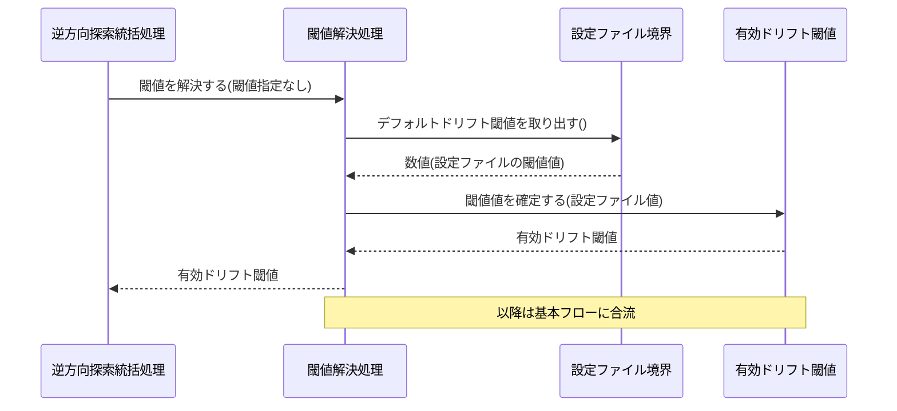
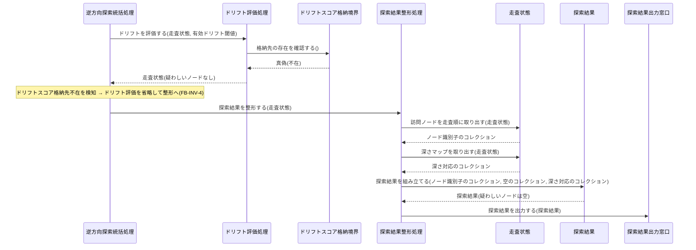
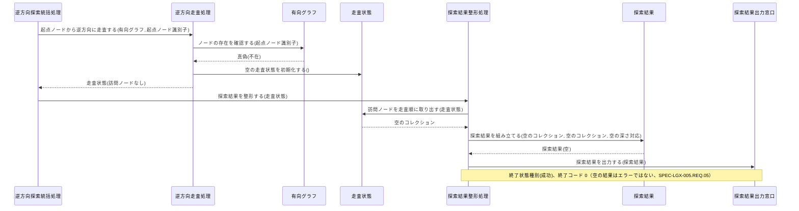

Document ID: SEQD-LGX-005

# SEQD-LGX-005: 逆方向探索 のクラス間メッセージング

**親 RBD**: RBD-LGX-005
**親 SEQA**: SEQA-LGX-005 / **親 UC**: UC-LGX-005
**レイヤ**: 具体側（クラス図レベル、言語非依存）

> **記述規律**: RBD-LGX-005 で識別したクラスをレーンとして、操作呼び出しの時系列を描く。**操作呼び出しは操作名（人間の言語）**。関数名・引数具体型・戻り型・言語固有同期機構は書かない（DD で確定）。本 SEQD は **Behavior Allocation**（どのクラスがどの操作を担うか）を確定する。
>
> **ハードルール 10**: 命名規則に従う関数呼び出し・言語固有のジェネリック型・並行修飾子・モジュール識別子が混入したら違反。`scripts/trace-check.sh` [5/5] が検出する。本ファイルは禁止トークンを literal で引用しない（記述的に書く）。

---

## 1. 基本フロー（`investigate <node-id> --drift-threshold <val>`）

```mermaid
sequenceDiagram
    actor Actor as 開発者 / Linear Agent コンテナ
    participant B1 as 逆方向探索コマンド受付窓口
    participant C0 as 逆方向探索統括処理
    participant C1 as 閾値解決処理
    participant Ethr as 有効ドリフト閾値
    participant C2 as グラフ構築処理
    participant Bgraph as グラフ定義境界
    participant Egraph as 有向グラフ
    participant C3 as 逆方向走査処理
    participant Escan as 走査状態
    participant C4 as ドリフト評価処理
    participant Bdb as ドリフトスコア格納境界
    participant Edrift as ドリフトスコア
    participant C5 as 探索結果整形処理
    participant Eresult as 探索結果
    participant B2 as 探索結果出力窓口

    Actor->>B1: 逆方向探索を受け付ける(起点ノード識別子, 閾値指定)
    B1->>C0: 探索を統括する(起点ノード識別子, 閾値指定)
    C0->>C1: 閾値を解決する(閾値指定)
    C1->>Ethr: 閾値値を確定する(要求値)
    Ethr-->>C1: 有効ドリフト閾値
    C1-->>C0: 有効ドリフト閾値
    C0->>C2: 有向グラフを構築する()
    C2->>Bgraph: グラフ定義を読み込む()
    Bgraph-->>C2: 定義内容
    C2->>Egraph: ノードとエッジを構築する(定義内容)
    C2-->>C0: 有向グラフ
    C0->>C3: 起点ノードから逆方向に走査する(有向グラフ, 起点ノード識別子)
    C3->>Egraph: ノードの存在を確認する(起点ノード識別子)
    Egraph-->>C3: 真偽(存在)
    C3->>Egraph: 上流隣接ノードを辿る(識別子)
    Egraph-->>C3: ノード識別子のコレクション
    C3->>Escan: 訪問済みとして記録する(識別子, 深さ)
    C3-->>C0: 走査状態
    C0->>C4: ドリフトを評価する(走査状態, 有効ドリフト閾値)
    C4->>Bdb: 格納先の存在を確認する()
    Bdb-->>C4: 真偽(存在)
    C4->>Bdb: ドリフトスコアを参照する(エッジ識別子)
    Bdb-->>C4: ドリフトスコア
    C4->>Edrift: スコア値を保持する(エッジ識別子, スコア値)
    C4->>Ethr: 閾値値を取り出す()
    Ethr-->>C4: 数値
    C4->>Escan: 疑わしいとしてマークする(識別子, スコア)
    C4-->>C0: 走査状態(疑わしいノード付き)
    C0->>C5: 探索結果を整形する(走査状態)
    C5->>Escan: 訪問ノードを走査順に取り出す(走査状態)
    Escan-->>C5: ノード識別子のコレクション
    C5->>Escan: 疑わしいノードをスコア降順に取り出す(走査状態)
    Escan-->>C5: ノードスコアのコレクション
    C5->>Escan: 深さマップを取り出す(走査状態)
    Escan-->>C5: 深さ対応のコレクション
    C5->>Eresult: 探索結果を組み立てる(ノード識別子のコレクション, ノードスコアのコレクション, 深さ対応のコレクション)
    Eresult-->>C5: 探索結果
    C5->>B2: 探索結果を出力する(探索結果)
    B2-->>Actor: 探索結果(訪問ノード・疑わしいノード・深さマップ)
```

## 2. 代替フロー

### 代替 1a: 閾値未指定（設定ファイルのデフォルト値を使用）



### 代替 3a: ドリフトスコア格納先が不在（走査結果のみ返す）



## 3. 代替・例外フロー

### 代替: 起点ノードがグラフ上に存在しない（空の結果、エラーではない）



## 4. 並行性（概念レベル）

`investigate` は読み取り専用の逐次探索であり、ドメインレベルの並行性はない。閾値解決・グラフ構築・逆方向走査・ドリフト評価・探索結果整形はすべて逆方向探索統括処理の協調下で逐次進む。グラフの状態変更は行わない（UC-005 事後条件）。並行アクセス時の整合性は本 UC の射程外であり、具体的な並行機構は DD で扱う。

## 5. 失敗伝搬

- 各操作の戻り値は「結果」概念（成功 / 失敗 + 理由）で表現。具体的なエラー型は DD で確定。
- ドリフトスコア格納先不在は致命的な失敗ではなく、逆方向探索統括処理がドリフト評価処理を省略して継続する（代替 3a）。
- 起点ノード不在は致命的失敗ではなく、逆方向走査処理が空の走査状態を返し、探索結果整形処理が空の探索結果を出力して終了状態種別（成功・終了コード 0）となる（SPEC-LGX-005.REQ.05「空の結果を返す＝エラーではない」、代替フロー）。
- それ以外の読み込み失敗（グラフ定義不在・設定ファイル不在）は逆方向探索統括処理が終了状態種別（失敗）を判定し、探索結果出力窓口を通じてアクターへ伝搬する。

## 6. Behavior Allocation（操作のクラス帰属、§6.3）

各操作は一つのクラスに帰属する（複数クラスへの分散なし）。Boundary=境界操作のみ / Control=複数 Entity の協調 / Entity=自身のデータ操作。

| 操作 | 帰属クラス | 役割 | 妥当性 |
|---|---|---|---|
| 逆方向探索を受け付ける | 逆方向探索コマンド受付窓口 | Boundary（アクター境界） | ✓ 境界操作のみ |
| 探索を統括する / ドリフトスコア格納先の不在を検知する | 逆方向探索統括処理 | Control（協調） | ✓ |
| 閾値を解決する | 閾値解決処理 | Control | ✓ |
| 設定を読み込む / デフォルトドリフト閾値を取り出す | 設定ファイル境界 | Boundary（外部ファイル境界） | ✓ |
| グラフ定義を読み込む / グラフ定義の存在を確認する | グラフ定義境界 | Boundary（外部ファイル境界） | ✓ |
| 格納先の存在を確認する / ドリフトスコアを参照する | ドリフトスコア格納境界 | Boundary（外部ストア境界） | ✓ |
| 有向グラフを構築する | グラフ構築処理 | Control | ✓ |
| 起点ノードから逆方向に走査する / 起点ノードの存在を確認する | 逆方向走査処理 | Control | ✓ |
| ドリフトを評価する / 閾値以上のノードを疑わしいとしてマークする | ドリフト評価処理 | Control | ✓ |
| 探索結果を整形する / 訪問ノードを走査順に取り出す / 疑わしいノードをスコア降順に取り出す / 深さマップを取り出す | 探索結果整形処理 | Control | ✓ |
| 閾値値を確定する / 閾値値を取り出す | 有効ドリフト閾値 | Entity（自身のデータ） | ✓ |
| ノードとエッジを構築する / ノードの存在を確認する / 上流隣接ノードを辿る | 有向グラフ | Entity（自身のデータ） | ✓ |
| 訪問済みとして記録する / 疑わしいとしてマークする / 走査失敗を記録する | 走査状態 | Entity（自身のデータ） | ✓ |
| スコア値を保持する | ドリフトスコア | Entity（自身のデータ） | ✓ |
| 探索結果を組み立てる / 終了状態を判定する | 探索結果 | Entity（自身のデータ） | ✓ |
| 探索結果を出力する / エラー結果を出力する | 探索結果出力窓口 | Boundary（出力境界） | ✓ |

割り当てに迷う操作なし。各操作が UC ステップ / SEQA メッセージに対応（余剰操作なし）。

## 7. 整合性確認

- [x] レーンが RBD-LGX-005 のクラスと一致する
- [x] 操作呼び出しが RBD-LGX-005 で識別した操作と対応する
- [x] 命名規則に従う関数名が混入していない（操作名は日本語）
- [x] 言語固有の引数型・戻り型が混入していない（概念型のみ）
- [x] 言語固有同期機構の表記が混入していない
- [x] UC-LGX-005 の基本（Step1-5）/ 代替（1a・3a）/ 例外（起点ノード不在）フローを網羅
- [x] SEQA-LGX-005 の全メッセージがクラス間操作呼び出しに具体化されている

## 8. 履歴

| 日付 | 変更内容 |
|---|---|
| 2026-06-13 | 初版。RBD-LGX-005 のクラスをレーンに操作呼び出し時系列を展開。基本（investigate --drift-threshold 指定）/ 代替（閾値未指定・格納先不在）/ 例外（起点ノード不在）。Behavior Allocation（操作のクラス帰属）を確定。失敗伝搬を概念表現。言語要素なし |
