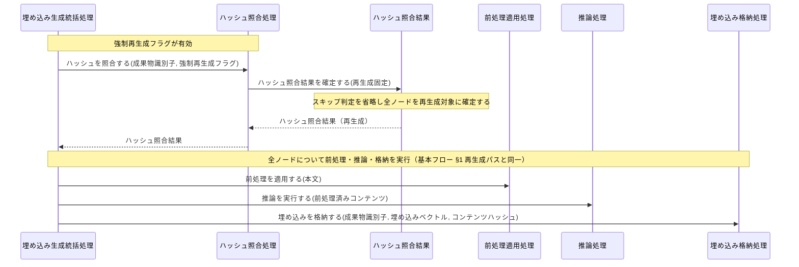
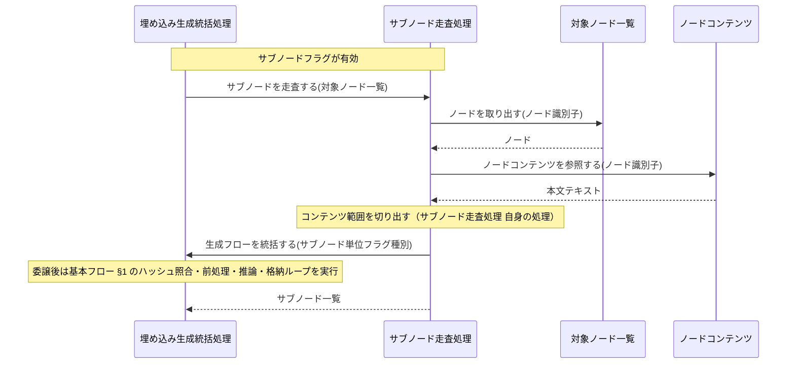
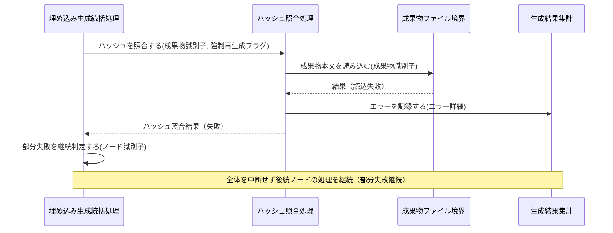

Document ID: SEQD-LGX-007

# SEQD-LGX-007: 埋め込み生成とドリフト検出 のクラス間メッセージング

**親 RBD**: RBD-LGX-007
**親 SEQA**: SEQA-LGX-007 / **親 UC**: UC-LGX-007
**レイヤ**: 具体側（クラス図レベル、言語非依存）

> **記述規律**: RBD-LGX-007 で識別したクラスをレーンとして、操作呼び出しの時系列を描く。**操作呼び出しは操作名（人間の言語）**。関数名・引数具体型・戻り型・言語固有同期機構は書かない（DD で確定）。本 SEQD は **Behavior Allocation**（どのクラスがどの操作を担うか）を確定する。
>
> **ハードルール 10**: 命名規則に従う関数呼び出し・言語固有のジェネリック型・並行修飾子・モジュール識別子が混入したら違反。`scripts/trace-check.sh` [5/5] が検出する。本ファイルは禁止トークンを literal で引用しない（記述的に書く）。

---

## 1. 基本フロー（`embed`、ハッシュ照合あり）

```mermaid
sequenceDiagram
    actor Actor as 開発者 / CI システム
    participant B受付 as 埋め込みコマンド受付窓口
    participant C統括 as 埋め込み生成統括処理
    participant C一覧 as ノード一覧取得処理
    participant Bgraph as グラフ定義境界
    participant Eノード一覧 as 対象ノード一覧
    participant Cハッシュ as ハッシュ照合処理
    participant Bファイル as 成果物ファイル境界
    participant B格納 as 埋め込み格納境界
    participant Eコンテンツ as ノードコンテンツ
    participant E照合結果 as ハッシュ照合結果
    participant C前処理 as 前処理適用処理
    participant E前処理済 as 前処理済みコンテンツ
    participant C推論 as 推論処理
    participant Bモデル as ONNX モデル境界
    participant Eベクトル as 埋め込みベクトル
    participant C格納 as 埋め込み格納処理
    participant E集計 as 生成結果集計
    participant B出力 as 処理結果出力窓口

    Actor->>B受付: 生成要求を受け付ける(フラグ種別)
    B受付->>C統括: 生成フローを統括する(フラグ種別)
    C統括->>C一覧: 対象ノード一覧を確定する()
    C一覧->>Bgraph: グラフ定義を読み込む()
    Bgraph-->>C一覧: 定義内容
    C一覧->>Eノード一覧: 対象ノード一覧を確定する(定義内容)
    C一覧-->>C統括: 対象ノード一覧
    loop 各ノード
        C統括->>Cハッシュ: ハッシュを照合する(成果物識別子, 強制再生成フラグ)
        Cハッシュ->>Bファイル: 成果物本文を読み込む(成果物識別子)
        Bファイル-->>Cハッシュ: 本文
        Cハッシュ->>Eコンテンツ: ノードコンテンツを保持する(成果物識別子, 本文テキスト, コンテンツハッシュ)
        Cハッシュ->>B格納: 既存ハッシュを参照する(成果物識別子)
        B格納-->>Cハッシュ: コンテンツハッシュ（不在も許容）
        Cハッシュ->>E照合結果: ハッシュ照合結果を確定する(照合状態種別)
        E照合結果-->>Cハッシュ: ハッシュ照合結果
        Cハッシュ-->>C統括: ハッシュ照合結果
        alt ハッシュ照合結果がスキップ（SCORE-INV-1）
            C統括->>E集計: 件数を加算する(スキップ加算)
        else ハッシュ照合結果が再生成または未生成
            C統括->>C前処理: 前処理を適用する(本文)
            C前処理->>Eコンテンツ: ノードコンテンツを参照する()
            Eコンテンツ-->>C前処理: 本文テキスト
            C前処理->>E前処理済: 前処理済みコンテンツを確定する(テキスト, 切り捨て済み)
            C前処理-->>C統括: 前処理済みコンテンツ
            C統括->>C推論: 推論を実行する(前処理済みコンテンツ)
            C推論->>Bモデル: モデルを参照する()
            Bモデル-->>C推論: モデル内容
            C推論->>E前処理済: 前処理済みコンテンツを参照する()
            E前処理済-->>C推論: テキスト
            C推論->>Eベクトル: 埋め込みベクトルを生成する(成果物識別子, ベクトル値, モデルバージョン, コンテンツハッシュ)
            C推論-->>C統括: 埋め込みベクトル
            C統括->>C格納: 埋め込みを格納する(成果物識別子, 埋め込みベクトル, コンテンツハッシュ)
            C格納->>Eベクトル: 埋め込みベクトルを参照する()
            Eベクトル-->>C格納: ベクトル値・モデルバージョン・コンテンツハッシュ
            C格納->>B格納: ベクトルとハッシュとバージョンを書き込む(成果物識別子, ベクトル値, コンテンツハッシュ, モデルバージョン)
            B格納-->>C格納: 書込結果
            C格納-->>C統括: 格納結果
            C統括->>E集計: 件数を加算する(生成加算)
        end
    end
    C統括->>E集計: エラーを記録する(エラー詳細)
    C統括->>B出力: 処理結果集計を出力する(生成件数, スキップ件数, 失敗件数, エラー詳細のコレクション)
    B出力-->>Actor: 処理結果集計 + 終了状態種別
```

## 2. 代替フロー

### 代替 3b: `--all`（強制再生成モード）



### 代替 4: `--subnodes` 指定時のサブノード走査



## 3. 例外フロー

### 例外 2a: 推論モデル不在（ERROR 報告・即時終了）

```mermaid
sequenceDiagram
    participant C統括 as 埋め込み生成統括処理
    participant C推論 as 推論処理
    participant Bモデル as ONNX モデル境界
    participant E集計 as 生成結果集計
    participant B出力 as 処理結果出力窓口
    actor Actor as 開発者 / CI システム

    C統括->>C推論: 推論を実行する(前処理済みコンテンツ)
    C推論->>Bモデル: モデルの存在を確認する()
    Bモデル-->>C推論: 真偽（不在）
    C推論->>E集計: エラーを記録する(エラー詳細)
    C推論-->>C統括: 結果（モデル不在失敗）
    C統括->>B出力: 処理結果集計を出力する(生成件数, スキップ件数, 失敗件数, エラー詳細のコレクション)
    B出力-->>Actor: ERROR 報告 + 終了状態種別（失敗）
    Note over B出力,Actor: モデル不在は処理継続不能のため全体を即時終了
```

### 例外: 一部ノードのファイル読込失敗（部分失敗継続）



## 4. 並行性（概念レベル）

`embed` はノードを逐次走査する処理であり、ドメインレベルの並行性はない。ハッシュ照合・前処理・推論・格納は埋め込み生成統括処理の協調下で各ノードごとに逐次進む。サブノード走査も統括処理への委譲として逐次モデル化される。具体的な並行機構は DD で扱う。

## 5. 失敗伝搬

- 各操作の戻り値は「結果」概念（成功 / 失敗 + 理由）で表現。具体的なエラー型は DD で確定。
- 推論モデル不在は即時終了（処理継続不能）。推論処理が失敗を埋め込み生成統括処理へ伝搬し、統括処理が処理結果出力窓口を通じてアクターに ERROR 報告する。
- 成果物ファイルの読込失敗は部分失敗として生成結果集計に記録され、埋め込み生成統括処理が継続を判定する（即時終了しない）。

## 6. Behavior Allocation（操作のクラス帰属）

各操作は一つのクラスに帰属する（複数クラスへの分散なし）。Boundary=境界操作のみ / Control=複数 Entity の協調 / Entity=自身のデータ操作。

| 操作 | 帰属クラス | 役割 | 妥当性 |
|---|---|---|---|
| 生成要求を受け付ける | 埋め込みコマンド受付窓口 | Boundary（アクター境界） | ✓ 境界操作のみ |
| 生成フローを統括する / 部分失敗を継続判定する | 埋め込み生成統括処理 | Control（協調） | ✓ |
| 対象ノード一覧を確定する | ノード一覧取得処理 | Control | ✓ |
| グラフ定義を読み込む | グラフ定義境界 | Boundary（外部ファイル境界） | ✓ |
| 成果物本文を読み込む / 成果物の存在を確認する | 成果物ファイル境界 | Boundary（外部ファイル境界） | ✓ |
| モデルを参照する / モデルの存在を確認する | ONNX モデル境界 | Boundary（外部ファイル境界） | ✓ |
| 既存ハッシュを参照する / ベクトルとハッシュとバージョンを書き込む | 埋め込み格納境界 | Boundary（外部保存域境界） | ✓ |
| 処理結果集計を出力する | 処理結果出力窓口 | Boundary（アクター境界） | ✓ |
| ハッシュを照合する | ハッシュ照合処理 | Control | ✓ |
| 前処理を適用する | 前処理適用処理 | Control | ✓ |
| 推論を実行する | 推論処理 | Control | ✓ |
| 埋め込みを格納する | 埋め込み格納処理 | Control | ✓ |
| サブノードを走査する / コンテンツ範囲を切り出す | サブノード走査処理 | Control | ✓ |
| ノードを取り出す | 対象ノード一覧 | Entity（自身のデータ） | ✓ |
| ノードコンテンツを保持する / ノードコンテンツを参照する | ノードコンテンツ | Entity（自身のデータ） | ✓ |
| ハッシュ照合結果を確定する / スキップを判定する | ハッシュ照合結果 | Entity（自身のデータ） | ✓ |
| 前処理済みコンテンツを確定する / 前処理済みコンテンツを参照する | 前処理済みコンテンツ | Entity（自身のデータ） | ✓ |
| 埋め込みベクトルを生成する / 埋め込みベクトルを参照する | 埋め込みベクトル | Entity（自身のデータ） | ✓ |
| 件数を加算する / エラーを記録する | 生成結果集計 | Entity（自身のデータ） | ✓ |

割り当てに迷う操作なし。各操作が UC ステップ / SEQA メッセージに対応（余剰操作なし）。

## 7. 整合性確認

- [x] レーンが RBD-LGX-007 のクラスと一致する
- [x] 操作呼び出しが RBD-LGX-007 で識別した操作と対応する
- [x] 命名規則に従う関数名が混入していない（操作名は日本語）
- [x] 言語固有の引数型・戻り型が混入していない（概念型のみ）
- [x] 言語固有同期機構の表記が混入していない
- [x] UC-LGX-007 の基本（Steps 1-4、3a-3e）/ 代替（3b・4）/ 例外（モデル不在・ファイル読込部分失敗継続）を網羅
- [x] SEQA-LGX-007 の全メッセージをクラス操作に対応づけた
- [x] Noun-Verb ルール遵守（Actor⇄Boundary / Boundary⇄Control / Control⇄Control / Control⇄Entity のみ。Boundary 同士・Entity 同士・Boundary→Entity・Actor→内部 の直接通信なし）

## 8. 履歴

| 日付 | 変更内容 |
|---|---|
| 2026-06-13 | 初版。RBD-LGX-007 のクラスをレーンに操作呼び出し時系列を展開。基本（ハッシュ照合あり embed）/ 代替（--all 強制再生成・--subnodes サブノード走査）/ 例外（推論モデル不在・ファイル読込部分失敗継続）。Behavior Allocation（操作のクラス帰属）を確定。失敗伝搬を概念表現。言語要素なし。drift 専念分離（UC-013 委譲）に整合 |
