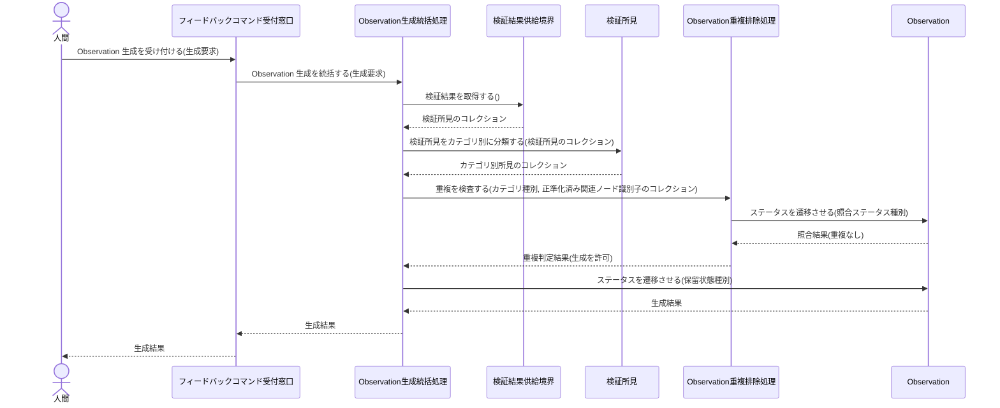
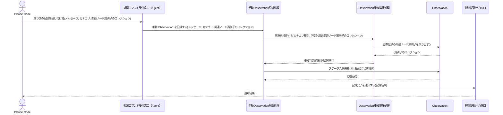
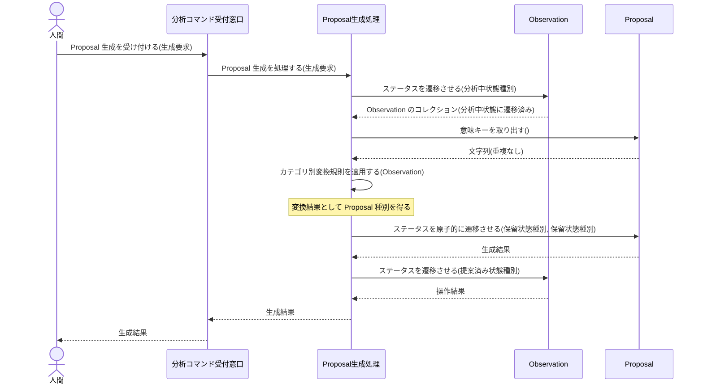
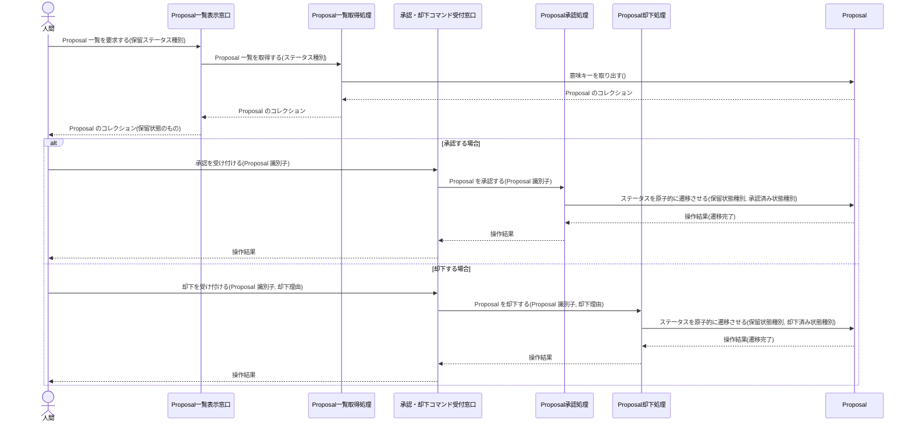
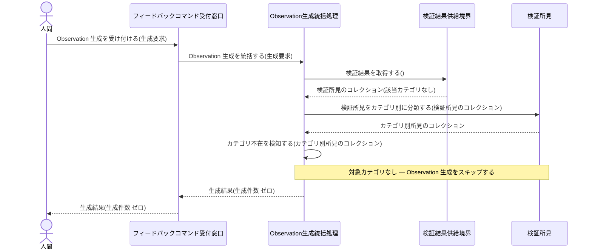
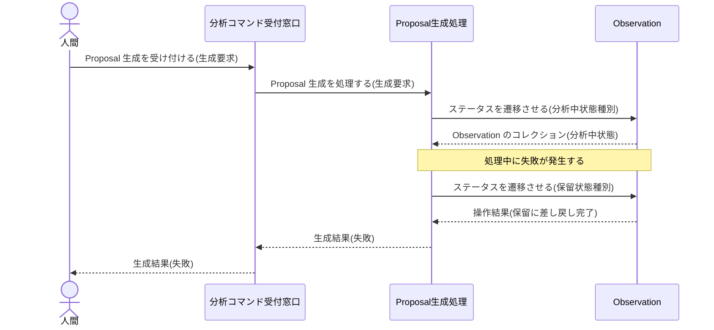
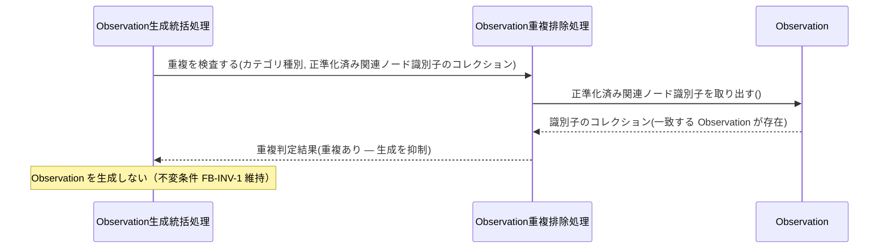
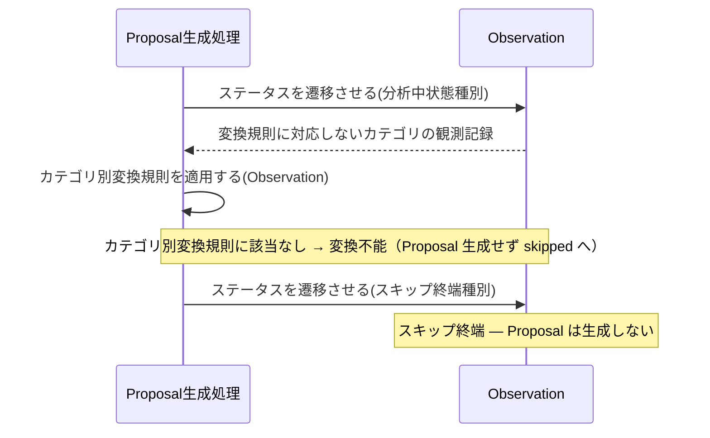
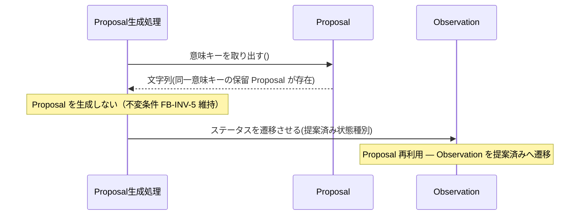

Document ID: SEQD-LGX-008

# SEQD-LGX-008: フィードバックループ のクラス間メッセージング

**親 RBD**: RBD-LGX-008
**親 SEQA**: SEQA-LGX-008 / **親 UC**: UC-LGX-008
**レイヤ**: 具体側（クラス図レベル、言語非依存）

> **記述規律**: RBD-LGX-008 で識別したクラスをレーンとして、操作呼び出しの時系列を描く。**操作呼び出しは操作名（人間の言語）**。関数名・引数具体型・戻り型・言語固有同期機構は書かない（DD で確定）。本 SEQD は **Behavior Allocation**（どのクラスがどの操作を担うか）を確定する。
>
> **ハードルール 10**: 命名規則に従う関数呼び出し・言語固有のジェネリック型・並行修飾子・モジュール識別子が混入したら違反。`scripts/trace-check.sh` [5/5] が検出する。本ファイルは禁止トークンを literal で引用しない（記述的に書く）。

---

## 1. 基本フロー

### 1a. Observation 生成（feedback コマンド: 自動生成）

### 1b. Observation 生成（observe コマンド: 手動記録）

### 1c. Proposal 生成（analyze コマンド）

### 1d. Proposal 一覧表示・承認・却下

## 2. 代替フロー

### 代替 1a: check 結果に該当カテゴリがない場合（Observation 生成なし）

### 代替 2a: analyze 処理中失敗（Observation を保留に差し戻し）

## 3. 例外フロー

### 例外 A: Observation 生成中の重複検出（不変条件 FB-INV-1 による抑制）

### 例外 B: Proposal 生成中の終端スキップ（変換規則に対応しないカテゴリ）

### 例外 C: 意味キーによる Proposal 重複排除（不変条件 FB-INV-5）

## 4. 並行性（概念レベル）

観測フロー（`feedback` / `observe`）・Proposal 生成フロー（`analyze`）・承認却下フロー（`approve` / `reject`）の 3 系統は論理的に独立した起動として逐次処理される。

ドメインレベルで共有される状態変更箇所は `Observation 重複排除処理` が参照する Observation Entity（保留・分析中状態の照合）であり、不変条件 FB-INV-1 により重複生成を防止する。Proposal の承認・却下においては、Proposal Entity の原子的状態遷移（比較交換相当の機構）により不変条件 FB-INV-2 を保証する。

具体的な並行制御機構（排他機構の種別・ロック戦略）は DD で確定する。

## 5. 失敗伝搬

- 各操作の戻り値は「操作結果」概念（成功 / 失敗 + 理由）で表現。具体的なエラー型は DD で確定。
- 重複検出（例外 A / 例外 C）は致命的失敗ではなく、呼び出し元 Control が生成をスキップして正常終了する。
- analyze 処理中失敗（代替 2a）では Observation が保留状態へ差し戻され、上位 Control は失敗を呼び出し元 Boundary へ伝搬する。
- 承認・却下での状態遷移失敗（保留状態以外への遷移試行）は操作結果（失敗）として Boundary 経由でアクターに返される。

## 6. Behavior Allocation（操作のクラス帰属）

各操作は一つのクラスに帰属する（複数クラスへの分散なし）。Boundary=境界操作のみ / Control=複数 Entity の協調 / Entity=自身のデータ操作。

| 操作 | 帰属クラス | 役割 | 妥当性 |
|---|---|---|---|
| Observation 生成を受け付ける | フィードバックコマンド受付窓口 | Boundary（アクター境界） | ✓ 境界操作のみ |
| 気づきの記録を受け付ける | 観測コマンド受付窓口（Agent） | Boundary（Claude Code 境界） | ✓ 境界操作のみ |
| Proposal 生成を受け付ける | 分析コマンド受付窓口 | Boundary（アクター境界） | ✓ 境界操作のみ |
| Proposal 一覧を要求する | Proposal 一覧表示窓口 | Boundary（アクター境界） | ✓ 境界操作のみ |
| 承認を受け付ける / 却下を受け付ける | 承認・却下コマンド受付窓口 | Boundary（アクター境界） | ✓ 境界操作のみ |
| 検証結果を取得する | 検証結果供給境界 | Boundary（外部システム境界） | ✓ 境界操作のみ |
| 記録完了を通知する | 観測記録出力窓口 | Boundary（出力境界） | ✓ 境界操作のみ |
| Observation 生成を統括する / 検証所見をカテゴリ別に分類する / カテゴリ不在を検知する | Observation 生成統括処理 | Control（協調） | ✓ |
| 手動 Observation を記録する | 手動 Observation 記録処理 | Control（協調） | ✓ |
| 重複を検査する | Observation 重複排除処理 | Control（照合協調） | ✓ Proposal は操作しない |
| Proposal 生成を処理する / カテゴリ別変換規則を適用する / Observation を差し戻す | Proposal 生成処理 | Control（協調） | ✓ |
| Proposal 一覧を取得する | Proposal 一覧取得処理 | Control（照合協調） | ✓ 承認・却下を操作しない |
| Proposal を承認する | Proposal 承認処理 | Control（協調） | ✓ |
| Proposal を却下する | Proposal 却下処理 | Control（協調） | ✓ |
| ステータスを遷移させる / 正準化済み関連ノード識別子を取り出す | Observation | Entity（自身のデータ） | ✓ |
| ステータスを原子的に遷移させる / 意味キーを取り出す | Proposal | Entity（自身のデータ） | ✓ |

割り当てに迷う操作なし。各操作が UC ステップ / SEQA メッセージに対応（余剰操作なし）。

## 7. 整合性確認

- [x] レーンが RBD-LGX-008 のクラスと一致する
- [x] 操作呼び出しが RBD-LGX-008 で識別した操作と対応する
- [x] 命名規則に従う関数名が混入していない（操作名は日本語）
- [x] 言語固有の引数型・戻り型が混入していない（概念型のみ）
- [x] 言語固有同期機構の表記が混入していない
- [x] Boundary 同士の直接通信なし
- [x] Entity 同士の直接通信なし
- [x] Boundary → Entity 直結なし（各受付窓口は Control 経由でのみ Entity と連携）
- [x] Actor → Control / Entity 直結なし（人間・Claude Code は各受付窓口 Boundary のみと通信）

## 8. 履歴

| 日付 | 変更内容 |
|---|---|
| 2026-06-13 | 初版。RBD-LGX-008 のクラスをレーンに操作呼び出し時系列を展開。基本（feedback §1a / observe §1b / analyze §1c / approve・reject §1d）/ 代替（1a: カテゴリ不在 / 2a: claim release）/ 例外（重複抑制 / スキップ終端 / 意味キー重複排除）を網羅。Behavior Allocation（操作のクラス帰属）を確定。失敗伝搬を概念表現。言語要素なし |
