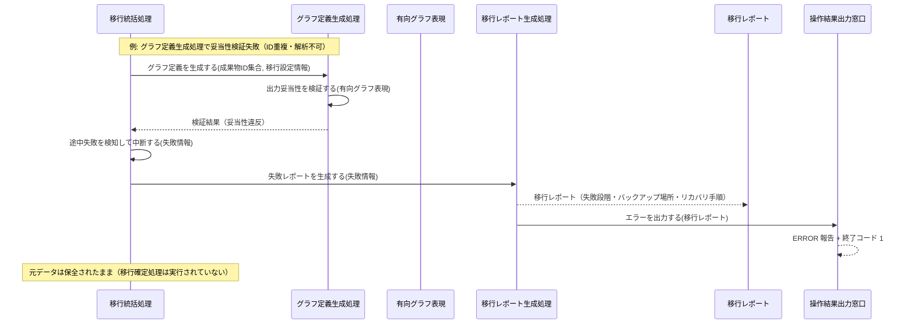
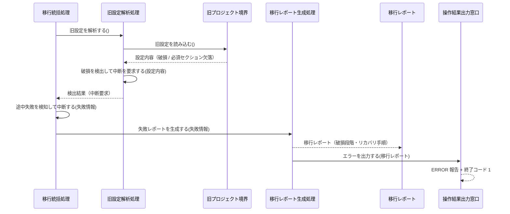

Document ID: SEQD-LGX-009

# SEQD-LGX-009: プロジェクト初期化とマイグレーション のクラス間メッセージング

**親 RBD**: RBD-LGX-009
**親 SEQA**: SEQA-LGX-009 / **親 UC**: UC-LGX-009
**レイヤ**: 具体側（クラス図レベル、言語非依存）

> **記述規律**: RBD-LGX-009 で識別したクラスをレーンとして、操作呼び出しの時系列を描く。**操作呼び出しは操作名（人間の言語）**。関数名・引数具体型・戻り型・言語固有同期機構は書かない（DD で確定）。本 SEQD は **Behavior Allocation**（どのクラスがどの操作を担うか）を確定する。
>
> **ハードルール 10**: 命名規則に従う関数呼び出し・言語固有のジェネリック型・並行修飾子・モジュール識別子が混入したら違反。`scripts/trace-check.sh` [5/5] が検出する。本ファイルは禁止トークンを literal で引用しない（記述的に書く）。

---

## 1. 基本フロー — init 系統（`legixy init`）

```mermaid
sequenceDiagram
    actor Actor as 開発者
    participant Bcmd as 初期化・移行コマンド受付窓口
    participant Cinit as 初期化統括処理
    participant Ccheck as 既存生成物検査処理
    participant Bcfg as 設定ファイル境界
    participant Ctmpl as 生成物テンプレート生成処理
    participant Bgen as プロジェクト生成物境界
    participant Cdbinit as データベース初期化処理
    participant Bout as 操作結果出力窓口

    Actor->>Bcmd: 初期化を受け付ける()
    Bcmd-->>Cinit: 初期化を統括する(操作要求)
    Cinit->>Ccheck: 生成物の存在を検査する()
    Ccheck->>Bcfg: 設定の存在を確認する()
    Bcfg-->>Ccheck: 真偽（不在）
    Ccheck->>Ccheck: 中断か続行かを判断する(検査結果, 強制フラグ)
    Ccheck-->>Cinit: 続行判断（続行）
    Cinit->>Ctmpl: テンプレートを生成する()
    Ctmpl->>Bgen: 設定テンプレートを書き出す(テンプレート内容)
    Bgen-->>Ctmpl: 書き出し結果
    Ctmpl->>Bgen: グラフ定義を書き出す(グラフ定義内容)
    Bgen-->>Ctmpl: 書き出し結果
    Ctmpl->>Bgen: 成果物ディレクトリを作成する(ディレクトリ名のコレクション)
    Bgen-->>Ctmpl: 書き出し結果
    Ctmpl-->>Cinit: テンプレート生成結果
    Cinit->>Cdbinit: データベースを初期化する()
    Cdbinit->>Bgen: データベースを初期化して書き出す(スキーマ)
    Bgen-->>Cdbinit: 書き出し結果
    Cdbinit->>Bgen: 管理ディレクトリの無視設定を書き出す()
    Bgen-->>Cdbinit: 書き出し結果
    Cdbinit-->>Cinit: 初期化結果
    Cinit->>Bout: 成功サマリを出力する(移行レポート)
    Bout-->>Actor: 成功サマリ（生成ファイル一覧）+ 終了コード 0
```

---

## 2. 基本フロー — migrate 系統（`legixy migrate --from <パス>`）

```mermaid
sequenceDiagram
    actor Actor as 開発者
    participant Bcmd as 初期化・移行コマンド受付窓口
    participant Cmig as 移行統括処理
    participant Cver as バージョン検出処理
    participant Bsrc as 旧プロジェクト境界
    participant Ever as プロジェクトバージョン情報
    participant Ccfg as 旧設定解析処理
    participant Emigset as 移行設定情報
    participant Cmat as マトリクス読み込み処理
    participant Eids as 成果物ID集合
    participant Cgraph as グラフ定義生成処理
    participant Egraph as 有向グラフ表現
    participant Cidmap as IDマッピング処理
    participant Eidmap as IDマッピング表
    participant Ccfgconv as 設定ファイル変換処理
    participant Cdb as データベース移行処理
    participant Ccommit as 移行確定処理
    participant Bdst as 移行先プロジェクト境界
    participant Crep as 移行レポート生成処理
    participant Ereport as 移行レポート
    participant Bout as 操作結果出力窓口

    Actor->>Bcmd: 移行を受け付ける(移行元パス)
    Bcmd-->>Cmig: 移行を統括する(操作要求)

    Cmig->>Cver: バージョンを検出する()
    Cver->>Bsrc: データベースのバージョン情報を参照する()
    Bsrc-->>Cver: バージョン識別情報
    Cver->>Cver: 矛盾を検出して中断を要求する(バージョン識別情報)
    Cver-->>Ever: プロジェクトバージョン情報（v0.1.0 確定）
    Ever-->>Cmig: プロジェクトバージョン情報

    Cmig->>Ccfg: 旧設定を解析する()
    Ccfg->>Bsrc: 旧設定を読み込む()
    Bsrc-->>Ccfg: 設定内容
    Ccfg->>Ccfg: 破損を検出して中断を要求する(設定内容)
    Ccfg-->>Emigset: 移行設定情報（確定）
    Emigset-->>Cmig: 移行設定情報

    Cmig->>Cmat: マトリクスを読み込む()
    Cmat->>Bsrc: マトリクスを読み込む()
    Bsrc-->>Cmat: マトリクス内容
    Cmat-->>Eids: 成果物ID集合（確定）
    Eids-->>Cmig: 成果物ID集合

    Cmig->>Cgraph: グラフ定義を生成する(成果物ID集合, 移行設定情報)
    Cgraph->>Eids: 件数を取り出す()
    Eids-->>Cgraph: 数値
    Cgraph->>Emigset: 設定値を取り出す(設定キー)
    Emigset-->>Cgraph: 設定値
    Cgraph->>Cgraph: 出力妥当性を検証する(有向グラフ表現)
    Cgraph-->>Egraph: 有向グラフ表現（ノード・エッジ・妥当性検証済）
    Egraph-->>Cmig: 有向グラフ表現

    Cmig->>Cidmap: IDマッピングを生成する(有向グラフ表現, 参照内容のコレクション)
    Cidmap->>Egraph: ノードを取り出す(識別子)
    Egraph-->>Cidmap: ノード
    Cidmap->>Bsrc: 既存参照を読み込む()
    Bsrc-->>Cidmap: 参照内容のコレクション
    Cidmap->>Cidmap: 全単射違反を検出して中断を要求する(対応候補)
    Cidmap-->>Eidmap: IDマッピング表（全単射保証済）
    Eidmap-->>Cmig: IDマッピング表

    Cmig->>Ccfgconv: 設定ファイルを変換する(移行設定情報)
    Ccfgconv->>Emigset: 設定値を取り出す(設定キー)
    Emigset-->>Ccfgconv: 設定値
    Ccfgconv-->>Cmig: 変換後設定内容

    Cmig->>Cdb: データベースを移行する()
    Cdb->>Bsrc: データベースを読み込む()
    Bsrc-->>Cdb: データベース内容
    Cdb->>Bsrc: ベクタデータの有無を確認する()
    Bsrc-->>Cdb: 真偽
    Cdb->>Bsrc: ベクタデータを読み込む()
    Bsrc-->>Cdb: ベクタデータ内容
    Cdb->>Cdb: ベクタデータをインポートする(ベクタデータ内容)
    Cdb-->>Cmig: 移行済みデータベース

    Cmig->>Ccommit: 移行を確定する(有向グラフ表現, IDマッピング表, 変換後設定内容, 移行済みデータベース)
    Ccommit->>Egraph: 妥当性を確認する()
    Egraph-->>Ccommit: 真偽
    Ccommit->>Eidmap: 全単射を確認する()
    Eidmap-->>Ccommit: 真偽
    Ccommit->>Bdst: データベースコミットを先行させる(移行済みデータベース)
    Bdst-->>Ccommit: 確定結果
    Ccommit->>Bdst: グラフ定義を確定する(グラフ定義内容)
    Bdst-->>Ccommit: 確定結果
    Ccommit->>Bdst: IDマッピング表を確定する(マッピング内容)
    Bdst-->>Ccommit: 確定結果
    Ccommit->>Bdst: 設定ファイルを確定する(設定内容)
    Bdst-->>Ccommit: 確定結果
    Ccommit-->>Cmig: 確定結果

    Cmig->>Crep: 成功レポートを生成する(変更サマリ)
    Crep-->>Ereport: 移行レポート（成功）
    Crep->>Bout: 成功サマリを出力する(移行レポート)
    Bout-->>Actor: 成功サマリ（生成・更新ファイル一覧・ID書き換え件数・バックアップ場所）+ 終了コード 0
```

---

## 3. 代替フロー

### 代替 2a: init で設定ファイルが既に存在する場合

```mermaid
sequenceDiagram
    actor Actor as 開発者
    participant Bcmd as 初期化・移行コマンド受付窓口
    participant Cinit as 初期化統括処理
    participant Ccheck as 既存生成物検査処理
    participant Bcfg as 設定ファイル境界
    participant Bout as 操作結果出力窓口

    Actor->>Bcmd: 初期化を受け付ける()
    Bcmd-->>Cinit: 初期化を統括する(操作要求)
    Cinit->>Ccheck: 生成物の存在を検査する()
    Ccheck->>Bcfg: 設定の存在を確認する()
    Bcfg-->>Ccheck: 真偽（存在あり）
    Ccheck->>Ccheck: 中断か続行かを判断する(検査結果, 強制フラグ)
    Ccheck-->>Cinit: 続行判断（中断）
    Cinit->>Bout: エラーを出力する(移行レポート)
    Bout-->>Actor: ERROR 報告（既存プロジェクト検出）+ 終了コード 1
```

### 代替 2b: migrate で旧プロジェクトが見つからない場合

```mermaid
sequenceDiagram
    actor Actor as 開発者
    participant Bcmd as 初期化・移行コマンド受付窓口
    participant Cmig as 移行統括処理
    participant Cver as バージョン検出処理
    participant Bsrc as 旧プロジェクト境界
    participant Crep as 移行レポート生成処理
    participant Ereport as 移行レポート
    participant Bout as 操作結果出力窓口

    Actor->>Bcmd: 移行を受け付ける(移行元パス)
    Bcmd-->>Cmig: 移行を統括する(操作要求)
    Cmig->>Cver: バージョンを検出する()
    Cver->>Bsrc: データベースのバージョン情報を参照する()
    Bsrc-->>Cver: 不在（供給できない）
    Cver->>Cver: 矛盾を検出して中断を要求する(バージョン識別情報)
    Cver-->>Cmig: 検出結果（中断要求）
    Cmig->>Cmig: 途中失敗を検知して中断する(失敗情報)
    Cmig->>Crep: 失敗レポートを生成する(失敗情報)
    Crep-->>Ereport: 移行レポート（旧プロジェクト不在）
    Crep->>Bout: エラーを出力する(移行レポート)
    Bout-->>Actor: ERROR 報告（旧プロジェクト不在）+ 終了コード 1
```

---

## 4. 例外フロー

### 例外 E1: migrate 途中での処理失敗（非破壊中断）



### 例外 E2: migrate — 旧設定破損（解析失敗・必須セクション欠落）



---

## 5. 並行性（概念レベル）

init 系統・migrate 系統ともに、クラス図レベルで並行に発生するメッセージ交換はない。init は既存生成物検査 → テンプレート生成 → データベース初期化の逐次協調であり、migrate はバージョン検出 → 旧設定解析 → マトリクス読み込み → グラフ定義生成 → IDマッピング生成 → 設定変換 → データベース移行 → 移行確定 → レポート生成の逐次協調である。各処理は移行統括処理または初期化統括処理の協調下で順序付けられており、クラス図レベルの並行実行は存在しない（非破壊性・確定先行はメッセージ順序で表現する）。具体的な並行機構は DD で確定する。

---

## 6. 失敗伝搬

- 各操作の戻りは「結果」概念（成功 / 失敗 + 理由）で表現する。具体的なエラー型は DD で確定する。
- 致命的な失敗（旧プロジェクト不在・設定破損・グラフ妥当性違反・全単射違反）は移行統括処理が「途中失敗を検知して中断する」操作で受け取り、移行レポート生成処理に失敗情報を渡す。
- init の中断判断は既存生成物検査処理が「中断か続行かを判断する」操作で確定し、初期化統括処理がエラーを出力窓口へ渡す。
- 移行確定処理が実行される前に中断した場合、元データは保全される（非破壊性保証）。

---

## 7. Behavior Allocation（操作のクラス帰属、§6.3）

各操作は一つのクラスに帰属する（複数クラスへの分散なし）。Boundary=境界操作のみ / Control=複数クラスの協調 / Entity=自身のデータ操作。

### init 系統

| 操作 | 帰属クラス | 役割 | 妥当性 |
|---|---|---|---|
| 初期化を受け付ける | 初期化・移行コマンド受付窓口 | Boundary（アクター境界） | ✓ 境界操作のみ |
| 初期化を統括する | 初期化統括処理 | Control（協調） | ✓ |
| 生成物の存在を検査する / 中断か続行かを判断する | 既存生成物検査処理 | Control（検査・判断） | ✓ |
| 設定の存在を確認する / 設定を読み込む | 設定ファイル境界 | Boundary（外部ファイル境界） | ✓ |
| テンプレートを生成する | 生成物テンプレート生成処理 | Control（生成） | ✓ |
| 設定テンプレートを書き出す / グラフ定義を書き出す / 成果物ディレクトリを作成する / データベースを初期化して書き出す / 管理ディレクトリの無視設定を書き出す | プロジェクト生成物境界 | Boundary（ファイルシステム境界） | ✓ |
| データベースを初期化する | データベース初期化処理 | Control（初期化） | ✓ |
| 成功サマリを出力する / エラーを出力する | 操作結果出力窓口 | Boundary（出力境界） | ✓ |

### migrate 系統

| 操作 | 帰属クラス | 役割 | 妥当性 |
|---|---|---|---|
| 移行を受け付ける | 初期化・移行コマンド受付窓口 | Boundary（アクター境界） | ✓ 境界操作のみ |
| 移行を統括する / 途中失敗を検知して中断する | 移行統括処理 | Control（協調・中断判定） | ✓ |
| バージョンを検出する / 矛盾を検出して中断を要求する | バージョン検出処理 | Control（検出） | ✓ |
| データベースのバージョン情報を参照する / 旧設定を読み込む / マトリクスを読み込む / データベースを読み込む / ベクタデータを読み込む / ベクタデータの有無を確認する / 既存参照を読み込む | 旧プロジェクト境界 | Boundary（外部ファイル境界） | ✓ |
| 旧設定を解析する / 破損を検出して中断を要求する | 旧設定解析処理 | Control（解析・破損検出） | ✓ |
| マトリクスを読み込む（制御側） | マトリクス読み込み処理 | Control（パース） | ✓ |
| グラフ定義を生成する / 出力妥当性を検証する | グラフ定義生成処理 | Control（生成・検証） | ✓ |
| IDマッピングを生成する / 全単射違反を検出して中断を要求する | IDマッピング処理 | Control（生成・検証） | ✓ |
| 設定ファイルを変換する | 設定ファイル変換処理 | Control（変換） | ✓ |
| データベースを移行する / ベクタデータをインポートする | データベース移行処理 | Control（移行・インポート） | ✓ |
| 移行を確定する | 移行確定処理 | Control（確定） | ✓ |
| データベースコミットを先行させる / グラフ定義を確定する / IDマッピング表を確定する / 設定ファイルを確定する / 退避ファイルを生成する | 移行先プロジェクト境界 | Boundary（ファイルシステム境界） | ✓ |
| 成功レポートを生成する / 失敗レポートを生成する | 移行レポート生成処理 | Control（生成） | ✓ |
| 設定値を取り出す | 移行設定情報 | Entity（自身のデータ） | ✓ |
| 件数を取り出す | 成果物ID集合 | Entity（自身のデータ） | ✓ |
| ノードを取り出す / 妥当性を確認する | 有向グラフ表現 | Entity（自身のデータ） | ✓ |
| 旧IDから新IDを引く / 全単射を確認する | IDマッピング表 | Entity（自身のデータ） | ✓ |
| 終了状態を判定する | 移行レポート | Entity（自身のデータ） | ✓ |

割り当てに迷う操作なし。各操作が UC ステップ / SEQA メッセージに対応（余剰操作なし）。

---

## 8. 整合性確認

- [x] レーンが RBD-LGX-009 のクラスと一致する（Boundary 6 / Control 14 / Entity 6 すべて対応）
- [x] 操作呼び出しが RBD-LGX-009 で識別した操作と対応する
- [x] 命名規則に従う関数名が混入していない（操作名は日本語）
- [x] 言語固有の引数型・戻り型が混入していない（概念型のみ）
- [x] 言語固有同期機構の表記が混入していない
- [x] UC-LGX-009 の基本フロー（init §1 / migrate §2）/ 代替フロー（2a / 2b: §3）/ 例外フロー（非破壊中断・設定破損: §4）を網羅
- [x] Noun-Verb ルール遵守（Actor⇄Boundary / Boundary⇄Control / Control⇄Control / Control⇄Entity のみ）
- [x] SEQA-LGX-009 のメッセージ時系列をクラス操作呼び出しに具体化（1:1 対応確認済）

---

## 9. 履歴

| 日付 | 変更内容 |
|---|---|
| 2026-06-13 | 初版。RBD-LGX-009 のクラスをレーンに操作呼び出し時系列を展開。init 基本（§1）・migrate 基本（§2）・代替 2a/2b（§3）・例外 E1/E2（§4）を網羅。Behavior Allocation（操作のクラス帰属）を確定。失敗伝搬を概念表現。言語要素なし |
