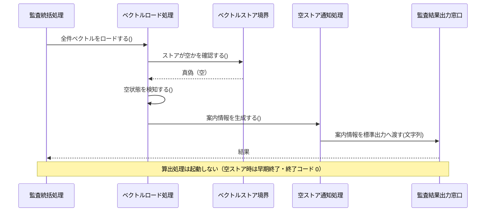
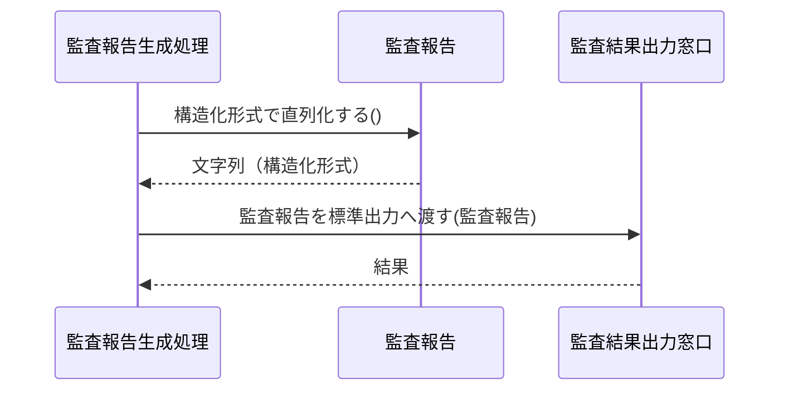
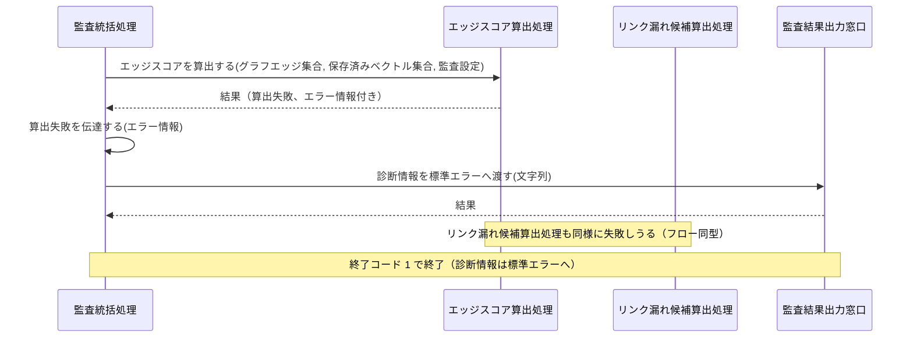

Document ID: SEQD-LGX-010

# SEQD-LGX-010: トレーサビリティ健全性監査 のクラス間メッセージング

**親 RBD**: RBD-LGX-010
**親 SEQA**: SEQA-LGX-010 / **親 UC**: UC-LGX-010
**レイヤ**: 具体側（クラス図レベル、言語非依存）

> **記述規律**: RBD-LGX-010 で識別したクラスをレーンとして、操作呼び出しの時系列を描く。**操作呼び出しは操作名（人間の言語）**。関数名・引数具体型・戻り型・言語固有同期機構は書かない（DD で確定）。本 SEQD は **Behavior Allocation**（どのクラスがどの操作を担うか）を確定する。
>
> **ハードルール 10**: 命名規則に従う関数呼び出し・言語固有のジェネリック型・並行修飾子・モジュール識別子が混入したら違反。`scripts/trace-check.sh` [5/5] が検出する。本ファイルは禁止トークンを literal で引用しない（記述的に書く）。

---

## 1. 基本フロー（`report [--json]`）

```mermaid
sequenceDiagram
    actor Actor as プロジェクトリード / QA リード / 設計者・実装者 / CI システム
    participant B1 as 監査コマンド受付窓口
    participant C0 as 監査統括処理
    participant C1 as 設定解決処理
    participant Bcfg as 設定ファイル境界
    participant Ecfg as 監査設定
    participant C2 as グラフ定義取得処理
    participant Bgraph as グラフ定義境界
    participant Eedge as グラフエッジ集合
    participant C3 as ベクトルロード処理
    participant Bvec as ベクトルストア境界
    participant Evec as 保存済みベクトル集合
    participant C4 as エッジスコア算出処理
    participant Escore as エッジスコア集合
    participant C5 as リンク漏れ候補算出処理
    participant Ecand as リンク漏れ候補集合
    participant C6 as 監査報告生成処理
    participant Ereport as 監査報告
    participant B2 as 監査結果出力窓口

    Actor->>B1: 監査要求を受け付ける(出力形式種別)
    B1->>C0: 監査を統括する(出力形式種別)
    C0->>C1: 設定を解決する()
    C1->>Bcfg: 設定の存在を確認する()
    Bcfg-->>C1: 真偽
    C1->>Bcfg: 設定を読み込む()
    Bcfg-->>C1: 設定内容
    C1->>Ecfg: 設定値を確定する(設定内容)
    C1-->>C0: 監査設定
    C0->>C2: グラフ定義を取得する()
    C2->>Bgraph: グラフ定義の存在を確認する()
    Bgraph-->>C2: 真偽
    C2->>Bgraph: 全エッジ定義を読み込む()
    Bgraph-->>C2: エッジ定義のコレクション
    C2->>Eedge: 全エッジを列挙する()
    Eedge-->>C2: エッジのコレクション
    C2-->>C0: グラフエッジ集合
    C0->>C3: 全件ベクトルをロードする()
    C3->>Bvec: ストアが空かを確認する()
    Bvec-->>C3: 真偽
    C3->>Bvec: 全件ベクトルを読み込む()
    Bvec-->>C3: ベクトルエントリのコレクション
    C3->>Evec: 全件を列挙する()
    Evec-->>C3: ベクトルエントリのコレクション
    C3-->>C0: 保存済みベクトル集合
    C0->>C4: エッジスコアを算出する(グラフエッジ集合, 保存済みベクトル集合, 監査設定)
    C4->>Eedge: 全エッジを列挙する()
    Eedge-->>C4: エッジのコレクション
    C4->>Evec: ベクトルを取り出す(ノード識別子)
    Evec-->>C4: ベクトルエントリ
    C4->>Ecfg: 設定値を取り出す(設定キー)
    Ecfg-->>C4: 設定値
    C4->>Escore: スコアを取り出す(エッジ識別子)
    C4->>Escore: スキップ件数を返す()
    C4->>C4: スキップエッジを記録する(エッジ識別子)
    C4->>C4: 集約警告を生成する()
    C4-->>C0: エッジスコア集合
    C0->>C5: リンク漏れ候補を算出する(保存済みベクトル集合, 監査設定)
    C5->>Evec: 全件を列挙する()
    Evec-->>C5: ベクトルエントリのコレクション
    C5->>Ecfg: 設定値を取り出す(設定キー)
    Ecfg-->>C5: 設定値
    C5->>Ecand: 候補を列挙する()
    Ecand-->>C5: 候補エントリのコレクション
    C5-->>C0: リンク漏れ候補集合
    C0->>C6: 監査報告を生成する(エッジスコア集合, リンク漏れ候補集合, 出力形式種別)
    C6->>Escore: スコアを取り出す(エッジ識別子)
    Escore-->>C6: 数値
    C6->>Ecand: 候補を列挙する()
    Ecand-->>C6: 候補エントリのコレクション
    C6->>C6: 統計サマリを集計する(エッジスコア集合)
    C6->>Ereport: テキスト形式で直列化する()
    Ereport-->>C6: 文字列
    C6->>B2: 監査報告を標準出力へ渡す(監査報告)
    B2-->>Actor: 監査報告（標準出力）+ 終了コード 0
```

## 2. 代替フロー

### 代替 2a: embeddings テーブルが空



### 代替 5a: 構造化形式（--json）出力



## 3. 例外フロー

### 例外 3a: エッジスコア算出 / リンク漏れ候補算出の失敗



## 4. 並行性（概念レベル）

`report` は読取専用の計測処理であり、ドメインレベルの並行性はない。設定解決・グラフ定義取得・ベクトルロード・エッジスコア算出・リンク漏れ候補算出は監査統括処理の協調下で逐次進む。STATE-INV-1（engine.db / graph.toml は不変）により書込み競合も発生しない。具体的な並行機構は DD で確定する。

## 5. 失敗伝搬

- 各操作の戻り値は「結果」概念（成功 / 失敗 + 理由）で表現する。具体的なエラー型は DD で確定。
- 設定ファイル不在・グラフ定義不在は設定解決処理 / グラフ定義取得処理が検知し、監査統括処理へ伝達する。
- エッジスコア算出 / リンク漏れ候補算出の失敗（例外 3a）は監査統括処理が算出失敗として受け取り、監査結果出力窓口を経由して標準エラーへ診断情報を出力、終了コード 1 で終了する。
- embeddings テーブルが空の場合（代替 2a）は失敗ではなく早期終了（終了コード 0）として扱う。空ストア通知処理が案内情報を生成し、監査結果出力窓口が標準出力へ渡す。

## 6. Behavior Allocation（操作のクラス帰属）

各操作は一つのクラスに帰属する（複数クラスへの分散なし）。Boundary=境界操作のみ / Control=複数 Entity の協調 / Entity=自身のデータ操作。

| 操作 | 帰属クラス | 役割 | 妥当性 |
|---|---|---|---|
| 監査要求を受け付ける | 監査コマンド受付窓口 | Boundary（アクター境界） | ✓ 境界操作のみ |
| 監査を統括する / 算出失敗を伝達する | 監査統括処理 | Control（協調） | ✓ |
| 設定を解決する | 設定解決処理 | Control | ✓ |
| 設定の存在を確認する / 設定を読み込む | 設定ファイル境界 | Boundary（外部ファイル境界） | ✓ |
| 設定値を確定する / 設定値を取り出す | 監査設定 | Entity（自身のデータ） | ✓ |
| グラフ定義を取得する | グラフ定義取得処理 | Control | ✓ |
| グラフ定義の存在を確認する / 全エッジ定義を読み込む | グラフ定義境界 | Boundary（外部ファイル境界） | ✓ |
| エッジを取り出す / 全エッジを列挙する | グラフエッジ集合 | Entity（自身のデータ） | ✓ |
| 全件ベクトルをロードする / 空状態を検知する | ベクトルロード処理 | Control | ✓ |
| ストアが空かを確認する / 全件ベクトルを読み込む | ベクトルストア境界 | Boundary（外部ストア境界） | ✓ |
| ベクトルを取り出す / 全件を列挙する / 件数を返す | 保存済みベクトル集合 | Entity（自身のデータ） | ✓ |
| エッジスコアを算出する / スキップエッジを記録する / 集約警告を生成する | エッジスコア算出処理 | Control | ✓ |
| スコアを取り出す / スキップ件数を返す | エッジスコア集合 | Entity（自身のデータ） | ✓ |
| リンク漏れ候補を算出する | リンク漏れ候補算出処理 | Control | ✓ |
| 候補を列挙する / 件数を返す | リンク漏れ候補集合 | Entity（自身のデータ） | ✓ |
| 監査報告を生成する / 統計サマリを集計する | 監査報告生成処理 | Control | ✓ |
| テキスト形式で直列化する / 構造化形式で直列化する | 監査報告 | Entity（自身のデータ） | ✓ |
| 案内情報を生成する | 空ストア通知処理 | Control | ✓ |
| 監査報告を標準出力へ渡す / 案内情報を標準出力へ渡す / 診断情報を標準エラーへ渡す | 監査結果出力窓口 | Boundary（出力境界） | ✓ |

割り当てに迷う操作なし。各操作が UC ステップ / SEQA メッセージに対応（余剰操作なし）。

## 7. 整合性確認

- [x] レーンが RBD-LGX-010 のクラスと一致する（Boundary 5 / Control 8 / Entity 6）
- [x] 操作呼び出しが RBD-LGX-010 で識別した操作と対応する
- [x] SEQA-LGX-010 のメッセージ時系列をクラス間メッセージとして具体化している
- [x] 命名規則に従う関数名が混入していない（操作名は日本語）
- [x] 言語固有の引数型・戻り型が混入していない（概念型のみ）
- [x] 言語固有同期機構の表記が混入していない
- [x] UC-LGX-010 の基本（Step 1–6）/ 代替（2a・構造化形式出力）/ 例外（3a）フローを網羅
- [x] Noun-Verb ルール遵守（Actor⇄Boundary / Boundary⇄Control / Control⇄Control / Control⇄Entity のみ。Boundary 同士・Entity 同士・Boundary→Entity・Actor→内部 の直接通信なし）

## 8. 履歴

| 日付 | 変更内容 |
|---|---|
| 2026-06-13 | 初版。RBD-LGX-010 のクラスをレーンに操作呼び出し時系列を展開。基本（report [--json]）/ 代替（空ストア・構造化形式出力）/ 例外（算出失敗）。Behavior Allocation（操作のクラス帰属）を確定。失敗伝搬を概念表現。言語要素なし |
