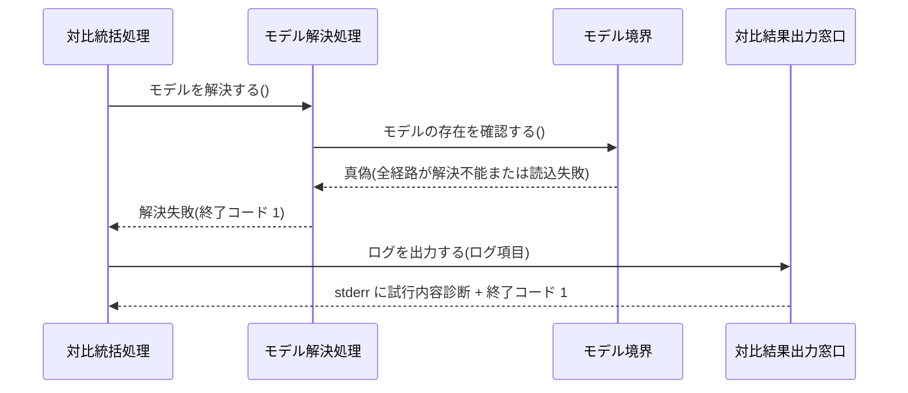
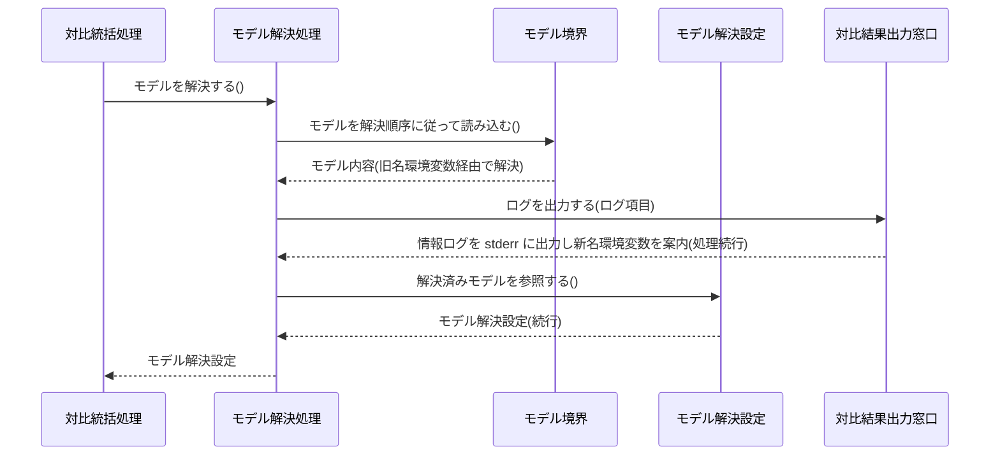
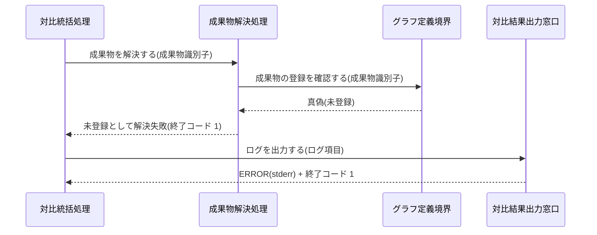
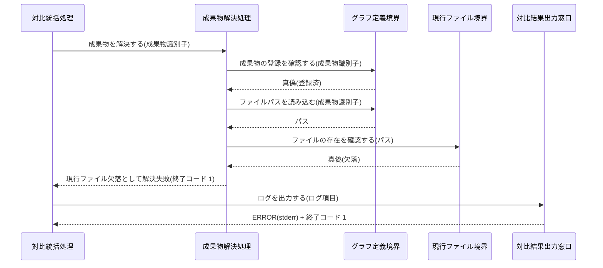
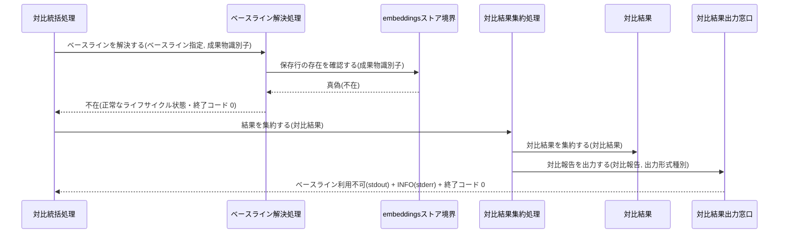
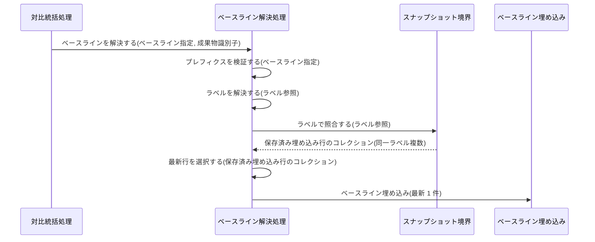
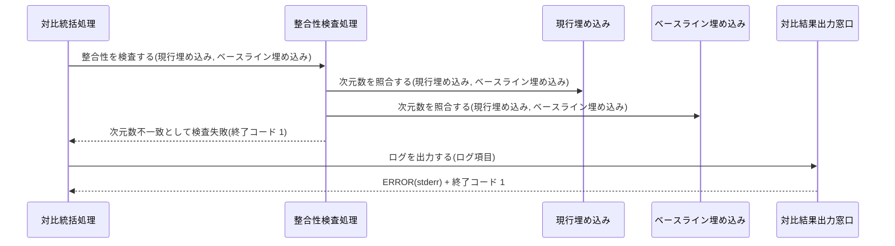
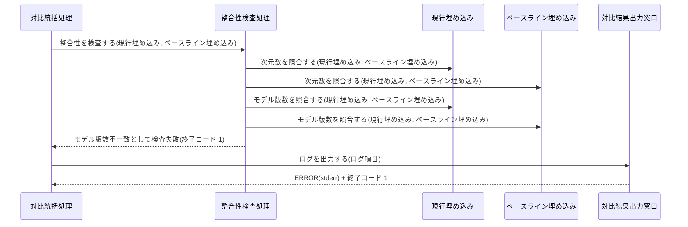
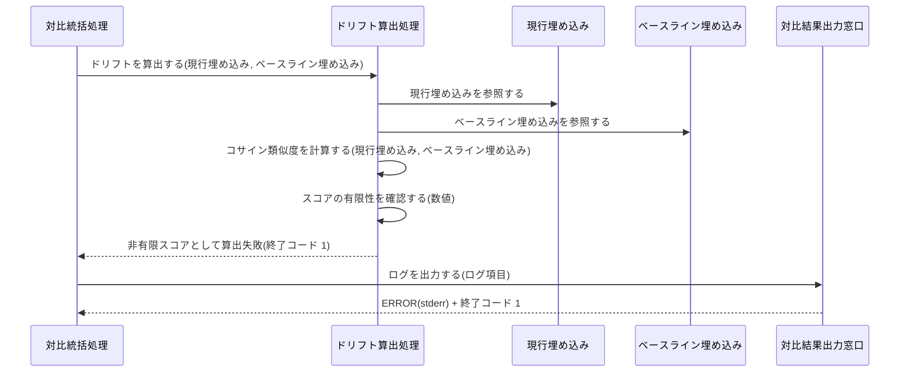
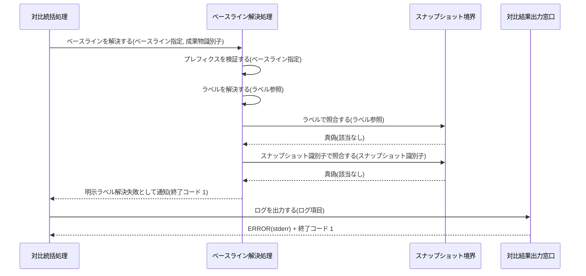

Document ID: SEQD-LGX-013

# SEQD-LGX-013: standalone ドリフト対比 のクラス間メッセージング

**親 RBD**: RBD-LGX-013
**親 SEQA**: SEQA-LGX-013 / **親 UC**: UC-LGX-013
**レイヤ**: 具体側（クラス図レベル、言語非依存）

> **記述規律**: RBD-LGX-013 で識別したクラスをレーンとして、操作呼び出しの時系列を描く。**操作呼び出しは操作名（人間の言語）**。関数名・引数具体型・戻り型・言語固有同期機構は書かない（DD で確定）。本 SEQD は **Behavior Allocation**（どのクラスがどの操作を担うか）を確定する。
>
> **ハードルール 10**: 命名規則に従う関数呼び出し・言語固有のジェネリック型・並行修飾子・モジュール識別子が混入したら違反。`scripts/trace-check.sh` [5/5] が検出する。本ファイルは禁止トークンを literal で引用しない（記述的に書く）。

---

## 1. 基本フロー（`drift <artifact_id>`）

```mermaid
sequenceDiagram
    actor Actor as 設計者 / 運用者 / QA リード
    participant B1 as 対比コマンド受付窓口
    participant C0 as 対比統括処理
    participant C1 as モデル解決処理
    participant Bmodel as モデル境界
    participant Emsetting as モデル解決設定
    participant C2 as 成果物解決処理
    participant Bgraph as グラフ定義境界
    participant Bfile as 現行ファイル境界
    participant Eartifact as 成果物参照
    participant C3 as 埋め込み生成処理
    participant Ecurrent as 現行埋め込み
    participant C4 as ベースライン解決処理
    participant Bembed as embeddingsストア境界
    participant Ebaseline as ベースライン埋め込み
    participant C5 as 整合性検査処理
    participant C6 as ドリフト算出処理
    participant Eresult as 対比結果
    participant C7 as 対比結果集約処理
    participant B2 as 対比結果出力窓口

    Actor->>B1: 対比要求を受け付ける(成果物識別子, ベースライン指定, 出力形式種別)
    B1->>C0: 対比を統括する(成果物識別子, ベースライン指定, 出力形式種別)
    C0->>C1: モデルを解決する()
    C1->>Bmodel: モデルを解決順序に従って読み込む()
    Bmodel-->>C1: モデル内容
    C1->>Emsetting: 解決済みモデルを参照する()
    Emsetting-->>C1: モデル解決設定
    C0->>C2: 成果物を解決する(成果物識別子)
    C2->>Bgraph: 成果物の登録を確認する(成果物識別子)
    Bgraph-->>C2: 真偽(登録済)
    C2->>Bgraph: ファイルパスを読み込む(成果物識別子)
    Bgraph-->>C2: パス
    C2->>Bfile: ファイルの存在を確認する(パス)
    Bfile-->>C2: 真偽(存在)
    C2->>Eartifact: 成果物参照
    C0->>C3: 埋め込みを生成する(ファイル内容, モデル解決設定)
    C3->>Bfile: 現行ファイル内容を読み込む(パス)
    Bfile-->>C3: ファイル内容
    C3->>Emsetting: 解決済みモデルを参照する()
    Emsetting-->>C3: モデル内容
    C3->>Ecurrent: 現行埋め込み
    C0->>C4: ベースラインを解決する(ベースライン指定, 成果物識別子)
    C4->>Bembed: 現行保存行を読み込む(成果物識別子)
    Bembed-->>C4: 保存済み埋め込み行
    C4->>Ebaseline: ベースライン埋め込み
    C0->>C5: 整合性を検査する(現行埋め込み, ベースライン埋め込み)
    C5->>Ecurrent: 次元数を照合する(現行埋め込み, ベースライン埋め込み)
    C5->>Ebaseline: モデル版数を照合する(現行埋め込み, ベースライン埋め込み)
    C5-->>C0: 検査結果(整合)
    C0->>C6: ドリフトを算出する(現行埋め込み, ベースライン埋め込み)
    C6->>Ecurrent: 現行埋め込みを参照する
    C6->>Ebaseline: ベースライン埋め込みを参照する
    C6->>C6: コサイン類似度を計算する(現行埋め込み, ベースライン埋め込み)
    C6->>C6: スコアの有限性を確認する(数値)
    C6->>Eresult: 対比結果
    C0->>C7: 結果を集約する(対比結果)
    C7->>Eresult: 対比結果を集約する(対比結果)
    C7->>B2: 対比報告を出力する(対比報告, 出力形式種別)
    B2-->>Actor: ドリフト値(stdout) + ログ(stderr) + 終了コード 0
```

## 2. 代替フロー

### 代替 1a: `--against` 値に必須プレフィクスが欠如している

```mermaid
sequenceDiagram
    actor Actor as 設計者 / 運用者 / QA リード
    participant B1 as 対比コマンド受付窓口
    participant C0 as 対比統括処理
    participant C4 as ベースライン解決処理
    participant B2 as 対比結果出力窓口

    Actor->>B1: 対比要求を受け付ける(成果物識別子, ベースライン指定なし, 出力形式種別)
    B1->>C0: 対比を統括する(成果物識別子, ベースライン指定, 出力形式種別)
    C0->>C4: ベースラインを解決する(ベースライン指定, 成果物識別子)
    C4->>C4: プレフィクスを検証する(ベースライン指定)
    C4-->>C0: 形式不正として解決失敗(終了コード 1)
    C0->>B2: ログを出力する(ログ項目)
    B2-->>Actor: ERROR(stderr) + 終了コード 1
```

### 代替 2a: モデル解決失敗・読込失敗



### 代替 2b: 旧名環境変数による解決（新名を案内し続行）



### 代替 3a: 成果物識別子がグラフ定義に未登録



### 代替 3b: グラフ定義登録済・現行ファイル欠落



### 代替 4a: ベースライン不在（未埋め込みノード・スナップショットに当該行なし）



### 代替 4b: スナップショット指定で同一ラベルが複数一致 → 時刻最新 1 件に決定



### 代替 5a: 次元数不一致



### 代替 5b: モデル版数不一致（次元数は一致）



### 代替 6a: 非有限スコア発生



### 代替: 明示ラベル形式指定で解決失敗



## 3. 例外フロー

### 例外: `--json` 指定時の出力形式切替

`drift` コマンドにおける出力形式切替（テキスト / 構造化データ）は、対比結果出力窓口の `対比報告を出力する` 操作が `出力形式種別` 引数に応じて内部処理を変えることで実現する。フロー分岐を発生させるのではなく、基本フロー末尾の同一呼び出し内で形式を切り替える。ベースライン不在（代替 4a）の場合も同様に、出力窓口が出力形式種別に従って対応する構造化データを返す。別のシーケンスを要さない。

## 4. 並行性（概念レベル）

並行性なし。`drift` は読み取り専用の対比処理であり、モデル解決 → 成果物解決 → 埋め込み生成 → ベースライン解決 → 整合性検査 → ドリフト算出 → 結果集約 の各処理は対比統括処理の協調下で逐次進む。UC-LGX-013 の事後条件（データストア・グラフ定義・成果物ファイルは不変）と整合しており、ドメインレベルで並行に発生する事象はない。具体的な実行機構は DD で確定する。

## 5. 失敗伝搬

- 各操作の戻り値は「結果」概念（成功 / 失敗 + 理由）で表現する。具体的なエラー型は DD で確定。
- モデル解決失敗・成果物解決失敗・整合性検査失敗・ドリフト算出失敗はいずれも対比統括処理が終了コード 1 として伝搬し、対比結果出力窓口が stderr にエラー診断を出力する。
- ベースライン不在（代替 4a）は正常なライフサイクル状態として終了コード 0 で伝搬し、対比結果集約処理がベースライン利用不可状態の対比報告を生成する。
- 必須プレフィクス欠如（代替 1a）はアプリ層判定の失敗として終了コード 1 で伝搬する（終了コード 2 は使用しない）。

## 6. Behavior Allocation（操作のクラス帰属）

各操作は一つのクラスに帰属する（複数クラスへの分散なし）。Boundary=境界操作のみ / Control=複数クラスの協調 / Entity=自身のデータ操作。

| 操作 | 帰属クラス | 役割 | 妥当性 |
|---|---|---|---|
| 対比要求を受け付ける | 対比コマンド受付窓口 | Boundary（アクター境界） | ✓ 境界操作のみ |
| 対比を統括する | 対比統括処理 | Control（協調） | ✓ 各処理を順に依頼 |
| モデルを解決する / 旧名解決を案内する | モデル解決処理 | Control | ✓ 解決順序ロジック担当 |
| モデルを解決順序に従って読み込む / モデルの存在を確認する | モデル境界 | Boundary（外部境界） | ✓ 境界操作のみ |
| 解決済みモデルを参照する | モデル解決設定 | Entity（自身のデータ） | ✓ |
| 成果物を解決する | 成果物解決処理 | Control | ✓ 登録確認とパス解決の協調 |
| 成果物の登録を確認する / ファイルパスを読み込む | グラフ定義境界 | Boundary（外部ファイル境界） | ✓ 境界操作のみ |
| 現行ファイル内容を読み込む / ファイルの存在を確認する | 現行ファイル境界 | Boundary（外部ファイル境界） | ✓ 境界操作のみ |
| 埋め込みを生成する | 埋め込み生成処理 | Control | ✓ ファイル内容とモデルの協調 |
| ベースラインを解決する / プレフィクスを検証する / ラベルを解決する / 最新行を選択する | ベースライン解決処理 | Control | ✓ 3 形式対応ロジック担当 |
| 現行保存行を読み込む / 保存行の存在を確認する | embeddingsストア境界 | Boundary（外部ストア境界） | ✓ 境界操作のみ |
| ラベルで照合する / スナップショット識別子で照合する / 該当行の存在を確認する | スナップショット境界 | Boundary（外部ストア境界） | ✓ 境界操作のみ |
| 整合性を検査する / 次元数を照合する / モデル版数を照合する | 整合性検査処理 | Control | ✓ 次元数とモデル版数の照合担当 |
| ドリフトを算出する / コサイン類似度を計算する / スコアの有限性を確認する | ドリフト算出処理 | Control | ✓ 算出ロジック担当 |
| 結果を集約する | 対比結果集約処理 | Control | ✓ 対比報告の構成担当 |
| 対比報告を出力する / ログを出力する | 対比結果出力窓口 | Boundary（出力境界） | ✓ 境界操作のみ |

割り当てに迷う操作なし。全操作が UC-LGX-013 ステップおよび SEQA-LGX-013 メッセージと対応（余剰操作なし）。

## 7. 整合性確認

- [x] レーンが RBD-LGX-013 のクラスと一致する（Boundary 7 / Control 8 / Entity 5）
- [x] 操作呼び出しが RBD-LGX-013 で識別した操作と対応する
- [x] 命名規則に従う関数名が混入していない（操作名は日本語）
- [x] 言語固有の引数型・戻り型が混入していない（概念型のみ）
- [x] 言語固有同期機構の表記が混入していない
- [x] UC-LGX-013 の基本（ステップ 1–7）/ 代替（1a/2a/2b/3a/3b/4a/4b/5a/5b/6a・明示ラベル失敗）/ 例外（出力形式切替）をすべて網羅
- [x] SEQA-LGX-013 のレーンをクラス名へ具体化し、メッセージを操作呼び出しへ具体化している

## 8. 履歴

| 日付 | 変更内容 |
|---|---|
| 2026-06-13 | 初版。RBD-LGX-013 のクラスをレーンに操作呼び出し時系列を展開。基本（drift 正常対比）/ 代替（1a/2a/2b/3a/3b/4a/4b/5a/5b/6a・明示ラベル失敗）/ 例外（出力形式切替）。Behavior Allocation（操作のクラス帰属）を確定。失敗伝搬を概念表現。言語固有要素なし |
